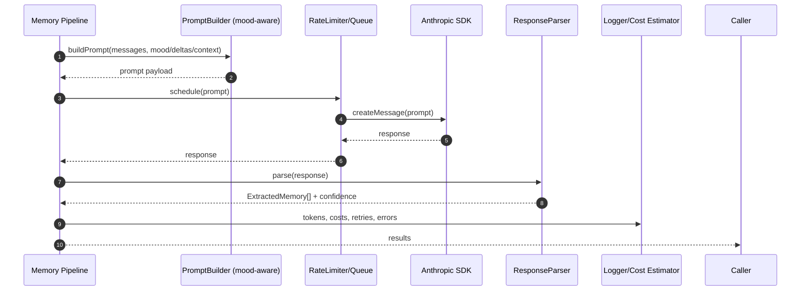

# Claude Pro Integration — Sequence Diagram and Summary

## Summary

Integrate Anthropic Claude into @studio/memory via mood-aware prompts, rate limiting, robust error handling, and response parsing to ExtractedMemory. Includes usage/cost tracking and thorough tests with MSW mocks.

## Mermaid Sequence Diagram

## Notes

- Retry with exponential backoff on 429/5xx; budget alerts.
- Batch processing with salience filtering (deltas) to reduce tokens.
- Strong schema validation of Claude output before acceptance.
