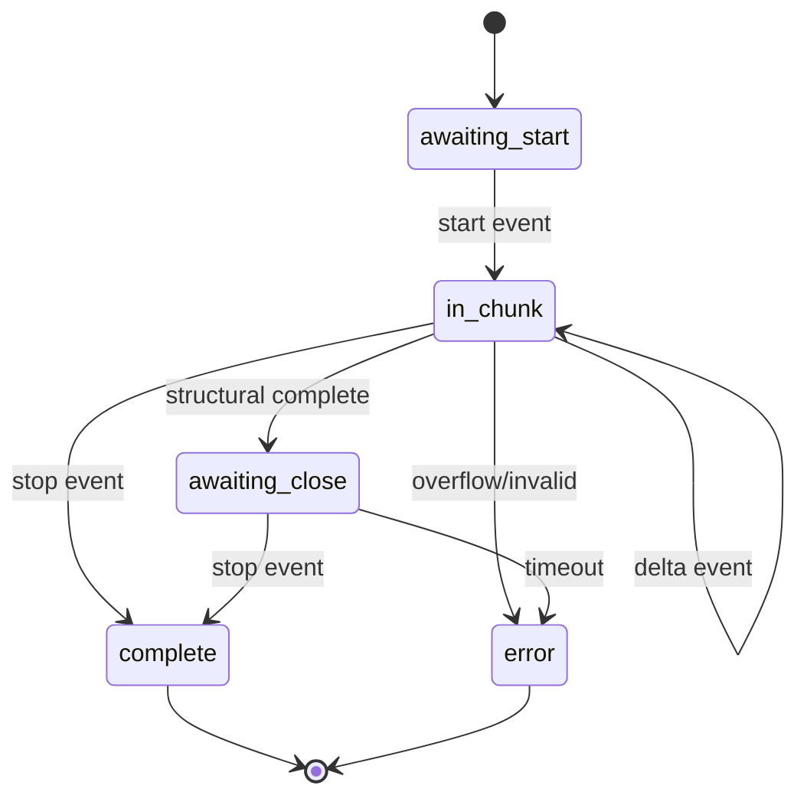

# Algorithms Specification

> Version: 1.0.0
> Created: 2025-08-11
> Scope: Precise algorithm definitions for LLM integration

_Glossary Reference_: See [../glossary.md](../glossary.md) for term definitions.

## 1. Message Salience Selection Algorithm

### Purpose (Salience Selection)

Select the most emotionally significant messages for LLM processing while respecting token limits.

### Algorithm (Salience Selection)

```typescript
function selectSalientMessages(
  messages: Message[],
  moodScores: MoodScore[],
  moodDeltas: MoodDelta[],
  config: SalienceConfig,
): SelectionResult {
  // Step 1: Calculate salience score for each message
  const scoredMessages = messages.map((msg, index) => {
    const moodScore = moodScores[index]
    const moodDelta = moodDeltas[index] || { magnitude: 0 }

    // Salience formula
    const deltaComponent = config.weightDelta * moodDelta.magnitude
    const emotionComponent =
      config.weightEmotion * getEmotionKeywordScore(msg.content)
    const positionBoost = getPositionBoost(index, messages.length)

    const score = deltaComponent + emotionComponent + positionBoost

    return { message: msg, score, index }
  })

  // Step 2: Sort by score descending
  scoredMessages.sort((a, b) => b.score - a.score)

  // Step 3: Select top-K messages
  const selected = scoredMessages.slice(0, config.topK)

  // Step 4: Add context windows (one before, one after)
  const withContext = addContextWindows(selected, messages)

  // Step 5: Token pruning if over limit
  let estimatedTokens = estimateTokens(withContext)
  const tokenCap = config.maxTokens * 0.9 // 90% safety margin

  while (
    estimatedTokens > tokenCap &&
    withContext.length > config.minMessages
  ) {
    // Remove lowest scored message
    const lowestIdx = findLowestScoredIndex(withContext)
    withContext.splice(lowestIdx, 1)
    estimatedTokens = estimateTokens(withContext)
  }

  // Step 6: Sort by original position for coherent narrative
  withContext.sort((a, b) => a.originalIndex - b.originalIndex)

  return {
    selectedMessages: withContext.map((m) => m.message),
    selectedIds: withContext.map((m) => m.message.id),
    prunedCount: messages.length - withContext.length,
    estimatedTokens,
    scores: withContext.map((m) => ({ id: m.message.id, score: m.score })),
  }
}

// Supporting functions
function getEmotionKeywordScore(content: string): number {
  const emotionKeywords = {
    high: ['love', 'hate', 'amazing', 'terrible', 'excited', 'devastated'],
    medium: ['happy', 'sad', 'worried', 'pleased', 'frustrated'],
    low: ['okay', 'fine', 'good', 'bad'],
  }

  const normalized = content.toLowerCase()
  if (emotionKeywords.high.some((k) => normalized.includes(k))) return 1.0
  if (emotionKeywords.medium.some((k) => normalized.includes(k))) return 0.5
  if (emotionKeywords.low.some((k) => normalized.includes(k))) return 0.2
  return 0
}

function getPositionBoost(index: number, totalMessages: number): number {
  // Boost first and last 20% of conversation
  const position = index / totalMessages
  if (position < 0.2 || position > 0.8) return 0.2
  return 0
}

// Default configuration
const DEFAULT_SALIENCE_CONFIG = {
  weightDelta: 0.5, // Weight for mood delta magnitude
  weightEmotion: 0.3, // Weight for emotion keywords
  topK: 24, // Maximum messages to select
  minMessages: 5, // Minimum to preserve
  maxTokens: 3000, // Token budget for selected messages
}
```

## 2. Exponential Backoff with Jitter

### Purpose (Backoff)

Implement retry delays that prevent thundering herd while being testable.

### Algorithm (Backoff)

```typescript
function calculateBackoffDelay(
  attempt: number,
  config: BackoffConfig,
  jitterProvider: JitterProvider = defaultJitter,
): number {
  // Base exponential calculation
  const baseDelay = config.baseDelayMs * Math.pow(config.multiplier, attempt)

  // Apply cap
  const cappedDelay = Math.min(baseDelay, config.maxDelayMs)

  // Add jitter
  const jitter = jitterProvider.getJitter(config.jitterRangeMs)

  return cappedDelay + jitter
}

// Default configuration
const DEFAULT_BACKOFF_CONFIG = {
  baseDelayMs: 500,
  multiplier: 2,
  maxDelayMs: 8000,
  jitterRangeMs: 200, // ±200ms
}

// Jitter provider interface for testing
interface JitterProvider {
  getJitter(range: number): number
}

class RandomJitter implements JitterProvider {
  getJitter(range: number): number {
    return Math.floor(Math.random() * (range * 2 + 1)) - range
  }
}

class DeterministicJitter implements JitterProvider {
  private sequence: number[]
  private index = 0

  constructor(sequence: number[]) {
    this.sequence = sequence
  }

  getJitter(range: number): number {
    const value = this.sequence[this.index % this.sequence.length]
    this.index++
    return value
  }
}
```

## 3. Token Projection for Rate Limiting

### Purpose (Token Projection)

Predict future token usage to prevent rate limit violations proactively.

### Algorithm (Token Projection)

```typescript
function projectTokenUsage(
  history: TokenUsage[],
  queueDepth: number,
  windowSizeMs: number,
): ProjectionResult {
  // Step 1: Filter to recent window
  const now = Date.now()
  const windowStart = now - windowSizeMs
  const recentUsage = history.filter((u) => u.timestamp >= windowStart)

  // Step 2: Calculate moving average
  if (recentUsage.length === 0) {
    return { projectedTokens: 0, shouldThrottle: false }
  }

  const avgTokensPerRequest =
    recentUsage.reduce((sum, u) => sum + u.totalTokens, 0) / recentUsage.length

  // Step 3: Project based on queue depth
  const projectedTokens = avgTokensPerRequest * queueDepth

  // Step 4: Compare to limit
  const tokensUsedInWindow = recentUsage.reduce(
    (sum, u) => sum + u.totalTokens,
    0,
  )
  const projectedTotal = tokensUsedInWindow + projectedTokens
  const limit = getTokenLimitForWindow(windowSizeMs)

  // Step 5: Throttle decision (80% threshold)
  const utilizationPercent = (projectedTotal / limit) * 100
  const shouldThrottle = utilizationPercent > 80

  return {
    projectedTokens,
    projectedTotal,
    utilizationPercent,
    shouldThrottle,
    windowTokensUsed: tokensUsedInWindow,
    windowLimit: limit,
  }
}

function getTokenLimitForWindow(windowSizeMs: number): number {
  // Provider-specific limits
  const TOKENS_PER_MINUTE = {
    claude: 40000,
    openai: 90000,
  }

  const provider = process.env.MEMORY_LLM_PRIMARY || 'claude'
  const tokensPerMs = TOKENS_PER_MINUTE[provider] / 60000
  return Math.floor(tokensPerMs * windowSizeMs)
}
```

## 4. Circuit Breaker State Machine

### Purpose (Circuit Breaker)

Prevent cascading failures by stopping requests when error rate is high.

### Algorithm (Circuit Breaker)

```typescript
class CircuitBreaker {
  private state: 'closed' | 'open' | 'half_open' = 'closed'
  private failures: number[] = [] // Timestamps of recent failures
  private lastStateChange: number = Date.now()
  private successfulProbes = 0

  constructor(private config: CircuitConfig) {}

  canExecute(): boolean {
    this.updateState()
    return this.state !== 'open'
  }

  recordSuccess(): void {
    if (this.state === 'half_open') {
      this.successfulProbes++
      if (this.successfulProbes >= this.config.probesRequired) {
        this.transitionTo('closed')
      }
    }
    // Remove old failures outside window
    this.cleanFailures()
  }

  recordFailure(): void {
    this.failures.push(Date.now())
    this.cleanFailures()

    if (this.state === 'half_open') {
      this.transitionTo('open')
    } else if (this.state === 'closed') {
      const failureRate = this.calculateFailureRate()
      if (failureRate >= this.config.errorThreshold) {
        this.transitionTo('open')
      }
    }
  }

  private updateState(): void {
    if (this.state === 'open') {
      const elapsed = Date.now() - this.lastStateChange
      if (elapsed >= this.config.cooldownMs) {
        this.transitionTo('half_open')
      }
    }
  }

  private transitionTo(newState: typeof this.state): void {
    this.state = newState
    this.lastStateChange = Date.now()
    this.successfulProbes = 0

    // Emit metric
    emitMetric('memory_llm_circuit_state', this.getStateValue())
  }

  private calculateFailureRate(): number {
    const windowSize = this.config.windowSize
    const recentFailures = this.failures.length
    return recentFailures / windowSize
  }

  private cleanFailures(): void {
    const cutoff = Date.now() - this.config.windowMs
    this.failures = this.failures.filter((t) => t > cutoff)
  }

  private getStateValue(): number {
    return { closed: 0, open: 1, half_open: 2 }[this.state]
  }
}

// Default configuration
const DEFAULT_CIRCUIT_CONFIG = {
  errorThreshold: 0.5, // 50% failure rate opens circuit
  windowSize: 20, // Consider last 20 attempts
  windowMs: 60000, // Within 1 minute
  cooldownMs: 30000, // Wait 30s before half-open
  probesRequired: 3, // Successful probes to close
}
```

## 5. Confidence Merge (Canonical Pairwise Harmonic Mean)

### Purpose (Confidence Merge)

Combine confidence scores from multiple sources, biasing toward lower confidence.

### Canonical Algorithm (Confidence Merge)

```typescript
/**
 * REFERENCE IMPLEMENTATION - Confidence Merge
 * All tests MUST use this exact implementation
 *
 * Rounding: Fixed 6 decimal places
 */
function mergeConfidence(
  baseConfidence: number | undefined,
  providerConfidence: number | undefined,
  defaultConfidence = 0.5
): number {
  // Step 1: Handle missing values with default
  const base = baseConfidence ?? defaultConfidence
  const provider = providerConfidence ?? defaultConfidence

  // Step 2: Clamp to valid range [0,1]
  const clampedBase = Math.max(0, Math.min(1, base))
  const clampedProvider = Math.max(0, Math.min(1, provider))

  // Step 3: Handle edge case - both zero
  if (clampedBase === 0 && clampedProvider === 0) {
    return 0
  }

  // Step 4: Calculate harmonic mean
  // Formula: 2xy / (x + y)
  // Biases toward lower value (appropriate for confidence)
  const harmonicMean = (2 * clampedBase * clampedProvider) /
                       (clampedBase + clampedProvider)

  // Step 5: Round to EXACTLY 6 decimal places
  return Math.round(harmonicMean * 1000000) / 1000000
}

// Test cases demonstrating exact behavior
describe('mergeConfidence', () => {
  it('returns exact 6 decimal places', () => {
  expect(mergeConfidence(0.8, 0.6)).toBe(0.685714)  // Harmonic mean rounded to 6dp
    expect(mergeConfidence(0.9, 0.9)).toBe(0.900000)  // Trailing zeros
    expect(mergeConfidence(0.5, 0.5)).toBe(0.500000)
  })

  it('handles edge cases', () => {
    expect(mergeConfidence(0, 0)).toBe(0)
    expect(mergeConfidence(1, 1)).toBe(1)
    expect(mergeConfidence(0, 1)).toBe(0)  // Biases to lower
    expect(mergeConfidence(undefined, 0.7)).toBe(0.583333)  // Uses default 0.5
  })

  it('clamps invalid inputs', () => {
    expect(mergeConfidence(-1, 0.5)).toBe(0)  // Negative → 0
    expect(mergeConfidence(2, 0.5)).toBe(0.666667)  // >1 → 1
  })
})

### Canonical Reference Vectors (Exact 6dp)

| Pair (x,y) | Raw Harmonic Mean (unrounded) | Stored (6dp) |
|-----------|--------------------------------|--------------|
| (0.8,0.6) | 0.6857142857… | 0.685714 |
| (0.8,0.7) | 0.7466666666… | 0.746667 |
| (0.7,0.6) | 0.6461538461… | 0.646154 |
| (1.0,0.1) | 0.1818181818… | 0.181818 |
| (0.5,0.5) | 0.5000000000  | 0.500000 |

Multi-fold example (deterministic folding):

`fold([0.8,0.6,0.7])` → merge(0.8,0.6)=0.685714 → merge(0.685714,0.7)= raw ≈ 0.6927840… → 0.692784.

Any implementation deviations from these values at >5e-6 absolute difference constitute failure.
```

## 6. Budget Window Reset Logic

### Purpose (Budget Reset)

Track daily budget usage with UTC midnight reset.

### Algorithm (Budget Reset)

```typescript
class BudgetTracker {
  private currentWindowStart: number
  private windowSpend = 0
  private readonly budgetUSD: number

  constructor(budgetUSD: number) {
    this.budgetUSD = budgetUSD
    this.currentWindowStart = this.getWindowStart()
  }

  canSpend(estimatedCost: number): boolean {
    this.checkWindowReset()

    // Budget disabled check (zero or negative disables budget)
    if (this.budgetUSD <= 0) {
      return true // Budget enforcement disabled
    }

    // CRITICAL OPERATOR: Use strict > for rejection
    // Formula: REJECT if (spent + estimated) > budget
    // This ALLOWS requests where (spent + estimated) = budget exactly
    const projectedTotal = this.windowSpend + estimatedCost
    const budgetExceeded = projectedTotal > this.budgetUSD

    return !budgetExceeded // Allow if NOT exceeded
  }

  recordSpend(actualCost: number): void {
    this.checkWindowReset()
    this.windowSpend += actualCost

    // Emit utilization metric
    const utilization =
      this.budgetUSD > 0 ? (this.windowSpend / this.budgetUSD) * 100 : 0
    emitMetric('memory_llm_budget_utilization_percent', utilization)

    // Check thresholds for warnings
    this.checkThresholds()
  }

  private checkWindowReset(): void {
    const currentWindow = this.getWindowStart()
    if (currentWindow > this.currentWindowStart) {
      // New day started
      this.currentWindowStart = currentWindow
      this.windowSpend = 0
      this.thresholdWarnings.clear()
    }
  }

  private getWindowStart(): number {
    const now = new Date()
    const utcMidnight = new Date(
      Date.UTC(
        now.getUTCFullYear(),
        now.getUTCMonth(),
        now.getUTCDate(),
        0,
        0,
        0,
        0,
      ),
    )
    return utcMidnight.getTime()
  }

  private thresholdWarnings = new Set<number>()

  private checkThresholds(): void {
    if (this.budgetUSD <= 0) return

    const utilization = (this.windowSpend / this.budgetUSD) * 100
    const thresholds = [70, 90, 100]

    for (const threshold of thresholds) {
      // Use >= for threshold comparison (alert at exactly 70%, 90%, 100%)
      if (utilization >= threshold && !this.thresholdWarnings.has(threshold)) {
        this.thresholdWarnings.add(threshold)

        // Emit warning metric
        emitMetric('memory_llm_budget_alerts_total', 1, {
          threshold: String(threshold),
        })

        logger.warn(`Budget utilization reached ${threshold}%`, {
          spent: this.windowSpend,
          budget: this.budgetUSD,
          window: new Date(this.currentWindowStart).toISOString(),
        })
      }
    }
  }

  // Edge case handling for exact budget amount
  handleExactBudgetRequest(requestCost: number): BudgetDecision {
    const remaining = this.budgetUSD - this.windowSpend

    if (requestCost === remaining) {
      // Request exactly matches remaining budget
      return {
        allowed: true,
        warning: 'This request will exactly exhaust the budget',
      }
    }

    if (requestCost > remaining) {
      // Request exceeds remaining budget
      return {
        allowed: false,
        reason: 'budget_exceeded',
        shortfall: requestCost - remaining,
      }
    }

    // Request is under budget
    return { allowed: true }
  }

  // Overflow protection
  private validateAmount(amount: number): void {
    if (!Number.isFinite(amount) || amount < 0) {
      throw new Error(`Invalid amount: ${amount}`)
    }
    if (amount > Number.MAX_SAFE_INTEGER) {
      throw new Error(`Amount exceeds safe integer: ${amount}`)
    }
  }
}
```

## 7. JSON Repair Algorithm (Token-Aware)

### Purpose (JSON Repair)

Safely repair common JSON formatting issues using proper tokenization.

### Algorithm (JSON Repair)

```typescript
class JSONRepairStateMachine {
  private state: 'default' | 'in_string' | 'in_number' | 'escape' = 'default'
  private depth = { brace: 0, bracket: 0 }
  private repairCount = 0
  private readonly maxRepairs = 10
  private readonly maxLength = 50000

  repair(input: string): string | null {
    // Safety check
    if (input.length > this.maxLength) {
      return null // Too large to safely repair
    }

    // Step 1: Find JSON boundaries
    const boundaries = this.findJSONBoundaries(input)
    if (!boundaries) return null

    let working = input.substring(boundaries.start, boundaries.end + 1)

    // Step 2: Token-aware processing
    const tokens = this.tokenize(working)

    // Step 3: Apply repairs
    const repaired = this.applyRepairs(tokens)

    // Step 4: Balance structures
    const balanced = this.balanceStructures(repaired)

    // Step 5: Validate
    try {
      JSON.parse(balanced)
      return balanced
    } catch {
      if (this.repairCount < this.maxRepairs) {
        this.repairCount++
        return this.repair(balanced) // Recursive repair attempt
      }
      return null
    }
  }

  private tokenize(input: string): Token[] {
    const tokens: Token[] = []
    let current = ''

    for (let i = 0; i < input.length; i++) {
      const char = input[i]
      const next = input[i + 1]

      switch (this.state) {
        case 'default':
          if (char === '"') {
            this.state = 'in_string'
            current = char
          } else if (char === '{') {
            this.depth.brace++
            tokens.push({ type: 'brace_open', value: char })
          } else if (char === '}') {
            this.depth.brace--
            tokens.push({ type: 'brace_close', value: char })
          } else if (char === '[') {
            this.depth.bracket++
            tokens.push({ type: 'bracket_open', value: char })
          } else if (char === ']') {
            this.depth.bracket--
            tokens.push({ type: 'bracket_close', value: char })
          } else if (char === ',') {
            tokens.push({ type: 'comma', value: char })
          } else if (char === ':') {
            tokens.push({ type: 'colon', value: char })
          } else if (/\d/.test(char) || char === '-') {
            this.state = 'in_number'
            current = char
          }
          break

        case 'in_string':
          current += char
          if (char === '\\') {
            this.state = 'escape'
          } else if (char === '"') {
            tokens.push({ type: 'string', value: current })
            current = ''
            this.state = 'default'
          }
          break

        case 'escape':
          current += char
          this.state = 'in_string'
          break

        case 'in_number':
          if (/[\d.eE+-]/.test(char)) {
            current += char
          } else {
            tokens.push({ type: 'number', value: current })
            current = ''
            this.state = 'default'
            i-- // Reprocess this character
          }
          break
      }
    }

    // Handle remaining content
    if (current) {
      if (this.state === 'in_string') {
        // Unclosed string - close it
        tokens.push({ type: 'string', value: current + '"' })
        this.repairCount++
      } else if (this.state === 'in_number') {
        tokens.push({ type: 'number', value: current })
      }
    }

    return tokens
  }

  private applyRepairs(tokens: Token[]): string {
    const repaired: Token[] = []

    for (let i = 0; i < tokens.length; i++) {
      const token = tokens[i]
      const next = tokens[i + 1]
      const prev = repaired[repaired.length - 1]

      // Remove trailing commas
      if (
        token.type === 'comma' &&
        next &&
        (next.type === 'brace_close' || next.type === 'bracket_close')
      ) {
        this.repairCount++
        continue // Skip trailing comma
      }

      // Fix single quotes in strings
      if (token.type === 'string') {
        token.value = token.value.replace(/'/g, '"')
      }

      repaired.push(token)
    }

    return repaired.map((t) => t.value).join('')
  }

  private balanceStructures(input: string): string {
    // Count depth
    const depth = { brace: 0, bracket: 0 }

    for (const char of input) {
      if (char === '{') depth.brace++
      else if (char === '}') depth.brace--
      else if (char === '[') depth.bracket++
      else if (char === ']') depth.bracket--
    }

    // Add missing closures
    if (depth.brace > 0) {
      input += '}'.repeat(depth.brace)
      this.repairCount += depth.brace
    }
    if (depth.bracket > 0) {
      input += ']'.repeat(depth.bracket)
      this.repairCount += depth.bracket
    }

    return input
  }

  private findJSONBoundaries(
    input: string,
  ): { start: number; end: number } | null {
    const start = input.search(/[{\[]/)
    if (start === -1) return null

    // Find last structural character
    let end = -1
    for (let i = input.length - 1; i >= start; i--) {
      if (input[i] === '}' || input[i] === ']') {
        end = i
        break
      }
    }

    if (end === -1) return null
    return { start, end }
  }
}

interface Token {
  type:
    | 'string'
    | 'number'
    | 'brace_open'
    | 'brace_close'
    | 'bracket_open'
    | 'bracket_close'
    | 'comma'
    | 'colon'
  value: string
}
```

## 8. Streaming Assembly State Machine

### Purpose (Streaming Assembly)

Robustly assemble streaming LLM responses with proper state tracking and boundary detection.

### Algorithm (Streaming Assembly)

```typescript
class StreamingAssemblyStateMachine {
  private state:
    | 'awaiting_start'
    | 'in_chunk'
    | 'awaiting_close'
    | 'complete'
    | 'error' = 'awaiting_start'
  private buffer = ''
  private depth = { brace: 0, bracket: 0 }
  private inString = false
  private escapeNext = false
  private lastValidBoundary = 0
  private chunkCount = 0
  private readonly maxBufferSize = 100000

  processChunk(event: StreamEvent): ProcessResult {
    this.chunkCount++

    switch (event.type) {
      case 'start':
        return this.handleStart(event)
      case 'delta':
        return this.handleDelta(event)
      case 'stop':
        return this.handleStop(event)
      case 'error':
        return this.handleError(event)
      default:
        return { type: 'continue', buffer: this.buffer }
    }
  }

  private handleStart(event: StreamEvent): ProcessResult {
    if (this.state !== 'awaiting_start') {
      this.state = 'error'
      return {
        type: 'error',
        error: 'Unexpected start event in state: ' + this.state,
      }
    }

    this.state = 'in_chunk'
    this.buffer = ''
    this.resetTracking()

    return { type: 'continue', buffer: '' }
  }

  private handleDelta(event: StreamEvent): ProcessResult {
    if (this.state !== 'in_chunk') {
      this.state = 'error'
      return {
        type: 'error',
        error: 'Delta received in invalid state: ' + this.state,
      }
    }

    // Append chunk
    const chunk = event.content || ''
    this.buffer += chunk

    // Safety check
    if (this.buffer.length > this.maxBufferSize) {
      this.state = 'error'
      return {
        type: 'error',
        error: 'Buffer overflow: exceeded max size',
      }
    }

    // Track structural balance
    this.updateStructuralBalance(chunk)

    // Check for complete JSON object
    if (this.isStructurallyComplete()) {
      // Mark potential validation boundary
      this.lastValidBoundary = this.buffer.length

      // Attempt parse (non-blocking)
      if (this.tryParse()) {
        return {
          type: 'complete_object',
          buffer: this.buffer,
          canValidate: true,
        }
      }
    }

    return { type: 'continue', buffer: this.buffer }
  }

  private handleStop(event: StreamEvent): ProcessResult {
    if (this.state !== 'in_chunk' && this.state !== 'awaiting_close') {
      this.state = 'error'
      return {
        type: 'error',
        error: 'Stop received in invalid state: ' + this.state,
      }
    }

    this.state = 'complete'

    // Final validation attempt
    if (this.tryParse()) {
      return {
        type: 'complete',
        buffer: this.buffer,
        chunkCount: this.chunkCount,
      }
    }

    // Attempt repair if structurally close
    const repaired = this.attemptBasicRepair()
    if (repaired && this.tryParse(repaired)) {
      return {
        type: 'complete',
        buffer: repaired,
        wasRepaired: true,
        chunkCount: this.chunkCount,
      }
    }

    return {
      type: 'error',
      error: 'Invalid JSON after streaming complete',
      buffer: this.buffer,
    }
  }

  private handleError(event: StreamEvent): ProcessResult {
    this.state = 'error'
    return {
      type: 'error',
      error: event.error || 'Stream error',
      buffer: this.buffer,
      chunkCount: this.chunkCount,
    }
  }

  private updateStructuralBalance(chunk: string): void {
    for (const char of chunk) {
      // Handle escape sequences
      if (this.escapeNext) {
        this.escapeNext = false
        continue
      }

      if (char === '\\' && this.inString) {
        this.escapeNext = true
        continue
      }

      // Handle string boundaries
      if (char === '"' && !this.escapeNext) {
        this.inString = !this.inString
        continue
      }

      // Only count structural chars outside strings
      if (!this.inString) {
        switch (char) {
          case '{':
            this.depth.brace++
            break
          case '}':
            this.depth.brace--
            break
          case '[':
            this.depth.bracket++
            break
          case ']':
            this.depth.bracket--
            break
        }
      }
    }
  }

  private isStructurallyComplete(): boolean {
    return (
      !this.inString &&
      this.depth.brace === 0 &&
      this.depth.bracket === 0 &&
      this.buffer.trim().length > 0
    )
  }

  private tryParse(text?: string): boolean {
    try {
      JSON.parse(text || this.buffer)
      return true
    } catch {
      return false
    }
  }

  private attemptBasicRepair(): string | null {
    let repaired = this.buffer.trim()

    // Balance unclosed structures
    if (this.depth.brace > 0) {
      repaired += '}'.repeat(this.depth.brace)
    }
    if (this.depth.bracket > 0) {
      repaired += ']'.repeat(this.depth.bracket)
    }

    // Close unclosed string
    if (this.inString) {
      repaired += '"'
    }

    // Remove common trailing issues
    repaired = repaired.replace(/,\s*([}\]])/, '$1') // Trailing commas

    return repaired
  }

  private resetTracking(): void {
    this.depth = { brace: 0, bracket: 0 }
    this.inString = false
    this.escapeNext = false
    this.lastValidBoundary = 0
  }

  getState(): string {
    return this.state
  }

  getMetrics(): StreamMetrics {
    return {
      state: this.state,
      bufferSize: this.buffer.length,
      chunkCount: this.chunkCount,
      structuralDepth: this.depth,
      inString: this.inString,
    }
  }
}

interface StreamEvent {
  type: 'start' | 'delta' | 'stop' | 'error'
  content?: string
  error?: string
  metadata?: Record<string, any>
}

interface ProcessResult {
  type: 'continue' | 'complete_object' | 'complete' | 'error'
  buffer?: string
  error?: string
  canValidate?: boolean
  wasRepaired?: boolean
  chunkCount?: number
}

interface StreamMetrics {
  state: string
  bufferSize: number
  chunkCount: number
  structuralDepth: { brace: number; bracket: number }
  inString: boolean
}

// Usage example
async function assembleStreamedResponse(
  stream: AsyncIterable<StreamEvent>,
): Promise<string> {
  const assembler = new StreamingAssemblyStateMachine()

  for await (const event of stream) {
    const result = assembler.processChunk(event)

    if (result.type === 'complete_object') {
      // Optional: validate against schema mid-stream
      logger.debug('Complete JSON object detected mid-stream')
    }

    if (result.type === 'complete') {
      logger.info('Stream assembly complete', {
        chunkCount: result.chunkCount,
        wasRepaired: result.wasRepaired,
      })
      return result.buffer!
    }

    if (result.type === 'error') {
      logger.error('Stream assembly error', {
        error: result.error,
        metrics: assembler.getMetrics(),
      })
      throw new Error(result.error)
    }
  }

  throw new Error('Stream ended without completion')
}
```

### State Transitions



### Testing Strategy (Deduplication)

```typescript
describe('StreamingAssemblyStateMachine', () => {
  it('assembles complete JSON from chunks', async () => {
    const chunks = [
      { type: 'start' },
      { type: 'delta', content: '{"schema' },
      { type: 'delta', content: 'Version":"v1",' },
      { type: 'delta', content: '"memories":[' },
      { type: 'delta', content: '{"content":"test"}' },
      { type: 'delta', content: ']}' },
      { type: 'stop' },
    ]

    const result = await assembleFromChunks(chunks)
    expect(JSON.parse(result)).toEqual({
      schemaVersion: 'v1',
      memories: [{ content: 'test' }],
    })
  })

  it('handles incomplete JSON with repair', async () => {
    const chunks = [
      { type: 'start' },
      { type: 'delta', content: '{"memories":[{"content":"test"' },
      { type: 'stop' }, // Missing }]}
    ]

    const result = await assembleFromChunks(chunks)
    expect(result).toContain('}]}') // Repaired
  })

  it('detects structural completion mid-stream', () => {
    const assembler = new StreamingAssemblyStateMachine()
    assembler.processChunk({ type: 'start' })
    assembler.processChunk({ type: 'delta', content: '{"test":' })
    const result = assembler.processChunk({ type: 'delta', content: 'true}' })
    expect(result.canValidate).toBe(true)
  })
})
```

## 9. Memory Deduplication Hash Algorithm (Canonical v1.3.0)

### Purpose (Deduplication)

Create deterministic, normalized hashes for detecting exact duplicate memories.

**V1 SCOPE**: Exact hash match only. No fuzzy matching or "minor variations" in MVP.

### Canonical Content Normalization Pipeline

```typescript
/**
 * CANONICAL DEDUPLICATION HASH ALGORITHM
 * Version: 1.0.0
 *
 * CRITICAL: Hash is computed from `content` field ONLY.
 * All other fields (emotionalContext, rationale, confidence) are EXCLUDED.
 */
async function computeMemoryHash(memory: ExtractedMemory): Promise<string> {
  // Content-only hashing (emotional context & meta excluded)
  let normalized = memory.content
    .normalize('NFKC') // 1. Unicode normalization
    .toLowerCase() // 2. Lowercase
    .trim() // 3. Trim ends

  normalized = normalized.replace(/\s+/g, ' ') // 4. Collapse internal whitespace
  // 5. Remove zero-width & control chars (Cf, Cc)
  normalized = normalized.replace(
    /[\u0000-\u001F\u007F-\u009F\u200B-\u200F\u202A-\u202E\u2060-\u206F\uFEFF]/g,
    '',
  )
  // 6. Strip trailing sentence punctuation run
  normalized = normalized.replace(/[.!?,;:]+$/g, '').trim()
  // 7. Preserve internal punctuation & stopwords intentionally
  const encoder = new TextEncoder()
  const data = encoder.encode(normalized)
  const hashBuffer = await crypto.subtle.digest('SHA-256', data)
  const hashArray = Array.from(new Uint8Array(hashBuffer))
  return hashArray.map((b) => b.toString(16).padStart(2, '0')).join('')
}

// EXPLICIT: Fields used for hash
const HASH_FIELDS = {
  included: ['content'], // ONLY content field - nothing else
  excluded: [
    'emotionalContext', // Excluded - can vary
    'significance', // Excluded - can vary
    'relationshipDynamics', // Excluded - can vary
    'rationale', // Excluded - transient
    'confidence', // Excluded - changes on merge
    'id', // Excluded - generated
    'timestamp', // Excluded - metadata
    'createdAt', // Excluded - metadata
    'updatedAt', // Excluded - metadata
    'provider', // Excluded - source tracking
    'model', // Excluded - source tracking
    'requestId', // Excluded - request tracking
    'cost', // Excluded - pricing
    'tokenUsage', // Excluded - usage
  ],
}
```

### Duplicate Detection Rules (V1 - Exact Match Only)

**V1 SCOPE**: Duplicate if and only if normalized content hashes match exactly.
**NO FUZZY OR EDIT DISTANCE MATCHING** in MVP – deferred to V2.

```typescript
interface DuplicateDetectionConfig {
  // V1: Only exact hash match
  exactMatchOnly: true
  // V2 Future: Levenshtein thresholds
}

function isDuplicate(
  newMemory: ExtractedMemory,
  existingMemory: ExtractedMemory,
): boolean {
  // V1: ONLY exact hash comparison
  const newHash = computeMemoryHash(newMemory)
  const existingHash = computeMemoryHash(existingMemory)

  return newHash === existingHash // Binary decision
}

// Persistence duplicate decision flow (authoritative)
function processDuplicateDecision(
  newMemory: ExtractedMemory,
  existingRows: ExtractedMemory[], // All rows with matching hash
): DuplicateAction {
  // Step 1: Compute normalized hash
  const newHash = computeMemoryHash(newMemory)

  // Step 2: Find existing row with same hash
  const existingMemory = existingRows.find(
    (row) => computeMemoryHash(row) === newHash,
  )

  // Case 1: No existing memory with this hash → INSERT
  if (!existingMemory) {
    return {
      action: 'insert',
      reason: 'unique_hash',
    }
  }

  // Case 2: Duplicate found (hash matches)
  // UPDATE RULE: Only update if new confidence STRICTLY GREATER
  if (newMemory.confidence > existingMemory.confidence) {
    return {
      action: 'update', // UPDATE existing row
      reason: 'confidence_improved',
      updateCriteria: {
        hash: newHash, // WHERE clause
        oldConfidence: existingMemory.confidence,
      },
      updateFields: {
        // Update ONLY these fields:
        emotionalContext: newMemory.emotionalContext,
        significance: newMemory.significance,
        relationshipDynamics: newMemory.relationshipDynamics,
        confidence: mergeConfidence(
          existingMemory.confidence,
          newMemory.confidence,
        ),
        updatedAt: 'CURRENT_TIMESTAMP',
        lastProvider: newMemory.provider,
        lastModel: newMemory.model,
        // content: NOT updated (hash same = content same after normalization)
      },
    }
  }

  // Case 3: Confidence not improved → SKIP
  return {
    action: 'skip',
    reason:
      newMemory.confidence === existingMemory.confidence
        ? 'equal_confidence'
        : 'lower_confidence',
    existingConfidence: existingMemory.confidence,
    newConfidence: newMemory.confidence,
  }
}

type DuplicateAction =
  | { action: 'insert'; reason: string }
  | {
      action: 'update'
      reason: string
      updateCriteria: object
      updateFields: object
    }
  | {
      action: 'skip'
      reason: string
      existingConfidence: number
      newConfidence: number
    }
```

### Testing Strategy

```typescript
describe('Memory Deduplication', () => {
  it('detects exact duplicates', async () => {
    const hash1 = await computeMemoryHash({ content: 'Hello, world!' } as any)
    const hash2 = await computeMemoryHash({ content: 'hello world' } as any) // Normalized same
    expect(hash1).toBe(hash2)
  })
  // V2 (future): near-duplicate / fuzzy matching tests intentionally omitted in v1.3.0
  it('excludes transient fields from hash', async () => {
    const base = { content: 'test', confidence: 0.8 } as any
    const variant = { content: 'test', confidence: 0.9 } as any
    const hash1 = await computeMemoryHash(base)
    const hash2 = await computeMemoryHash(variant)
    expect(hash1).toBe(hash2) // Same despite confidence difference
  })
})
```

**Confidence Merge Canonical Reference**: Use `mergeConfidence` (section 5) exclusively; array-style harmonic mean helpers MUST fold pairwise via this function to preserve rounding invariants. DO NOT reuse this function for unrelated domains (e.g., cost, latency) to avoid semantic misuse—its rounding & clamping rules are specific to confidence semantics.
Assertion Style: Tests assert exact 6-decimal stringified numeric equality (no tolerance) except for documented FP artifact tolerance (≤5e-6) in acceptance-criteria.md §Confidence Merge Accuracy. Cross‑ref acceptance-criteria.md methodology item 5 for authoritative rounding policy.

## 10. Deterministic Testing Interfaces (Formal)

### Purpose (Deterministic Testing Interfaces)

Provide injectable time and randomness sources for deterministic, reproducible tests.

### Formal Interface Definitions

```typescript
/**
 * Clock interface for all time-dependent operations
 */
interface Clock {
  now(): number // Returns milliseconds since Unix epoch (1970-01-01T00:00:00Z)
}

/**
 * Random Number Generator interface for all randomness
 */
interface RNG {
  nextFloat(): number // Returns [0, 1) - uniform distribution
}

/**
 * Extended interfaces for testing
 */
interface TestClock extends Clock {
  reset(value: number): void // Set clock to specific time
  advance(ms: number): void // Advance clock by milliseconds
}

interface TestRNG extends RNG {
  reset(seed: number): void // Reset to deterministic seed
  setSequence(values: number[]): void // Use fixed sequence
}
```

### Injection Points

All components with time or randomness dependency MUST accept injection:

| Component          | Injection Point                       | Usage                            |
| ------------------ | ------------------------------------- | -------------------------------- |
| BudgetTracker      | `constructor(clock: Clock)`           | UTC midnight reset               |
| ExponentialBackoff | `constructor(rng: RNG)`               | Jitter calculation               |
| CircuitBreaker     | `constructor(clock: Clock)`           | Cooldown timing, probe intervals |
| RateLimiter        | `constructor(clock: Clock)`           | Window calculations              |
| TokenProjector     | `constructor(clock: Clock)`           | Usage window                     |
| StreamAssembler    | `constructor(clock: Clock)`           | Timeout detection                |
| SalienceSelector   | `constructor(rng: RNG)`               | Tie-breaking for equal scores    |
| SyntheticLatency   | `constructor(rng: RNG, clock: Clock)` | Test delays                      |

### Implementation Examples

```typescript
// Production implementations
class SystemClock implements Clock {
  now(): number {
    return Date.now()
  }
}

class SystemRNG implements RNG {
  nextFloat(): number {
    return Math.random() // [0, 1)
  }
}

// Test implementations
class DeterministicClock implements TestClock {
  private currentTime: number

  constructor(initialTime: number) {
    this.currentTime = initialTime
  }

  now(): number {
    return this.currentTime
  }

  reset(value: number): void {
    this.currentTime = value
  }

  advance(ms: number): void {
    this.currentTime += ms
  }
}

class DeterministicRNG implements TestRNG {
  private seed: number
  private sequence?: number[]
  private sequenceIndex = 0

  constructor(seed: number) {
    this.seed = seed
  }

  nextFloat(): number {
    if (this.sequence) {
      const value = this.sequence[this.sequenceIndex % this.sequence.length]
      this.sequenceIndex++
      return value
    }
    // Simple LCG algorithm for predictable sequences
    this.seed = (this.seed * 1103515245 + 12345) & 0x7fffffff
    return this.seed / 0x7fffffff
  }

  reset(seed: number): void {
    this.seed = seed
    this.sequenceIndex = 0
  }

  setSequence(values: number[]): void {
    this.sequence = values
    this.sequenceIndex = 0
  }
}
```

### Usage Examples

```typescript
// Production usage with explicit injection points
class BudgetTracker {
  constructor(
    private budgetUSD: number,
    private clock: Clock = new SystemClock(), // Injection point
  ) {}

  getCurrentWindow(): number {
    const now = this.clock.now() // Uses injected clock
    const date = new Date(now)
    const utcMidnight = Date.UTC(
      date.getUTCFullYear(),
      date.getUTCMonth(),
      date.getUTCDate(),
      0,
      0,
      0,
      0,
    )
    return utcMidnight
  }
}

// Test usage
describe('BudgetTracker', () => {
  it('resets at UTC midnight', () => {
    const testClock = new DeterministicClock(
      Date.UTC(2025, 0, 1, 23, 59, 59), // Just before midnight
    )
    const tracker = new BudgetTracker(testClock, 10.0)

    // Advance to midnight
    testClock.advance(1000)

    expect(tracker.getCurrentWindow()).toBe(Date.UTC(2025, 0, 2, 0, 0, 0))
  })
})

// Jitter testing with explicit injection
class ExponentialBackoff {
  constructor(
    private config: BackoffConfig,
    private rng: RNG = new SystemRNG(), // Injection point
  ) {}

  getJitter(range: number): number {
    // Uses injected RNG for deterministic testing
    // nextFloat() returns [0, 1), scale to [-range, +range]
    return Math.floor(this.rng.nextFloat() * (range * 2 + 1)) - range
  }

  calculateDelay(attempt: number): number {
    const baseDelay =
      this.config.baseDelayMs * Math.pow(this.config.multiplier, attempt)
    const cappedDelay = Math.min(baseDelay, this.config.maxDelayMs)
    const jitter = this.getJitter(this.config.jitterRangeMs) // Injected RNG used here
    return cappedDelay + jitter
  }
}

describe('ExponentialBackoff', () => {
  it('produces deterministic jitter', () => {
    const testRng = new DeterministicRNG(12345)
    const backoff = new ExponentialBackoff(testRng, config)

    // Always produces same sequence
    expect(backoff.getJitter(200)).toBe(42)
    expect(backoff.getJitter(200)).toBe(-137)
    expect(backoff.getJitter(200)).toBe(189)
  })
})
```

## 11. Performance Measurement Methodology

### Environment Assumptions

```typescript
interface PerformanceEnvironment {
  process: 'single' // Single process (no distributed coordination)
  providerClient: 'warmed' // SDK client already initialized
  excludeFirstRequest: true // Discard first request (cold start)
  clock: 'monotonic' // Use performance.now() not Date.now()
  units: 'milliseconds' // All measurements in ms
  precision: 6 // Round to 6 decimal places
}
```

### Sample Size Requirements

```typescript
const SAMPLE_SIZE_REQUIREMENTS = {
  minimum: 30, // Minimum samples for statistical validity
  preferred: 100, // Preferred for percentile accuracy
  outlierHandling: 'trim', // Trim top 1% or use p99 cutoff
  warmupRequests: 3, // Discard first 3 requests
}
```

### Latency Measurement Points

All latency measurements use high-resolution timestamps (microsecond precision):

```typescript
interface LatencyMeasurement {
  startTime: number // High-res timestamp from performance.now()
  endTime: number // High-res timestamp from performance.now()
  durationMs: number // endTime - startTime
  operation: string // Operation identifier
  labels: Record<string, string> // Metric labels
}

class PerformanceTracker {
  private measurements: Map<string, LatencyMeasurement> = new Map()

  startOperation(operationId: string, operation: string): void {
    this.measurements.set(operationId, {
      startTime: performance.now(),
      endTime: 0,
      durationMs: 0,
      operation,
      labels: {},
    })
  }

  endOperation(operationId: string, labels?: Record<string, string>): number {
    const measurement = this.measurements.get(operationId)
    if (!measurement) throw new Error(`No measurement for ${operationId}`)

    measurement.endTime = performance.now()
    measurement.durationMs = measurement.endTime - measurement.startTime
    measurement.labels = labels || {}

    // Emit to metrics system
    this.emitLatencyMetric(measurement)

    return measurement.durationMs
  }

  private emitLatencyMetric(measurement: LatencyMeasurement): void {
    // memory_llm_latency_ms_summary with percentiles
    metricsCollector.recordSummary(
      'memory_llm_latency_ms_summary',
      measurement.durationMs,
      {
        provider: measurement.labels.provider || 'unknown',
        operation: measurement.operation,
      },
    )
  }
}
```

### Percentile Tracking

```typescript
class LatencySummary {
  private values: number[] = []
  private sorted = false

  record(value: number): void {
    this.values.push(value)
    this.sorted = false
  }

  getPercentile(p: number): number {
    if (!this.sorted) {
      this.values.sort((a, b) => a - b)
      this.sorted = true
    }

    const index = Math.ceil((p / 100) * this.values.length) - 1
    return this.values[Math.max(0, index)] || 0
  }

  getSummary(): PercentileSummary {
    return {
      p50: this.getPercentile(50), // Median
      p90: this.getPercentile(90), // 90th percentile
      p95: this.getPercentile(95), // 95th percentile
      p99: this.getPercentile(99), // 99th percentile
      min: Math.min(...this.values),
      max: Math.max(...this.values),
      count: this.values.length,
    }
  }
}
```

### Batch Size Impact

Batch processing performance scales with size:

```typescript
interface BatchPerformanceProfile {
  batchSize: number
  medianLatencyMs: number
  p95LatencyMs: number
  throughput: number // items/second
}

const EXPECTED_PERFORMANCE: BatchPerformanceProfile[] = [
  { batchSize: 1, medianLatencyMs: 200, p95LatencyMs: 500, throughput: 5 },
  { batchSize: 10, medianLatencyMs: 800, p95LatencyMs: 1200, throughput: 12.5 },
  {
    batchSize: 25,
    medianLatencyMs: 1500,
    p95LatencyMs: 2000,
    throughput: 16.7,
  },
  { batchSize: 50, medianLatencyMs: 2500, p95LatencyMs: 3500, throughput: 20 },
  { batchSize: 100, medianLatencyMs: 4000, p95LatencyMs: 6000, throughput: 25 },
]
```

## 12. JSON Repair Test Corpus

### Test Corpus Location

```typescript
// Test corpus stored at: packages/memory/src/llm/__tests__/fixtures/json-repair-corpus.json
const TEST_CORPUS_PATH =
  'packages/memory/src/llm/__tests__/fixtures/json-repair-corpus.json'

interface RepairTestCase {
  id: string
  description: string
  input: string
  expectedOutput: string | null // null if unrepairable
  repairType:
    | 'trailing_comma'
    | 'unclosed_string'
    | 'unclosed_brace'
    | 'single_quotes'
    | 'mixed'
    | 'unrepairable'
  shouldRepair: boolean
}

const REPAIR_TEST_CORPUS: RepairTestCase[] = [
  {
    id: 'trailing-comma-1',
    description: 'Trailing comma in object',
    input: '{"key": "value",}',
    expectedOutput: '{"key": "value"}',
    repairType: 'trailing_comma',
    shouldRepair: true,
  },
  {
    id: 'unclosed-string-1',
    description: 'Unclosed string at end',
    input: '{"key": "value',
    expectedOutput: '{"key": "value"}',
    repairType: 'unclosed_string',
    shouldRepair: true,
  },
  {
    id: 'unclosed-brace-1',
    description: 'Missing closing brace',
    input: '{"key": "value"',
    expectedOutput: '{"key": "value"}',
    repairType: 'unclosed_brace',
    shouldRepair: true,
  },
  {
    id: 'single-quotes-1',
    description: 'Single quotes instead of double',
    input: "{'key': 'value'}",
    expectedOutput: '{"key": "value"}',
    repairType: 'single_quotes',
    shouldRepair: true,
  },
  {
    id: 'mixed-issues-1',
    description: 'Multiple issues combined',
    input: "{'key': 'value',",
    expectedOutput: '{"key": "value"}',
    repairType: 'mixed',
    shouldRepair: true,
  },
  {
    id: 'unrepairable-1',
    description: 'Completely malformed',
    input: 'not even close to JSON',
    expectedOutput: null,
    repairType: 'unrepairable',
    shouldRepair: false,
  },
]
```

### Edge Cases

```typescript
const EDGE_CASE_CORPUS: RepairTestCase[] = [
  {
    id: 'nested-quotes',
    description: 'Escaped quotes in strings',
    input: '{"key": "value with \\"quotes\\"",}',
    expectedOutput: '{"key": "value with \\"quotes\\""}',
    repairType: 'trailing_comma',
    shouldRepair: true,
  },
  {
    id: 'deep-nesting',
    description: 'Deeply nested structure',
    input: '{"a":{"b":{"c":{"d":"e"',
    expectedOutput: '{"a":{"b":{"c":{"d":"e"}}}}',
    repairType: 'unclosed_brace',
    shouldRepair: true,
  },
  {
    id: 'array-trailing',
    description: 'Trailing comma in array',
    input: '["a","b","c",]',
    expectedOutput: '["a","b","c"]',
    repairType: 'trailing_comma',
    shouldRepair: true,
  },
]
```

## Testing Considerations

All algorithms should be tested with:

1. **Deterministic inputs** - Use injected providers for randomness
2. **Edge cases** - Empty inputs, boundary values, overflow conditions
3. **Performance** - Ensure O(n) or better complexity where possible
4. **Concurrency** - Thread-safe state management where applicable
5. **Metrics emission** - Verify correct metric values
6. **Test corpus validation** - All repair corpus cases must pass

## Implementation Notes

- All algorithms must be pure functions where possible
- State-bearing classes must be thread-safe
- Use dependency injection for time/randomness sources
- Include comprehensive logging at decision points
- Export configuration constants for testing
