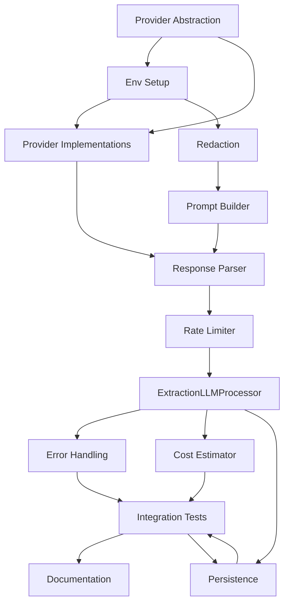

# Spec Tasks

_Glossary Reference_: See [./glossary.md](./glossary.md) for canonical term definitions referenced by task names and success criteria.

These are the tasks to be completed for the spec detailed in @.agent-os/specs/2025-01-08-claude-pro-integration/spec.md

> Created: 2025-01-08
> Status: Ready for Implementation (post-reconciliation 2025-08-11)

## Tasks (Parser before processor; added redaction & adapters)

- [x] 0. Provider Abstraction Layer
  - [x] 0.1 Tests for LLMProvider interface & factory
  - [x] 0.2 llm-provider.interface.ts (LLMProvider + capabilities)
  - [x] 0.3 llm-provider-factory.ts (LLMProviderFactory)
  - [x] 0.4 Shared request/response/stream types
  - [x] 0.5 Capability registry definition
  - [x] 0.6 Initial pricing catalog & type
  - [x] 0.7 Provider config schema (zod)
  - [x] 0.8 All tests green

- [ ] 1. Environment Setup & SDK Installation
  - [ ] 1.1 Config loader tests (env overrides, defaults)
  - [ ] 1.2 Install @anthropic-ai/sdk openai tiktoken
  - [ ] 1.3 Update .env.example (MEMORY*LLM*\*)
  - [ ] 1.4 LLMConfigLoader implementation
  - [ ] 1.5 Validation + error messaging
  - [ ] 1.6 All tests green

- [ ] 2. Provider Implementations
  - [ ] 2.1 ClaudeProvider tests (send/stream, errors)
  - [ ] 2.2 claude.provider.ts
  - [ ] 2.3 OpenAIProvider tests
  - [ ] 2.4 openai.provider.ts
  - [ ] 2.5 Streaming event normalization (all chunk types)
  - [ ] 2.6 Usage statistics tracking
  - [ ] 2.7 Provider-specific error mapping parity
  - [ ] 2.8 All tests green

- [ ] 3. Redaction Module
  - [ ] 3.1 Redactor interface + implementation (categories)
  - [ ] 3.2 Redaction tests (counts, placeholder safety)
  - [ ] 3.3 Integration point before mood scoring
  - [ ] 3.4 All tests green

- [ ] 4. Prompt Builder System
  - [ ] 4.1 Prompt template tests (mood, deltas, truncation)
  - [ ] 4.2 prompt-builder.ts
  - [ ] 4.3 Mood + delta + salience injection
  - [ ] 4.4 System + extraction instruction blocks
  - [ ] 4.5 JSON schema injection (versioned)
  - [ ] 4.6 Token optimization (salience pruning)
  - [ ] 4.7 Prompt statistics output
  - [ ] 4.8 All tests green

- [ ] 5. Response Parser Implementation
  - [ ] 5.1 Parser tests (valid/malformed/repair/fallback)
  - [ ] 5.2 response-parser.ts
  - [ ] 5.3 Streaming assembly & boundary detection
  - [ ] 5.4 Schema validation (MemoryLLMResponseSchema plural)
  - [ ] 5.5 Streaming parser state machine tests
  - [ ] 5.6 Corrective retry prompt logic
  - [ ] 5.7 Confidence extraction & normalization
  - [ ] 5.8 Fallback heuristics if unrecoverable
  - [ ] 5.9 Adapter support for legacy singular schema
  - [ ] 5.10 All tests green

- [ ] 6. Rate Limiting & Queue Management
  - [ ] 6.1 Rate limiter unit tests (burst/window)
  - [ ] 6.2 rate-limiter.ts (token + request tracking)
  - [ ] 6.3 Predictive queue projection logic
  - [ ] 6.4 Queue overflow policy implementation
  - [ ] 6.5 Exponential backoff implementation (injectable jitter)
  - [ ] 6.6 Header parsing (Anthropic) + synthetic metrics (OpenAI)
  - [ ] 6.7 Concurrency & fairness (FIFO) tests
  - [ ] 6.8 Circuit breaker integration hooks
  - [ ] 6.9 All tests green

- [ ] 7. ExtractionLLMProcessor
  - [ ] 7.1 Processor tests (happy path + skip + fallback)
  - [ ] 7.2 extraction-llm-processor.ts
  - [ ] 7.3 Emotional salience selection (top-K + context window)
  - [ ] 7.4 Provider selection + fallback chain
  - [ ] 7.5 Merge LLM output into base memory & confidence harmonics
  - [ ] 7.6 Budget guard invocation points
  - [ ] 7.7 Metrics consolidation and emission (requests, tokens, cost, latency, circuit)
  - [ ] 7.8 All tests green

- [ ] 8. Error Handling & Recovery
  - [ ] 8.1 Error classifier tests (mapping table)
  - [ ] 8.2 error-handler.ts
  - [ ] 8.3 Retry controller (max attempts + jitter injection)
  - [ ] 8.4 Corrective parsing retry path
  - [ ] 8.5 Fallback cascade logic tests
  - [ ] 8.6 Sanitized logging & redaction hooks
  - [ ] 8.7 All tests green

- [ ] 9. Cost Estimation & Tracking
  - [ ] 9.1 Cost estimator tests (model matrix)
  - [ ] 9.2 cost-estimator.ts + pricing catalog loader
  - [ ] 9.3 Pricing catalog validation
  - [ ] 9.4 Per-provider token tracking
  - [ ] 9.5 Token estimation fallbacks (heuristic vs actual variance)
  - [ ] 9.6 Rolling aggregates + UTC midnight reset
  - [ ] 9.7 Budget threshold events (70/90/100%)
  - [ ] 9.8 Daily over-budget refusal test
  - [ ] 9.9 All tests green

- [ ] 10. Integration Testing
  - [ ] 10.1 Mocked Claude end-to-end
  - [ ] 10.2 OpenAI fallback scenario
  - [ ] 10.3 Rate limit queue scenario
  - [ ] 10.4 Malformed → repair → success
  - [ ] 10.5 Budget exceeded refusal
  - [ ] 10.6 Concurrency stress (controlled)
  - [ ] 10.7 All integration tests green

- [ ] 11. Documentation & Examples
  - [ ] 11.1 API & config reference (configuration.md)
  - [ ] 11.2 Prompt design guide
  - [ ] 11.3 Error taxonomy & retry matrix doc
  - [ ] 11.4 Troubleshooting (common failures)
  - [ ] 11.5 Example scripts (happy path, fallback)
  - [ ] 11.6 README updates
  - [ ] 11.7 Metrics reference & dashboard examples

- [ ] 12. Persistence Integration
  - [ ] 12.1 persistence-adapter.ts (maps `ExtractedMemory` → DB models)
  - [ ] 12.2 Persistence adapter unit tests (batch transactional write, rollback on induced failure)
  - [ ] 12.3 Plural schema → record mapping (ensure required defaults: clusteringMetadata=null, clusterParticipationCount=0)
  - [ ] 12.4 Deduplication alignment (reuse existing hashing; reject or merge duplicates deterministically)
  - [ ] 12.5 Confidence harmonic merge logic on upsert (idempotent re-run)
  - [ ] 12.6 ID strategy & provenance fields (source provider, model, cost attribution placeholders)
  - [ ] 12.7 Error handling classification (db_conflict, validation) + metrics emission
  - [ ] 12.8 Performance guard (max records per batch + timing assertion)
  - [ ] 12.9 All tests green

## Task Dependencies

## Estimated Timeline (Realistic)

| Task                        | Hours (est) |
| --------------------------- | ----------- |
| 0. Provider Abstraction     | 5–6         |
| 1. Environment Setup        | 3–4         |
| 2. Provider Implementations | 7–8         |
| 3. Redaction Module         | 3–4         |
| 4. Prompt Builder           | 5–6         |
| 5. Response Parser          | 6–7         |
| 6. Rate Limiting & Queue    | 5–6         |
| 7. ExtractionLLMProcessor   | 8–10        |
| 8. Error Handling           | 4–5         |
| 9. Cost Estimation          | 4–5         |
| 10. Integration Testing     | 6–8         |
| 11. Documentation           | 4–5         |
| 12. Persistence Integration | 10–12       |

**Total Estimated Time**: 65–75 hours

Notes on increased estimates:

- Added complexity from streaming state machine implementation
- Schema constraint validation and testing overhead
- Multi-process budget coordination complexity
- Persistence integration with transactional guarantees
- Comprehensive metrics consolidation
- Additional testing for edge cases and error scenarios

## Success Criteria

- [ ] All unit tests passing with >80% overall coverage
- [ ] Provider & parser modules ≥85% coverage
- [ ] Integration tests passing with mocked providers
- [ ] Multi-memory extraction validated
- [ ] Rate limiting & circuit breaker verified under load
- [ ] Error recovery paths exercised (taxonomy complete)
- [ ] Budget guard correctness (100%)
- [ ] Documentation & metrics reference complete
- [ ] Example usage scripts function out of the box
