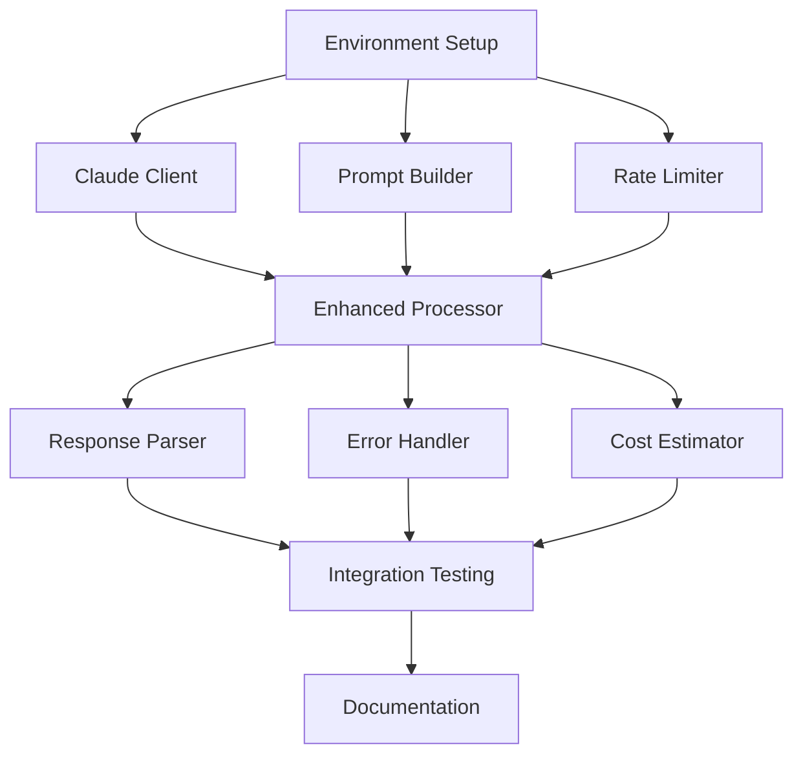

# Spec Tasks

These are the tasks to be completed for the spec detailed in @.agent-os/specs/2025-01-08-claude-pro-integration/spec.md

> Created: 2025-01-08
> Status: Ready for Implementation

## Tasks

- [ ] 1. Environment Setup and SDK Installation
  - [ ] 1.1 Write tests for environment configuration loading
  - [ ] 1.2 Install @anthropic-ai/sdk and related dependencies
  - [ ] 1.3 Create .env.example with required variables
  - [ ] 1.4 Implement ConfigurationManager for environment loading
  - [ ] 1.5 Add configuration validation
  - [ ] 1.6 Verify all tests pass

- [ ] 2. Claude Client Implementation
  - [ ] 2.1 Write tests for ClaudeClient initialization and validation
  - [ ] 2.2 Create claude-client.ts with Anthropic SDK wrapper
  - [ ] 2.3 Implement API key validation method
  - [ ] 2.4 Add message sending functionality
  - [ ] 2.5 Implement streaming support
  - [ ] 2.6 Add usage statistics tracking
  - [ ] 2.7 Verify all tests pass

- [ ] 3. Prompt Builder System
  - [ ] 3.1 Write tests for prompt generation with mood context
  - [ ] 3.2 Create prompt-builder.ts with template system
  - [ ] 3.3 Implement mood-aware prompt generation
  - [ ] 3.4 Add system prompt builder for emotional context
  - [ ] 3.5 Create extraction instructions generator
  - [ ] 3.6 Implement prompt optimization for tokens
  - [ ] 3.7 Add prompt statistics calculation
  - [ ] 3.8 Verify all tests pass

- [ ] 4. Rate Limiting and Queue Management
  - [ ] 4.1 Write tests for rate limiting scenarios
  - [ ] 4.2 Create rate-limiter.ts with queue implementation
  - [ ] 4.3 Implement request execution with throttling
  - [ ] 4.4 Add exponential backoff for retries
  - [ ] 4.5 Implement rate limit header parsing
  - [ ] 4.6 Add concurrent request management
  - [ ] 4.7 Verify all tests pass

- [ ] 5. Enhanced Claude Processor
  - [ ] 5.1 Write tests for message batch processing
  - [ ] 5.2 Create enhanced-processor.ts orchestrator
  - [ ] 5.3 Integrate with MoodScoringAnalyzer
  - [ ] 5.4 Implement emotional salience filtering
  - [ ] 5.5 Add batch processing with Claude API
  - [ ] 5.6 Implement cost estimation
  - [ ] 5.7 Add processing statistics tracking
  - [ ] 5.8 Verify all tests pass

- [ ] 6. Response Parser Implementation
  - [ ] 6.1 Write tests for response parsing scenarios
  - [ ] 6.2 Create response-parser.ts with validation
  - [ ] 6.3 Implement JSON response parsing
  - [ ] 6.4 Add streaming chunk assembly
  - [ ] 6.5 Implement schema validation
  - [ ] 6.6 Add confidence extraction
  - [ ] 6.7 Implement fallback parsing strategies
  - [ ] 6.8 Verify all tests pass

- [ ] 7. Error Handling and Recovery
  - [ ] 7.1 Write tests for error scenarios
  - [ ] 7.2 Create error-handler.ts with recovery strategies
  - [ ] 7.3 Implement error classification
  - [ ] 7.4 Add recovery strategy selection
  - [ ] 7.5 Implement retry logic with context
  - [ ] 7.6 Add error logging with sanitization
  - [ ] 7.7 Verify all tests pass

- [ ] 8. Cost Estimation and Tracking
  - [ ] 8.1 Write tests for cost calculations
  - [ ] 8.2 Create cost-estimator.ts with pricing model
  - [ ] 8.3 Implement token counting
  - [ ] 8.4 Add cost calculation for different models
  - [ ] 8.5 Implement usage tracking over time
  - [ ] 8.6 Add budget monitoring
  - [ ] 8.7 Verify all tests pass

- [ ] 9. Integration Testing
  - [ ] 9.1 Write integration tests with mocked Claude API
  - [ ] 9.2 Test end-to-end memory extraction workflow
  - [ ] 9.3 Test rate limiting with actual-like responses
  - [ ] 9.4 Test error recovery scenarios
  - [ ] 9.5 Test mood scoring integration
  - [ ] 9.6 Verify all integration tests pass

- [ ] 10. Documentation and Examples
  - [ ] 10.1 Write API documentation with examples
  - [ ] 10.2 Create configuration guide
  - [ ] 10.3 Write prompt engineering best practices
  - [ ] 10.4 Add troubleshooting guide
  - [ ] 10.5 Create example usage scripts
  - [ ] 10.6 Update package README

## Task Dependencies

## Estimated Timeline

- **Task 1**: 2-3 hours (Environment Setup)
- **Task 2**: 3-4 hours (Claude Client)
- **Task 3**: 4-5 hours (Prompt Builder)
- **Task 4**: 3-4 hours (Rate Limiter)
- **Task 5**: 4-5 hours (Enhanced Processor)
- **Task 6**: 3-4 hours (Response Parser)
- **Task 7**: 2-3 hours (Error Handler)
- **Task 8**: 2-3 hours (Cost Estimator)
- **Task 9**: 3-4 hours (Integration Testing)
- **Task 10**: 2-3 hours (Documentation)

**Total Estimated Time**: 28-38 hours

## Success Criteria

- [ ] All unit tests passing with >80% coverage
- [ ] Integration tests passing with mocked API
- [ ] Successfully process test conversations with mood scoring
- [ ] Rate limiting works correctly under load
- [ ] Error recovery handles all expected scenarios
- [ ] Documentation is complete and clear
- [ ] Example usage works out of the box
