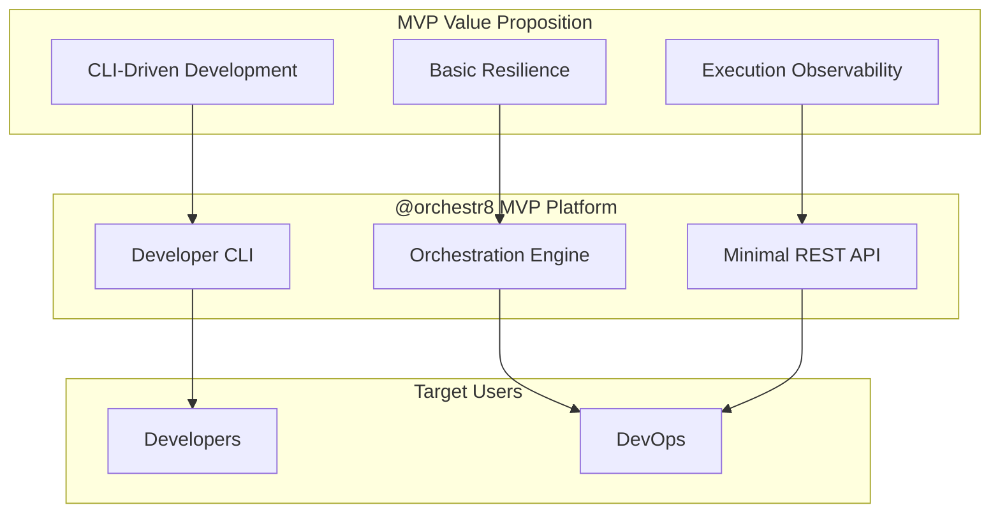
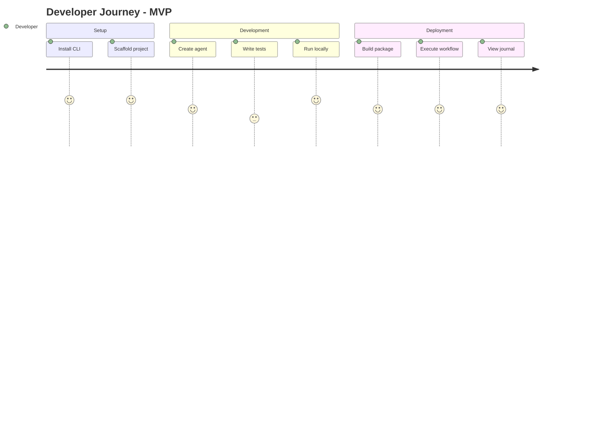
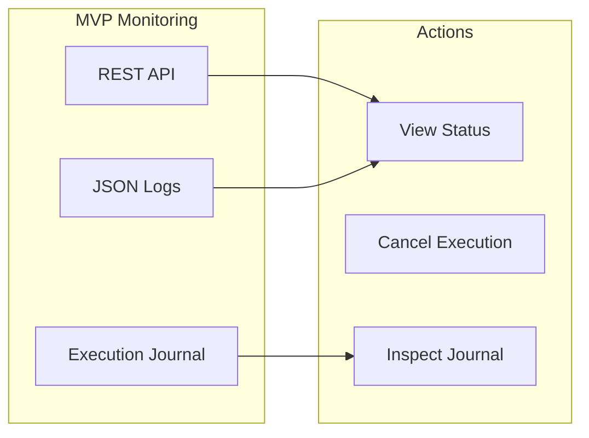
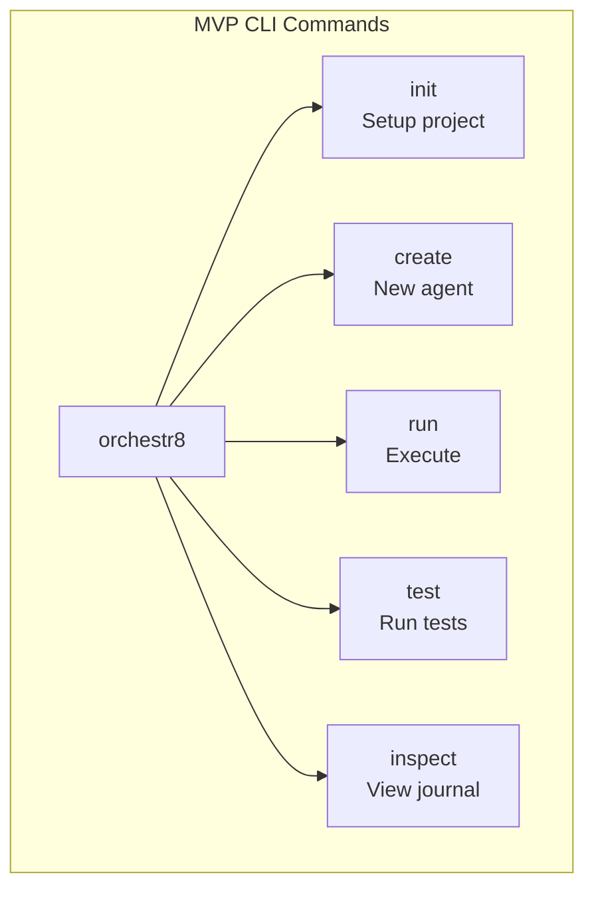
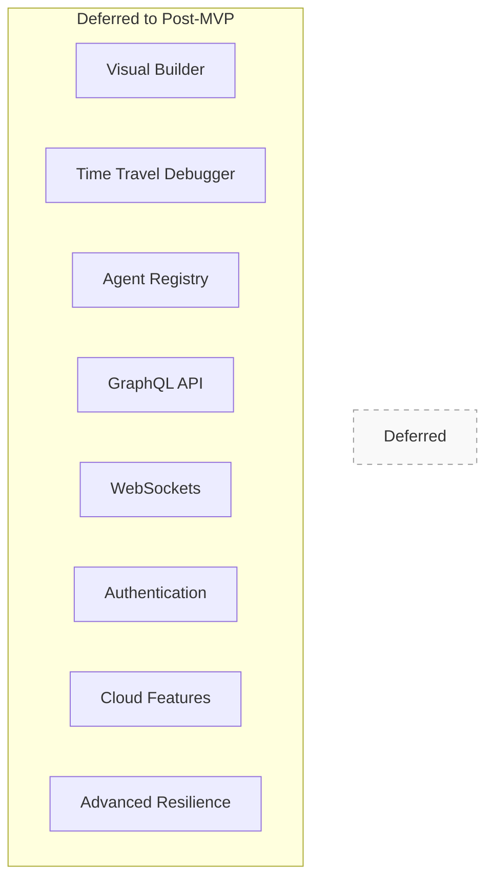
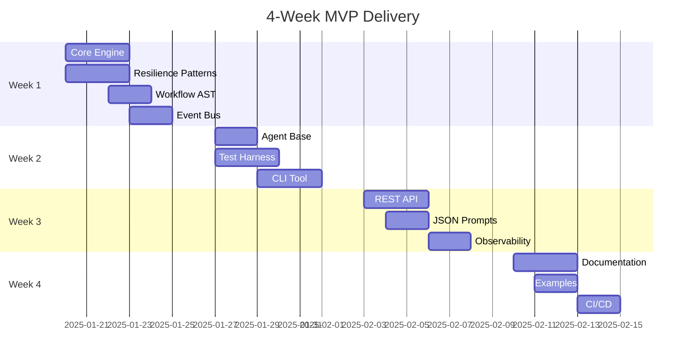
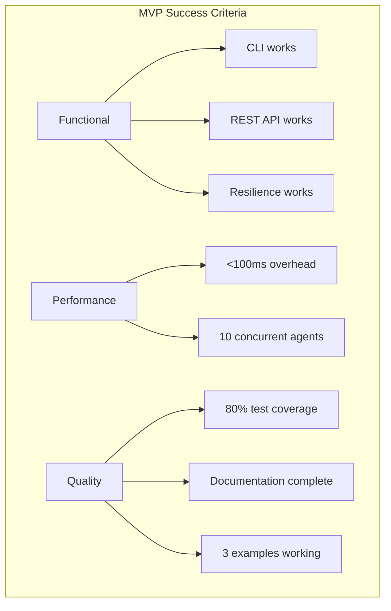

# @orchestr8 Agent Orchestration System - MVP Specification

> **Spec**: Agent Orchestration Platform MVP  
> **Created**: 2025-01-17  
> **Status**: 4-Week MVP Implementation  
> **Version**: 1.0.0-mvp  
> **Target**: Week 4 Delivery

## Executive Summary

@orchestr8 MVP delivers a **working agent orchestration system** with CLI tooling, basic resilience patterns, and execution observability in 4 weeks. The focus is on core value delivery without visual tools or complex features.



## MVP System Architecture

The @orchestr8 MVP implements a **simplified monorepo architecture** with 6 core packages focused on essential functionality.

```mermaid
graph TD
    subgraph "External Interfaces - MVP Only"
        CLI[CLI Tool]
        REST[REST API]
        NPM[NPM Registry]
    end

    subgraph "@orchestr8 Core Packages - MVP"
        Core[@orchestr8/core<br/>Orchestration]
        Resilience[@orchestr8/resilience<br/>Retry, Timeout, CB]
        AgentBase[@orchestr8/agent-base<br/>Base Classes]
        Testing[@orchestr8/testing<br/>Test Harness]
        Schema[@orchestr8/schema<br/>Workflow AST]
        CLIPkg[@orchestr8/cli<br/>Developer Tool]
    end

    CLI --> CLIPkg
    REST --> Core
    Core --> Resilience
    Core --> AgentBase
    Core --> Schema
    AgentBase --> Testing
    CLIPkg --> NPM
```

### MVP Addition: Dual Deployment for a TypeScript Research Agent (scoped)

To enable real-world validation with external information tools while keeping scope tight, MVP will include a single research agent (Context7) that can run in two modes using an adapter pattern:

- Standalone microservice: HTTP endpoints `/process` and `/health` for simple request/response processing
- Claude Code sub‑agent: a thin adapter function `handleRequest(input, context)` for invocation from Claude Code

Notes and boundaries:

- Core orchestration workflows remain JSON. This change does not alter the Workflow AST or orchestrator semantics
- Agent prompt authoring may use XML templates (scoped to the research agent’s prompt templates only). JSON remains the canonical format for workflows and policies
- No distributed infra (no Kafka). No registry. No auth. Local-only, same as other MVP components

## User Stories - MVP Focus

### Developer Building Agents (Week 1-2)

**Persona**: Developer needing basic agent orchestration  
**Goal**: Create and run agents via CLI with basic resilience



**User Story**: As a developer, I want to create agents using CLI scaffolding and run them with basic resilience patterns, without needing visual tools or complex debugging.

### DevOps Monitoring Execution (Week 3-4)

**Persona**: DevOps engineer needing execution visibility  
**Goal**: Monitor agent execution via REST API and logs



## Spec Scope - MVP Components Only

### 1. Core Orchestration Engine (Week 1)

**MVP Deliverables:**

- Parallel and sequential execution strategies
- In-process event bus with bounded queues
- Basic state management
- Execution context propagation

**NOT in MVP:**

- Visual workflow builder
- Time travel debugger
- Cross-process messaging
- Advanced orchestration patterns

### 2. Basic Resilience Patterns (Week 1)

```mermaid
graph LR
    subgraph "MVP Resilience Chain (Per ADR-014)"
        REQ[Request] --> RT[Retry]
        RT --> CB[Circuit Breaker]
        CB --> TO[Timeout]
        TO --> EXEC[Execute]
    end

    Note[Composition: retry(circuitBreaker(timeout(operation)))]
```

**MVP Deliverables:**

- Retry with exponential backoff
- Timeout management (30s default)
- Simple circuit breaker (open/closed/half-open)

**NOT in MVP:**

- Bulkhead isolation
- Rate limiting
- Adaptive circuit breakers

### 3. Developer CLI (Week 2)



**MVP Deliverables:**

- Project scaffolding
- Agent creation from templates
- Workflow execution
- Basic journal inspection

**NOT in MVP:**

- Interactive debugging
- Registry operations
- Visual tools

### 4. Minimal REST API (Week 3)

**MVP Endpoints:**

- `POST /workflows/execute` - Run workflow
- `GET /executions/:id` - Get status
- `GET /executions/:id/journal` - Get journal
- `POST /executions/:id/cancel` - Cancel execution

**NOT in MVP:**

- GraphQL interface
- WebSocket subscriptions
- Batch operations
- Authentication

## Out of Scope for MVP



- **No Visual Tools**: CLI only
- **No Advanced Debugging**: Journal inspection only
- **No Multiple APIs**: REST with JSON only
- **No Cross-Process**: In-process only
- **No Registry**: Direct imports only
- **No Auth**: Local execution only
- **No Cloud**: Single-node only

## Testing Architecture Overview

The @orchestr8 system implements a comprehensive testing strategy with concrete improvements across architecture, resilience, and ADR compliance:

### Vitest Project Separation

- **4 distinct projects**: Unit (threads), Integration (serial), Performance (isolated), Post-MVP (deferred)
- **Optimized execution**: Fast unit tests in parallel, stable integration tests in serial
- **Coverage enforcement**: v8 provider with project-specific thresholds (NO nyc)

### ADR Conformance Testing

- **Single test per ADR**: Lock down semantics to prevent drift
- **100% coverage requirement**: Conformance tests must have perfect coverage
- **Property-based testing**: For complex invariants (scheduler, resilience)

### Resilience & Determinism

- **Fake timers**: For TTL, timeout composition, and cancellation tests
- **Property tests**: Using fast-check for scheduler invariants
- **Error taxonomy**: Golden tests for error shapes, no PII in logs

### MSW & External APIs

- **Centralized setup**: @orchestr8/testing package with canned fixtures
- **Environment-aware**: `onUnhandledRequest: 'error'` in CI, `'warn'` locally
- **Provider fixtures**: Pre-defined responses for OpenAI, Anthropic, GitHub

### CI/CD Pipeline (Enhanced)

- **Codecov v4**: Using codecov-action@v4 with v8 json-summary uploads
- **Concurrency control**: `group: ${{ github.workflow }}-${{ github.ref }}`, `cancel-in-progress: true`
- **Environment consistency**: `TZ=UTC`, `LANG=en_US.UTF-8` in all test jobs
- **Node.js pinning**: Minor versions (20.12.x, 22.15.x) for cross-platform consistency (22.15.x aligned with .nvmrc)
- **Unified workspace option**: Single test run to simplify coverage collection
- **Thread capping**: Max 8 threads for stability
- **Reporter consistency**: junit.xml and coverage-summary.json

## Expected Deliverable - 4 Week Timeline



### Week 1 Deliverables

- ✅ Working orchestration engine
- ✅ Basic resilience patterns (retry, timeout, circuit breaker)
- ✅ Workflow AST with JSON Schema
- ✅ In-process event bus

### Week 2 Deliverables

- ✅ Agent base classes and test harness
- ✅ CLI with scaffold, create, run, test commands
- ✅ Execution journal capture
- ✅ MSW for mocking

### Week 3 Deliverables

- ✅ REST API with 4 endpoints
- ✅ JSON-based prompts (not XML) — scoped exception: agent-level XML templates for the single MVP research agent
- ✅ Basic OpenTelemetry integration
- ✅ Resilience tuning

### Week 3 Additional (Dual Deployment)

- ✅ Dual deployment adapters for the single research agent:
  - Standalone microservice endpoints: `POST /process`, `GET /health` (standardized paths)
  - Claude sub‑agent handler: handleRequest(input, context)
  - Note: All test specs use `/process` consistently, no `/agent/process` variations

### Week 4 Deliverables

- ✅ Docusaurus documentation
- ✅ 3+ working examples
- ✅ CI/CD pipeline with:
  - Codecov v4 + v8 coverage (NO nyc)
  - Concurrency management
  - Deterministic test environments (TZ=UTC, LANG=en_US.UTF-8)
  - Pinned Node.js versions
  - GitHub Actions optimization
- ✅ NPM publish readiness
- ✅ Cross‑repo agent distribution package + CLI installer (scoped)

## Success Metrics - MVP Targets



### Technical Metrics

- Orchestration overhead: <100ms (p95)
- Concurrent agents: 10+
- Test coverage: 80% on core packages (v8 provider only, NO nyc)
- CI/CD pipeline performance:
  - Build time: <10 minutes for PR checks
  - Test stability: <1% flake rate
  - Coverage: No drops >2% between commits
- ADR conformance: 100% test coverage on conformance tests
- Environment consistency: TZ=UTC, LANG=en_US.UTF-8 enforced

### Deliverable Checklist

- [ ] CLI executes workflows
- [ ] REST API serves 4 endpoints
- [ ] Basic resilience functional
- [ ] Documentation on Docusaurus
- [ ] Examples demonstrate patterns
- [ ] Performance baseline established

## Specification Documentation

### Core Documentation (MVP)

- **Main Specification**: @.agent-os/specs/2025-01-17-orchestr8-system/spec.md
- **Lean MVP**: @.agent-os/specs/2025-01-17-orchestr8-system/sub-specs/lean-mvp.md
- **Workflow Schema**: @.agent-os/specs/2025-01-17-orchestr8-system/sub-specs/workflow-ast-schema.md
- **Execution Semantics**: @.agent-os/specs/2025-01-17-orchestr8-system/sub-specs/execution-semantics.md
- **Tasks**: @.agent-os/specs/2025-01-17-orchestr8-system/tasks.md
- **Dual Deployment (MVP)**: @.agent-os/specs/2025-01-17-orchestr8-system/sub-specs/dual-deployment-mvp.md
- **Cross‑Repo Distribution (MVP)**: @.agent-os/specs/2025-01-17-orchestr8-system/sub-specs/cross-repo-agent-distribution.md

### Testing Documentation (Enhanced)

- **Testing Architecture**: @.agent-os/specs/2025-01-17-orchestr8-system/sub-specs/testing-architecture.md
- **ADR Conformance Tests**: @.agent-os/specs/2025-01-17-orchestr8-system/sub-specs/adr-conformance-tests.md
- **Test Specifications**: @.agent-os/specs/2025-01-17-orchestr8-system/sub-specs/tests.md

### Prompt Engineering Documentation (Phase 2)

- **Agent Prompt Engineering**: @.agent-os/specs/2025-01-17-orchestr8-system/sub-specs/agent-prompt-engineering.md
- **Prompt Quality Measurement**: @.agent-os/specs/2025-01-17-orchestr8-system/sub-specs/prompt-quality-measurement.md
- **Enhanced Technical Spec**: @.agent-os/specs/2025-01-17-orchestr8-system/sub-specs/technical-spec.md (Chain of Thought patterns)
- **Enhanced Prompt Schema**: @.agent-os/specs/2025-01-17-orchestr8-system/sub-specs/prompt-schema.md (Anthropic best practices)

### CI/CD Documentation (MVP Critical)

- **CI/CD Pipeline**: @.agent-os/specs/2025-01-17-orchestr8-system/sub-specs/ci-cd-pipeline.md

### Deferred Documentation (Post-MVP)

- Visual Builder Specification
- Time Travel Debugger Design
- GraphQL API Schema
- Enterprise Security Model
- Cloud Deployment Guide

---

## Phase 2: Enterprise-Grade Prompt Engineering Enhancement

Following the MVP delivery, expert prompt engineering analysis using Anthropic's documentation revealed critical opportunities to achieve enterprise-grade agent reliability through proven prompt engineering patterns.

### Enhanced System Architecture

```mermaid
graph TD
    subgraph "Phase 1: MVP Foundation (Complete)"
        Core[@orchestr8/core]
        CLI[@orchestr8/cli]
        REST[REST API]
        style Core fill:#e1f5fe,stroke:#01579b
        style CLI fill:#e1f5fe,stroke:#01579b
        style REST fill:#e1f5fe,stroke:#01579b
    end

    subgraph "Phase 2: Prompt Engineering Layer"
        PE[Agent Prompt Engineering]
        QM[Quality Measurement]
        AB[A/B Testing Framework]
        CT[Chain of Thought]

        style PE fill:#e8f5e8,stroke:#2e7d32
        style QM fill:#e8f5e8,stroke:#2e7d32
        style AB fill:#e8f5e8,stroke:#2e7d32
        style CT fill:#e8f5e8,stroke:#2e7d32
    end

    Core --> PE
    PE --> QM
    QM --> AB
    PE --> CT
    CLI --> QM
```

### Prompt Engineering Value Proposition

**Transforms Agent Reliability:**

- **95%+ instruction adherence** (vs typical 60-70%)
- **XML-structured prompts** for consistent parsing
- **Statistical validation** with confidence intervals
- **Chain of thought reasoning** for complex decisions
- **A/B testing framework** for scientific optimization

### Phase 2 Deliverables Created

**Core Specifications:**

1. **agent-prompt-engineering.md** - Enterprise XML template architecture with role definitions
2. **prompt-quality-measurement.md** - Statistical validation and A/B testing framework
3. **technical-spec.md enhanced** - Chain of thought patterns integrated into base agents
4. **prompt-schema.md enhanced** - Anthropic best practices for JSON/XML hybrid approach

**Implementation Progress:**

- ✅ **Tasks 27-30 Complete**: Foundation architecture and quality measurement
- 🔄 **Tasks 31-34 In Progress**: Integration with existing measurement and decision frameworks
- 📋 **Tasks 35-38 Planned**: Testing methodology and performance baselines
- 📋 **Tasks 39-41 Planned**: Developer tooling and enterprise patterns

## Conclusion

The @orchestr8 project delivers value in two distinct phases:

### Phase 1: MVP Foundation (4 weeks)

- **Focusing**: CLI + REST only, no visual tools
- **Simplifying**: 6 packages, not 17+
- **Deferring**: Complex features to post-MVP
- **Measuring**: Real metrics, not claims
- **Shipping**: Working system in 4 weeks

### Phase 2: Enterprise Enhancement (Ongoing)

- **Scientific**: Statistical validation of prompt quality
- **Measurable**: 95%+ instruction adherence targets
- **Systematic**: XML-structured prompts with proven patterns
- **Optimizable**: A/B testing framework for continuous improvement
- **Reliable**: Chain of thought reasoning for complex decisions

This pragmatic approach ensures high-quality delivery of essential features while building toward **enterprise-grade agent reliability** through scientifically validated prompt engineering patterns.
