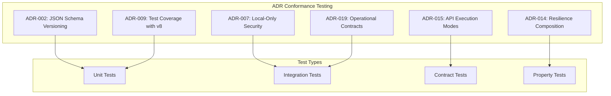

# ADR Conformance Test Specification

This document defines comprehensive test requirements to ensure strict compliance with Architectural Decision Records (ADRs) for the @orchestr8 system.

> Created: 2025-01-17  
> Version: 1.0.0  
> Status: ADR Validation Strategy

## Overview

Each critical ADR requires a dedicated conformance test suite to lock down semantics and prevent future drift. These tests serve as executable specifications that validate the exact implementation of architectural decisions.



## ADR-002: JSON Schema Versioning Conformance

### Test Requirements

Validate that all workflow and policy schemas include proper versioning with cryptographic hash verification.

```typescript
// adr-002-schema-versioning.test.ts
import { describe, it, expect, vi } from 'vitest'
import { createHash } from 'crypto'
import {
  WorkflowSchema,
  validateSchema,
  calculateSchemaHash,
} from '@orchestr8/schema'

describe('ADR-002: JSON Schema Versioning Conformance', () => {
  describe('Schema Hash Validation', () => {
    it('enforces SHA-256 hash format for all schemas', async () => {
      const schema = await WorkflowSchema.load('workflow-v1.json')

      // Must have version field
      expect(schema.version).toMatch(/^\d+\.\d+\.\d+$/)

      // Must have valid SHA-256 hash
      expect(schema.schemaHash).toMatch(/^[a-f0-9]{64}$/)

      // Hash must be calculated from canonical JSON
      const canonicalJson = JSON.stringify(schema.definition, null, 2)
      const expectedHash = createHash('sha256')
        .update(canonicalJson)
        .digest('hex')

      expect(schema.schemaHash).toBe(expectedHash)
    })

    it('rejects schemas with invalid or missing hash', async () => {
      const invalidSchema = {
        version: '1.0.0',
        schemaHash: 'invalid-hash',
        definition: {
          /* schema */
        },
      }

      await expect(validateSchema(invalidSchema)).rejects.toThrow(
        'Invalid schema hash: expected 64 character hex string',
      )
    })

    it('rejects schemas with tampered content', async () => {
      const validSchema = await WorkflowSchema.load('workflow-v1.json')
      const tamperedSchema = {
        ...validSchema,
        definition: {
          ...validSchema.definition,
          tampered: true, // Content modification
        },
      }

      await expect(validateSchema(tamperedSchema)).rejects.toThrow(
        'Schema hash mismatch: content has been modified',
      )
    })

    it('supports schema evolution with version bumps', async () => {
      const v1Schema = await WorkflowSchema.load('workflow-v1.json')
      const v2Schema = await WorkflowSchema.load('workflow-v2.json')

      // Different versions should have different hashes
      expect(v2Schema.version).toMatch(/^2\.\d+\.\d+$/)
      expect(v2Schema.schemaHash).not.toBe(v1Schema.schemaHash)

      // Both should validate correctly
      await expect(validateSchema(v1Schema)).resolves.toBe(true)
      await expect(validateSchema(v2Schema)).resolves.toBe(true)
    })
  })

  describe('Scoped XML Exception', () => {
    it('allows XML templates only for designated research agent', () => {
      const researchAgentPrompt = {
        agentId: 'context7-research',
        promptType: 'xml',
        template: '<prompt>...</prompt>',
      }

      expect(() => validateAgentPrompt(researchAgentPrompt)).not.toThrow()
    })

    it('rejects XML for workflow definitions', () => {
      const workflowWithXml = {
        type: 'workflow',
        format: 'xml',
        content: '<workflow>...</workflow>',
      }

      expect(() => validateWorkflowDefinition(workflowWithXml)).toThrow(
        'Workflows must use JSON format (ADR-002)',
      )
    })

    it('rejects XML for orchestration policies', () => {
      const policyWithXml = {
        type: 'policy',
        format: 'xml',
        content: '<policy>...</policy>',
      }

      expect(() => validatePolicy(policyWithXml)).toThrow(
        'Policies must use JSON format (ADR-002)',
      )
    })
  })
})
```

## ADR-007: Local-Only Security Conformance

### Test Requirements

Ensure the system enforces localhost-only binding and rejects external requests.

```typescript
// adr-007-local-security.test.ts
import { describe, it, expect, beforeAll, afterAll } from 'vitest'
import { createServer } from 'http'
import { RestAPI } from '@orchestr8/api'
import net from 'net'

describe('ADR-007: Local-Only Security Conformance', () => {
  let server: any
  let api: RestAPI

  beforeAll(async () => {
    api = new RestAPI({ security: { localOnly: true } })
    server = await api.listen(0) // Random port
  })

  afterAll(async () => {
    await server.close()
  })

  describe('Localhost Binding', () => {
    it('binds server to 127.0.0.1 only', () => {
      const address = server.address()
      expect(address.address).toBe('127.0.0.1')
      expect(address.family).toBe('IPv4')
    })

    it('rejects connections from external IPs', async () => {
      // Attempt connection from non-localhost
      const client = new net.Socket()
      const externalIP = '192.168.1.100'

      await expect(
        new Promise((resolve, reject) => {
          client.connect(server.address().port, externalIP, () => {
            reject(new Error('Should not connect from external IP'))
          })

          client.on('error', (err) => {
            resolve(err)
          })
        }),
      ).resolves.toMatchObject({
        code: 'ECONNREFUSED',
      })
    })
  })

  describe('Host Header Validation', () => {
    it('accepts localhost host headers', async () => {
      const validHosts = [
        'localhost:8088',
        '127.0.0.1:8088',
        '[::1]:8088',
        'localhost',
      ]

      for (const host of validHosts) {
        const response = await api.handleRequest({
          method: 'GET',
          path: '/health',
          headers: { host },
        })

        expect(response.status).toBe(200)
      }
    })

    it('rejects non-localhost host headers', async () => {
      const invalidHosts = [
        'example.com:8088',
        '192.168.1.100:8088',
        'orchestr8.io',
        'malicious.site',
      ]

      for (const host of invalidHosts) {
        const response = await api.handleRequest({
          method: 'GET',
          path: '/health',
          headers: { host },
        })

        expect(response.status).toBe(403)
        expect(response.body.error.code).toBe('FORBIDDEN')
        expect(response.body.error.message).toContain('Local access only')
      }
    })
  })

  describe('CORS Configuration', () => {
    it('disables CORS for local-only mode', async () => {
      const response = await api.handleRequest({
        method: 'OPTIONS',
        path: '/workflows',
        headers: {
          origin: 'https://external.com',
          'access-control-request-method': 'POST',
        },
      })

      // No CORS headers should be present
      expect(response.headers['access-control-allow-origin']).toBeUndefined()
      expect(response.headers['access-control-allow-methods']).toBeUndefined()
      expect(response.headers['access-control-allow-headers']).toBeUndefined()
    })
  })

  describe('Security Headers', () => {
    it('includes security headers for local requests', async () => {
      const response = await api.handleRequest({
        method: 'GET',
        path: '/health',
        headers: { host: 'localhost' },
      })

      expect(response.headers['x-frame-options']).toBe('DENY')
      expect(response.headers['x-content-type-options']).toBe('nosniff')
      expect(response.headers['x-xss-protection']).toBe('1; mode=block')
      expect(response.headers['content-security-policy']).toContain(
        "default-src 'self'",
      )
    })
  })
})
```

## ADR-009: Test Coverage with v8 Conformance

### Test Requirements

Validate that all packages use v8 coverage provider with proper thresholds.

```typescript
// adr-009-coverage-enforcement.test.ts
import { describe, it, expect } from 'vitest'
import { readFileSync, existsSync } from 'fs'
import { join } from 'path'
import { glob } from 'glob'

describe('ADR-009: Test Coverage with v8 Conformance', () => {
  describe('Vitest Configuration', () => {
    it('enforces v8 coverage provider in all packages', async () => {
      const configFiles = await glob('packages/*/vitest.config.ts')

      for (const configPath of configFiles) {
        const config = readFileSync(configPath, 'utf-8')

        // Must use v8 provider
        expect(config).toContain("provider: 'v8'")

        // Must not use istanbul or c8
        expect(config).not.toContain("provider: 'istanbul'")
        expect(config).not.toContain("provider: 'c8'")
      }
    })

    it('enforces correct coverage thresholds for core packages', () => {
      const corePackages = ['core', 'resilience', 'schema']

      for (const pkg of corePackages) {
        const configPath = join('packages', pkg, 'vitest.config.ts')
        const config = readFileSync(configPath, 'utf-8')

        // Core packages must have 80% thresholds
        expect(config).toContain('branches: 80')
        expect(config).toContain('functions: 80')
        expect(config).toContain('lines: 80')
        expect(config).toContain('statements: 80')
      }
    })

    it('enforces correct coverage thresholds for supporting packages', () => {
      const supportingPackages = ['agent-base', 'testing', 'cli']

      for (const pkg of supportingPackages) {
        const configPath = join('packages', pkg, 'vitest.config.ts')
        const config = readFileSync(configPath, 'utf-8')

        // Supporting packages have 60-70% thresholds
        const thresholdMatch = config.match(/lines:\s*(\d+)/)
        expect(thresholdMatch).toBeTruthy()

        const threshold = parseInt(thresholdMatch![1])
        expect(threshold).toBeGreaterThanOrEqual(60)
        expect(threshold).toBeLessThanOrEqual(70)
      }
    })
  })

  describe('Coverage Output', () => {
    it('generates coverage in correct directory structure', () => {
      const expectedPaths = [
        './test-results/coverage/',
        './test-results/junit.xml',
      ]

      for (const path of expectedPaths) {
        const configContent = readFileSync('vitest.config.ts', 'utf-8')
        expect(configContent).toContain(path)
      }
    })

    it('produces v8 format coverage-summary.json', () => {
      // This would run after tests to validate output
      const summaryPath = './test-results/coverage/coverage-summary.json'

      if (existsSync(summaryPath)) {
        const summary = JSON.parse(readFileSync(summaryPath, 'utf-8'))

        // v8 format includes these keys
        expect(summary).toHaveProperty('total')
        expect(summary.total).toHaveProperty('lines')
        expect(summary.total).toHaveProperty('branches')
        expect(summary.total).toHaveProperty('functions')
        expect(summary.total).toHaveProperty('statements')
      }
    })
  })

  describe('Enforcement Script', () => {
    it('reads from v8 coverage-summary.json', () => {
      const scriptPath = 'scripts/enforce-coverage.ts'
      const script = readFileSync(scriptPath, 'utf-8')

      // Script must read correct file
      expect(script).toContain('coverage-summary.json')

      // Script must check v8 format
      expect(script).toContain('total.lines.pct')
      expect(script).toContain('total.branches.pct')
    })

    it('fails fast with readable output on threshold violations', () => {
      const mockReport = {
        total: {
          lines: { pct: 75 },
          branches: { pct: 75 },
          functions: { pct: 75 },
          statements: { pct: 75 },
        },
      }

      const enforceCoverage = require('../../scripts/enforce-coverage')
      const result = enforceCoverage('core', mockReport)

      expect(result.passed).toBe(false)
      expect(result.message).toContain('Coverage below threshold')
      expect(result.message).toContain('75% < 80% required')
    })
  })
})
```

## ADR-014: Resilience Composition Conformance

### Test Requirements

Validate the correct composition order of resilience patterns.

```typescript
// adr-014-resilience-composition.test.ts
import { describe, it, expect, vi } from 'vitest'
import {
  withResilience,
  RetryPolicy,
  CircuitBreaker,
  TimeoutPolicy,
} from '@orchestr8/resilience'
import fc from 'fast-check'

describe('ADR-014: Resilience Composition Conformance', () => {
  describe('Composition Order', () => {
    it('enforces retry(circuitBreaker(timeout(operation))) order', async () => {
      const executionOrder: string[] = []

      const operation = vi.fn(async () => {
        executionOrder.push('operation')
        throw new Error('Failed')
      })

      const tracedTimeout = (fn: any) => {
        return async (...args: any[]) => {
          executionOrder.push('timeout-start')
          try {
            return await TimeoutPolicy.wrap(fn, { duration: 1000 })(...args)
          } finally {
            executionOrder.push('timeout-end')
          }
        }
      }

      const tracedCircuitBreaker = (fn: any) => {
        return async (...args: any[]) => {
          executionOrder.push('circuitbreaker-start')
          try {
            return await CircuitBreaker.wrap(fn, { threshold: 2 })(...args)
          } finally {
            executionOrder.push('circuitbreaker-end')
          }
        }
      }

      const tracedRetry = (fn: any) => {
        return async (...args: any[]) => {
          executionOrder.push('retry-start')
          try {
            return await RetryPolicy.wrap(fn, { maxAttempts: 3 })(...args)
          } finally {
            executionOrder.push('retry-end')
          }
        }
      }

      const resilientOp = tracedRetry(
        tracedCircuitBreaker(tracedTimeout(operation)),
      )

      await expect(resilientOp()).rejects.toThrow()

      // Verify nesting order: retry wraps CB wraps timeout
      const firstAttempt = executionOrder.slice(0, 7)
      expect(firstAttempt).toEqual([
        'retry-start',
        'circuitbreaker-start',
        'timeout-start',
        'operation',
        'timeout-end',
        'circuitbreaker-end',
        // retry continues...
      ])
    })

    it('prevents incorrect composition orders', () => {
      const operation = vi.fn()

      // Should throw or warn on incorrect order
      expect(() => {
        // Wrong: timeout wrapping retry
        withResilience(operation, {
          order: ['timeout', 'retry', 'circuitBreaker'], // Invalid
        })
      }).toThrow('Invalid resilience composition order')
    })
  })

  describe('Pattern Interaction', () => {
    it('circuit breaker state affects retry behavior', async () => {
      const operation = vi.fn().mockRejectedValue(new Error('Service error'))
      const cb = new CircuitBreaker({ threshold: 2, timeout: 100 })

      const resilientOp = withResilience(operation, {
        retry: { maxAttempts: 5 },
        circuitBreaker: cb,
      })

      // First 2 attempts should execute and fail
      await expect(resilientOp()).rejects.toThrow()
      expect(operation).toHaveBeenCalledTimes(2) // CB opens after 2 failures

      // Circuit breaker is now open
      expect(cb.state).toBe('OPEN')

      // Further attempts should fail fast without calling operation
      operation.mockClear()
      await expect(resilientOp()).rejects.toThrow('Circuit breaker is open')
      expect(operation).not.toHaveBeenCalled()
    })

    it('timeout affects individual retry attempts', async () => {
      const delays = [100, 200, 50, 300, 150]
      let attemptIndex = 0

      const operation = vi.fn(async () => {
        const delay = delays[attemptIndex++]
        await new Promise((resolve) => setTimeout(resolve, delay))
        return 'success'
      })

      const resilientOp = withResilience(operation, {
        retry: { maxAttempts: 5 },
        timeout: { duration: 175 }, // Times out on 200ms and 300ms
      })

      const result = await resilientOp()

      // Should succeed on attempt 3 (50ms) after 1 and 2 timeout
      expect(result).toBe('success')
      expect(operation).toHaveBeenCalledTimes(3)
    })
  })

  describe('Property-Based Composition Tests', () => {
    it('maintains composition invariants across random configurations', () => {
      fc.assert(
        fc.property(
          fc.record({
            retryAttempts: fc.integer({ min: 1, max: 10 }),
            cbThreshold: fc.integer({ min: 1, max: 5 }),
            timeoutMs: fc.integer({ min: 10, max: 1000 }),
            operationDelayMs: fc.integer({ min: 0, max: 500 }),
          }),
          async (config) => {
            const operation = vi.fn(async () => {
              await new Promise((r) => setTimeout(r, config.operationDelayMs))
              throw new Error('Test error')
            })

            const resilientOp = withResilience(operation, {
              retry: { maxAttempts: config.retryAttempts },
              circuitBreaker: { threshold: config.cbThreshold },
              timeout: { duration: config.timeoutMs },
            })

            await expect(resilientOp()).rejects.toThrow()

            // Invariant: attempts ≤ min(retryAttempts, cbThreshold)
            const actualAttempts = operation.mock.calls.length
            const maxPossibleAttempts = Math.min(
              config.retryAttempts,
              config.cbThreshold,
            )

            expect(actualAttempts).toBeLessThanOrEqual(maxPossibleAttempts)
          },
        ),
      )
    })
  })
})
```

## ADR-015: API Execution Modes Conformance

### Test Requirements

Validate async (202) vs sync execution modes and proper status codes.

```typescript
// adr-015-api-execution-modes.test.ts
import { describe, it, expect } from 'vitest'
import { RestAPI } from '@orchestr8/api'
import { v4 as uuidv4 } from 'uuid'

describe('ADR-015: API Execution Modes Conformance', () => {
  let api: RestAPI

  beforeEach(() => {
    api = new RestAPI()
  })

  describe('Asynchronous Execution (Default)', () => {
    it('returns 202 Accepted for workflow execution', async () => {
      const response = await api.handleRequest({
        method: 'POST',
        path: '/workflows/execute',
        body: {
          workflowId: 'test-workflow',
          input: { data: 'test' },
        },
      })

      expect(response.status).toBe(202)
      expect(response.headers['content-type']).toBe('application/json')
      expect(response.body).toHaveProperty('executionId')
      expect(response.body).toHaveProperty('status', 'PENDING')
      expect(response.body).toHaveProperty('links')

      // HATEOAS links
      expect(response.body.links).toEqual({
        self: expect.stringContaining(
          `/executions/${response.body.executionId}`,
        ),
        journal: expect.stringContaining(
          `/executions/${response.body.executionId}/journal`,
        ),
        cancel: expect.stringContaining(
          `/executions/${response.body.executionId}/cancel`,
        ),
      })
    })

    it('provides polling endpoint for status', async () => {
      const executeResponse = await api.handleRequest({
        method: 'POST',
        path: '/workflows/execute',
        body: { workflowId: 'test-workflow' },
      })

      const executionId = executeResponse.body.executionId

      // Poll for status
      const statusResponse = await api.handleRequest({
        method: 'GET',
        path: `/executions/${executionId}`,
      })

      expect(statusResponse.status).toBe(200)
      expect(statusResponse.body).toHaveProperty('status')
      expect(['PENDING', 'RUNNING', 'COMPLETED', 'FAILED']).toContain(
        statusResponse.body.status,
      )
    })
  })

  describe('Synchronous Execution (Optional)', () => {
    it('supports sync mode with prefer header', async () => {
      const response = await api.handleRequest({
        method: 'POST',
        path: '/workflows/execute',
        headers: {
          prefer: 'respond-async=false',
        },
        body: {
          workflowId: 'simple-workflow',
          input: { data: 'test' },
        },
      })

      // Should wait and return 200 with result
      expect(response.status).toBe(200)
      expect(response.body).toHaveProperty('status', 'COMPLETED')
      expect(response.body).toHaveProperty('output')
    })

    it('times out sync requests after 30 seconds', async () => {
      const slowWorkflow = {
        workflowId: 'slow-workflow',
        input: { delay: 35000 }, // 35 second delay
      }

      const response = await api.handleRequest({
        method: 'POST',
        path: '/workflows/execute',
        headers: {
          prefer: 'respond-async=false',
        },
        body: slowWorkflow,
      })

      // Should timeout and return 202 with async execution
      expect(response.status).toBe(202)
      expect(response.body).toHaveProperty('executionId')
      expect(response.body).toHaveProperty(
        'message',
        'Execution taking longer than 30s, switching to async mode',
      )
    })
  })

  describe('Status Code Semantics', () => {
    it('uses correct status codes for each scenario', async () => {
      const scenarios = [
        {
          name: 'successful async execution',
          request: { method: 'POST', path: '/workflows/execute', body: {} },
          expectedStatus: 202,
        },
        {
          name: 'successful sync execution',
          request: {
            method: 'POST',
            path: '/workflows/execute',
            headers: { prefer: 'respond-async=false' },
            body: {},
          },
          expectedStatus: 200,
        },
        {
          name: 'execution not found',
          request: { method: 'GET', path: '/executions/nonexistent' },
          expectedStatus: 404,
        },
        {
          name: 'invalid workflow payload',
          request: {
            method: 'POST',
            path: '/workflows/execute',
            body: { invalid: 'payload' },
          },
          expectedStatus: 400,
        },
        {
          name: 'successful cancellation',
          request: { method: 'POST', path: '/executions/test-id/cancel' },
          expectedStatus: 200,
        },
        {
          name: 'already completed execution cancel',
          request: { method: 'POST', path: '/executions/completed-id/cancel' },
          expectedStatus: 409, // Conflict
        },
      ]

      for (const scenario of scenarios) {
        const response = await api.handleRequest(scenario.request)
        expect(response.status).toBe(scenario.expectedStatus)
      }
    })
  })
})
```

## ADR-019: Operational Contracts Conformance

### Test Requirements

Validate scheduler contracts, idempotency, ETags, and cancellation semantics.

```typescript
// adr-019-operational-contracts.test.ts
import { describe, it, expect, vi, beforeEach } from 'vitest'
import { FairScheduler } from '@orchestr8/core'
import { RestAPI } from '@orchestr8/api'
import { useFakeTimers } from '../utils/timers'
import { createHash } from 'crypto'

describe('ADR-019: Operational Contracts Conformance', () => {
  describe('Scheduler Contracts', () => {
    it('validates dependency checking against completedTasks', async () => {
      const scheduler = new FairScheduler()
      const executionLog: string[] = []

      const tasks = [
        {
          id: 'task-a',
          dependencies: [],
          execute: async () => {
            executionLog.push('a-start')
            await new Promise((r) => setTimeout(r, 100))
            executionLog.push('a-end')
          },
        },
        {
          id: 'task-b',
          dependencies: ['task-a'],
          execute: async () => {
            executionLog.push('b-start')
            // Should only start after task-a completes
            expect(executionLog).toContain('a-end')
          },
        },
      ]

      await scheduler.execute(tasks)

      expect(executionLog).toEqual(['a-start', 'a-end', 'b-start'])
    })

    it('detects and rejects circular dependencies', () => {
      const scheduler = new FairScheduler()

      const circularTasks = [
        { id: 'a', dependencies: ['b'] },
        { id: 'b', dependencies: ['c'] },
        { id: 'c', dependencies: ['a'] }, // Creates cycle
      ]

      expect(() => scheduler.validate(circularTasks)).toThrow(
        'Circular dependency detected: a -> b -> c -> a',
      )
    })

    it('enforces FIFO ordering under contention', async () => {
      const scheduler = new FairScheduler({ maxConcurrency: 2 })
      const submissionOrder: string[] = []
      const startOrder: string[] = []

      // Create 10 tasks that track order
      const tasks = Array.from({ length: 10 }, (_, i) => ({
        id: `task-${i}`,
        execute: async () => {
          startOrder.push(`task-${i}`)
          await new Promise((r) => setTimeout(r, 50))
        },
      }))

      // Submit all tasks
      for (const task of tasks) {
        submissionOrder.push(task.id)
        scheduler.submit(task)
      }

      await scheduler.waitForAll()

      // With FIFO, start order should roughly match submission
      // Allow for concurrency but no starvation
      for (let i = 0; i < 8; i++) {
        const startIndex = startOrder.indexOf(`task-${i}`)
        expect(startIndex).toBeLessThanOrEqual(i + 2) // Max 2 positions later
      }
    })
  })

  describe('Idempotency Contracts', () => {
    let api: RestAPI
    const timers = useFakeTimers()

    beforeEach(() => {
      api = new RestAPI({
        idempotency: {
          ttl: 600000, // 10 minutes
          cleanupInterval: 60000, // 1 minute
        },
      })
    })

    it('enforces 10-minute TTL for idempotency keys', async () => {
      const key = uuidv4()
      const payload = { workflowId: 'test', input: { data: 'test' } }

      // First request
      const response1 = await api.handleRequest({
        method: 'POST',
        path: '/workflows/execute',
        headers: { 'idempotency-key': key },
        body: payload,
      })

      expect(response1.status).toBe(202)
      const executionId1 = response1.body.executionId

      // Immediate duplicate - should return cached
      const response2 = await api.handleRequest({
        method: 'POST',
        path: '/workflows/execute',
        headers: { 'idempotency-key': key },
        body: payload,
      })

      expect(response2.status).toBe(202)
      expect(response2.body.executionId).toBe(executionId1)
      expect(response2.headers['x-idempotent-replayed']).toBe('true')

      // Advance time to just before TTL
      timers.advance(599000) // 9:59

      const response3 = await api.handleRequest({
        method: 'POST',
        path: '/workflows/execute',
        headers: { 'idempotency-key': key },
        body: payload,
      })

      expect(response3.body.executionId).toBe(executionId1) // Still cached

      // Advance past TTL
      timers.advance(2000) // 10:01

      const response4 = await api.handleRequest({
        method: 'POST',
        path: '/workflows/execute',
        headers: { 'idempotency-key': key },
        body: payload,
      })

      expect(response4.body.executionId).not.toBe(executionId1) // New execution
      expect(response4.headers['x-idempotent-replayed']).toBeUndefined()
    })

    it('runs cleanup sweep every 60 seconds', async () => {
      const keys = Array.from({ length: 10 }, () => uuidv4())

      // Create 10 cached entries
      for (const key of keys) {
        await api.handleRequest({
          method: 'POST',
          path: '/workflows/execute',
          headers: { 'idempotency-key': key },
          body: { workflowId: 'test' },
        })
      }

      expect(api.getIdempotencyCacheSize()).toBe(10)

      // Advance past TTL
      timers.advance(601000) // 10:01

      // Trigger cleanup sweep
      timers.advance(60000) // Next sweep

      expect(api.getIdempotencyCacheSize()).toBe(0) // All expired entries removed
    })

    it('validates idempotency key format', async () => {
      const invalidKeys = [
        'short',
        'invalid-@-characters',
        'way-too-long-' + 'x'.repeat(200),
        '../../etc/passwd',
      ]

      for (const key of invalidKeys) {
        const response = await api.handleRequest({
          method: 'POST',
          path: '/workflows/execute',
          headers: { 'idempotency-key': key },
          body: { workflowId: 'test' },
        })

        expect(response.status).toBe(400)
        expect(response.body.error.message).toContain(
          'Invalid idempotency key format',
        )
      }
    })

    it('returns 409 for same key with different payload', async () => {
      const key = uuidv4()

      const response1 = await api.handleRequest({
        method: 'POST',
        path: '/workflows/execute',
        headers: { 'idempotency-key': key },
        body: { workflowId: 'workflow-1', input: { a: 1 } },
      })

      expect(response1.status).toBe(202)

      // Same key, different payload
      const response2 = await api.handleRequest({
        method: 'POST',
        path: '/workflows/execute',
        headers: { 'idempotency-key': key },
        body: { workflowId: 'workflow-2', input: { b: 2 } },
      })

      expect(response2.status).toBe(409)
      expect(response2.body.error.code).toBe('IDEMPOTENCY_KEY_CONFLICT')
      expect(response2.body.error.message).toContain('different payload')
    })

    it('caches successful results but not failures', async () => {
      const successKey = uuidv4()
      const failureKey = uuidv4()

      // Successful execution
      const successResponse = await api.handleRequest({
        method: 'POST',
        path: '/workflows/execute',
        headers: { 'idempotency-key': successKey },
        body: { workflowId: 'success-workflow' },
      })

      expect(successResponse.status).toBe(202)

      // Failed execution
      const failureResponse = await api.handleRequest({
        method: 'POST',
        path: '/workflows/execute',
        headers: { 'idempotency-key': failureKey },
        body: { workflowId: 'invalid-workflow' },
      })

      expect(failureResponse.status).toBe(400)

      // Retry success - should be cached
      const successRetry = await api.handleRequest({
        method: 'POST',
        path: '/workflows/execute',
        headers: { 'idempotency-key': successKey },
        body: { workflowId: 'success-workflow' },
      })

      expect(successRetry.headers['x-idempotent-replayed']).toBe('true')

      // Retry failure - should NOT be cached
      const failureRetry = await api.handleRequest({
        method: 'POST',
        path: '/workflows/execute',
        headers: { 'idempotency-key': failureKey },
        body: { workflowId: 'invalid-workflow' },
      })

      expect(failureRetry.headers['x-idempotent-replayed']).toBeUndefined()
    })
  })

  describe('ETag Contracts', () => {
    it('generates stable ETags for resources', async () => {
      const api = new RestAPI()

      const response1 = await api.handleRequest({
        method: 'GET',
        path: '/workflows/test-workflow',
      })

      const etag1 = response1.headers['etag']
      expect(etag1).toMatch(/^W\/"[a-f0-9]{8}-[a-f0-9]{4}"$/) // Weak ETag format

      // Same resource should have same ETag
      const response2 = await api.handleRequest({
        method: 'GET',
        path: '/workflows/test-workflow',
      })

      expect(response2.headers['etag']).toBe(etag1)
    })

    it('returns 304 for If-None-Match with matching ETag', async () => {
      const api = new RestAPI()

      // Get resource with ETag
      const response1 = await api.handleRequest({
        method: 'GET',
        path: '/executions/test-id/journal',
      })

      const etag = response1.headers['etag']
      expect(response1.status).toBe(200)
      expect(response1.body).toBeDefined()

      // Conditional request
      const response2 = await api.handleRequest({
        method: 'GET',
        path: '/executions/test-id/journal',
        headers: { 'if-none-match': etag },
      })

      expect(response2.status).toBe(304)
      expect(response2.body).toBeUndefined() // No body for 304
      expect(response2.headers['etag']).toBe(etag) // ETag still included
    })

    it('updates ETag when content changes', async () => {
      const api = new RestAPI()
      const executionId = 'test-execution'

      // Get initial state
      const response1 = await api.handleRequest({
        method: 'GET',
        path: `/executions/${executionId}`,
      })

      const etag1 = response1.headers['etag']

      // Modify execution state
      await api.updateExecutionState(executionId, { status: 'COMPLETED' })

      // Get updated state
      const response2 = await api.handleRequest({
        method: 'GET',
        path: `/executions/${executionId}`,
      })

      const etag2 = response2.headers['etag']

      expect(etag2).not.toBe(etag1) // ETag changed

      // Old ETag should not match
      const response3 = await api.handleRequest({
        method: 'GET',
        path: `/executions/${executionId}`,
        headers: { 'if-none-match': etag1 },
      })

      expect(response3.status).toBe(200) // Full response, not 304
    })

    it('only supports conditional semantics on specific endpoints', async () => {
      const api = new RestAPI()

      // Endpoints that support ETags
      const etagEndpoints = [
        '/executions/test-id',
        '/executions/test-id/journal',
        '/workflows/test-workflow',
      ]

      for (const path of etagEndpoints) {
        const response = await api.handleRequest({
          method: 'GET',
          path,
        })

        expect(response.headers['etag']).toBeDefined()
      }

      // Endpoints that don't support ETags
      const noEtagEndpoints = ['/health', '/metrics']

      for (const path of noEtagEndpoints) {
        const response = await api.handleRequest({
          method: 'GET',
          path,
        })

        expect(response.headers['etag']).toBeUndefined()
      }
    })
  })

  describe('Cancellation Contracts', () => {
    it('enforces 5-second grace period for cleanup', async () => {
      const timers = useFakeTimers()
      const cleanupCalled = vi.fn()
      const forcedTermination = vi.fn()

      const agent = {
        execute: async (input: any, context: any) => {
          context.signal.addEventListener('abort', () => {
            // Cleanup within grace period
            setTimeout(() => cleanupCalled(), 3000)

            // Force termination after grace period
            setTimeout(() => forcedTermination(), 5001)
          })

          // Long-running operation
          await new Promise((resolve, reject) => {
            context.signal.addEventListener('abort', () => {
              reject(new Error('Aborted'))
            })
          })
        },
      }

      const controller = new AbortController()
      const promise = agent.execute({}, { signal: controller.signal })

      // Cancel after 1 second
      timers.advance(1000)
      controller.abort()

      // Advance through grace period
      timers.advance(3000)
      expect(cleanupCalled).toHaveBeenCalled()
      expect(forcedTermination).not.toHaveBeenCalled()

      // Advance past grace period
      timers.advance(2001)
      expect(forcedTermination).toHaveBeenCalled()

      await expect(promise).rejects.toThrow('Aborted')
    })

    it('includes Cancelled state in journal entries', async () => {
      const orchestrator = new Orchestrator()
      const controller = new AbortController()

      const execution = orchestrator.execute(
        'test-workflow',
        {},
        { signal: controller.signal },
      )

      // Cancel mid-execution
      setTimeout(() => controller.abort(), 100)

      await expect(execution).rejects.toThrow()

      const journal = await orchestrator.getJournal(execution.id)

      // Verify cancelled state in journal
      const cancelledEntry = journal.entries.find(
        (e) => e.event === 'EXECUTION_CANCELLED',
      )
      expect(cancelledEntry).toBeDefined()
      expect(cancelledEntry.state).toBe('CANCELLED')
      expect(cancelledEntry.reason).toContain('User requested cancellation')
      expect(cancelledEntry.timestamp).toBeDefined()
    })

    it('propagates cancellation through nested agent chains', async () => {
      const abortObservations: string[] = []

      const createAgent = (id: string) => ({
        id,
        execute: async (input: any, context: any) => {
          context.signal.addEventListener('abort', () => {
            abortObservations.push(`${id}-aborted`)
          })

          // Simulate work
          await new Promise((resolve, reject) => {
            const timeout = setTimeout(resolve, 1000)
            context.signal.addEventListener('abort', () => {
              clearTimeout(timeout)
              reject(new Error(`${id} aborted`))
            })
          })
        },
      })

      const workflow = {
        agents: [
          createAgent('agent-1'),
          createAgent('agent-2'),
          createAgent('agent-3'),
        ],
        execute: async function (signal: AbortSignal) {
          for (const agent of this.agents) {
            // Chain signals with AbortSignal.any
            const combinedSignal = AbortSignal.any([
              signal,
              AbortSignal.timeout(5000), // Individual timeout
            ])

            await agent.execute({}, { signal: combinedSignal })
          }
        },
      }

      const controller = new AbortController()
      const promise = workflow.execute(controller.signal)

      // Cancel after first agent starts
      setTimeout(() => controller.abort(), 500)

      await expect(promise).rejects.toThrow()

      // All agents should observe cancellation
      expect(abortObservations).toContain('agent-1-aborted')
      expect(abortObservations).toContain('agent-2-aborted')
      expect(abortObservations).toContain('agent-3-aborted')
    })
  })
})
```

## Test Execution Strategy

### Running ADR Conformance Tests

```json
// package.json
{
  "scripts": {
    "test:adr": "vitest run --config vitest.config.adr.ts",
    "test:adr:watch": "vitest watch --config vitest.config.adr.ts",
    "test:adr:coverage": "vitest run --config vitest.config.adr.ts --coverage"
  }
}
```

### Dedicated Vitest Configuration

```typescript
// vitest.config.adr.ts
import { defineConfig } from 'vitest/config'

export default defineConfig({
  test: {
    name: 'adr-conformance',
    include: ['**/*.adr-*.test.ts'],
    setupFiles: ['./test/setup/adr.ts'],
    coverage: {
      provider: 'v8',
      reportsDirectory: './test-results/coverage/adr',
      thresholds: {
        branches: 100, // ADR tests must have perfect coverage
        functions: 100,
        lines: 100,
        statements: 100,
      },
    },
    reporters: [
      'default',
      [
        'junit',
        {
          outputFile: './test-results/adr-conformance.xml',
          suiteName: 'ADR Conformance Tests',
        },
      ],
    ],
  },
})
```

### CI Integration

```yaml
# .github/workflows/adr-conformance.yml
name: ADR Conformance

on:
  pull_request:
    paths:
      - 'packages/*/src/**'
      - 'test/adr/**'
      - '.agent-os/specs/**/architecture-decisions.md'

jobs:
  adr-conformance:
    runs-on: ubuntu-latest
    steps:
      - uses: actions/checkout@v4
      - uses: pnpm/action-setup@v2
      - uses: actions/setup-node@v4
        with:
          node-version: 20
          cache: 'pnpm'

      - name: Install dependencies
        run: pnpm install --frozen-lockfile

      - name: Run ADR conformance tests
        run: pnpm test:adr:coverage

      - name: Verify 100% coverage
        run: |
          coverage=$(jq '.total.lines.pct' test-results/coverage/adr/coverage-summary.json)
          if [ "$coverage" != "100" ]; then
            echo "❌ ADR conformance tests must have 100% coverage"
            exit 1
          fi

      - name: Upload results
        if: always()
        uses: actions/upload-artifact@v4
        with:
          name: adr-conformance-results
          path: |
            test-results/adr-conformance.xml
            test-results/coverage/adr/
```

## Summary

The ADR Conformance Test Specification provides:

1. **Comprehensive test coverage** for each critical ADR
2. **Executable specifications** that validate architectural decisions
3. **Property-based testing** for complex invariants
4. **Deterministic test utilities** for reliable validation
5. **CI integration** ensuring ADR compliance on every change
6. **100% coverage requirement** for conformance tests

These tests serve as living documentation that prevents architectural drift and ensures the @orchestr8 system maintains its design integrity throughout development and maintenance.
