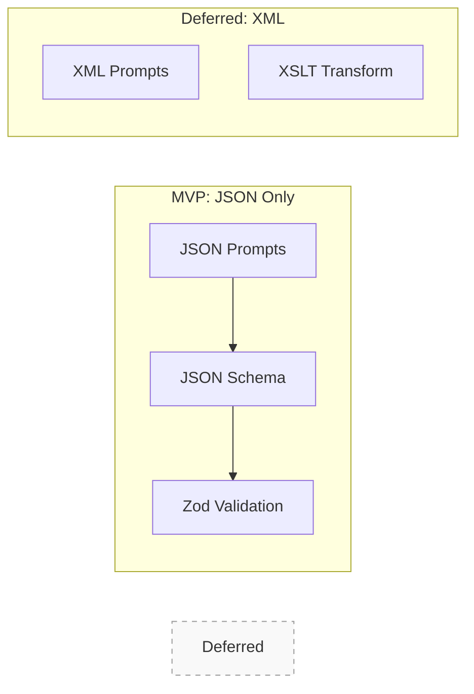
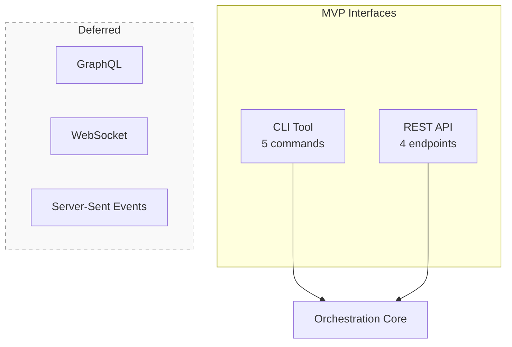
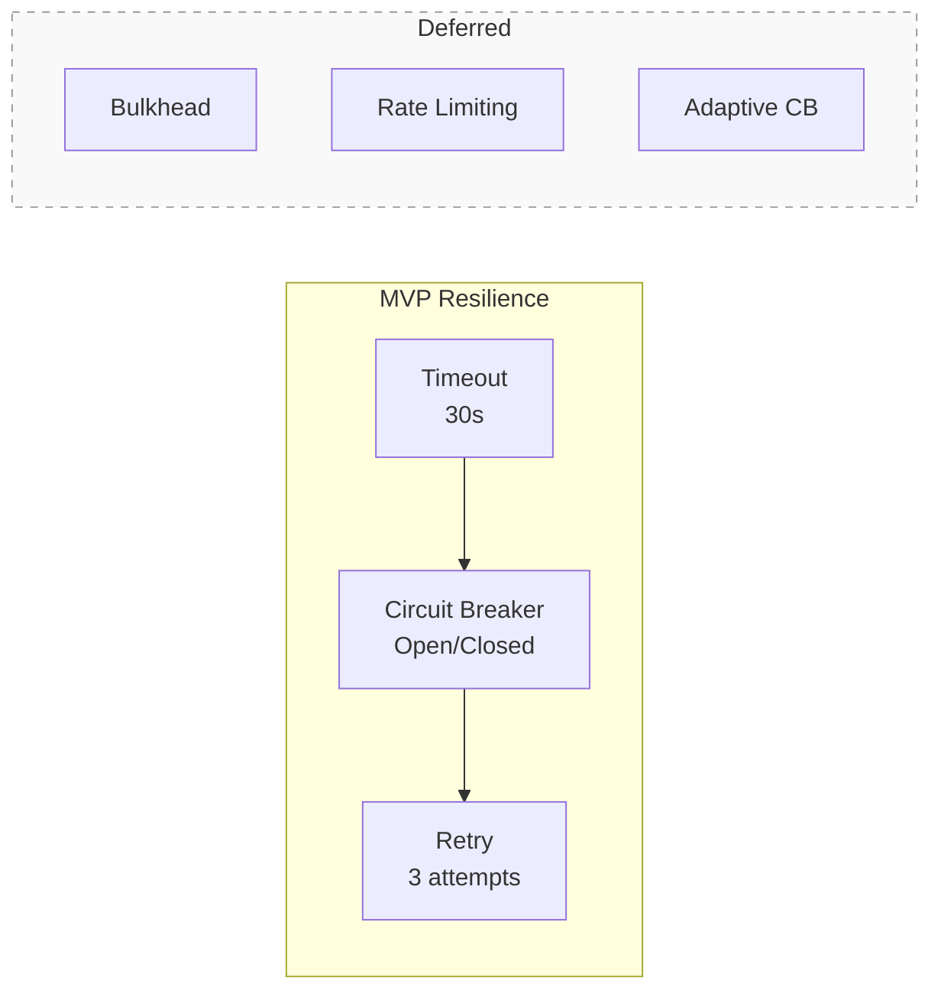
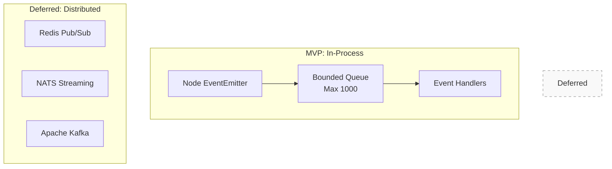
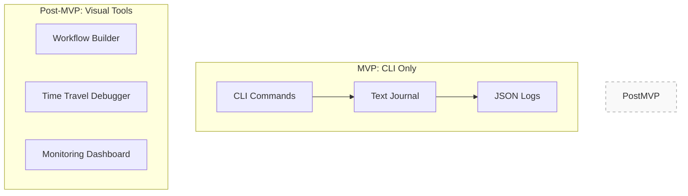
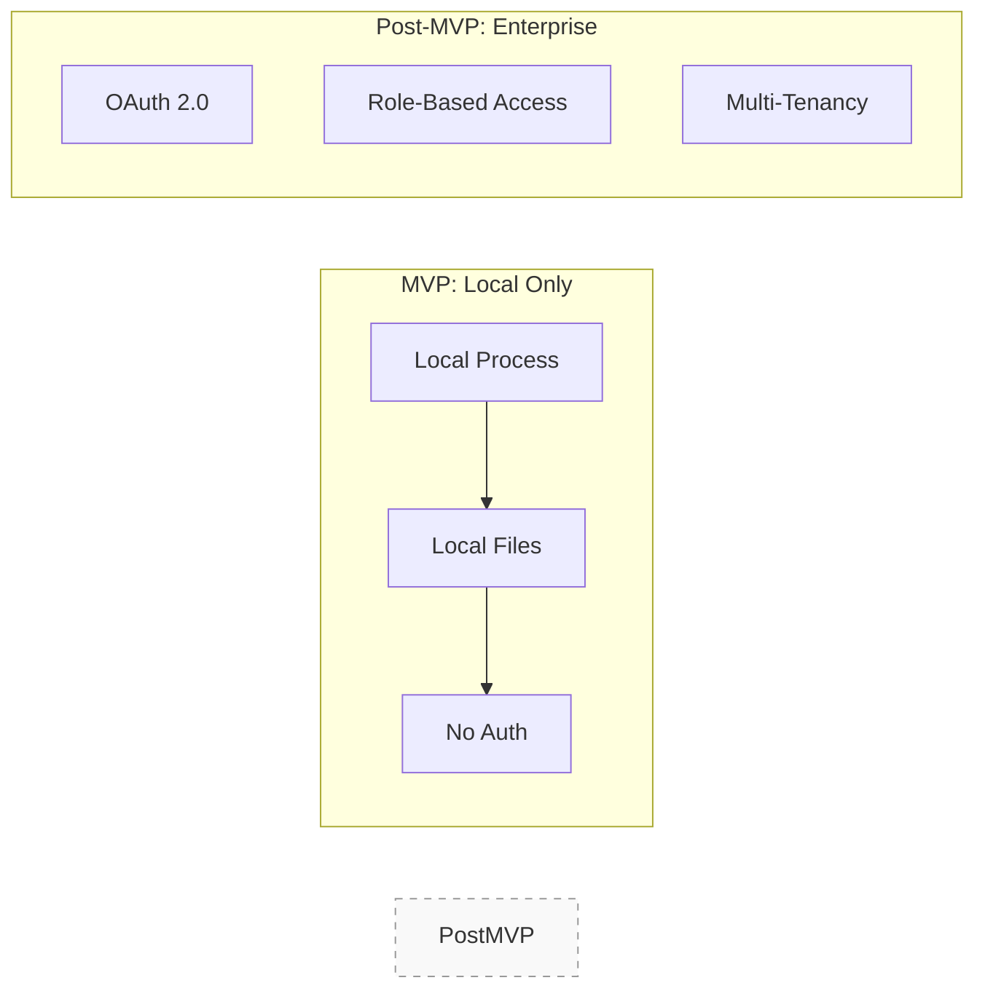
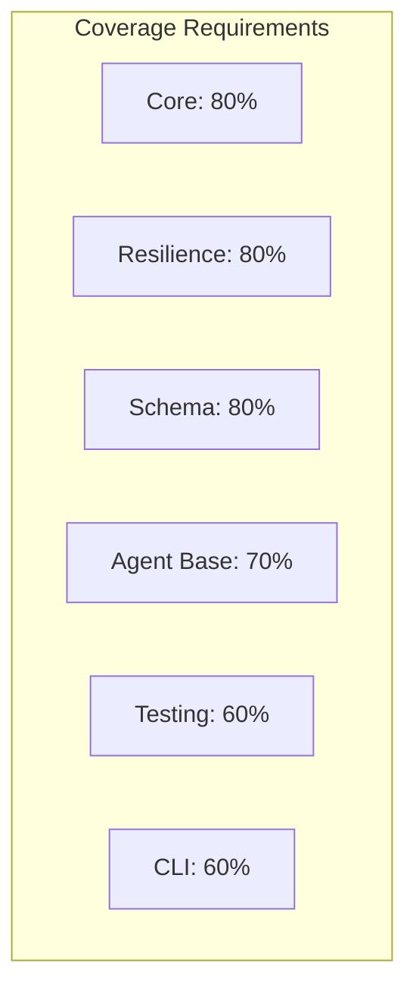
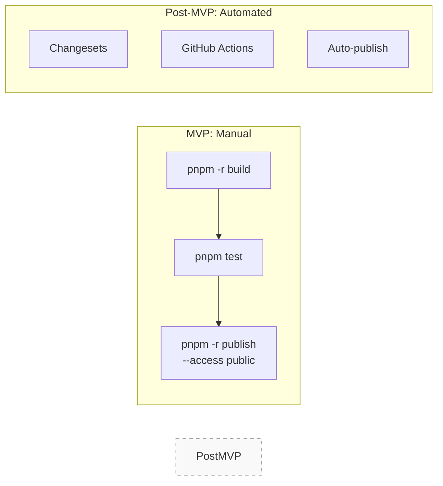
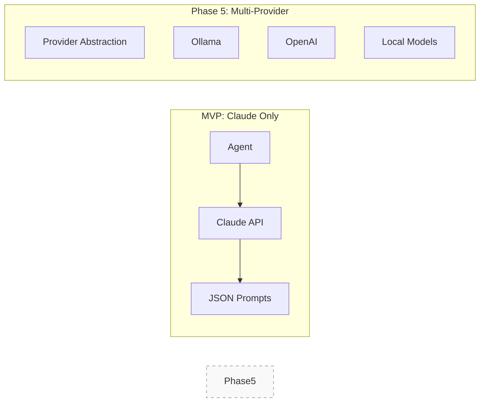

# Architecture Decision Records (ADRs) - MVP Focus

This document contains the architectural decision records for the @orchestr8 MVP detailed in @.agent-os/specs/2025-01-17-orchestr8-system/spec.md

> Created: 2025-01-17  
> Version: 1.0.0-mvp  
> Status: 4-Week MVP Decisions

## ADR Template

Each ADR follows this structure:

- **Status**: Proposed | Accepted | Rejected | Superseded
- **Date**: Decision date
- **Context**: Problem statement
- **Decision**: Chosen approach
- **Consequences**: Trade-offs accepted

---

## ADR-001: Modular Monorepo for MVP

**Status:** Accepted  
**Date:** 2025-01-17

### Context (ADR-001)

Need to deliver working orchestration system in 4 weeks. Must balance speed of development with future extensibility.

### Decision Drivers (ADR-001)

- Need for rapid development (4-week timeline)
- Code sharing between packages
- Independent versioning capability
- Separate repository from existing mnemosyne monorepo
- Pure ESM module support required

### Decision (ADR-001)

Create a **separate monorepo** for Orchestr8 using Turborepo with 6 core packages under the `@orchestr8/` namespace. This will be independent from the mnemosyne repository.

```mermaid
graph TB
    subgraph "MVP Monorepo - 6 Packages"
        Core[@orchestr8/core]
        Resilience[@orchestr8/resilience]
        Schema[@orchestr8/schema]
        AgentBase[@orchestr8/agent-base]
        Testing[@orchestr8/testing]
        CLI[@orchestr8/cli]
    end

    Core --> Resilience
    Core --> Schema
    AgentBase --> Core
    Testing --> AgentBase
    CLI --> Core
```

### Consequences (ADR-001)

- ✅ Fast development with code sharing
- ✅ Simple deployment for MVP
- ✅ Easy to extend post-MVP
- ✅ Clean separation from mnemosyne codebase
- ✅ Pure ESM modules for modern JavaScript
- ❌ Not distributed (acceptable for MVP)
- ❌ Single-node only (acceptable for MVP)

### Adoption Plan (ADR-001)

1. Initialize new repository with Turborepo + pnpm
2. Create 6 core packages with proper inter-dependencies
3. Configure pure ESM modules (`"type": "module"`)
4. Set up TypeScript project references
5. Configure minimal inter-package boundaries

---

## ADR-002: JSON Prompts Instead of XML (with Scoped Exception)

**Status:** Accepted  
**Date:** 2025-01-17

### Context (ADR-002)

Original spec claimed "95% better adherence" with XML prompts but provided no evidence. JSON is simpler for MVP.

### Decision Drivers (ADR-002)

- Simplicity of implementation
- Native JavaScript support
- Easier validation with existing tools
- Need for deterministic parsing and cacheability
- One research agent requires XML template support

### Decision (ADR-002)

Use JSON for all workflow and policy prompt definitions in MVP with **schema versioning and hash**. Allow a scoped exception: XML prompt templates are permitted for a single research agent included in the MVP dual deployment feature. This exception does not apply to workflow definitions or orchestration policies, which remain JSON.

**Requirements:**

- All JSON schemas must include version hash field
- Zod validation required for all JSON prompt/workflow files
- Provide helpful error messages with remediation hints
- Cache validated schemas by hash for performance



### Consequences (ADR-002)

- ✅ Simpler implementation for core (JSON everywhere)
- ✅ Native JavaScript support
- ✅ Easier validation with Zod
- ✅ Enables XML template parity for the single research agent (sub‑agent + microservice)
- ✅ Schema versioning ensures deterministic parsing
- ✅ Cache-friendly with hash-based validation
- ❌ Slight increase in complexity for that agent's prompt engine
- ❌ XML is not allowed outside that agent in MVP

### Adoption Plan (ADR-002)

1. Define JSON schema with `version` and `schemaHash` fields
2. Implement Zod validation layer with custom error messages
3. Add SHA-256 hash computation for schemas
4. Create LRU cache layer for validated schemas
5. Isolate XML support to single research agent module

---

## ADR-003: CLI + REST Only (No GraphQL/WebSocket)

**Status:** Accepted  
**Date:** 2025-01-17

### Context (ADR-003)

Multiple API interfaces add complexity. MVP needs simplest possible interface for 4-week delivery.

### Decision Drivers (ADR-003)

- Simplicity of implementation
- Standard HTTP semantics
- Wide client compatibility
- Need for idempotency and caching support

### Decision (ADR-003)

Implement CLI tool and minimal REST API only with proper HTTP semantics.



**REST Endpoints (with /v1 prefix):**

- POST /v1/workflows/execute (with idempotency-key support)
- GET /v1/executions/:id (with ETag support)
- GET /v1/executions/:id/journal (with pagination and ETag)
- POST /v1/executions/:id/cancel

**Additional Requirements:**

- Idempotency-key header for POST operations
- ETag/If-None-Match for GET operations
- Pagination with cursor/since parameters for journals
- Retry-After header guidance on 202/504 responses
- Recommended polling interval: 5 seconds

**Idempotency Contract Specification:**

```typescript
interface IdempotencyContract {
  scope: 'per-endpoint';               // Only POST /v1/workflows/execute in MVP
  keyHeader: 'Idempotency-Key';        // HTTP header name

  storage: {
    mechanism: 'in-memory-map';        // MVP limitation: restart loses cache
    ttl: 86400000;                     // 24 hours (86.4M milliseconds)
    maxKeyLength: 255;                 // Maximum key length in characters
    keyValidation: /^[a-zA-Z0-9\-_]+$/; // Alphanumeric, hyphens, underscores only
  };

  // Request matching strategy
  matching: {
    keyRequired: false;                // Idempotency-Key is optional
    bodyHashAlgorithm: 'sha256-hex';   // Hash request body for comparison
    comparison: 'key-and-body-hash';   // Both key and body hash must match
    caseSensitive: true;               // Key comparison is case-sensitive
  };

  // Duplicate request handling
  duplicateHandling: {
    inFlight: 'return-same-202-location';    // Same executionId and Location header
    completed: 'return-cached-response';     // Return original status + response body
    expired: 'execute-new-request';          // TTL expired, execute normally
    differentBody: 'error-409-conflict';    // Same key, different body hash
  };

  // Concurrent request behavior
  concurrency: {
    duplicateWhileRunning: 'same-execution-id'; // Return same 202 with Location
    neverDoubleExecute: true;                   // Guarantee single execution per key
    timeoutInheritance: false;                  // Each request has own timeout
  }
}

// Implementation interface
interface IdempotencyRecord {
  key: string;
  bodyHash: string;           // SHA-256 hex of request body
  executionId: string;
  status: number;            // HTTP status code of response
  response: any;             // Full response body
  timestamp: number;         // Creation timestamp for TTL
  inFlight: boolean;         // Whether execution is still running
}

// ETag contract specification
interface ETagContract {
  // Execution resources (GET /v1/executions/:id)
  executions: {
    type: 'strong';                    // Strong ETag (exact content match)
    algorithm: 'sha256-first-8-hex';   // SHA-256 hash, first 8 bytes as hex
    canonicalization: 'sorted-keys-stable-stringify'; // Deterministic JSON
    includes: ['status', 'outputs', 'error', 'timestamps', 'metadata'];
    excludes: ['journal', 'internal_state']; // Journal changes don't affect execution ETag
  };

  // Journal resources (GET /v1/executions/:id/journal)
  journals: {
    type: 'weak';                      // Weak ETag (append-only semantics)
    algorithm: 'entry-count-hash';     // Based on entry count and last entry hash
    changeCondition: 'new-entries-only'; // Only changes when new entries added
    includes: ['entry_count', 'last_entry_sequence', 'last_entry_hash'];
    headers: ['ETag', 'Last-Modified']; // Include Last-Modified header
  };

  // ETag header format
  headerFormat: {
    strong: '"<hash>"';                // RFC 7234: quoted hash
    weak: 'W/"<hash>"';                // RFC 7234: W/ prefix for weak
    maxLength: 64;                     // Maximum ETag value length
  };

  // Client behavior
  clientBehavior: {
    ifNoneMatch: 'return-304-if-match'; // 304 Not Modified if ETag matches
    ifMatch: 'return-412-if-no-match';  // 412 Precondition Failed if no match
    cacheControl: 'private-max-age-60'; // Allow 60-second client caching
  };
}

// ETag generation implementation
class ETagGenerator {
  static forExecution(execution: ExecutionResource): string {
    const canonical = {
      id: execution.id,
      status: execution.status,
      outputs: execution.outputs,
      error: execution.error,
      startTime: execution.startTime,
      endTime: execution.endTime,
      // Exclude journal from execution ETag
    };

    const canonicalJson = JSON.stringify(canonical, Object.keys(canonical).sort());
    const hash = this.sha256(canonicalJson).substring(0, 16); // First 8 bytes
    return `"${hash}"`;
  }

  static forJournal(entries: JournalEntry[]): string {
    const entryCount = entries.length;
    const lastEntry = entries[entries.length - 1];
    const lastEntryHash = lastEntry ? this.sha256(JSON.stringify(lastEntry)).substring(0, 8) : '0';

    const journalFingerprint = `${entryCount}:${lastEntryHash}`;
    const hash = this.sha256(journalFingerprint).substring(0, 16);
    return `W/"${hash}"`; // Weak ETag
  }

  private static sha256(input: string): string {
    // Use crypto.createHash('sha256').update(input).digest('hex') in implementation
    return 'hash-' + input.length.toString(16).padStart(8, '0');
  }
}
```

### Consequences (ADR-003)

- ✅ Simple to implement
- ✅ Easy to test
- ✅ Standard HTTP tooling
- ✅ Proper caching with ETags
- ✅ Idempotent operations
- ❌ No real-time updates (use polling)
- ❌ No complex queries (acceptable)

### Adoption Plan (ADR-003)

1. Implement Express server with /v1 prefix
2. Add idempotency-key storage (TTL: 24 hours)
3. Implement ETag generation for resources
4. Add cursor-based pagination for journals
5. Configure Retry-After headers based on queue depth

---

## ADR-004: Basic Resilience Patterns Only

**Status:** Accepted  
**Date:** 2025-01-17

### Context (ADR-004)

Netflix-level resilience patterns are complex. MVP needs basic fault tolerance that works.

### Decision Drivers (ADR-004)

- Need for basic fault tolerance
- Simplicity over sophistication
- Proper timeout composition
- AbortSignal propagation for cleanup

### Decision (ADR-004)

Implement only retry, timeout, and simple circuit breaker with **exponential backoff with full jitter** and **AbortSignal propagation**.



**Resilience Specifications:**

- Exponential backoff: 1s, 2s, 4s with full jitter
- AbortSignal propagation through all layers
- Per-execution resilience budget (max 90s total)
- Cleanup guarantees on cancellation

### Consequences (ADR-004)

- ✅ Covers 80% of failure scenarios
- ✅ Simple to understand and debug
- ✅ Proven patterns
- ✅ Proper cleanup with AbortSignal
- ✅ Jitter prevents thundering herd
- ❌ No advanced isolation (bulkhead)
- ❌ No rate limiting (add post-MVP)

### Adoption Plan (ADR-004)

1. Implement base resilience helper with AbortSignal
2. Add exponential backoff with full jitter algorithm
3. Create per-attempt timeout wrapper
4. Implement circuit breaker with state management
5. Set resilience budget per execution (90s max)

---

## ADR-005: In-Process Event Bus

**Status:** Accepted  
**Date:** 2025-01-17

### Context (ADR-005)

Distributed message buses (Redis, NATS) add operational complexity. MVP needs simplest working solution.

### Decision Drivers (ADR-005)

- Simplicity over distribution
- Need for bounded resources
- Observable overflow conditions
- Handler isolation requirements

### Decision (ADR-005)

Use in-process event emitter with bounded queue and **drop-oldest overflow policy**.



**Overflow Policy Specifications:**

- Queue limit: 1000 events
- Overflow action: Drop oldest events
- Monitoring: Counter for dropped events
- Warning threshold: Log warning at 10% drop rate
- Handler isolation: Errors never crash the emitter

### Consequences (ADR-005)

- ✅ No external dependencies
- ✅ Fast (no network overhead)
- ✅ Easy to debug
- ✅ Bounded memory usage
- ✅ Observable overflow conditions
- ❌ Not distributed (single-node only)
- ❌ Lost on restart (acceptable for MVP)

### Adoption Plan (ADR-005)

1. Implement bounded queue with configurable size
2. Add drop-oldest overflow logic
3. Create metrics: dropped event counter, queue depth
4. Add warning logs at 10% drop rate
5. Implement handler isolation (try/catch per handler)

---

## ADR-006: No Visual Tools in MVP

**Status:** Accepted  
**Date:** 2025-01-17

### Context (ADR-006)

Visual workflow builder and debugger are complex UI projects. MVP needs to ship in 4 weeks.

### Decision (ADR-006)

CLI only for MVP. Defer all visual tools.



### Consequences (ADR-006)

- ✅ Faster development
- ✅ No UI complexity
- ✅ Works in any terminal
- ❌ Less user-friendly (developers OK with CLI)
- ❌ No visual debugging (use journal)

---

## ADR-007: Local Execution Only (No Auth)

**Status:** Accepted  
**Date:** 2025-01-17

### Context (ADR-007)

Authentication, authorization, and multi-tenancy add significant complexity. MVP targets local development.

### Decision Drivers (ADR-007)

- Security by isolation (local-only)
- No network exposure requirements
- Developer-only target audience
- Simplicity over remote access

### Decision (ADR-007)

No authentication for MVP. **Local execution only with explicit 127.0.0.1 binding and CORS disabled**.



**Security Requirements:**

- REST API must bind to 127.0.0.1 only
- CORS must be disabled entirely
- No external interface listening allowed
- File permissions: 0600 for sensitive files
- Process should not accept remote connections

### Consequences (ADR-007)

- ✅ No auth complexity
- ✅ Faster development
- ✅ Easier testing
- ✅ Secure by default (localhost only)
- ❌ Not production-ready (OK for MVP)
- ❌ No multi-user support (add later)

### Adoption Plan (ADR-007)

1. Configure Express to bind to 127.0.0.1 explicitly
2. Disable CORS middleware entirely
3. Set file permissions to 0600 for config/secrets
4. Add startup validation for binding address
5. Document security rationale in operations guide

---

## ADR-008: TypeScript Strict Mode

**Status:** Accepted  
**Date:** 2025-01-17

### Context (ADR-008)

Type safety prevents runtime errors but adds development overhead.

### Decision (ADR-008)

Use TypeScript strict mode from day one.

```typescript
// tsconfig.json
{
  "compilerOptions": {
    "strict": true,
    "noImplicitAny": true,
    "strictNullChecks": true,
    "noUnusedLocals": true,
    "noUnusedParameters": true
  }
}
```

### Consequences (ADR-008)

- ✅ Catch errors at compile time
- ✅ Better IDE support
- ✅ Self-documenting code
- ❌ Slightly slower initial development
- ❌ More verbose type annotations

---

## ADR-009: Test Coverage Target 80%

**Status:** Accepted  
**Date:** 2025-01-17

### Context (ADR-009)

100% coverage is unrealistic for 4-week MVP. Need pragmatic target.

### Decision Drivers (ADR-009)

- Balance quality with speed
- Focus on critical paths
- Enforceable in CI/CD
- Measurable progress

### Decision (ADR-009)

Require 80% test coverage on core packages, **enforced via vitest.config.ts with v8 coverage**.



**Coverage Configuration:**

- Reporter: v8 (native Node.js coverage)
- Output: ./test-results/coverage/
- JUnit: ./test-results/junit.xml
- CI enforcement: Fail if below threshold

### Consequences (ADR-009)

- ✅ Catches most bugs
- ✅ Achievable in timeline
- ✅ Good foundation for future
- ✅ CI-enforced quality gates
- ❌ Some edge cases untested
- ❌ CLI less tested (acceptable)

### Adoption Plan (ADR-009)

1. Configure vitest.config.ts with v8 reporter
2. Set coverage thresholds per package
3. Output to standardized directories
4. Add CI job to enforce thresholds
5. Generate coverage badges for README

---

## ADR-010: Manual Package Publishing with pnpm

**Status:** Accepted  
**Date:** 2025-01-17

### Context (ADR-010)

Automated publishing requires careful setup. MVP needs to ship packages quickly.

### Decision Drivers (ADR-010)

- Consistency with monorepo tooling (pnpm)
- Fast package management
- Workspace protocol support
- Manual control for MVP

### Decision (ADR-010)

Manual package publishing using **pnpm** for MVP. Automate post-MVP.



### Consequences (ADR-010)

- ✅ Simple process
- ✅ Full control
- ✅ No CI/CD complexity
- ✅ Consistent with pnpm monorepo
- ❌ Manual process (OK for MVP)
- ❌ Human error risk (document process)

### Adoption Plan (ADR-010)

1. Use pnpm for all package management
2. Build all packages: `pnpm -r build`
3. Run tests: `pnpm test`
4. Publish to npm: `pnpm -r publish --access public`
5. Document exact commands in README

---

## ADR-011: Local LLM Support (Deferred)

**Status:** Deferred to Phase 5  
**Date:** 2025-01-17

### Context (ADR-011)

While local LLM support via Ollama and other providers offers privacy, cost, and control benefits, the MVP needs to focus on core orchestration with a single, reliable LLM provider.

### Decision (ADR-011)

Defer multi-provider LLM support to Phase 5 post-MVP. MVP will use Claude API only.



### Consequences (ADR-011)

- ✅ Simpler MVP implementation
- ✅ Consistent output quality
- ✅ Faster development
- ✅ Known performance characteristics
- ❌ No local/offline capability (acceptable)
- ❌ API costs required (acceptable for MVP)
- ❌ No privacy-first option (add in Phase 5)

---

## ADR-012: Dual Deployment for Single Research Agent (MVP-Scoped)

**Status:** Accepted  
**Date:** 2025-01-17

### Context (ADR-012)

Dual deployment (standalone microservice and Claude sub‑agent) was mandated for MVP. Scope must remain minimal to preserve delivery timeline.

### Decision (ADR-012)

Implement a single research agent that runs in two modes via adapters:

- Microservice adapter (Express): POST /process, GET /health
- Claude sub‑agent adapter: export handleRequest(input, context)

Allow XML prompt templates for this agent only; workflows and orchestration policies remain JSON. No distributed infra, no auth, local-only.

### Consequences (ADR-012)

- ✅ Enables feature parity across deployment modes
- ✅ Preserves JSON-first system design
- ✅ Minimal surface area: one agent, two adapters
- ❌ Small increase in build/test scope
- ❌ XML prompt engine complexity isolated to one agent

### Future Implementation

Phase 5 will add:

- Provider abstraction interface
- Model-specific adapters (Llama, Mistral, Mixtral)
- Enhanced output parsing for variable quality
- Local-optimized resilience settings
- Hybrid cloud/local workflows

---

## **ADR-013**: Cross-Repository Sub-Agent Distribution (MVP-Scoped)

**Status:** Accepted  
**Date:** 2025-01-17

### Context (ADR-013)

MVP requires that the single research agent can be reused across repositories (including Claude projects) without adding heavy infrastructure. We need a simple, versioned distribution mechanism that installs agent definitions and scoped XML prompt templates into a target repo's `.claude/` folder and updates its MCP server settings, while keeping workflows/policies JSON and staying local-only.

### Decision Drivers (ADR-013)

- Cross-repo reusability requirement
- Atomic operations for reliability
- Idempotent installations
- Safe settings.json merging
- Rollback capability

### Decision (ADR-013)

Ship a standalone NPM package with a small CLI:

- Package name: `@orchestr8/research-agents`
- Assets: `.claude/agents/*.md`, `templates/*.xml` (scoped exception per ADR-002), optional `dist/agents/*.js`
- CLI: `research-agents install [--agents a,b] [--config-only] [--target dir] [--dry-run]`
- Behavior: creates `.claude/` folders, copies agents/prompts, and merges MCP `settings.json` entries idempotently
- **Atomic operations**: Write to temp files, then rename
- **Backup mechanism**: Create `.claude/settings.json.backup` before modification
- **Idempotent merge**: Check for existing entries, don't duplicate
- **Rollback**: `research-agents uninstall` restores from backup
- CI/CD: GitHub Actions publishes on tag (`v*`); optional release tarballs for direct download installs

```mermaid
graph LR
    Source[Source Repo<br/>research-agents] -->|CI publish| NPM[NPM Registry]
    NPM -->|install| Target[Target Repo]
    Target --> Claude[.claude/agents + prompts]
    Target --> Settings[.claude/settings.json (MCP)]
```

### Consequences (ADR-013)

- ✅ Fast adoption across repos (no registry UI)
- ✅ Consistent, idempotent installs; simple updates via version bumps
- ✅ Preserves MVP constraints (local-only, JSON workflows, scoped XML for agents)
- ✅ Atomic operations prevent partial states
- ✅ Backup/rollback capability for safety
- ❌ Adds a small package/CLI to maintain
- ❌ Version coordination required between agents and core examples
- ❌ Care needed to avoid writing secrets into `settings.json`

**Atomic Operations and Merge Semantics Contract:**

```typescript
interface DistributionContract {
  // Atomic file operations
  atomicOperations: {
    method: 'temp-file-then-rename' // Write to .tmp, then rename
    backupStrategy: 'create-before-modify' // Always backup existing files
    permissions: {
      files: '0600' // rw-------
      directories: '0700' // rwx------
      backup: '0600' // Same as original
    }
    errorHandling: 'rollback-on-failure' // Restore from backup if any step fails
  }

  // Settings.json merge semantics
  mergeSemantics: {
    mcpServers: {
      keyStrategy: 'name-url-tuple' // Deduplicate by (name, url) combination
      mergeStrategy: 'union' // Combine all unique entries
      conflictResolution: 'fail-with-clear-error' // Don't auto-resolve conflicts
    }

    arrayMerge: {
      algorithm: 'stable-sort-deterministic-diff'
      preservation: 'maintain-existing-order' // Keep user's existing order
      newEntries: 'append-at-end' // Add new entries at end
    }

    validation: {
      jsonSchema: 'validate-before-merge' // Ensure valid JSON structure
      mcpValidation: 'check-required-fields' // name, url required
      duplicateCheck: 'error-on-duplicate-names' // Fail if name already exists
    }
  }

  // Dry-run behavior
  dryRun: {
    outputFormat: 'unified-diff' // Show what would change
    exitCode: 'zero-on-success' // 0 if dry-run would succeed
    checkMode: 'exit-one-if-changes' // For CI validation
    verbosity: 'show-all-operations' // List every file operation
  }

  // Rollback and recovery
  rollback: {
    backupFormat: '{original}.backup.{timestamp}'
    retentionPolicy: 'keep-last-3-backups'
    recoveryCommand: 'research-agents uninstall --restore'
    verificationStep: 'validate-json-after-restore'
  }
}

// Implementation of atomic operations
class AtomicFileOperations {
  static async writeFileAtomic(
    filePath: string,
    content: string,
    options: { backup?: boolean; permissions?: string } = {},
  ): Promise<void> {
    const tempPath = `${filePath}.tmp.${Date.now()}`
    const backupPath = `${filePath}.backup.${Date.now()}`

    try {
      // 1. Create backup if file exists and backup requested
      if (options.backup && (await this.fileExists(filePath))) {
        await fs.copyFile(filePath, backupPath)
        await fs.chmod(backupPath, options.permissions || '0600')
      }

      // 2. Write to temporary file
      await fs.writeFile(tempPath, content, {
        mode: options.permissions || '0600',
      })

      // 3. Atomic rename (this is the critical atomic operation)
      await fs.rename(tempPath, filePath)
    } catch (error) {
      // 4. Cleanup temp file on failure
      try {
        await fs.unlink(tempPath)
      } catch {}

      // 5. Restore from backup if available
      if (options.backup && (await this.fileExists(backupPath))) {
        await fs.rename(backupPath, filePath)
      }

      throw error
    }
  }

  private static async fileExists(path: string): Promise<boolean> {
    try {
      await fs.access(path)
      return true
    } catch {
      return false
    }
  }
}

// Settings.json merge implementation
class SettingsMerger {
  static async mergeSettings(
    existingPath: string,
    newEntries: MCPServerEntry[],
  ): Promise<MergeResult> {
    const result: MergeResult = {
      success: false,
      conflicts: [],
      added: [],
      unchanged: [],
    }

    // 1. Load existing settings (or create empty structure)
    let existingSettings: SettingsJson = { mcpServers: {} }
    if (
      await fs.access(existingPath).then(
        () => true,
        () => false,
      )
    ) {
      const content = await fs.readFile(existingPath, 'utf8')
      existingSettings = JSON.parse(content)
    }

    // 2. Validate new entries
    for (const entry of newEntries) {
      if (!entry.name || !entry.url) {
        throw new ValidationError('MCP server entries must have name and url')
      }
    }

    // 3. Check for conflicts (same name, different config)
    for (const newEntry of newEntries) {
      const existing = existingSettings.mcpServers[newEntry.name]
      if (existing) {
        const isSame = this.deepEqual(existing, newEntry)
        if (!isSame) {
          result.conflicts.push({
            name: newEntry.name,
            existing,
            proposed: newEntry,
          })
        } else {
          result.unchanged.push(newEntry.name)
        }
      } else {
        result.added.push(newEntry.name)
      }
    }

    // 4. Fail on conflicts (user must resolve manually)
    if (result.conflicts.length > 0) {
      throw new ConflictError('Settings conflicts detected', result.conflicts)
    }

    // 5. Merge new entries
    for (const newEntry of newEntries) {
      if (!existingSettings.mcpServers[newEntry.name]) {
        existingSettings.mcpServers[newEntry.name] = newEntry
      }
    }

    result.success = true
    return result
  }

  private static deepEqual(a: any, b: any): boolean {
    return JSON.stringify(a) === JSON.stringify(b)
  }
}

interface MergeResult {
  success: boolean
  conflicts: Array<{
    name: string
    existing: MCPServerEntry
    proposed: MCPServerEntry
  }>
  added: string[]
  unchanged: string[]
}

interface MCPServerEntry {
  name: string
  url: string
  args?: string[]
  env?: Record<string, string>
}
```

### Adoption Plan (ADR-013)

1. **Implement atomic file operations** with temp + rename pattern
2. **Add comprehensive backup creation** before any modifications
3. **Create conflict-detecting merge algorithm** for settings.json with clear error messages
4. **Implement --dry-run flag** with unified diff output and proper exit codes
5. **Add uninstall command** with backup restoration and validation
6. **Create comprehensive test suite** covering empty repos, existing configs, and conflict scenarios
7. **Add file permission enforcement** (0600 for files, 0700 for directories)
8. **Implement rollback mechanism** with timestamp-based backup retention

---

## ADR-014: Resilience Composition Order

**Status:** Accepted  
**Date:** 2025-01-17

### Context (ADR-014)

The specification showed inconsistent resilience composition patterns. Different examples showed "Timeout → CB → Retry" vs per-attempt "Retry → CB → Timeout". This creates confusion about the correct production behavior and could lead to incorrect implementations.

### Decision (ADR-014)

Standardize on per-attempt timeout composition for all resilience patterns:

```typescript
// Correct composition: Timeout is per-attempt inside retry
async function executeWithResilience<T>(
  operation: () => Promise<T>,
): Promise<T> {
  return await retry(
    async () => {
      return await circuitBreaker(async () => {
        return await timeout(operation, 30000) // Per-attempt timeout
      })
    },
    { maxAttempts: 3 },
  )
}
```

**Key Principles:**

1. **Timeout wraps individual operations** - Each retry attempt gets its own timeout (30s default)
2. **Circuit breaker tracks aggregate failures** - Counts failures across all retry attempts
3. **Retry orchestrates multiple attempts** - Handles backoff and retry logic
4. **Total worst-case time** = attempts × per-attempt timeout (e.g., 3 × 30s = 90s max)

### Consequences (ADR-014)

- ✅ Clear, consistent resilience behavior across all implementations
- ✅ Prevents hanging operations with per-attempt timeouts
- ✅ Circuit breaker protects downstream services from repeated failures
- ✅ Predictable worst-case execution times
- ❌ Total execution time can be longer (3x timeout in worst case)
- ❌ Requires careful timeout configuration to avoid long waits

---

## ADR-015: API Execution Mode Semantics

**Status:** Accepted  
**Date:** 2025-01-17

### Context (ADR-015)

The API specification was ambiguous about sync vs async execution. Sometimes POST /workflows/execute returns 200 with results, other times 202 with a check URL. This inconsistency creates confusion for API consumers and implementation complexity.

### Decision Drivers (ADR-015)

- Clear API semantics required
- Support both async and sync modes
- Proper HTTP status codes and headers
- Maximum payload size limits
- Resilience layer integration

### Decision (ADR-015)

Define strict execution mode semantics:

**1. Default: Asynchronous Execution**

```http
POST /v1/workflows/execute
Response: 202 Accepted
Headers:
  Location: /v1/executions/exec-456
  Retry-After: 5
{
  "executionId": "exec-456",
  "status": "running",
  "checkUrl": "/v1/executions/exec-456"
}
```

**2. Optional: Synchronous Execution**

```http
POST /v1/workflows/execute?mode=sync
Response: 200 OK (on success) or 504 Gateway Timeout
Headers (on 504):
  Location: /v1/executions/exec-456
  Retry-After: 10
{
  "executionId": "exec-456",
  "status": "completed",
  "outputs": { ... }  // Max 1MB for sync response
}
```

**Rules:**

- **Default behavior**: Always return 202 with executionId and Location header
- **Sync mode**: Enabled via `?mode=sync` query parameter
- **Sync timeout**: Server-side cap at 30 seconds (respects resilience layer)
- **Timeout response**: 504 with `Location` and `Retry-After` headers
- **Idempotency**: Recommend `Idempotency-Key` header for all executions
- **Max payload**: 1MB for sync responses, 10MB for journal responses
- **Error schema**: Defined JSON error format for 504 responses

### Consequences (ADR-015)

- ✅ Clear, predictable API behavior
- ✅ Clients know exactly what response to expect
- ✅ Supports both polling and blocking patterns
- ✅ Prevents accidental double-execution with idempotency
- ✅ Proper HTTP headers (Location, Retry-After)
- ✅ Bounded response sizes prevent memory issues
- ❌ Sync mode can tie up server resources
- ❌ Requires client-side polling logic for async mode

### Adoption Plan (ADR-015)

1. Implement Location header generation for all 202 responses
2. Add Retry-After calculation based on queue depth
3. Enforce 1MB limit on sync responses
4. Define error schema for 504 timeout responses
5. Ensure resilience layer respects 30s sync cap with AbortSignal
6. Document polling best practices in API guide

---

## ADR-019: Operational Contracts - Critical Implementation Specifications

**Status**: Accepted  
**Date**: 2025-01-17  
**Deciders**: Architecture Team  
**Context**: High-risk ambiguities in operational semantics requiring precise contracts

### Problem (ADR-019)

The architectural review identified critical implementation risks from underspecified operational semantics. Without precise contracts, Week 1-2 implementation will diverge from expected behaviors, causing integration failures and timeline risk.

### Critical Risk Areas (ADR-019)

1. **Resilience Composition**: Exact order and failure propagation unclear
2. **Circuit Breaker Scope**: Per-agent vs per-target vs global ambiguity
3. **Concurrency Model**: Global vs per-workflow vs per-layer scheduling
4. **Cancellation Semantics**: AbortSignal propagation and force-cancel behavior
5. **Expression Engine**: Syntax, security, and failure modes undefined
6. **Event Bus Backpressure**: Overflow policy and consistency guarantees
7. **Journal Contracts**: Truncation, redaction, and ordering rules
8. **Error Taxonomy**: Retry classification and structured error contracts

### Decision (ADR-019): Precise Operational Contracts

**1. Resilience Composition Contract**

```typescript
// EXACT composition order - no deviation allowed
async function executeWithResilience<T>(
  operation: (signal: AbortSignal) => Promise<T>,
  signal: AbortSignal,
  config: ResilienceConfig,
): Promise<T> {
  // Outer retry loop orchestrates multiple attempts
  return await retry(
    async (attemptSignal: AbortSignal) => {
      // Circuit breaker protects downstream services from repeated failures
      return await circuitBreaker(
        async (cbSignal: AbortSignal) => {
          // Per-attempt timeout prevents any single attempt from hanging
          return await timeout(
            operation, // The actual operation to execute
            config.timeoutMs, // 30 seconds per attempt
            cbSignal, // Signal that can abort this specific attempt
          )
        },
        config.circuitBreakerKey, // Key for circuit breaker state (e.g., "agent:methodName")
        attemptSignal, // Signal that can abort this attempt from retry level
      )
    },
    signal, // Overall execution signal (can abort entire operation)
    {
      maxAttempts: config.maxAttempts, // Default: 3
      backoff: fullJitterBackoff(config.baseDelayMs), // Corrected jitter implementation
      isRetryable: (error) => isRetryableError(error), // Error classification
      budget: config.totalBudgetMs || 90000, // Total time budget: 90s
    },
  )
}

// Complete resilience configuration interface
interface ResilienceConfig {
  // Timeout configuration
  timeoutMs: number // Per-attempt timeout (default: 30000)

  // Retry configuration
  maxAttempts: number // Maximum attempts (default: 3)
  baseDelayMs: number // Base delay for backoff (default: 1000)
  maxDelayMs: number // Maximum delay cap (default: 30000)
  totalBudgetMs?: number // Total execution budget (default: 90000)

  // Circuit breaker configuration
  circuitBreakerKey: string // Unique key for CB state
  failureThreshold?: number // Failures before opening (default: 5)
  openDurationMs?: number // Time to stay open (default: 60000)

  // Error handling
  isRetryable?: (error: Error) => boolean // Custom retry logic
}

// Helper function to create standard resilience config
function createResilienceConfig(
  operationName: string,
  overrides: Partial<ResilienceConfig> = {},
): ResilienceConfig {
  return {
    timeoutMs: 30000, // 30 second per-attempt timeout
    maxAttempts: 3, // 3 total attempts
    baseDelayMs: 1000, // 1 second base delay
    maxDelayMs: 30000, // 30 second max delay
    totalBudgetMs: 90000, // 90 second total budget
    circuitBreakerKey: `cb:${operationName}`,
    failureThreshold: 5, // 5 consecutive failures
    openDurationMs: 60000, // 60 second open duration
    isRetryable: isRetryableError,
    ...overrides, // Apply any overrides
  }
}

// Usage example with all signal propagation
async function exampleAgentOperation(
  input: AgentInput,
  context: AgentContext,
  signal: AbortSignal,
): Promise<AgentOutput> {
  const config = createResilienceConfig('example-agent', {
    timeoutMs: 45000, // Longer timeout for this operation
    circuitBreakerKey: 'cb:example-agent:api-call',
  })

  return await executeWithResilience(
    async (operationSignal: AbortSignal) => {
      // The actual operation - MUST respect the signal
      const response = await fetch(input.url, {
        signal: operationSignal, // Critical: pass through the signal
        method: 'POST',
        body: JSON.stringify(input.data),
      })

      if (!response.ok) {
        throw new RetryableError(
          `HTTP ${response.status}: ${response.statusText}`,
        )
      }

      return await response.json()
    },
    signal, // Overall execution signal from agent caller
    config, // Resilience configuration
  )
}

// Signal chain visualization:
// ExecutionContext.signal
//   → retry(signal)
//   → attemptSignal (created by retry for each attempt)
//   → circuitBreaker(attemptSignal)
//   → cbSignal (created by circuit breaker)
//   → timeout(cbSignal)
//   → operationSignal (created by timeout wrapper)
//   → operation(operationSignal) [user code MUST respect this signal]

// Full jitter backoff - prevents thundering herds (AWS canonical implementation)
function fullJitterBackoff(
  baseMs: number,
  maxDelayMs: number = 30000,
): BackoffFunction {
  return (attempt: number) => {
    const exponential = baseMs * Math.pow(2, attempt - 1)
    const capped = Math.min(exponential, maxDelayMs)
    return Math.random() * capped // Full jitter: 0 to exponential
  }
}

// Budget-aware backoff respects 90s total execution budget
function budgetAwareBackoff(
  baseMs: number,
  totalBudgetMs: number = 90000,
): BackoffFunction {
  return (attempt: number, elapsedMs: number = 0) => {
    const remainingBudget = Math.max(0, totalBudgetMs - elapsedMs)
    const exponential = baseMs * Math.pow(2, attempt - 1)
    const budgetCapped = Math.min(exponential, remainingBudget / 2) // Reserve half remaining budget
    return Math.random() * Math.max(0, budgetCapped)
  }
}
```

**Failure Propagation Rules:**

- Timeouts count as failures for circuit breaker AND retry
- Circuit breaker open state blocks all attempts (no retry)
- AbortSignal cancellation bypasses all resilience layers

**2. Circuit Breaker **Scope** Contract**

```typescript
interface CircuitBreakerKey {
  agentId: string // Required: agent identifier
  target?: string // Optional: URL host, endpoint, or resource identifier
}

// Key generation
function generateCBKey(agentId: string, context?: { target?: string }): string {
  const base = `cb:${agentId}`
  return context?.target ? `${base}:${context.target}` : base
}

// Per-process circuit breaker state
const circuitBreakers = new Map<string, CircuitBreakerState>()

interface CircuitBreakerState {
  state: 'closed' | 'open' | 'half-open'
  failureCount: number
  lastFailureTime: number
  openUntil?: number // Timestamp when CB can transition to half-open
  halfOpenProbeCount: number // Active probes in half-open state
  consecutiveSuccesses: number // Track successes for half-open → closed transition
}

interface CircuitBreakerConfig {
  failureThreshold: 5 // Consecutive failures (strict sequence, not time-windowed)
  openDurationMs: 60000 // 60 seconds
  halfOpenSuccessThreshold: 1 // Single success closes circuit
  halfOpenMaxConcurrency: 1 // Only 1 probe allowed in half-open

  // Error classification for circuit breaker failure counting
  errorClassification: {
    timeout: 'failure' // Timeouts count as failures
    circuitOpen: 'no-count' // CB open errors don't count toward failure threshold
    http5xx: 'failure' // 5xx HTTP responses count as failures
    http4xx: 'no-count' // 4xx client errors don't count (not downstream fault)
    networkError: 'failure' // Network/connection errors count as failures
    validationError: 'no-count' // Input validation errors don't count
    cancelledError: 'no-count' // User cancellation doesn't count as downstream failure
  }
}

// Half-open behavior: SINGLE probe only
// - Half-open allows exactly 1 concurrent probe
// - Success: transition to closed, reset failure count and consecutive successes
// - Failure: transition to open, reset open timer and failure count
// - Probe limit: Block additional requests while probe is active
```

**Thresholds and Behavior:**

- **Failure threshold**: 5 consecutive failures (strict sequence, not time-windowed)
- **Open duration**: 60 seconds before transition to half-open
- **Half-open probe limit**: 1 concurrent probe maximum
- **Success threshold**: 1 success closes circuit from half-open
- **Error classification**: Timeouts, 5xx, network errors count; 4xx, validation, cancellation don't count
- **Consecutive counting**: Failures must be uninterrupted sequence (any success resets counter)

**3. Concurrency and Scheduling Contract**

```typescript
interface ConcurrencyConfig {
  globalMaxConcurrency: number // Default: 10
  workflowMaxConcurrency?: number // Optional per-workflow override
  fairScheduling: boolean // Default: true
}

// Global scheduler with fair queue
class GlobalScheduler {
  private runningCount = 0
  private readyQueue: Array<ScheduledStep> = []
  private readonly maxConcurrency: number

  // Fair scheduling: round-robin by workflow ID
  async scheduleStep(step: WorkflowStep, workflowId: string): Promise<void> {
    if (this.runningCount < this.maxConcurrency) {
      await this.executeImmediately(step)
    } else {
      this.enqueueWithFairness(step, workflowId)
    }
  }

  // Topological execution: dependencies MUST complete before dependents
  private validateDependencies(step: WorkflowStep): boolean {
    return step.dependencies.every((dep) => this.isCompleted(dep))
  }
}
```

**Scheduling Rules:**

- Global concurrency limit enforced across all workflows
- Fair ready-queue prevents workflow starvation
- Topological ordering: strict dependency enforcement
- Long-running tasks cannot block ready queue

**4. Cancellation Semantics Contract**

```typescript
// MANDATORY AbortSignal in BaseAgent
abstract class BaseAgent {
  abstract execute(
    input: AgentInput,
    context: AgentContext,
    signal: AbortSignal  // REQUIRED - no optional parameters
  ): Promise<AgentOutput>;
}

// Cancellation propagation with grace period enforcement
async function cancelExecution(executionId: string): Promise<CancellationResult> {
  const execution = this.getExecution(executionId);
  const startTime = Date.now();

  // 1. Set state to 'cancelling' and signal cancellation
  execution.state = 'cancelling';
  execution.abortController.abort(new CancellationError('User requested cancellation'));

  // 2. Journal the cancellation request
  this.journalWrite(execution, {
    type: 'cancellation',
    data: {
      requestedAt: startTime,
      reason: 'user_request',
      gracePeriodMs: 5000
    }
  });

  // 3. Grace period: 5 seconds for cleanup
  const gracePeriodPromise = new Promise<'grace_expired'>((resolve) => {
    setTimeout(() => resolve('grace_expired'), 5000);
  });

  // 4. Race between graceful completion and grace period expiry
  const result = await Promise.race([
    execution.promise.then(() => 'graceful_completion' as const),
    gracePeriodPromise
  ]);

  // 5. Handle final state based on completion type
  const endTime = Date.now();
  const elapsedMs = endTime - startTime;

  if (result === 'graceful_completion') {
    // Graceful completion within grace period
    execution.state = 'cancelled';
    this.journalWrite(execution, {
      type: 'cancellation-complete',
      data: {
        completedAt: endTime,
        elapsedMs,
        graceful: true,
        finalState: 'cancelled'
      }
    });
  } else {
    // Grace period expired - force termination
    execution.state = 'cancelled';
    this.forceTerminate(execution);
    this.journalWrite(execution, {
      type: 'cancellation-forced',
      data: {
        forcedAt: endTime,
        elapsedMs,
        graceful: false,
        finalState: 'cancelled'
      }
    });
  }

  // 6. Brief window for final journal writes from cleanup handlers
  await this.finalizeJournal(execution, 2000); // 2 seconds additional

  return {
    executionId,
    finalState: execution.state,
    graceful: result === 'graceful_completion',
    elapsedMs
  };
}

interface CancellationError extends Error {
  readonly code: 'CANCELLED';
  readonly isRetryable: false;
  readonly reason: string;
}

interface CancellationResult {
  executionId: string;
  finalState: 'cancelled' | 'failed';
  graceful: boolean;
  elapsedMs: number;
}

// Force termination implementation
private forceTerminate(execution: ExecutionContext): void {
  // 1. Stop scheduling any dependent steps
  this.scheduler.cancelPendingSteps(execution.id);

  // 2. Mark all in-flight steps as cancelled
  for (const step of execution.steps.values()) {
    if (step.state === 'running' || step.state === 'pending') {
      step.state = 'cancelled';
      step.error = new CancellationError('Force cancelled after grace period');
    }
  }

  // 3. Close journal to new entries (except cleanup)
  execution.journal.closeToNewEntries();

  // 4. Trigger final cleanup handlers (fire-and-forget)
  this.triggerCleanupHandlers(execution).catch(() => {
    // Cleanup failures logged but don't affect final state
  });
}

// Final state determination rules
function determineFinalState(
  execution: ExecutionContext,
  abortSignal: AbortSignal,
  lastError?: Error
): 'completed' | 'failed' | 'cancelled' {
  // Signal-based cancellation takes precedence
  if (abortSignal.aborted) {
    return 'cancelled';
  }

  // Exception-based failure
  if (lastError) {
    // Check if error is due to cancellation
    if (lastError.name === 'CancellationError' ||
        lastError.name === 'AbortError') {
      return 'cancelled';
    }
    return 'failed';
  }

  // Successful completion
  return 'completed';
}
```

**Cancellation Rules and Enforcement:**

```typescript
interface CancellationContract {
  // Grace period enforcement
  gracePeriod: {
    duration: 5000 // 5 seconds in milliseconds
    enforcement: 'race-against-completion' // Promise.race pattern
    stateTransition: 'pending-to-cancelling-to-cancelled'
    journalWrites: 'continue-during-grace-period'
  }

  // Post-grace period behavior
  forceTermination: {
    stopScheduling: 'cancel-pending-steps'
    markInFlight: 'cancelled-state-with-error'
    journalAccess: 'close-to-new-except-cleanup'
    cleanupHandlers: 'fire-and-forget-max-2s'
  }

  // Final state precedence (highest to lowest)
  statePrecedence: [
    'abortSignal.aborted', // AbortSignal wins over exceptions
    'CancellationError', // Explicit cancellation errors
    'AbortError', // Abort-related errors
    'other-exceptions', // Any other error = failed
    'successful-completion', // No error = completed
  ]

  // Library integration requirements
  libraryIntegration: {
    fetch: 'must-pass-abortSignal' // fetch(url, { signal })
    axios: 'must-configure-cancel-token' // axios.CancelToken integration
    customLibraries: 'wrap-or-replace-with-abort-aware' // Requirement for custom code
    timeouts: 'use-abortSignal-timeout-pattern' // AbortSignal.timeout() preferred
  }
}

// Agent implementation requirements
abstract class BaseAgent {
  abstract execute(
    input: AgentInput,
    context: AgentContext,
    signal: AbortSignal, // MANDATORY - no default parameters allowed
  ): Promise<AgentOutput>

  // Helper for fetch with automatic signal integration
  protected async fetch(
    url: string,
    options: RequestInit = {},
  ): Promise<Response> {
    return fetch(url, {
      ...options,
      signal: options.signal, // Must be provided by caller
    })
  }

  // Helper for cleanup on cancellation
  protected onCancel(signal: AbortSignal, cleanup: () => void): void {
    if (signal.aborted) {
      cleanup()
    } else {
      signal.addEventListener('abort', cleanup, { once: true })
    }
  }
}
```

**Integration Testing Contract:**

- All agents MUST handle AbortSignal within 100ms of abort()
- Network operations MUST use provided AbortSignal
- Resource cleanup MUST complete within grace period
- Tests MUST verify cancellation behavior under load

**5. Expression Engine Contract**

```typescript
// Expression syntax: ${steps.<stepId>.output.<jsonPath>}
interface ExpressionSyntax {
  pattern: /\$\{steps\.([a-zA-Z0-9_-]+)\.output\.([a-zA-Z0-9_.[\]]+)(\?\?(.+))?\}/g;
  selector: string;        // JSONPath-lite: "field.nested[0].value"
  defaultValue?: string;   // Via ?? operator: "${expr ?? 'default'}"
}

// Pre-execution validation
function validateExpressions(workflow: Workflow): ValidationResult {
  const errors: string[] = [];

  for (const step of workflow.steps) {
    const expressions = extractExpressions(step.input);
    for (const expr of expressions) {
      // Check dependency exists
      if (!workflow.steps.find(s => s.id === expr.stepId)) {
        errors.push(`Unknown step reference: ${expr.stepId}`);
      }
      // Check step is a dependency
      if (!step.dependencies.includes(expr.stepId)) {
        errors.push(`Step ${step.id} references ${expr.stepId} but missing dependency`);
      }
    }
  }

  return { valid: errors.length === 0, errors };
}

// Runtime resolution with fail-fast
function resolveExpression(expr: string, stepOutputs: Map<string, any>): string {
  const match = EXPRESSION_PATTERN.exec(expr);
  if (!match) throw new ValidationError(`Invalid expression: ${expr}`);

  const [, stepId, path, , defaultValue] = match;
  const stepOutput = stepOutputs.get(stepId);

  if (stepOutput === undefined) {
    if (defaultValue) return defaultValue;
    throw new ValidationError(`Step output not available: ${stepId}`);
  }

  try {
    const result = getPath(stepOutput, path);
    return result !== undefined ? String(result) : (defaultValue || '');
  } catch (error) {
    if (defaultValue) return defaultValue;
    throw new ValidationError(`Path not found: ${stepId}.${path}`);
  }
}
```

**Security Rules and Validation Boundaries:**

```typescript
interface ExpressionSecurityContract {
  // Forbidden operations (security boundaries)
  forbidden: {
    eval: 'never-allowed';              // No eval(), Function(), new Function()
    functions: 'never-allowed';         // No function calls of any kind
    prototypes: 'never-allowed';        // No __proto__, prototype access
    globals: 'never-allowed';           // No global object access
    constructors: 'never-allowed';      // No constructor property access
    imports: 'never-allowed';           // No require(), import() calls
  };

  // Syntax validation
  syntax: {
    pattern: /^\$\{steps\.([a-zA-Z0-9_-]+)\.output\.([a-zA-Z0-9_.[\]]+)(\?\?(.+))?\}$/;
    identifiers: /^[a-zA-Z0-9_-]+$/;    // Step IDs: alphanumeric, underscore, hyphen only
    pathComponents: /^[a-zA-Z0-9_[\]]+$/; // Path parts: alphanumeric, underscore, brackets
    maxDepth: 10;                       // Maximum nesting levels in path
    maxExpansionSize: 65536;            // 64KB maximum expanded string size
  };

  // Runtime validation
  validation: {
    preflightCheck: 'extract-and-validate-all-expressions';
    runtimeFailure: 'fail-fast-on-unresolvable-without-default';
    pathTraversal: 'limited-to-output-object-only';
    typeCoercion: 'safe-string-conversion-only';
    circularReference: 'detect-and-prevent';
  };

  // Default value handling
  defaultValues: {
    syntax: '${expression ?? "literal-string"}';
    escaping: 'json-string-escape-rules';
    maxLength: 1024;                    // Maximum default value length
    allowedChars: 'printable-ascii-only'; // No control characters
  }
}

// Safe path resolution implementation
function safePathResolver(object: any, path: string): any {
  // Prevent prototype pollution and dangerous property access
  const dangerousProps = ['__proto__', 'prototype', 'constructor', 'toString', 'valueOf'];
  const pathParts = path.split(/[.\[\]]/).filter(Boolean);

  // Validate path components
  for (const part of pathParts) {
    if (dangerousProps.includes(part)) {
      throw new ValidationError(`Dangerous property access: ${part}`);
    }
    if (!/^[a-zA-Z0-9_]+$/.test(part) && !/^\d+$/.test(part)) {
      throw new ValidationError(`Invalid path component: ${part}`);
    }
  }

  // Safe traversal with bounds checking
  let current = object;
  let depth = 0;

  for (const part of pathParts) {
    if (depth++ > 10) {
      throw new ValidationError('Path depth limit exceeded');
    }

    if (current == null) {
      return undefined;
    }

    // Safe property access
    if (typeof current === 'object' && part in current) {
      current = current[part];
    } else {
      return undefined;
    }
  }

  return current;
}

// Expression validation during workflow parsing
function validateExpressionsAtParseTime(workflow: Workflow): ValidationResult {
  const errors: string[] = [];
  const expressions = new Set<string>();

  // Extract all expressions from workflow
  for (const step of workflow.steps) {
    const stepExpressions = extractExpressions(JSON.stringify(step.input));
    stepExpressions.forEach(expr => expressions.add(expr));
  }

  // Validate each expression
  for (const expr of expressions) {
    try {
      const parsed = parseExpression(expr);

      // Validate step reference exists
      const referencedStep = workflow.steps.find(s => s.id === parsed.stepId);
      if (!referencedStep) {
        errors.push(`Expression references unknown step: ${parsed.stepId}`);
        continue;
      }

      // Validate dependency chain
      const currentStep = workflow.steps.find(s =>
        JSON.stringify(s.input).includes(expr)
      );
      if (currentStep && !currentStep.dependencies.includes(parsed.stepId)) {
        errors.push(`Step ${currentStep.id} uses ${parsed.stepId} output but missing dependency`);
      }

    } catch (error) {
      errors.push(`Invalid expression syntax: ${expr} - ${error.message}`);
    }
  }

  return { valid: errors.length === 0, errors };
}
```

**6. Event Bus Backpressure Contract**

```typescript
interface EventBusConfig {
  // Queue management
  maxQueueSize: number // Default: 1000
  overflowPolicy: 'drop-oldest' | 'drop-newest' | 'block' // Default: drop-oldest

  // Priority tiers for critical events
  priorityTiers: {
    reservedCapacity: number // Default: 0.1 (10% reserved for critical)
    criticalEvents: string[] // Events that use reserved capacity
    normalEvents: string[] // Events that can be dropped
  }

  // Overflow monitoring
  monitoring: {
    dropMetricName: string // Default: 'events_dropped_total'
    measurementWindow: number // Default: 60000 (60 seconds)
    warningThreshold: number // Default: 0.1 (10% drop rate)
    warningInterval: number // Default: 30000 (log warning every 30s)
  }

  // Ordering guarantees
  ordering: {
    guarantee: 'best-effort-fifo-per-topic'
    overflowBehavior: 'breaks-global-fifo' // Acceptable for MVP
    crossTopicOrdering: 'not-guaranteed' // MVP limitation
  }
}

interface QueuedEvent {
  event: string
  args: any[]
  timestamp: number
  priority: 'critical' | 'normal'
}

class BoundedEventBus extends EventEmitter {
  private queue: Array<QueuedEvent> = []
  private droppedCount = 0
  private dropRateWindow: Array<{ timestamp: number; count: number }> = []
  private lastWarningTime = 0

  constructor(private config: EventBusConfig) {
    super()
    this.config.priorityTiers.criticalEvents = this.config.priorityTiers
      .criticalEvents || [
      'execution-start',
      'execution-complete',
      'execution-failed',
      'cancellation',
      'circuit-open',
      'circuit-close',
      'error',
    ]
    this.config.priorityTiers.normalEvents = this.config.priorityTiers
      .normalEvents || [
      'step-start',
      'step-complete',
      'debug',
      'metric',
      'info',
    ]
  }

  emit(event: string, ...args: any[]): boolean {
    const priority = this.determinePriority(event)
    const queuedEvent: QueuedEvent = {
      event,
      args,
      timestamp: Date.now(),
      priority,
    }

    if (this.shouldAcceptEvent(queuedEvent)) {
      this.queue.push(queuedEvent)
    } else {
      this.handleOverflow(queuedEvent)
    }

    return super.emit(event, ...args)
  }

  private determinePriority(event: string): 'critical' | 'normal' {
    if (this.config.priorityTiers.criticalEvents.includes(event)) {
      return 'critical'
    }
    return 'normal'
  }

  private shouldAcceptEvent(event: QueuedEvent): boolean {
    const totalSize = this.config.maxQueueSize
    const reservedSize = Math.floor(
      totalSize * this.config.priorityTiers.reservedCapacity,
    )
    const normalCapacity = totalSize - reservedSize

    if (event.priority === 'critical') {
      // Critical events can always use reserved capacity
      return this.queue.length < totalSize
    } else {
      // Normal events can only use non-reserved capacity
      const normalEventsCount = this.queue.filter(
        (e) => e.priority === 'normal',
      ).length
      return normalEventsCount < normalCapacity
    }
  }

  private handleOverflow(newEvent: QueuedEvent): void {
    this.droppedCount++

    // Track drop rate over measurement window
    this.updateDropRateWindow()

    // Emit drop event (this itself may be dropped if queue is full)
    this.emit('event-dropped', {
      type: this.config.overflowPolicy,
      event: newEvent.event,
      priority: newEvent.priority,
      count: this.droppedCount,
    })

    if (this.config.overflowPolicy === 'drop-oldest') {
      // Drop oldest normal-priority event first, then oldest overall
      const oldestNormal = this.queue.findIndex((e) => e.priority === 'normal')
      if (oldestNormal !== -1) {
        this.queue.splice(oldestNormal, 1)
      } else {
        this.queue.shift() // No normal events, drop oldest critical
      }

      // Add new event if there's space
      if (this.shouldAcceptEvent(newEvent)) {
        this.queue.push(newEvent)
      }
    }
    // drop-newest: ignore newEvent (already handled by not adding)
    // block: not implemented in MVP (would require async emit)
  }

  private updateDropRateWindow(): void {
    const now = Date.now()
    const windowStart = now - this.config.monitoring.measurementWindow

    // Remove entries outside measurement window
    this.dropRateWindow = this.dropRateWindow.filter(
      (entry) => entry.timestamp > windowStart,
    )

    // Add current drop
    this.dropRateWindow.push({ timestamp: now, count: 1 })

    // Check if warning threshold exceeded
    const totalDrops = this.dropRateWindow.reduce(
      (sum, entry) => sum + entry.count,
      0,
    )
    const dropRate = totalDrops / this.config.maxQueueSize // Approximate rate

    if (
      dropRate > this.config.monitoring.warningThreshold &&
      now - this.lastWarningTime > this.config.monitoring.warningInterval
    ) {
      console.warn(
        `Event bus drop rate exceeded threshold: ${(dropRate * 100).toFixed(1)}% over ${this.config.monitoring.measurementWindow}ms`,
      )
      this.lastWarningTime = now
    }
  }
}
```

**Consistency Rules and Monitoring:**

```typescript
interface EventBusMetrics {
  // Drop tracking
  droppedEvents: {
    total: number // Total dropped since start
    byPriority: Record<'critical' | 'normal', number>
    byEvent: Record<string, number> // Drops per event type
    dropRate: number // Current drop rate (events/sec)
  }

  // Queue health
  queueHealth: {
    currentSize: number
    maxSize: number
    utilization: number // Percentage full
    reservedUsage: number // Critical events in reserved space
  }

  // Journal integration
  journalEntries: {
    type: 'event-dropped'
    data: {
      eventType: string
      priority: 'critical' | 'normal'
      dropPolicy: string
      queueSize: number
      dropRate: number
    }
  }
}

// Metrics exposure
const eventBusMetrics = {
  events_dropped_total: droppedCount,
  events_dropped_critical: criticalDrops,
  events_dropped_normal: normalDrops,
  event_queue_size: currentQueueSize,
  event_queue_utilization: queueUtilization,
  event_drop_rate_per_minute: dropRatePerMinute,
}
```

**Measurement Window Specifications:**

- **Drop rate calculation**: 60-second rolling window
- **Warning threshold**: 10% drop rate triggers warning log
- **Warning interval**: Maximum one warning every 30 seconds
- **Priority preservation**: Critical events protected by 10% reserved capacity
- **Monitoring exposure**: Prometheus-compatible metrics for observability

**7. Journal Contracts**

```typescript
interface JournalConfig {
  // Size limits
  maxTotalSize: number // 10MB per execution journal
  maxEntrySize: number // 8KB per individual journal entry
  maxFieldSize: number // 1KB per field within entry

  // Timing and ordering
  clockSource: 'monotonic' // performance.now() deltas from execution start
  sequencing: 'uint64-monotonic' // Strictly increasing sequence numbers

  // Redaction and security
  redactionRules: RedactionRule[]
  defaultRedactionPolicy: 'deny-all' // Redact everything except allowlist

  // Pagination and access
  paginationDefaults: {
    pageSize: 100 // Default entries per page
    maxPageSize: 1000 // Maximum entries per page
    cursorType: 'sequence-id' // Use sequence ID as cursor
  }
}

interface JournalEntry {
  sequence: number // Strictly increasing uint64 sequence ID
  timestamp: number // Monotonic time delta from execution start (performance.now())
  correlationId: string // Request correlation ID for tracing
  type: JournalEntryType // Enumerated entry types
  stepId?: string // Optional step identifier
  level: 'info' | 'warn' | 'error' | 'debug' // Log level for filtering
  data: Record<string, any> // Subject to truncation and redaction
  truncated?: {
    // Present if any truncation occurred
    originalSize: number // Size before truncation
    truncatedFields: string[] // Fields that were truncated
    checksum: string // SHA-256 of original data
  }
}

type JournalEntryType =
  | 'execution-start'
  | 'execution-complete'
  | 'execution-failed'
  | 'step-start'
  | 'step-complete'
  | 'step-failed'
  | 'step-retry'
  | 'timeout'
  | 'circuit-open'
  | 'circuit-close'
  | 'cancellation'
  | 'error'
  | 'warning'
  | 'debug'
  | 'metric'
  | 'event-dropped'

interface RedactionRule {
  type: 'field-name' | 'field-pattern' | 'value-pattern'
  pattern: string | RegExp
  action: 'redact' | 'hash' | 'remove'
  replacement?: string // Custom replacement value
}

// Comprehensive redaction and truncation
class JournalProcessor {
  private static readonly REDACTION_PATTERNS = [
    // Common secret patterns
    /api[_-]?key/i,
    /access[_-]?token/i,
    /secret/i,
    /password/i,
    /auth/i,
    /bearer/i,
    // Credit card patterns
    /\b\d{4}[- ]?\d{4}[- ]?\d{4}[- ]?\d{4}\b/,
    // JWT patterns
    /eyJ[A-Za-z0-9-_]+\.[A-Za-z0-9-_]+\.[A-Za-z0-9-_]*/,
  ]

  private static readonly ALLOWED_FIELDS = [
    'timestamp',
    'sequence',
    'correlationId',
    'type',
    'stepId',
    'level',
    'status',
    'duration',
    'attempt',
    'retryCount',
    'circuitState',
  ]

  static sanitizeEntry(
    entry: JournalEntry,
    config: JournalConfig,
  ): JournalEntry {
    const sanitized = { ...entry }
    const truncatedFields: string[] = []
    let originalSize = JSON.stringify(entry).length

    // Apply redaction rules
    sanitized.data = this.applyRedaction(sanitized.data, config.redactionRules)

    // Apply size limits
    const entrySize = JSON.stringify(sanitized).length
    if (entrySize > config.maxEntrySize) {
      sanitized.data = this.truncateFields(
        sanitized.data,
        config.maxFieldSize,
        truncatedFields,
      )

      // Add truncation metadata
      sanitized.truncated = {
        originalSize,
        truncatedFields,
        checksum: this.sha256(JSON.stringify(entry.data)),
      }
    }

    return sanitized
  }

  private static applyRedaction(data: any, rules: RedactionRule[]): any {
    const redacted = JSON.parse(JSON.stringify(data)) // Deep clone

    function redactRecursive(obj: any, path: string = ''): void {
      if (typeof obj !== 'object' || obj === null) return

      for (const [key, value] of Object.entries(obj)) {
        const fieldPath = path ? `${path}.${key}` : key

        // Check if field should be redacted
        let shouldRedact = !this.ALLOWED_FIELDS.includes(key)

        // Apply custom redaction rules
        for (const rule of rules) {
          if (rule.type === 'field-name' && key.match(rule.pattern)) {
            shouldRedact = true
          } else if (
            rule.type === 'field-pattern' &&
            fieldPath.match(rule.pattern)
          ) {
            shouldRedact = true
          } else if (
            rule.type === 'value-pattern' &&
            typeof value === 'string' &&
            value.match(rule.pattern)
          ) {
            shouldRedact = true
          }
        }

        // Apply pattern-based redaction
        if (typeof value === 'string') {
          for (const pattern of this.REDACTION_PATTERNS) {
            if (value.match(pattern)) {
              shouldRedact = true
              break
            }
          }
        }

        if (shouldRedact) {
          obj[key] = '[REDACTED]'
        } else if (typeof value === 'object' && value !== null) {
          redactRecursive(value, fieldPath)
        }
      }
    }

    redactRecursive.call(this, redacted)
    return redacted
  }

  private static truncateFields(
    data: any,
    maxFieldSize: number,
    truncatedFields: string[],
  ): any {
    const truncated = { ...data }

    for (const [key, value] of Object.entries(truncated)) {
      if (typeof value === 'string' && value.length > maxFieldSize) {
        const truncateAt = maxFieldSize - 20 // Reserve space for suffix
        const checksum = this.sha256(value).substring(0, 8)
        truncated[key] =
          value.substring(0, truncateAt) + `...[truncated:${checksum}]`
        truncatedFields.push(key)
      } else if (typeof value === 'object' && value !== null) {
        const serialized = JSON.stringify(value)
        if (serialized.length > maxFieldSize) {
          const truncateAt = maxFieldSize - 30
          const checksum = this.sha256(serialized).substring(0, 8)
          truncated[key] = `[object:truncated:${checksum}]`
          truncatedFields.push(key)
        }
      }
    }

    return truncated
  }

  private static sha256(input: string): string {
    // Simplified for example - use crypto.createHash('sha256') in actual implementation
    return 'sha256-hash-' + input.length.toString(16)
  }
}
```

**Ordering Guarantees and Pagination:**

```typescript
interface JournalOrdering {
  // Within-execution ordering
  sequenceOrdering: 'strictly-increasing-uint64' // Never decreases, no gaps allowed
  timestampOrdering: 'monotonic-performance-now' // Relative to execution start

  // Cross-execution ordering
  crossExecutionOrdering: 'execution-start-timestamp' // Compare execution start times

  // Pagination contract
  pagination: {
    cursor: 'last-seen-sequence-id' // Use sequence number as cursor
    ordering: 'sequence-ascending' // Always ordered by sequence
    consistency: 'read-your-writes' // See your own writes immediately
    etagBehavior: 'weak-append-only' // ETag changes only when new entries added
  }

  // Total ordering enforcement
  totalOrdering: {
    guarantee: 'within-execution-only' // Global ordering not guaranteed across executions
    conflictResolution: 'execution-start-timestamp-tiebreaker'
    clockSkew: 'not-a-concern-local-only' // Local-only MVP eliminates clock skew
  }
}

// Pagination implementation
interface JournalPaginationRequest {
  since?: number // Sequence ID to start after (exclusive)
  limit?: number // Max entries to return (default 100, max 1000)
  level?: 'info' | 'warn' | 'error' | 'debug' // Filter by log level
  types?: JournalEntryType[] // Filter by entry types
}

interface JournalPaginationResponse {
  entries: JournalEntry[]
  pagination: {
    hasMore: boolean
    nextCursor?: number // Next sequence ID to fetch
    totalCount?: number // Optional total count (expensive to compute)
  }
  etag: string // Weak ETag for caching
  lastModified: string // ISO timestamp of last entry
}
```

**8. Error Taxonomy Contract**

```typescript
abstract class OrchestrationError extends Error {
  abstract readonly code: string
  abstract readonly isRetryable: boolean
  readonly attempts: number
  readonly cause?: Error
  readonly context: Record<string, any>
}

class TimeoutError extends OrchestrationError {
  readonly code = 'TIMEOUT'
  readonly isRetryable = true
  constructor(timeoutMs: number, attempts: number, cause?: Error) {
    super(`Operation timed out after ${timeoutMs}ms`)
    this.attempts = attempts
    this.cause = cause
    this.context = { timeoutMs }
  }
}

class CircuitOpenError extends OrchestrationError {
  readonly code = 'CIRCUIT_OPEN'
  readonly isRetryable = false // Don't retry when circuit is open
  constructor(circuitKey: string, attempts: number) {
    super(`Circuit breaker open for key: ${circuitKey}`)
    this.attempts = attempts
    this.context = { circuitKey }
  }
}

class CancelledError extends OrchestrationError {
  readonly code = 'CANCELLED'
  readonly isRetryable = false
  constructor(reason: string, attempts: number) {
    super(`Operation cancelled: ${reason}`)
    this.attempts = attempts
    this.context = { reason }
  }
}

class ValidationError extends OrchestrationError {
  readonly code = 'VALIDATION'
  readonly isRetryable = false
  constructor(message: string, field?: string) {
    super(message)
    this.attempts = 0
    this.context = field ? { field } : {}
  }
}

class RetryableError extends OrchestrationError {
  readonly code = 'RETRYABLE'
  readonly isRetryable = true
  constructor(message: string, attempts: number, cause?: Error) {
    super(message)
    this.attempts = attempts
    this.cause = cause
  }
}

// Error classification
function isRetryableError(error: Error): boolean {
  if (error instanceof OrchestrationError) {
    return error.isRetryable
  }

  // Default classification
  if (error.name === 'NetworkError' || error.name === 'FetchError') return true
  if (error.name === 'SyntaxError' || error.name === 'TypeError') return false
  if ('status' in error && typeof error.status === 'number') {
    return error.status >= 500 || error.status === 429 // 5xx or rate limit
  }

  return false // Conservative: don't retry unknown errors
}
```

### Implementation Priority (ADR-019)

**Week 1 Day 1 (Critical)**:

1. Resilience composition order and jitter backoff
2. Circuit breaker key generation and half-open behavior
3. AbortSignal contract in BaseAgent

**Week 1 Day 2-3 (High)**: 4. Global scheduler with fair queue 5. Expression syntax validation and resolution 6. Error taxonomy and classification

**Week 1 Day 4-5 (Medium)**: 7. Event bus overflow policies 8. Journal truncation and redaction rules

**9. API Idempotency Contract**

```typescript
interface IdempotencyConfig {
  keyHeader: string;         // 'Idempotency-Key'
  ttlMs: number;            // 10 minutes = 600000
  maxKeyLength: number;     // 255 characters
  storage: 'memory';        // MVP: in-memory only
}

class IdempotencyManager {
  private cache = new Map<string, IdempotencyRecord>();

  interface IdempotencyRecord {
    key: string;
    response: any;
    status: number;
    timestamp: number;
    executionId: string;
  }

  async checkIdempotency(
    key: string,
    request: any
  ): Promise<IdempotencyRecord | null> {
    const existing = this.cache.get(key);

    if (existing && Date.now() - existing.timestamp < this.config.ttlMs) {
      return existing; // Return cached response
    }

    if (existing) {
      this.cache.delete(key); // Expired
    }

    return null; // No cached response
  }

  storeIdempotencyResult(
    key: string,
    response: any,
    status: number,
    executionId: string
  ): void {
    this.cache.set(key, {
      key,
      response,
      status,
      timestamp: Date.now(),
      executionId
    });
  }
}

// POST /workflows/execute with idempotency
app.post('/workflows/execute', async (req, res) => {
  const idempotencyKey = req.headers['idempotency-key'] as string;

  if (idempotencyKey) {
    // Check for existing result
    const existing = await idempotencyManager.checkIdempotency(
      idempotencyKey,
      req.body
    );

    if (existing) {
      return res.status(existing.status).json(existing.response);
    }
  }

  // Execute workflow
  const result = await orchestrationEngine.execute(req.body);

  // Store result if idempotency key provided
  if (idempotencyKey) {
    idempotencyManager.storeIdempotencyResult(
      idempotencyKey,
      result,
      200,
      result.executionId
    );
  }

  res.json(result);
});
```

**Idempotency Rules:**

- Same key within TTL returns identical response
- TTL: 10 minutes (600,000ms)
- Key validation: max 255 chars, alphanumeric + hyphens
- Storage: in-memory (MVP limitation - restart loses cache)
- Scope: per endpoint (execute only in MVP)

**10. Observability Contract**

```typescript
interface ObservabilityConfig {
  tracingEnabled: boolean
  correlationIdHeader: string // 'X-Correlation-ID'
  spanNames: {
    orchestrate: string // 'orchestr8.execute'
    step: string // 'orchestr8.step'
    attempt: string // 'orchestr8.attempt'
    retry: string // 'orchestr8.retry'
    circuitBreaker: string // 'orchestr8.circuit_breaker'
    timeout: string // 'orchestr8.timeout'
  }
}

// Correlation ID propagation
function generateCorrelationId(): string {
  return `orchestr8-${Date.now()}-${Math.random().toString(36).substr(2, 9)}`
}

// Span creation with correlation
function createExecutionSpan(
  correlationId: string,
  workflowId: string,
  operationName: string,
): Span {
  const span = tracer.startSpan(operationName, {
    attributes: {
      'orchestr8.correlation_id': correlationId,
      'orchestr8.workflow_id': workflowId,
      'orchestr8.version': '1.0.0',
    },
  })

  return span
}

// End-to-end tracing
async function executeWithTracing<T>(
  operation: () => Promise<T>,
  spanName: string,
  correlationId: string,
  attributes: Record<string, any> = {},
): Promise<T> {
  const span = tracer.startSpan(spanName, {
    attributes: {
      'orchestr8.correlation_id': correlationId,
      ...attributes,
    },
  })

  try {
    const result = await operation()
    span.setStatus({ code: SpanStatusCode.OK })
    return result
  } catch (error) {
    span.setStatus({
      code: SpanStatusCode.ERROR,
      message: error.message,
    })
    span.setAttribute('error.type', error.constructor.name)
    throw error
  } finally {
    span.end()
  }
}

// JSON logging with correlation
interface LogEntry {
  timestamp: string
  level: 'info' | 'warn' | 'error' | 'debug'
  correlationId: string
  component: string
  message: string
  data?: Record<string, any>
  spanId?: string
  traceId?: string
}

function log(
  level: LogEntry['level'],
  message: string,
  correlationId: string,
  data?: Record<string, any>,
): void {
  const activeSpan = trace.getActiveSpan()
  const spanContext = activeSpan?.spanContext()

  const entry: LogEntry = {
    timestamp: new Date().toISOString(),
    level,
    correlationId,
    component: 'orchestr8-core',
    message,
    data,
    spanId: spanContext?.spanId,
    traceId: spanContext?.traceId,
  }

  console.log(JSON.stringify(entry))
}
```

**Observability Rules:**

- Correlation ID propagated through all layers
- Span hierarchy: orchestrate → step → attempt → resilience
- JSON structured logging with correlation ID
- Error spans include error type and message
- Performance spans include timing attributes

### Testing Contracts (ADR-019)

```typescript
// Property-based tests for scheduler fairness
describe('Scheduler Fairness', () => {
  test('no workflow starvation under mixed load', async () => {
    const workflows = [
      { id: 'fast', steps: generateSteps(5, 10) }, // 5 steps, 10ms each
      { id: 'slow', steps: generateSteps(2, 1000) }, // 2 steps, 1s each
    ]

    const startTimes = await executeWorkflows(workflows)

    // Fast workflow should not wait for slow workflow completion
    expect(startTimes.fast).toBeLessThan(startTimes.slow + 100)
  })
})

// Deterministic backoff testing
describe('Jittered Backoff', () => {
  test('distribution within expected bounds', () => {
    const seeds = Array.from({ length: 1000 }, (_, i) => i)
    const delays = seeds.map((seed) => {
      Math.seedrandom(seed) // Deterministic random
      return jitteredExponentialBackoff(1000)(2) // 2nd attempt
    })

    // Base * 2^(2-1) = 2000ms, jitter 0.5-1.5 = 1000-3000ms
    expect(Math.min(...delays)).toBeGreaterThanOrEqual(1000)
    expect(Math.max(...delays)).toBeLessThanOrEqual(3000)
    expect(Math.abs(mean(delays) - 2000)).toBeLessThan(100) // ~2s mean
  })
})
```

### Consequences (ADR-019)

**Benefits:**

- ✅ Zero ambiguity in critical operational behaviors
- ✅ Precise testing contracts for verification
- ✅ Deterministic error handling and retry logic
- ✅ Prevents thundering herd and starvation scenarios
- ✅ Security boundaries for expression engine
- ✅ Observable backpressure and resource limits

**Trade-offs:**

- ❌ Increased implementation complexity in Week 1
- ❌ More extensive test suite requirements
- ❌ Stricter error handling (may surface more edge cases)

**Migration Path:**

- Implement contracts incrementally in dependency order
- Start with TypeScript interfaces and error classes
- Add runtime validation in development mode
- Comprehensive test coverage before Week 2 milestone

---

## Summary of MVP Architectural Decisions

```mermaid
graph TB
    subgraph "MVP Architecture Decisions"
        Monorepo[Monorepo with 6 packages]
        JSON[JSON prompts only]
        CLIREST[CLI + REST only]
        Basic[Basic resilience]
        InProcess[In-process events]
        NoVisual[No visual tools]
        Local[Local only, no auth]
        TypeScript[TypeScript strict]
        Coverage[80% test coverage]
        Manual[Manual publishing]
    end

    Monorepo --> JSON
    JSON --> CLIREST
    CLIREST --> Basic
    Basic --> InProcess
    InProcess --> NoVisual
    NoVisual --> Local
    Local --> TypeScript
    TypeScript --> Coverage
    Coverage --> Manual
```



These decisions prioritize **shipping a working system in 4 weeks** over advanced features. All decisions can be revisited post-MVP once core functionality is proven.

---

## ADR-016: Dashboard Technology Stack

**Status:** Accepted  
**Date:** 2025-01-17

### Context (ADR-016)

Need to provide real-time visualization and monitoring capabilities for agent orchestration workflows. Users require immediate visual feedback and debugging capabilities.

### Decision Drivers (ADR-016)

- Real-time workflow monitoring and visualization needs
- Developer experience enhancement with visual feedback
- Browser-based accessibility (no desktop app required)
- Modern web technologies for maintainability
- Fast development with existing React ecosystem

### Decision (ADR-016)

Build a **React-based real-time dashboard** with the following technology stack:

**Frontend Framework:**

- React 18 with hooks and concurrent features
- TypeScript for type safety
- Vite for fast development and building
- Tailwind CSS for utility-first styling

**Real-time Communication:**

- WebSocket for bidirectional communication
- Server-Sent Events (SSE) as fallback
- Reconnection logic with exponential backoff

**Visualization Libraries:**

- Recharts for charts and metrics visualization
- React Flow for workflow diagram rendering
- Lucide React for icons

**State Management:**

- Zustand for lightweight state management
- React Query for server state synchronization

### Consequences (ADR-016)

- ✅ Modern, performant dashboard experience
- ✅ Real-time workflow monitoring and debugging
- ✅ Browser-based (cross-platform compatibility)
- ✅ Rich ecosystem of React components and libraries
- ✅ Fast development with Vite hot reload
- ❌ Additional complexity with WebSocket management
- ❌ Frontend build step required
- ❌ JavaScript dependency (not accessible without browser)

### Adoption Plan (ADR-016)

1. Create dashboard package in monorepo structure
2. Set up Vite + React + TypeScript configuration
3. Implement WebSocket connection with auto-reconnection
4. Build core dashboard components (workflow list, metrics, controls)
5. Integrate with Express server for static file serving
6. Configure production build process

---

## ADR-017: Port 8088 Selection ("8r8" → orchestr8)

**Status:** Accepted  
**Date:** 2025-01-17

### Context (ADR-017)

Need a unique, memorable port number for the orchestration server. Port 3000 is too common and conflicts with many development servers (React, Next.js, etc.).

### Decision Drivers (ADR-017)

- Avoid conflicts with common development ports (3000, 3001, 8000, 8080)
- Choose memorable port that relates to the product name
- Ensure port is in non-privileged range (> 1024)
- Consider conflicts with well-known services

### Decision (ADR-017)

Use **port 8088** for the orchestration server with the mnemonic **"8r8" → orchestr8**.

**Rationale:**

- "8r8" visually represents "orchestr8" when read as "eight-r-eight"
- Port 8088 is uncommon and unlikely to conflict
- Falls in safe range (1024-65535)
- Easy to remember and type
- Not used by major development tools or services

### Consequences (ADR-017)

- ✅ Memorable port number with brand connection
- ✅ Low probability of port conflicts
- ✅ Safe non-privileged port range
- ✅ Unique identifier in development environments
- ❌ Non-standard port requires explicit configuration
- ❌ Firewall rules may need updates in some environments

### Adoption Plan (ADR-017)

1. Update all API specifications to use <http://127.0.0.1:8088>
2. Configure Express server to bind to port 8088 by default
3. Update CLI tool to connect to port 8088
4. Update dashboard URLs to reference port 8088
5. Document port selection rationale for users

---

## ADR-018: Execution and Resilience Semantics

**Status:** Accepted  
**Date:** 2025-01-17

### Context (ADR-018)

The original specification was ambiguous about exact retry/timeout/circuit breaker interaction semantics. Multiple patterns were shown inconsistently (timeout → CB → retry vs per-attempt composition). This creates implementation confusion and could lead to incorrect production behavior with unpredictable failure modes.

### Decision Drivers (ADR-018)

- **Predictable failure behavior** - Operations must have deterministic worst-case timing
- **Resource protection** - Prevent hanging operations and resource exhaustion
- **Cooperative cancellation** - Clean shutdown and resource cleanup on cancellation
- **Circuit breaker effectiveness** - Protect downstream services from cascading failures
- **Implementation clarity** - Unambiguous semantics for all resilience patterns

### Decision (ADR-018)

Implement **per-attempt timeout composition** with cooperative cancellation throughout:

```typescript
// Standard resilience composition for all operations
async function executeWithResilience<T>(
  operation: (signal: AbortSignal) => Promise<T>,
  signal: AbortSignal,
  config: ResilienceConfig,
): Promise<T> {
  return await retry(
    async (attemptSignal) => {
      return await circuitBreaker(
        async (cbSignal) => {
          return await timeout(operation, 30000, cbSignal) // Per-attempt timeout
        },
        config.circuitBreakerKey,
        cbSignal,
      )
    },
    signal,
    { maxAttempts: 3, baseDelayMs: 1000, maxDelayMs: 4000, jitter: true },
  )
}
```

### Resilience Semantics Specification (ADR-018)

#### 1. Timeout Behavior

- **Per-attempt timeout**: Each retry attempt gets its own 30s timeout
- **AbortSignal propagation**: Cancellation propagates to wrapped operation
- **Cleanup guarantee**: Operations must respect AbortSignal for resource cleanup
- **No overall timeout**: Total execution time = attempts × per-attempt timeout (max 90s)

#### 2. Circuit Breaker Semantics

- **Failure counting**: Counts failures across all retry attempts for a given key
- **Key strategy**: Use operation name as circuit breaker key (`operation:methodName`)
- **State transitions**: Closed → Open (5 failures) → Half-Open (60s) → Closed/Open
- **Half-open policy**: Single trial request only, no concurrent half-open attempts
- **Isolation**: Each circuit breaker key maintains independent state

#### 3. Retry Behavior

- **Max attempts**: 3 attempts total (initial + 2 retries)
- **Backoff schedule**: Exponential with full jitter
  - Attempt 1: No delay
  - Attempt 2: 1000ms ± jitter
  - Attempt 3: 2000ms ± jitter
  - Attempt 4+: 4000ms ± jitter (capped)
- **Jitter calculation**: `delay * (0.5 + Math.random() * 0.5)`
- **Failure criteria**: Any thrown exception or AbortSignal abort

#### 4. AbortSignal Propagation Chain

```typescript
// Signal flows through the entire stack
ExecutionContext.signal
  → Retry.signal
  → CircuitBreaker.signal
  → Timeout.signal
  → Operation.signal
```

**Requirements:**

- Every async function must accept and respect AbortSignal
- Operations must clean up resources when signal is aborted
- Cleanup must complete within 5 seconds of abort signal
- Nested AbortControllers linked to parent signals

#### 5. Resilience Budget

- **Per-execution budget**: Maximum 90 seconds total (3 × 30s timeout)
- **Queue timeout**: 30 seconds maximum wait before execution starts
- **Total system budget**: 120 seconds from request to final response/error
- **Monitoring**: Track time spent in each resilience layer

### Error Propagation Rules (ADR-018)

#### Retryable Errors

```typescript
class RetryableError extends Error {
  constructor(
    message: string,
    public cause?: Error,
  ) {
    super(message)
    this.name = 'RetryableError'
  }
}
```

#### Non-Retryable Errors

```typescript
class ValidationError extends Error {
  constructor(
    message: string,
    public details?: Record<string, unknown>,
  ) {
    super(message)
    this.name = 'ValidationError'
  }
}
```

#### Circuit Breaker Errors

```typescript
class CircuitOpenError extends Error {
  constructor(
    key: string,
    public reopensAt: Date,
  ) {
    super(
      `Circuit breaker open for ${key}, reopens at ${reopensAt.toISOString()}`,
    )
    this.name = 'CircuitOpenError'
  }
}
```

### Implementation Requirements (ADR-018)

#### AbortController Integration

```typescript
interface ResilienceContext {
  signal: AbortSignal
  correlationId: string
  startTime: number
  budgetRemainingMs: number
}

// Every resilience wrapper must accept and propagate signal
type ResilienceWrapper<T> = (
  operation: (signal: AbortSignal) => Promise<T>,
  signal: AbortSignal,
  config: unknown,
) => Promise<T>
```

#### Monitoring Integration

- **Metrics**: Track success/failure rates per circuit breaker key
- **Traces**: Create spans for retry attempts, circuit breaker state changes
- **Logs**: Structured logs with correlation IDs and timing information
- **Alerts**: Circuit breaker state changes, retry exhaustion, timeout thresholds

### Consequences (ADR-018)

#### Positive Impacts

- ✅ **Predictable timing**: Total execution time bounded by attempts × timeout
- ✅ **Resource protection**: Per-attempt timeouts prevent resource exhaustion
- ✅ **Clean cancellation**: AbortSignal ensures proper resource cleanup
- ✅ **Service protection**: Circuit breakers prevent cascading failures
- ✅ **Implementation clarity**: Unambiguous behavior for all resilience patterns
- ✅ **Testability**: Deterministic behavior enables reliable testing

#### Trade-offs Accepted

- ❌ **Longer worst-case times**: 90s maximum vs single 30s timeout
- ❌ **Implementation complexity**: AbortSignal must be threaded through all layers
- ❌ **Memory overhead**: Circuit breaker state tracking per key
- ❌ **Coordination required**: Multiple resilience patterns must be composed correctly

### Adoption Plan (ADR-018)

#### Phase 1: Core Implementation (Week 1)

1. **Implement AbortSignal-aware timeout wrapper** with cleanup validation
2. **Create circuit breaker with key-based state management** and half-open logic
3. **Implement retry with exponential backoff and full jitter** algorithm
4. **Compose resilience stack** with per-attempt timeout semantics
5. **Add structured error types** for different failure modes

#### Phase 2: Integration (Week 2)

1. **Thread AbortSignal through ExecutionEngine** and all agent operations
2. **Add resilience budget tracking** and enforcement
3. **Implement monitoring integration** with structured logging
4. **Create comprehensive test suite** for all resilience patterns
5. **Document operation timeout guidelines** for agent authors

#### Phase 3: Validation (Week 3)

1. **Performance testing** to validate <100ms overhead target
2. **Chaos testing** to verify resilience under failure conditions
3. **AbortSignal cleanup validation** to ensure resource cleanup
4. **Circuit breaker load testing** to verify protection effectiveness
5. **Documentation and examples** for agent developers

### Testing Strategy (ADR-018)

#### Unit Tests

- Per-attempt timeout behavior under various failure modes
- Circuit breaker state transitions and key isolation
- Retry backoff timing with jitter validation
- AbortSignal propagation and cleanup verification

#### Integration Tests

- Full resilience stack composition under load
- Resource cleanup validation after cancellation
- Circuit breaker protection during downstream failures
- Performance validation of resilience overhead

#### Chaos Tests

- Random failure injection to validate retry behavior
- Network partitions to test circuit breaker protection
- Resource exhaustion scenarios to validate timeout protection
- Signal cancellation at random points to test cleanup

This ADR establishes the foundational semantics required for reliable resilience implementation in the MVP.
