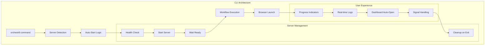
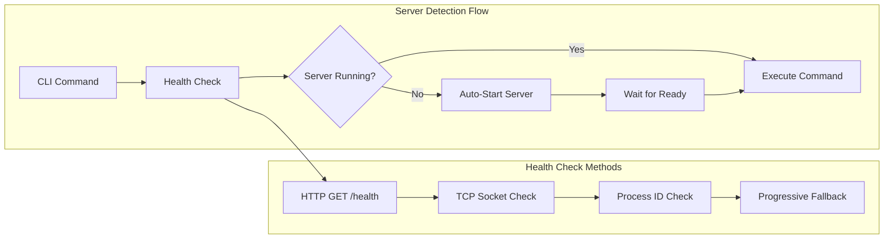
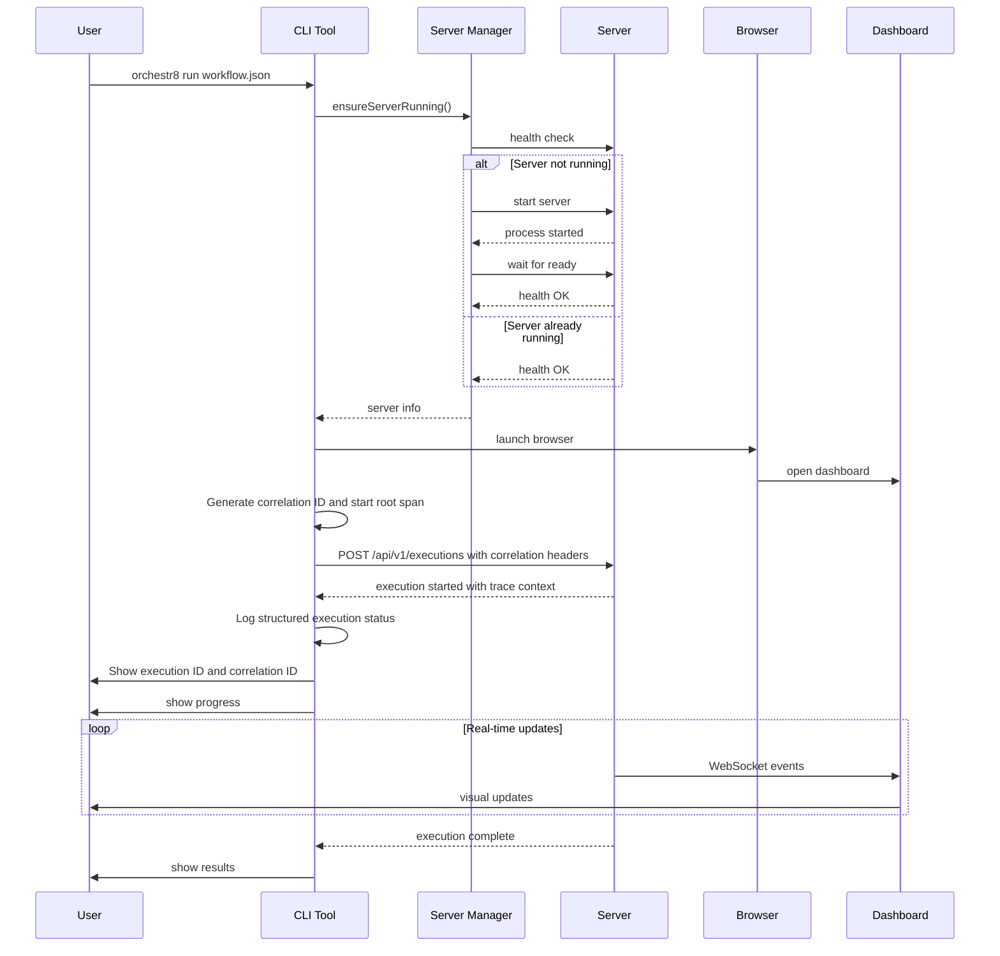

# CLI Tool Specification with Auto-Server

This document defines the **Command Line Interface (CLI)** for @orchestr8 MVP, featuring smart auto-server functionality and seamless workflow execution.

> Created: 2025-01-17  
> Version: 1.0.0  
> Status: MVP CLI Framework

## Overview

The @orchestr8 CLI provides a **smart command-line interface** that automatically manages the orchestration server lifecycle. When running `orchestr8 run workflow.json`, the CLI detects if the server is running and auto-starts it if needed, then opens the browser to the dashboard.

## CLI Architecture



## CLI Commands

### MVP Commands (Reduced Scope)

```bash
# Essential Commands for Week 2 MVP
orchestr8 init                         # Initialize new workspace
orchestr8 create <agent-name>          # Create new agent from template
orchestr8 run <workflow-file>          # Execute workflow locally
orchestr8 test <agent-path>            # Run agent tests
orchestr8 inspect <execution-id>       # View execution journal

# Utility commands
orchestr8 version                      # Show version information
orchestr8 help [command]               # Show help information
```

### Deferred Commands (Post-MVP)

```bash
# Server management - DEFERRED to Phase 2
# orchestr8 start                      # Complex process management
# orchestr8 stop                       # Complex process management
# orchestr8 status                     # Complex process management
# orchestr8 restart                    # Complex process management

# Advanced workflow management - DEFERRED
# orchestr8 validate <workflow-file>   # Nice-to-have, not critical
# orchestr8 list                       # Can use journal directly
# orchestr8 cancel <execution-id>      # Complex state management
# orchestr8 logs <execution-id>        # Duplicate of inspect

# Configuration management - DEFERRED
# orchestr8 config get                 # Can use files directly
# orchestr8 config set <key> <value>   # Can edit files directly
# orchestr8 config reset               # Can delete files directly

# Browser features - DEFERRED to Phase 3
# orchestr8 run --no-browser           # No UI in MVP
# orchestr8 browser                    # No UI in MVP
```

### Command Examples

```bash
# Basic workflow execution
orchestr8 run research-github-user.json

# Run workflow without browser (CI/headless mode)
orchestr8 run workflow.json --no-browser --wait

# Background execution with monitoring
orchestr8 run workflow.json --detach
orchestr8 logs $(orchestr8 list --last --format id)

# Server management
orchestr8 start --port 8088 --host 127.0.0.1
orchestr8 status --json
orchestr8 stop --force

# Configuration management
orchestr8 config set server.port 8088
orchestr8 config set dashboard.autoOpen true
orchestr8 config get server
```

## Auto-Server Functionality

### Server Detection Logic



### Implementation Details

```typescript
// TypeScript interfaces for CLI auto-server functionality
interface ServerInfo {
  host: string
  port: number
  pid?: number | null
  startedAt?: Date | null
  process?: ChildProcess
}

interface ServerStatus {
  running: boolean
  pid?: number
  port?: number
  startedAt?: Date
  health?: boolean
  message: string
  error?: string
}

interface ServerOptions {
  port?: number
  host?: string
  detach?: boolean
  silent?: boolean
}

interface ServerStartOptions extends ServerOptions {
  // Additional options for server startup
}

interface HealthResponse {
  healthy: boolean
  service?: string
  name?: string
  pid?: number
  startedAt?: string
}

interface BrowserOptions {
  noBrowser?: boolean
  browser?: string
}

interface ExecutionOptions {
  port?: number
  host?: string
  detach?: boolean
  noBrowser?: boolean
  browser?: string
  async?: boolean
  priority?: string
  tags?: string[]
  verbose?: boolean
  showOutput?: boolean
}

interface ExecutionResult {
  id: string
  status: string
  detached?: boolean
  duration?: number
  completedSteps?: number
  totalSteps?: number
  error?: string
  output?: any
}

interface ExecutionResponse {
  id: string
  status: string
}

// CLI Auto-Server Manager
export class AutoServerManager {
  private readonly DEFAULT_PORT = 8088
  private readonly DEFAULT_HOST = '127.0.0.1'
  private readonly HEALTH_CHECK_TIMEOUT = 5000
  private readonly STARTUP_TIMEOUT = 30000

  async ensureServerRunning(options: ServerOptions = {}): Promise<ServerInfo> {
    const port = options.port || this.DEFAULT_PORT
    const host = options.host || this.DEFAULT_HOST

    // Step 1: Check if server is already running
    const runningServer = await this.detectRunningServer(host, port)
    if (runningServer) {
      console.log(`✓ Server already running at http://${host}:${port}`)
      return runningServer
    }

    // Step 2: Auto-start server if not running
    console.log(`🚀 Starting orchestr8 server on ${host}:${port}...`)
    const serverProcess = await this.startServer({ host, port, ...options })

    // Step 3: Wait for server to be ready
    await this.waitForServerReady(host, port)

    console.log(`✓ Server ready at http://${host}:${port}`)

    return {
      host,
      port,
      pid: serverProcess.pid,
      startedAt: new Date(),
      process: serverProcess,
    }
  }

  private async detectRunningServer(
    host: string,
    port: number,
  ): Promise<ServerInfo | null> {
    try {
      // Method 1: HTTP health check
      const healthResponse = await this.httpHealthCheck(host, port)
      if (healthResponse.healthy) {
        return {
          host,
          port,
          pid: healthResponse.pid,
          startedAt: new Date(healthResponse.startedAt),
        }
      }
    } catch (error) {
      // Health check failed, try other methods
    }

    try {
      // Method 2: TCP socket check
      const tcpConnected = await this.tcpSocketCheck(host, port)
      if (tcpConnected) {
        // Server is listening but might not be ready
        return { host, port, pid: null, startedAt: null }
      }
    } catch (error) {
      // TCP check failed
    }

    // Method 3: Enhanced PID file check with process validation
    const pidInfo = await this.checkPidFile()
    if (pidInfo) {
      // Verify process is actually listening on expected port
      const listening = await this.tcpSocketCheck(host, port)
      if (listening) {
        return { host, port, ...pidInfo }
      } else {
        // Process exists but not listening - clean up stale PID file
        await this.removeStalePidFile(pidInfo.pid)
      }
    }

    return null
  }

  private async httpHealthCheck(
    host: string,
    port: number,
  ): Promise<HealthResponse> {
    const controller = new AbortController()
    const timeout = setTimeout(
      () => controller.abort(),
      this.HEALTH_CHECK_TIMEOUT,
    )

    try {
      const response = await fetch(`http://${host}:${port}/api/v1/health`, {
        signal: controller.signal,
        headers: { Accept: 'application/json' },
      })

      if (response.ok) {
        const health = await response.json()
        return health
      }

      throw new Error(`Health check failed: ${response.status}`)
    } finally {
      clearTimeout(timeout)
    }
  }

  private async tcpSocketCheck(host: string, port: number): Promise<boolean> {
    return new Promise((resolve) => {
      const socket = new net.Socket()
      const timeout = setTimeout(() => {
        socket.destroy()
        resolve(false)
      }, 2000)

      socket.setTimeout(2000)
      socket.on('connect', () => {
        clearTimeout(timeout)
        socket.destroy()
        resolve(true)
      })

      socket.on('timeout', () => {
        clearTimeout(timeout)
        socket.destroy()
        resolve(false)
      })

      socket.on('error', () => {
        clearTimeout(timeout)
        socket.destroy()
        resolve(false)
      })

      socket.connect(port, host)
    })
  }

  private async startServer(
    options: ServerStartOptions,
  ): Promise<ChildProcess> {
    const args = [
      'server',
      '--port',
      options.port.toString(),
      '--host',
      options.host,
    ]

    if (options.detach) {
      args.push('--detach')
    }

    if (options.silent) {
      args.push('--silent')
    }

    const serverProcess = spawn('orchestr8', args, {
      detached: options.detach || false,
      stdio: options.detach ? 'ignore' : ['ignore', 'pipe', 'pipe'],
      env: {
        ...process.env,
        ORCHESTR8_CLI_MODE: 'auto',
      },
    })

    if (options.detach) {
      serverProcess.unref()
    } else {
      // Pipe server output to CLI with prefix
      serverProcess.stdout?.on('data', (data) => {
        process.stdout.write(`[server] ${data}`)
      })

      serverProcess.stderr?.on('data', (data) => {
        process.stderr.write(`[server] ${data}`)
      })
    }

    // Save PID for later reference with enhanced metadata
    await this.savePidFile(serverProcess.pid!, options)

    return serverProcess
  }

  // Enhanced PID file management with process validation
  private async checkPidFile(): Promise<{
    pid: number
    startedAt: Date
    port?: number
  } | null> {
    try {
      const pidFilePath = this.getPidFilePath()
      if (!fs.existsSync(pidFilePath)) {
        return null
      }

      const pidData = JSON.parse(fs.readFileSync(pidFilePath, 'utf-8'))
      const { pid, startedAt, port, host } = pidData

      // Validate PID data structure
      if (!pid || !startedAt) {
        console.warn('Invalid PID file format, removing...')
        await this.removePidFile()
        return null
      }

      // Check if process is still running
      try {
        process.kill(pid, 0) // Signal 0 checks if process exists without killing it

        // Process exists, verify it's our orchestr8 server
        const isOrchestrateServer =
          await this.validateProcessIsOrchestrateServer(pid, port)
        if (!isOrchestrateServer) {
          console.warn(
            `PID ${pid} exists but is not an orchestr8 server, cleaning up...`,
          )
          await this.removePidFile()
          return null
        }

        return {
          pid,
          startedAt: new Date(startedAt),
          port,
        }
      } catch (error: any) {
        if (error.code === 'ESRCH') {
          // Process doesn't exist, remove stale PID file
          console.warn(
            `Process ${pid} no longer exists, cleaning up PID file...`,
          )
          await this.removePidFile()
          return null
        }
        throw error
      }
    } catch (error) {
      console.warn('Error reading PID file:', error)
      // Remove corrupted PID file
      await this.removePidFile()
      return null
    }
  }

  private async savePidFile(
    pid: number,
    options: ServerStartOptions,
  ): Promise<void> {
    const pidFilePath = this.getPidFilePath()
    const pidDir = path.dirname(pidFilePath)

    // Ensure PID directory exists
    await fs.promises.mkdir(pidDir, { recursive: true })

    const pidData = {
      pid,
      startedAt: new Date().toISOString(),
      port: options.port,
      host: options.host,
      version: getVersion(),
      nodeVersion: process.version,
      platform: process.platform,
      cwd: process.cwd(),
      command: process.argv.join(' '),
    }

    try {
      await fs.promises.writeFile(pidFilePath, JSON.stringify(pidData, null, 2))
      console.debug(`PID file saved: ${pidFilePath}`)
    } catch (error) {
      console.warn('Failed to save PID file:', error)
      // Don't fail server startup if PID file can't be saved
    }
  }

  private async removePidFile(): Promise<void> {
    try {
      const pidFilePath = this.getPidFilePath()
      if (fs.existsSync(pidFilePath)) {
        await fs.promises.unlink(pidFilePath)
        console.debug('PID file removed')
      }
    } catch (error) {
      console.warn('Failed to remove PID file:', error)
    }
  }

  private async removeStalePidFile(pid: number): Promise<void> {
    console.warn(`Found stale PID file for process ${pid}, cleaning up...`)
    await this.removePidFile()
  }

  private getPidFilePath(): string {
    return PlatformAdapter.getPidFile()
  }

  private async validateProcessIsOrchestrateServer(
    pid: number,
    expectedPort?: number,
  ): Promise<boolean> {
    try {
      // Method 1: Check process command line (Linux/macOS)
      if (process.platform !== 'win32') {
        try {
          const cmdline = fs.readFileSync(`/proc/${pid}/cmdline`, 'utf-8')
          if (cmdline.includes('orchestr8') && cmdline.includes('server')) {
            return true
          }
        } catch (error) {
          // /proc not available or process not found
        }
      }

      // Method 2: Check if process is listening on expected port (cross-platform)
      if (expectedPort) {
        const isListening = await this.tcpSocketCheck('127.0.0.1', expectedPort)
        if (isListening) {
          // Additional validation: try to hit the health endpoint
          try {
            const response = await fetch(
              `http://127.0.0.1:${expectedPort}/api/v1/health`,
              {
                signal: AbortSignal.timeout(2000),
              },
            )
            const health = await response.json()
            return (
              health.service === '@orchestr8' || health.name === 'orchestr8'
            )
          } catch (error) {
            // Health check failed, but process is listening on port
            return true
          }
        }
      }

      // Method 3: Use platform-specific process validation
      return await this.platformSpecificProcessValidation(pid)
    } catch (error) {
      console.debug('Process validation failed:', error)
      return false
    }
  }

  private async platformSpecificProcessValidation(
    pid: number,
  ): Promise<boolean> {
    const platform = process.platform

    try {
      switch (platform) {
        case 'win32':
          // Use WMIC to check process details
          const { stdout } = await exec(
            `wmic process where "ProcessId=${pid}" get CommandLine /format:csv`,
          )
          return stdout.includes('orchestr8') && stdout.includes('server')

        case 'darwin':
          // Use ps to check process details
          const { stdout: macStdout } = await exec(`ps -p ${pid} -o command=`)
          return macStdout.includes('orchestr8') && macStdout.includes('server')

        default: // Linux
          // Check /proc/pid/comm and /proc/pid/cmdline
          const comm = fs.readFileSync(`/proc/${pid}/comm`, 'utf-8').trim()
          const cmdline = fs.readFileSync(`/proc/${pid}/cmdline`, 'utf-8')
          return (
            (comm.includes('node') || comm.includes('orchestr8')) &&
            cmdline.includes('orchestr8') &&
            cmdline.includes('server')
          )
      }
    } catch (error) {
      console.debug(
        `Platform-specific validation failed for ${platform}:`,
        error,
      )
      return false
    }
  }

  private async waitForServerReady(host: string, port: number): Promise<void> {
    const startTime = Date.now()
    const spinner = this.createSpinner('Waiting for server to be ready...')

    while (Date.now() - startTime < this.STARTUP_TIMEOUT) {
      try {
        const health = await this.httpHealthCheck(host, port)
        if (health.healthy) {
          spinner.succeed('Server is ready')
          return
        }
      } catch (error) {
        // Server not ready yet, continue waiting
      }

      await new Promise((resolve) => setTimeout(resolve, 500))
    }

    spinner.fail('Server startup timeout')
    throw new Error(`Server failed to start within ${this.STARTUP_TIMEOUT}ms`)
  }

  async stopServer(force: boolean = false): Promise<void> {
    const pidInfo = await this.checkPidFile()
    if (!pidInfo) {
      console.log('No running server found')
      return
    }

    try {
      if (force) {
        process.kill(pidInfo.pid, 'SIGKILL')
      } else {
        process.kill(pidInfo.pid, 'SIGTERM')

        // Wait for graceful shutdown
        await this.waitForProcessExit(pidInfo.pid, 10000)
      }

      await this.removePidFile()
      console.log('✓ Server stopped')
    } catch (error: any) {
      if (error.code === 'ESRCH') {
        // Process doesn't exist, clean up PID file
        await this.removePidFile()
        console.log('✓ Server was not running (cleaned up PID file)')
      } else {
        throw error
      }
    }
  }

  private async waitForProcessExit(
    pid: number,
    timeoutMs: number,
  ): Promise<void> {
    const startTime = Date.now()

    while (Date.now() - startTime < timeoutMs) {
      try {
        process.kill(pid, 0) // Check if process still exists
        await new Promise((resolve) => setTimeout(resolve, 100))
      } catch (error: any) {
        if (error.code === 'ESRCH') {
          // Process has exited
          return
        }
        throw error
      }
    }

    throw new Error(`Process ${pid} did not exit within ${timeoutMs}ms`)
  }

  async getServerStatus(): Promise<ServerStatus> {
    try {
      const pidInfo = await this.checkPidFile()
      if (!pidInfo) {
        return {
          running: false,
          message: 'No server process found',
        }
      }

      // Verify process is still running and is actually our server
      try {
        process.kill(pidInfo.pid, 0)
        const isOurServer = await this.validateProcessIsOrchestrateServer(
          pidInfo.pid,
          pidInfo.port,
        )

        if (!isOurServer) {
          await this.removePidFile()
          return {
            running: false,
            message: `Process ${pidInfo.pid} exists but is not an orchestr8 server`,
          }
        }

        // Try health check if port is available
        if (pidInfo.port) {
          try {
            const health = await this.httpHealthCheck('127.0.0.1', pidInfo.port)
            return {
              running: true,
              pid: pidInfo.pid,
              port: pidInfo.port,
              startedAt: pidInfo.startedAt,
              health: health.healthy,
              message: `Server running healthy on port ${pidInfo.port}`,
            }
          } catch (error) {
            return {
              running: true,
              pid: pidInfo.pid,
              port: pidInfo.port,
              startedAt: pidInfo.startedAt,
              health: false,
              message: `Server process exists but health check failed`,
            }
          }
        }

        return {
          running: true,
          pid: pidInfo.pid,
          startedAt: pidInfo.startedAt,
          message: 'Server process confirmed running',
        }
      } catch (error: any) {
        if (error.code === 'ESRCH') {
          await this.removePidFile()
          return {
            running: false,
            message: 'Server process no longer exists (cleaned up PID file)',
          }
        }
        throw error
      }
    } catch (error: any) {
      return {
        running: false,
        message: `Error checking server status: ${error.message}`,
        error: error.message,
      }
    }
  }

  async restartServer(options: ServerStartOptions = {}): Promise<ServerInfo> {
    console.log('🔄 Restarting orchestr8 server...')

    try {
      // Stop existing server
      await this.stopServer(false)

      // Brief pause to ensure cleanup
      await new Promise((resolve) => setTimeout(resolve, 1000))

      // Start new server
      return await this.ensureServerRunning(options)
    } catch (error) {
      console.error('Failed to restart server:', error)
      throw error
    }
  }
}
```

### Browser Auto-Launch

```typescript
// Browser launcher with cross-platform support
export class BrowserLauncher {
  async openDashboard(
    serverInfo: ServerInfo,
    options: BrowserOptions = {},
  ): Promise<void> {
    if (options.noBrowser) {
      console.log(
        `Dashboard available at: http://${serverInfo.host}:${serverInfo.port}`,
      )
      return
    }

    const url = `http://${serverInfo.host}:${serverInfo.port}`

    try {
      await this.launchBrowser(url, options)
      console.log(`✓ Dashboard opened in browser: ${url}`)
    } catch (error) {
      console.warn(`⚠️  Failed to open browser automatically: ${error.message}`)
      console.log(`Dashboard available at: ${url}`)
    }
  }

  private async launchBrowser(
    url: string,
    options: BrowserOptions,
  ): Promise<void> {
    const platform = process.platform

    let command: string
    let args: string[]

    switch (platform) {
      case 'darwin': // macOS
        command = 'open'
        args = [url]
        if (options.browser) {
          args.unshift('-a', options.browser)
        }
        break

      case 'win32': // Windows
        command = 'start'
        args = ['""', url] // Empty title for start command
        if (options.browser) {
          args[1] = options.browser
          args.push(url)
        }
        break

      default: // Linux and others
        command = 'xdg-open'
        args = [url]
        if (options.browser) {
          command = options.browser
          args = [url]
        }
        break
    }

    await new Promise<void>((resolve, reject) => {
      spawn(command, args, { detached: true, stdio: 'ignore' })
        .on('error', reject)
        .on('spawn', () => {
          // Give browser time to start before resolving
          setTimeout(resolve, 1000)
        })
        .unref()
    })
  }
}
```

## Workflow Execution (Enhanced with ADR-019)

### Correlation ID Propagation and Observability

**ADR-019 Observability Integration:**

- **Correlation IDs**: Generated for end-to-end tracing across CLI → Server → Agents
- **OpenTelemetry Integration**: CLI creates root span and propagates trace context
- **Structured Logging**: All CLI operations use structured JSON logging with correlation
- **Error Attribution**: Errors traced back through correlation ID chain
- **Performance Monitoring**: CLI execution timing tracked and reported

### Enhanced Command Flow with Observability



### Correlation ID Implementation (Per ADR-019)

```typescript
import { trace, context, SpanStatusCode } from '@opentelemetry/api'
import { randomUUID } from 'crypto'

export class CorrelationManager {
  private readonly tracer = trace.getTracer('@orchestr8/cli')

  createExecutionContext(command: string): ExecutionContext {
    const correlationId = randomUUID()
    const span = this.tracer.startSpan(`cli.${command}`, {
      attributes: {
        'cli.command': command,
        'cli.correlation_id': correlationId,
        'cli.version': process.env.npm_package_version,
      },
    })

    return {
      correlationId,
      span,
      startTime: Date.now(),
      traceContext: trace.setSpan(context.active(), span),
    }
  }

  generateRequestHeaders(ctx: ExecutionContext): Record<string, string> {
    return {
      'X-Correlation-ID': ctx.correlationId,
      'X-Trace-ID': ctx.span.spanContext().traceId,
      'X-Span-ID': ctx.span.spanContext().spanId,
      'User-Agent': `@orchestr8/cli/${process.env.npm_package_version}`,
    }
  }

  logStructured(
    level: string,
    message: string,
    ctx: ExecutionContext,
    metadata?: any,
  ): void {
    const logEntry = {
      timestamp: new Date().toISOString(),
      level,
      message,
      correlationId: ctx.correlationId,
      traceId: ctx.span.spanContext().traceId,
      spanId: ctx.span.spanContext().spanId,
      component: 'cli',
      duration: Date.now() - ctx.startTime,
      ...metadata,
    }

    console.log(JSON.stringify(logEntry))
  }

  completeExecution(
    ctx: ExecutionContext,
    success: boolean,
    error?: Error,
  ): void {
    if (error) {
      ctx.span.recordException(error)
      ctx.span.setStatus({ code: SpanStatusCode.ERROR, message: error.message })
      this.logStructured('error', 'Execution failed', ctx, {
        error: error.message,
        errorCode: (error as any).code,
        stack: error.stack,
      })
    } else {
      ctx.span.setStatus({ code: SpanStatusCode.OK })
      this.logStructured('info', 'Execution completed successfully', ctx)
    }

    ctx.span.end()
  }
}

interface ExecutionContext {
  correlationId: string
  span: any
  startTime: number
  traceContext: any
}
```

### Enhanced HTTP Client with Correlation

```typescript
export class ObservableHTTPClient {
  constructor(private correlationManager: CorrelationManager) {}

  async executeWorkflow(
    workflowFile: string,
    serverUrl: string,
    ctx: ExecutionContext,
  ): Promise<ExecutionResult> {
    const headers = this.correlationManager.generateRequestHeaders(ctx)
    headers['Content-Type'] = 'application/json'
    headers['Idempotency-Key'] = `cli-${ctx.correlationId}-${Date.now()}`

    this.correlationManager.logStructured(
      'info',
      'Starting workflow execution',
      ctx,
      {
        workflowFile,
        serverUrl,
        headers: Object.keys(headers),
      },
    )

    try {
      const response = await fetch(`${serverUrl}/api/v1/workflows/execute`, {
        method: 'POST',
        headers,
        body: JSON.stringify({
          workflow: await this.loadWorkflow(workflowFile),
          context: {
            correlationId: ctx.correlationId,
            source: 'cli',
            timestamp: new Date().toISOString(),
          },
        }),
      })

      if (!response.ok) {
        throw new Error(`HTTP ${response.status}: ${response.statusText}`)
      }

      const result = await response.json()

      this.correlationManager.logStructured(
        'info',
        'Workflow execution started',
        ctx,
        {
          executionId: result.executionId,
          status: result.status,
          responseHeaders: Object.fromEntries(response.headers.entries()),
        },
      )

      return result
    } catch (error) {
      this.correlationManager.logStructured(
        'error',
        'Failed to start workflow execution',
        ctx,
        {
          error: error.message,
          workflowFile,
        },
      )
      throw error
    }
  }

  private async loadWorkflow(file: string): Promise<any> {
    // Load and validate workflow file
    const content = await fs.readFile(file, 'utf-8')
    return JSON.parse(content)
  }
}
```

### Execution Implementation

```typescript
// Workflow execution with auto-server
export class WorkflowExecutor {
  constructor(
    private serverManager: AutoServerManager,
    private browserLauncher: BrowserLauncher,
    private correlationManager: CorrelationManager,
    private httpClient: ObservableHTTPClient,
  ) {}

  async executeWorkflow(
    workflowFile: string,
    options: ExecutionOptions,
  ): Promise<ExecutionResult> {
    // Step 0: Create execution context with correlation ID (ADR-019)
    const ctx = this.correlationManager.createExecutionContext('run')

    this.correlationManager.logStructured(
      'info',
      'Starting workflow execution',
      ctx,
      {
        workflowFile,
        options: {
          port: options.port,
          host: options.host,
          detach: options.detach,
          noBrowser: options.noBrowser,
        },
      },
    )

    try {
      // Step 1: Validate workflow file
      const workflow = await this.validateWorkflow(workflowFile, ctx)
      console.log(
        `📋 Validated workflow: ${workflow.metadata.name} [${ctx.correlationId}]`,
      )

      // Step 2: Ensure server is running
      const serverInfo = await this.serverManager.ensureServerRunning(
        {
          port: options.port,
          host: options.host,
          detach: options.detach,
        },
        ctx,
      )

      // Step 3: Open dashboard (unless disabled)
      if (!options.noBrowser) {
        await this.browserLauncher.openDashboard(serverInfo, {
          noBrowser: options.noBrowser,
          browser: options.browser,
          correlationId: ctx.correlationId,
        })
      }

      // Step 4: Submit workflow for execution with correlation
      const execution = await this.httpClient.executeWorkflow(
        workflowFile,
        `http://${serverInfo.host}:${serverInfo.port}`,
        ctx,
      )

      console.log(
        `🚀 Started execution: ${execution.executionId} [${ctx.correlationId}]`,
      )

      // Step 5: Monitor execution (unless detached)
      if (!options.detach) {
        const result = await this.monitorExecution(
          serverInfo,
          execution.executionId,
          ctx,
          options,
        )
        this.correlationManager.completeExecution(ctx, true)
        return result
      } else {
        console.log(
          `✓ Workflow running in background. Execution ID: ${execution.executionId}`,
        )
        console.log(`   Correlation ID: ${ctx.correlationId}`)
        console.log(
          `   Monitor progress at: http://${serverInfo.host}:${serverInfo.port}`,
        )
        console.log(
          `   Check status with: orchestr8 status ${execution.executionId}`,
        )

        this.correlationManager.completeExecution(ctx, true)

        return {
          id: execution.executionId,
          correlationId: ctx.correlationId,
          status: 'running',
          detached: true,
        }
      }
    } catch (error) {
      this.correlationManager.completeExecution(ctx, false, error as Error)
      throw error
    }
  }

  private async submitWorkflow(
    serverInfo: ServerInfo,
    workflow: Workflow,
    options: ExecutionOptions,
  ): Promise<ExecutionResponse> {
    const response = await fetch(
      `http://${serverInfo.host}:${serverInfo.port}/api/v1/executions`,
      {
        method: 'POST',
        headers: {
          'Content-Type': 'application/json',
          'User-Agent': `orchestr8-cli/${getVersion()}`,
        },
        body: JSON.stringify({
          workflow,
          options: {
            async: options.async || false,
            priority: options.priority || 'normal',
            tags: options.tags || [],
          },
        }),
      },
    )

    if (!response.ok) {
      const error = await response.json()
      throw new Error(`Failed to start workflow: ${error.message}`)
    }

    return await response.json()
  }

  private async monitorExecution(
    serverInfo: ServerInfo,
    executionId: string,
    options: ExecutionOptions,
  ): Promise<ExecutionResult> {
    const spinner = this.createSpinner(`Executing workflow...`)

    try {
      // Monitor via polling (WebSocket would be better but more complex for CLI)
      let lastStatus = 'running'

      while (true) {
        const status = await this.getExecutionStatus(serverInfo, executionId)

        if (status.status !== lastStatus) {
          lastStatus = status.status
          spinner.text = `Status: ${status.status} (${status.completedSteps}/${status.totalSteps} steps)`
        }

        if (['completed', 'failed', 'cancelled'].includes(status.status)) {
          if (status.status === 'completed') {
            spinner.succeed(`✓ Workflow completed successfully`)
          } else {
            spinner.fail(`✗ Workflow ${status.status}`)
          }

          // Show execution summary
          await this.showExecutionSummary(serverInfo, executionId, options)

          return status
        }

        await new Promise((resolve) => setTimeout(resolve, 1000))
      }
    } catch (error) {
      spinner.fail(`✗ Execution monitoring failed: ${error.message}`)
      throw error
    }
  }

  private async showExecutionSummary(
    serverInfo: ServerInfo,
    executionId: string,
    options: ExecutionOptions,
  ): Promise<void> {
    const execution = await this.getExecutionDetails(serverInfo, executionId)

    console.log('\n📊 Execution Summary')
    console.log('─'.repeat(50))
    console.log(`ID: ${execution.id}`)
    console.log(`Status: ${execution.status}`)
    console.log(`Duration: ${formatDuration(execution.duration)}`)
    console.log(`Steps: ${execution.completedSteps}/${execution.totalSteps}`)

    if (execution.status === 'failed') {
      console.log(`Error: ${execution.error}`)

      if (options.verbose) {
        console.log('\n📝 Failed Steps:')
        execution.steps
          .filter((step) => step.status === 'failed')
          .forEach((step) => {
            console.log(`  • ${step.name}: ${step.error}`)
          })
      }
    }

    if (execution.output && options.showOutput) {
      console.log('\n📤 Output:')
      console.log(JSON.stringify(execution.output, null, 2))
    }

    console.log(
      `\n🌐 View details: http://${serverInfo.host}:${serverInfo.port}/?execution=${executionId}`,
    )
  }
}
```

## Configuration Management

### Configuration Schema

```typescript
// CLI configuration structure
export interface CLIConfig {
  server: {
    port: number
    host: string
    autoStart: boolean
    shutdownTimeout: number
  }
  dashboard: {
    autoOpen: boolean
    browser?: string
    theme: 'light' | 'dark' | 'auto'
  }
  execution: {
    defaultTimeout: number
    maxConcurrent: number
    logLevel: 'debug' | 'info' | 'warn' | 'error'
  }
  output: {
    format: 'table' | 'json' | 'yaml'
    verbose: boolean
    colors: boolean
  }
}

// Default configuration
export const DEFAULT_CONFIG: CLIConfig = {
  server: {
    port: 8088,
    host: '127.0.0.1',
    autoStart: true,
    shutdownTimeout: 10000,
  },
  dashboard: {
    autoOpen: true,
    theme: 'auto',
  },
  execution: {
    defaultTimeout: 300000, // 5 minutes
    maxConcurrent: 10,
    logLevel: 'info',
  },
  output: {
    format: 'table',
    verbose: false,
    colors: true,
  },
}
```

### Configuration Commands

```typescript
// Configuration management implementation
export class ConfigManager {
  private configPath: string
  private config: CLIConfig

  constructor() {
    this.configPath = path.join(os.homedir(), '.orchestr8', 'config.json')
    this.config = this.loadConfig()
  }

  async get(key?: string): Promise<any> {
    if (!key) {
      return this.config
    }

    const value = this.getNestedValue(this.config, key)
    if (value === undefined) {
      throw new Error(`Configuration key not found: ${key}`)
    }

    return value
  }

  async set(key: string, value: any): Promise<void> {
    this.setNestedValue(this.config, key, value)
    await this.saveConfig()
    console.log(`✓ Set ${key} = ${JSON.stringify(value)}`)
  }

  async reset(): Promise<void> {
    this.config = { ...DEFAULT_CONFIG }
    await this.saveConfig()
    console.log('✓ Configuration reset to defaults')
  }

  async show(format: 'json' | 'yaml' | 'table' = 'table'): Promise<void> {
    switch (format) {
      case 'json':
        console.log(JSON.stringify(this.config, null, 2))
        break
      case 'yaml':
        console.log(yaml.dump(this.config))
        break
      case 'table':
        this.showAsTable(this.config)
        break
    }
  }

  private loadConfig(): CLIConfig {
    try {
      if (fs.existsSync(this.configPath)) {
        const content = fs.readFileSync(this.configPath, 'utf-8')
        const userConfig = JSON.parse(content)
        return { ...DEFAULT_CONFIG, ...userConfig }
      }
    } catch (error) {
      console.warn(
        `Warning: Failed to load config from ${this.configPath}, using defaults`,
      )
    }

    return { ...DEFAULT_CONFIG }
  }

  private async saveConfig(): Promise<void> {
    const configDir = path.dirname(this.configPath)
    await fs.promises.mkdir(configDir, { recursive: true })
    await fs.promises.writeFile(
      this.configPath,
      JSON.stringify(this.config, null, 2),
    )
  }

  private getNestedValue(obj: any, key: string): any {
    return key.split('.').reduce((current, prop) => current?.[prop], obj)
  }

  private setNestedValue(obj: any, key: string, value: any): void {
    const props = key.split('.')
    const lastProp = props.pop()!
    const target = props.reduce((current, prop) => {
      if (!(prop in current)) {
        current[prop] = {}
      }
      return current[prop]
    }, obj)

    target[lastProp] = value
  }
}
```

## Signal Handling and Cleanup

### Graceful Shutdown

```typescript
// Signal handling for graceful shutdown
export class SignalHandler {
  private cleanupHandlers: (() => Promise<void>)[] = []
  private shutdownInProgress = false

  constructor() {
    this.setupSignalHandlers()
  }

  addCleanupHandler(handler: () => Promise<void>): void {
    this.cleanupHandlers.push(handler)
  }

  private setupSignalHandlers(): void {
    const signals: NodeJS.Signals[] = ['SIGINT', 'SIGTERM']

    signals.forEach((signal) => {
      process.on(signal, async () => {
        if (this.shutdownInProgress) return
        this.shutdownInProgress = true

        console.log(`\n🛑 Received ${signal}, shutting down gracefully...`)

        try {
          await this.performCleanup()
          console.log('✓ Cleanup completed')
          process.exit(0)
        } catch (error) {
          console.error('✗ Cleanup failed:', error)
          process.exit(1)
        }
      })
    })

    // Handle uncaught exceptions
    process.on('uncaughtException', async (error) => {
      console.error('💥 Uncaught exception:', error)
      await this.performCleanup()
      process.exit(1)
    })

    process.on('unhandledRejection', async (reason) => {
      console.error('💥 Unhandled rejection:', reason)
      await this.performCleanup()
      process.exit(1)
    })
  }

  private async performCleanup(): Promise<void> {
    const cleanupPromises = this.cleanupHandlers.map(async (handler, index) => {
      try {
        await handler()
      } catch (error) {
        console.error(`Cleanup handler ${index} failed:`, error)
      }
    })

    await Promise.allSettled(cleanupPromises)
  }
}

// Usage in main CLI
export class OrchestrateCLI {
  private signalHandler = new SignalHandler()
  private serverManager = new AutoServerManager()

  async run(args: string[]): Promise<void> {
    // Register cleanup handlers
    this.signalHandler.addCleanupHandler(async () => {
      await this.serverManager.cleanup()
    })

    // Parse command and execute
    const command = this.parseCommand(args)
    await this.executeCommand(command)
  }
}
```

## Error Handling and User Experience

### Progress Indicators

```typescript
// Progress indicators and user feedback
export class ProgressIndicator {
  private spinners = new Map<string, any>()

  createSpinner(message: string, id?: string): any {
    const spinner = ora({
      text: message,
      color: 'blue',
      spinner: 'dots',
    }).start()

    if (id) {
      this.spinners.set(id, spinner)
    }

    return spinner
  }

  updateSpinner(id: string, message: string): void {
    const spinner = this.spinners.get(id)
    if (spinner) {
      spinner.text = message
    }
  }

  succeedSpinner(id: string, message?: string): void {
    const spinner = this.spinners.get(id)
    if (spinner) {
      spinner.succeed(message)
      this.spinners.delete(id)
    }
  }

  failSpinner(id: string, message?: string): void {
    const spinner = this.spinners.get(id)
    if (spinner) {
      spinner.fail(message)
      this.spinners.delete(id)
    }
  }

  showProgressBar(total: number, current: number, message: string): void {
    const percentage = Math.round((current / total) * 100)
    const barLength = 30
    const filledLength = Math.round((barLength * current) / total)

    const bar = '█'.repeat(filledLength) + '░'.repeat(barLength - filledLength)
    const progress = `${bar} ${percentage}% (${current}/${total})`

    process.stdout.write(`\r${message}: ${progress}`)

    if (current >= total) {
      process.stdout.write('\n')
    }
  }
}
```

### Error Formatting

```typescript
// Enhanced error handling and formatting
export class CLIErrorHandler {
  formatError(error: Error): string {
    if (error instanceof ValidationError) {
      return this.formatValidationError(error)
    }

    if (error instanceof ServerError) {
      return this.formatServerError(error)
    }

    if (error instanceof NetworkError) {
      return this.formatNetworkError(error)
    }

    return this.formatGenericError(error)
  }

  private formatValidationError(error: ValidationError): string {
    const lines = [
      '❌ Workflow Validation Failed',
      '',
      `File: ${error.filePath}`,
      `Error: ${error.message}`,
    ]

    if (error.details) {
      lines.push('', 'Details:')
      error.details.forEach((detail) => {
        lines.push(`  • ${detail.path}: ${detail.message}`)
      })
    }

    return lines.join('\n')
  }

  private formatServerError(error: ServerError): string {
    return [
      '🔧 Server Error',
      '',
      `Status: ${error.status}`,
      `Message: ${error.message}`,
      '',
      'Suggestions:',
      '  • Check if the server is running: orchestr8 status',
      '  • Restart the server: orchestr8 restart',
      '  • Check the server logs for more details',
    ].join('\n')
  }

  private formatNetworkError(error: NetworkError): string {
    return [
      '🌐 Network Error',
      '',
      `Error: ${error.message}`,
      '',
      'Suggestions:',
      '  • Check your network connection',
      '  • Verify the server is accessible',
      '  • Try running: orchestr8 status',
    ].join('\n')
  }

  private formatGenericError(error: Error): string {
    return [
      '💥 Unexpected Error',
      '',
      `Message: ${error.message}`,
      '',
      'This is likely a bug. Please report it with:',
      '  • Your command',
      '  • The error message above',
      '  • Your system information: orchestr8 version --verbose',
    ].join('\n')
  }
}
```

## Integration with Package Manager

### Package.json Integration

```json
{
  "name": "@orchestr8/cli",
  "version": "1.0.0",
  "description": "Command-line interface for orchestr8 agent orchestration",
  "type": "module",
  "bin": {
    "orchestr8": "./dist/bin/orchestr8.js"
  },
  "scripts": {
    "build": "tsc && node scripts/fix-shebangs.js",
    "dev": "tsx src/bin/orchestr8.ts",
    "test": "vitest",
    "type-check": "tsc --noEmit"
  },
  "dependencies": {
    "commander": "^11.0.0",
    "ora": "^7.0.0",
    "chalk": "^5.3.0",
    "inquirer": "^9.2.0",
    "yaml": "^2.3.0",
    "zod": "^3.22.0",
    "node-fetch": "^3.3.0",
    "ws": "^8.14.0"
  },
  "devDependencies": {
    "@types/node": "^20.0.0",
    "@types/ws": "^8.5.0",
    "tsx": "^4.0.0",
    "typescript": "^5.0.0",
    "vitest": "^1.0.0"
  },
  "engines": {
    "node": ">=18.0.0"
  },
  "os": ["darwin", "linux", "win32"],
  "keywords": ["orchestr8", "agents", "cli", "workflow", "automation"],
  "homepage": "https://orchestr8.ai",
  "repository": {
    "type": "git",
    "url": "https://github.com/orchestr8/orchestr8.git"
  }
}
```

### Installation and Distribution

```bash
# Global installation
npm install -g @orchestr8/cli

# Project-local installation
npm install --save-dev @orchestr8/cli
npx orchestr8 run workflow.json

# Direct execution (no install)
npx @orchestr8/cli run workflow.json

# Development installation
git clone https://github.com/orchestr8/orchestr8.git
cd orchestr8/packages/cli
npm install
npm run build
npm link
```

## Platform Support

### Cross-Platform Compatibility

- **Windows**: Full support with PowerShell and Command Prompt
- **macOS**: Native support with Terminal and iTerm2
- **Linux**: Support for all major distributions
- **Node.js**: Requires Node.js 18+ for modern ES features

### Platform-Specific Features

```typescript
// Platform-specific adaptations
export class PlatformAdapter {
  static getConfigDir(): string {
    const platform = process.platform
    const home = os.homedir()

    switch (platform) {
      case 'win32':
        return path.join(process.env.APPDATA || home, 'orchestr8')
      case 'darwin':
        return path.join(home, '.config', 'orchestr8')
      default:
        return path.join(home, '.config', 'orchestr8')
    }
  }

  static getPidFile(): string {
    const platform = process.platform

    switch (platform) {
      case 'win32':
        return path.join(os.tmpdir(), 'orchestr8.pid')
      default:
        return '/tmp/orchestr8.pid'
    }
  }

  static getDefaultShell(): string {
    const platform = process.platform

    switch (platform) {
      case 'win32':
        return process.env.COMSPEC || 'cmd.exe'
      case 'darwin':
        return process.env.SHELL || '/bin/zsh'
      default:
        return process.env.SHELL || '/bin/bash'
    }
  }
}
```

## Future Enhancements (Post-MVP)

### Advanced CLI Features

- **Interactive mode** with workflow wizard
- **Tab completion** for commands and file paths
- **Plugin system** for custom commands
- **Workflow templates** and scaffolding
- **Advanced logging** with structured output

### Integration Features

- **IDE integration** with VS Code extension
- **Git hooks** for workflow validation
- **CI/CD integration** with GitHub Actions
- **Docker support** for containerized execution
- **Shell completion** for bash, zsh, and fish

### Developer Experience

- **Hot reload** for workflow development
- **Debugging mode** with step-by-step execution
- **Performance profiling** and optimization hints
- **Workflow testing** and validation tools
- **Documentation generation** from workflows

## Conclusion

This CLI specification provides:

- ✅ **Smart auto-server management** with detection and startup
- ✅ **Seamless workflow execution** with progress monitoring
- ✅ **Browser integration** with automatic dashboard opening
- ✅ **Cross-platform support** for Windows, macOS, and Linux
- ✅ **Comprehensive configuration** with persistent settings
- ✅ **Graceful error handling** with helpful error messages
- ✅ **Signal handling** and cleanup for robustness
- ✅ **Modern CLI patterns** with intuitive commands

The CLI transforms @orchestr8 from a server-based tool into a **developer-friendly command-line experience** that automates the complexity of server management while providing immediate visual feedback through the dashboard.
