# Cross‑Repository Sub‑Agent Distribution (MVP‑Scoped)

> Status: Accepted for MVP (scoped)
> Date: 2025-08-17

This document defines the minimal cross‑repository distribution pattern for the single MVP research agents so any repository can consume them quickly. It complements the dual deployment adapters by enabling reuse via NPM and simple automation.

## Goals

- Ship agents as a versioned NPM package with a small CLI installer
- Install into a project’s `.claude/` folder with agent markdown and prompts
- Auto‑update `.claude/settings.json` with MCP server entries (Context7, Firecrawl, Tavily)
- Support config‑only installs and selective agent installs

## Non‑Goals (MVP)

- No registry/marketplace UI
- No in‑app agent discovery
- No auth/entitlements
- No multi‑provider orchestration packaging

## Package Layout (Source Repo)

```text
research-agents/
├── .claude/
│   └── agents/
│       ├── context7-specialist.md
│       ├── firecrawl-specialist.md
│       └── tavily-researcher.md
├── dist/
│   └── agents/
│       ├── context7.js
│       ├── firecrawl.js
│       └── tavily.js
├── templates/
│   ├── context7-prompts.xml
│   ├── firecrawl-prompts.xml
│   └── tavily-prompts.xml
├── bin/
│   └── cli.js
├── package.json
└── scripts/
    └── build-agents.js
```

Key points:

- Agents ship as markdown specs and optional JS implementations
- XML prompt templates are allowed (scoped exception) for these agents only
- Consumers never ingest workflows/policies in XML; those remain JSON

## CLI Installer (research-agents)

### Enhanced Safety Measures (Post-Architectural Review)

Based on architectural review feedback, the installer implements comprehensive safety measures including atomic operations, deterministic merging, and extensive dry-run capabilities to prevent cross-repo distribution failures:

```mermaid
graph TB
    subgraph "Atomic Installation Process"
        BACKUP[Create Backup<br/>.claude/settings.json.backup]
        VALIDATE[Validate Target Directory]
        TEMP[Write to Temp Files<br/>.tmp.xxx]
        ATOMIC[Atomic Rename<br/>temp -> final]
        MERGE[Idempotent Merge<br/>settings.json]
        VERIFY[Verify Installation]
    end

    subgraph "Rollback on Failure"
        DETECT[Detect Failure]
        RESTORE[Restore from Backup]
        CLEANUP[Cleanup Temp Files]
    end

    BACKUP --> VALIDATE
    VALIDATE --> TEMP
    TEMP --> ATOMIC
    ATOMIC --> MERGE
    MERGE --> VERIFY

    DETECT --> RESTORE
    RESTORE --> CLEANUP
```



### Core Behaviors

- **Atomic file operations**: Write to temp files, then rename for atomic updates
- **Backup mechanism**: Create `.claude/settings.json.backup` before any modifications
- **Idempotent operations**: Check for existing entries, don't duplicate
- **Rollback capability**: `research-agents uninstall` restores from backup
- Creates `.claude/agents`, `.claude/prompts`, `.claude/configs` directories
- Copies agent markdown and XML prompt templates
- Optionally copies JS implementations for offline/local runs
- Updates `.claude/settings.json` `mcpServers` entries for Context7, Firecrawl, Tavily
- Supports flags: `--agents`, `--target`, `--config-only`, `--dry-run`

### Example Usage

```bash
# Global install
npm install -g @orchestr8/research-agents
research-agents install --agents context7,tavily

# Project dev-dep
npm i -D @orchestr8/research-agents
npx research-agents install --config-only

# Dry run to preview changes
npx research-agents install --dry-run

# Uninstall with rollback
npx research-agents uninstall
```

### Atomic Operations Implementation

```typescript
// Atomic file operations for safe installation
export class AtomicInstaller {
  private backupPath: string
  private tempFiles: Set<string> = new Set()

  async install(options: InstallOptions): Promise<void> {
    try {
      // Step 1: Create backup
      await this.createBackup(options.target)

      // Step 2: Validate target directory
      await this.validateTarget(options.target)

      // Step 3: Write to temp files
      const tempOperations = await this.prepareAtomicOperations(options)

      // Step 4: Atomic rename (all or nothing)
      await this.executeAtomicOperations(tempOperations)

      // Step 5: Merge settings.json idempotently
      await this.mergeSettings(options)

      // Step 6: Verify installation
      await this.verifyInstallation(options)

      console.log('✓ Agent installation completed successfully')
    } catch (error) {
      console.error('❌ Installation failed:', error.message)
      await this.rollback()
      throw error
    } finally {
      await this.cleanup()
    }
  }

  private async createBackup(targetDir: string): Promise<void> {
    const settingsPath = path.join(targetDir, '.claude', 'settings.json')
    this.backupPath = `${settingsPath}.backup`

    if (await this.fileExists(settingsPath)) {
      await fs.copyFile(settingsPath, this.backupPath)
      console.log('✓ Created backup:', this.backupPath)
    }
  }

  private async prepareAtomicOperations(
    options: InstallOptions,
  ): Promise<AtomicOperation[]> {
    const operations: AtomicOperation[] = []

    // Prepare agent files
    for (const agent of options.agents) {
      const tempPath = await this.createTempFile(`${agent}.md.tmp`)
      const finalPath = path.join(
        options.target,
        '.claude',
        'agents',
        `${agent}.md`,
      )

      await this.writeAgentFile(tempPath, agent)
      operations.push({ tempPath, finalPath, type: 'agent' })
    }

    // Prepare prompt templates
    for (const agent of options.agents) {
      const tempPath = await this.createTempFile(`${agent}-prompts.xml.tmp`)
      const finalPath = path.join(
        options.target,
        '.claude',
        'prompts',
        `${agent}-prompts.xml`,
      )

      await this.writePromptFile(tempPath, agent)
      operations.push({ tempPath, finalPath, type: 'prompt' })
    }

    return operations
  }

  private async executeAtomicOperations(
    operations: AtomicOperation[],
  ): Promise<void> {
    // Ensure all target directories exist
    const dirs = new Set(operations.map((op) => path.dirname(op.finalPath)))
    for (const dir of dirs) {
      await fs.mkdir(dir, { recursive: true })
    }

    // Atomic rename all files
    for (const operation of operations) {
      await fs.rename(operation.tempPath, operation.finalPath)
      this.tempFiles.delete(operation.tempPath)
    }
  }

  private async mergeSettings(options: InstallOptions): Promise<void> {
    const settingsPath = path.join(options.target, '.claude', 'settings.json')

    let settings: any = {}
    if (await this.fileExists(settingsPath)) {
      const content = await fs.readFile(settingsPath, 'utf-8')
      settings = JSON.parse(content)
    }

    // Initialize mcpServers if not exists
    if (!settings.mcpServers) {
      settings.mcpServers = {}
    }

    // Idempotent merge: only add if not already present
    const mcpEntries = this.getMcpEntries(options.agents)
    for (const [serverName, config] of Object.entries(mcpEntries)) {
      if (!settings.mcpServers[serverName]) {
        settings.mcpServers[serverName] = config
        console.log(`✓ Added MCP server: ${serverName}`)
      } else {
        console.log(`ℹ️ MCP server already exists: ${serverName}`)
      }
    }

    // Write updated settings atomically
    const tempSettings = await this.createTempFile('settings.json.tmp')
    await fs.writeFile(tempSettings, JSON.stringify(settings, null, 2))
    await fs.rename(tempSettings, settingsPath)
  }

  private async rollback(): Promise<void> {
    console.log('🔄 Rolling back installation...')

    if (this.backupPath && (await this.fileExists(this.backupPath))) {
      const settingsPath = this.backupPath.replace('.backup', '')
      await fs.copyFile(this.backupPath, settingsPath)
      console.log('✓ Restored settings from backup')
    }

    // Remove any files that were successfully moved
    // (This would require tracking which operations completed)
  }

  private async cleanup(): Promise<void> {
    // Clean up any remaining temp files
    for (const tempFile of this.tempFiles) {
      try {
        await fs.unlink(tempFile)
      } catch {
        // Ignore cleanup errors
      }
    }
    this.tempFiles.clear()
  }

  async uninstall(): Promise<void> {
    console.log('🗑️ Uninstalling research agents...')

    if (this.backupPath && (await this.fileExists(this.backupPath))) {
      const settingsPath = this.backupPath.replace('.backup', '')
      await fs.copyFile(this.backupPath, settingsPath)
      await fs.unlink(this.backupPath)
      console.log('✓ Restored settings from backup')
    }

    // Remove installed agent files
    const agentDirs = ['.claude/agents', '.claude/prompts']
    for (const dir of agentDirs) {
      try {
        const files = await fs.readdir(dir)
        for (const file of files) {
          if (this.isResearchAgentFile(file)) {
            await fs.unlink(path.join(dir, file))
            console.log(`✓ Removed: ${dir}/${file}`)
          }
        }
      } catch {
        // Directory might not exist
      }
    }
  }
}

interface AtomicOperation {
  tempPath: string
  finalPath: string
  type: 'agent' | 'prompt' | 'config'
}
```

### Enhanced Safety Measures Implementation

```typescript
// Enhanced safety measures for cross-repo distribution
export class SafetyEnhancedInstaller extends AtomicInstaller {
  private operationLog: OperationLogEntry[] = []
  private checksumCache: Map<string, string> = new Map()

  async install(options: InstallOptions): Promise<InstallResult> {
    const startTime = Date.now()

    try {
      // Step 0: Enhanced dry-run with full validation
      if (options.dryRun) {
        return await this.performDryRun(options)
      }

      // Step 1: Pre-installation validation
      await this.performPreInstallationValidation(options)

      // Step 2: Create timestamped backup with verification
      await this.createVerifiedBackup(options.target)

      // Step 3: Deterministic merge planning
      const mergeStrategy = await this.planDeterministicMerge(options)

      // Step 4: Execute with operation logging
      const result = await this.executeWithLogging(options, mergeStrategy)

      // Step 5: Post-installation verification
      await this.verifyInstallationIntegrity(options, result)

      return {
        success: true,
        duration: Date.now() - startTime,
        operationLog: this.operationLog,
        checksums: this.getOperationChecksums(),
        backupPath: this.backupPath,
      }
    } catch (error) {
      console.error('❌ Installation failed:', error.message)
      await this.performEnhancedRollback()
      throw error
    }
  }

  private async performDryRun(options: InstallOptions): Promise<InstallResult> {
    console.log('🔍 Performing comprehensive dry-run validation...')

    const dryRunResult: DryRunResult = {
      targetValidation: await this.validateTargetDirectory(options.target),
      fileOperations: await this.simulateFileOperations(options),
      settingsMerge: await this.simulateSettingsMerge(options),
      conflictDetection: await this.detectPotentialConflicts(options),
      spaceRequirements: await this.calculateSpaceRequirements(options),
      permissionCheck: await this.validatePermissions(options.target),
    }

    // Generate detailed dry-run report
    this.generateDryRunReport(dryRunResult)

    if (dryRunResult.hasErrors) {
      throw new Error(`Dry-run detected issues: ${dryRunResult.errorSummary}`)
    }

    return {
      success: true,
      dryRun: true,
      wouldInstall: dryRunResult.fileOperations,
      wouldMerge: dryRunResult.settingsMerge,
      conflicts: dryRunResult.conflictDetection,
      estimatedDuration: dryRunResult.estimatedDuration,
    }
  }

  private async performPreInstallationValidation(
    options: InstallOptions,
  ): Promise<void> {
    console.log('✅ Performing pre-installation validation...')

    // Validate package integrity
    await this.validatePackageIntegrity()

    // Check disk space
    const spaceRequired = await this.calculateSpaceRequirements(options)
    const spaceAvailable = await this.getAvailableSpace(options.target)
    if (spaceAvailable < spaceRequired * 1.5) {
      // 50% buffer
      throw new Error(
        `Insufficient disk space: ${spaceRequired}MB required, ${spaceAvailable}MB available`,
      )
    }

    // Validate target directory structure
    await this.validateTargetDirectory(options.target)

    // Check for potential conflicts
    const conflicts = await this.detectPotentialConflicts(options)
    if (conflicts.length > 0) {
      console.warn(
        `⚠️ Potential conflicts detected: ${conflicts.map((c) => c.path).join(', ')}`,
      )
      if (!options.force) {
        throw new Error(
          'Conflicts detected. Use --force to override or resolve manually.',
        )
      }
    }
  }

  private async createVerifiedBackup(targetDir: string): Promise<void> {
    const timestamp = new Date().toISOString().replace(/[:.]/g, '-')
    const settingsPath = path.join(targetDir, '.claude', 'settings.json')
    this.backupPath = path.join(
      targetDir,
      '.claude',
      `settings.backup.${timestamp}.json`,
    )

    if (await this.fileExists(settingsPath)) {
      // Create backup with integrity verification
      await fs.copyFile(settingsPath, this.backupPath)

      // Verify backup integrity
      const originalContent = await fs.readFile(settingsPath, 'utf-8')
      const backupContent = await fs.readFile(this.backupPath, 'utf-8')

      if (originalContent !== backupContent) {
        throw new Error(
          'Backup verification failed: backup content does not match original',
        )
      }

      // Calculate and store checksums
      const originalChecksum = await this.calculateChecksum(originalContent)
      const backupChecksum = await this.calculateChecksum(backupContent)

      this.checksumCache.set(settingsPath, originalChecksum)
      this.checksumCache.set(this.backupPath, backupChecksum)

      console.log(`✓ Created verified backup: ${this.backupPath}`)
      this.logOperation('backup_created', settingsPath, this.backupPath)
    }
  }

  private async planDeterministicMerge(
    options: InstallOptions,
  ): Promise<MergeStrategy> {
    console.log('📋 Planning deterministic merge strategy...')

    const settingsPath = path.join(options.target, '.claude', 'settings.json')
    let existingSettings: any = {}

    if (await this.fileExists(settingsPath)) {
      const content = await fs.readFile(settingsPath, 'utf-8')
      existingSettings = JSON.parse(content)
    }

    const mcpEntries = this.getMcpEntries(options.agents)
    const mergeStrategy: MergeStrategy = {
      additions: [],
      modifications: [],
      conflicts: [],
      preservedEntries: [],
    }

    // Analyze each MCP entry deterministically
    for (const [serverName, config] of Object.entries(mcpEntries)) {
      if (!existingSettings.mcpServers?.[serverName]) {
        mergeStrategy.additions.push({ serverName, config })
      } else {
        const existing = existingSettings.mcpServers[serverName]
        const comparison = this.compareConfigurations(existing, config)

        if (comparison.identical) {
          mergeStrategy.preservedEntries.push({ serverName, config: existing })
        } else if (comparison.compatible) {
          mergeStrategy.modifications.push({
            serverName,
            existing,
            proposed: config,
            mergedConfig: comparison.merged,
          })
        } else {
          mergeStrategy.conflicts.push({
            serverName,
            existing,
            proposed: config,
            reason: comparison.conflictReason,
          })
        }
      }
    }

    // Log merge strategy
    console.log(
      `📊 Merge strategy: ${mergeStrategy.additions.length} additions, ${mergeStrategy.modifications.length} modifications, ${mergeStrategy.conflicts.length} conflicts`,
    )

    if (mergeStrategy.conflicts.length > 0 && !options.force) {
      throw new Error(
        `Configuration conflicts detected: ${mergeStrategy.conflicts.map((c) => c.serverName).join(', ')}`,
      )
    }

    return mergeStrategy
  }

  private async executeWithLogging(
    options: InstallOptions,
    mergeStrategy: MergeStrategy,
  ): Promise<InstallExecutionResult> {
    console.log('⚙️ Executing installation with operation logging...')

    const result: InstallExecutionResult = {
      filesInstalled: [],
      settingsModified: false,
      operationsPerformed: [],
    }

    // Execute file operations with logging
    const tempOperations = await this.prepareAtomicOperations(options)
    for (const operation of tempOperations) {
      await this.executeOperationWithLogging(operation)
      result.filesInstalled.push(operation.finalPath)
      result.operationsPerformed.push({
        type: 'file_install',
        source: operation.tempPath,
        target: operation.finalPath,
        timestamp: new Date().toISOString(),
      })
    }

    // Execute settings merge with logging
    if (
      mergeStrategy.additions.length > 0 ||
      mergeStrategy.modifications.length > 0
    ) {
      await this.executeDeterministicMerge(options, mergeStrategy)
      result.settingsModified = true
      result.operationsPerformed.push({
        type: 'settings_merge',
        additions: mergeStrategy.additions.length,
        modifications: mergeStrategy.modifications.length,
        timestamp: new Date().toISOString(),
      })
    }

    return result
  }

  private async executeDeterministicMerge(
    options: InstallOptions,
    strategy: MergeStrategy,
  ): Promise<void> {
    const settingsPath = path.join(options.target, '.claude', 'settings.json')

    let settings: any = {}
    if (await this.fileExists(settingsPath)) {
      const content = await fs.readFile(settingsPath, 'utf-8')
      settings = JSON.parse(content)
    }

    // Initialize mcpServers if not exists
    if (!settings.mcpServers) {
      settings.mcpServers = {}
    }

    // Apply additions deterministically (sorted by server name for consistency)
    const sortedAdditions = strategy.additions.sort((a, b) =>
      a.serverName.localeCompare(b.serverName),
    )
    for (const addition of sortedAdditions) {
      settings.mcpServers[addition.serverName] = addition.config
      console.log(`✓ Added MCP server: ${addition.serverName}`)
      this.logOperation(
        'mcp_server_added',
        addition.serverName,
        JSON.stringify(addition.config),
      )
    }

    // Apply modifications deterministically
    const sortedModifications = strategy.modifications.sort((a, b) =>
      a.serverName.localeCompare(b.serverName),
    )
    for (const modification of sortedModifications) {
      settings.mcpServers[modification.serverName] = modification.mergedConfig
      console.log(`✓ Modified MCP server: ${modification.serverName}`)
      this.logOperation(
        'mcp_server_modified',
        modification.serverName,
        JSON.stringify(modification.mergedConfig),
      )
    }

    // Write updated settings atomically with verification
    await this.writeSettingsAtomically(settingsPath, settings)
  }

  private async writeSettingsAtomically(
    settingsPath: string,
    settings: any,
  ): Promise<void> {
    const tempSettings = await this.createTempFile('settings.json.tmp')
    const settingsContent = JSON.stringify(settings, null, 2)

    // Write to temp file
    await fs.writeFile(tempSettings, settingsContent)

    // Verify temp file content
    const writtenContent = await fs.readFile(tempSettings, 'utf-8')
    if (writtenContent !== settingsContent) {
      throw new Error('Settings write verification failed')
    }

    // Calculate checksum for verification
    const checksum = await this.calculateChecksum(settingsContent)
    this.checksumCache.set(settingsPath, checksum)

    // Atomic rename
    await fs.rename(tempSettings, settingsPath)
    this.tempFiles.delete(tempSettings)

    console.log('✓ Settings updated atomically with verification')
  }

  private async verifyInstallationIntegrity(
    options: InstallOptions,
    result: InstallExecutionResult,
  ): Promise<void> {
    console.log('🔍 Verifying installation integrity...')

    // Verify all installed files exist and have correct checksums
    for (const filePath of result.filesInstalled) {
      if (!(await this.fileExists(filePath))) {
        throw new Error(
          `Installation verification failed: ${filePath} does not exist`,
        )
      }

      // Verify file content if checksum was calculated
      if (this.checksumCache.has(filePath)) {
        const content = await fs.readFile(filePath, 'utf-8')
        const actualChecksum = await this.calculateChecksum(content)
        const expectedChecksum = this.checksumCache.get(filePath)

        if (actualChecksum !== expectedChecksum) {
          throw new Error(
            `Installation verification failed: ${filePath} checksum mismatch`,
          )
        }
      }
    }

    // Verify settings.json if it was modified
    if (result.settingsModified) {
      const settingsPath = path.join(options.target, '.claude', 'settings.json')
      if (!(await this.fileExists(settingsPath))) {
        throw new Error(
          'Installation verification failed: settings.json does not exist after merge',
        )
      }

      // Verify settings.json is valid JSON
      try {
        const content = await fs.readFile(settingsPath, 'utf-8')
        JSON.parse(content)
      } catch (error) {
        throw new Error(
          `Installation verification failed: settings.json is not valid JSON: ${error.message}`,
        )
      }
    }

    console.log('✅ Installation integrity verified')
  }

  private async performEnhancedRollback(): Promise<void> {
    console.log('🔄 Performing enhanced rollback with operation log...')

    // Restore from backup with verification
    if (this.backupPath && (await this.fileExists(this.backupPath))) {
      const settingsPath = this.backupPath.replace(
        /\.backup\.\d{4}-\d{2}-\d{2}T\d{2}-\d{2}-\d{2}.*\.json$/,
        '.json',
      )

      // Verify backup integrity before restore
      const backupContent = await fs.readFile(this.backupPath, 'utf-8')
      const expectedChecksum = this.checksumCache.get(this.backupPath)
      if (expectedChecksum) {
        const actualChecksum = await this.calculateChecksum(backupContent)
        if (actualChecksum !== expectedChecksum) {
          console.error(
            '❌ Backup integrity check failed - manual recovery may be required',
          )
          return
        }
      }

      await fs.copyFile(this.backupPath, settingsPath)
      console.log('✓ Restored settings from verified backup')
    }

    // Rollback file operations using operation log
    for (const logEntry of this.operationLog.reverse()) {
      try {
        if (
          logEntry.operation === 'file_created' &&
          (await this.fileExists(logEntry.target))
        ) {
          await fs.unlink(logEntry.target)
          console.log(`✓ Removed: ${logEntry.target}`)
        }
      } catch (error) {
        console.warn(
          `⚠️ Failed to rollback ${logEntry.target}: ${error.message}`,
        )
      }
    }

    await this.cleanup()
    console.log('🔄 Enhanced rollback completed')
  }

  private async calculateChecksum(content: string): Promise<string> {
    const crypto = await import('crypto')
    return crypto.createHash('sha256').update(content, 'utf-8').digest('hex')
  }

  private logOperation(
    operation: string,
    source: string,
    target: string,
  ): void {
    this.operationLog.push({
      operation,
      source,
      target,
      timestamp: new Date().toISOString(),
    })
  }

  private compareConfigurations(
    existing: any,
    proposed: any,
  ): ConfigurationComparison {
    // Deterministic configuration comparison logic
    const existingStr = JSON.stringify(this.normalizeConfig(existing))
    const proposedStr = JSON.stringify(this.normalizeConfig(proposed))

    if (existingStr === proposedStr) {
      return { identical: true, compatible: true }
    }

    // Check if configurations are compatible (can be merged)
    const compatibility = this.checkConfigCompatibility(existing, proposed)

    return {
      identical: false,
      compatible: compatibility.compatible,
      merged: compatibility.compatible ? compatibility.merged : undefined,
      conflictReason: compatibility.compatible
        ? undefined
        : compatibility.reason,
    }
  }

  private normalizeConfig(config: any): any {
    // Normalize configuration for deterministic comparison
    if (typeof config !== 'object' || config === null) {
      return config
    }

    const normalized = { ...config }

    // Sort object keys for deterministic comparison
    const sortedKeys = Object.keys(normalized).sort()
    const result: any = {}

    for (const key of sortedKeys) {
      result[key] = this.normalizeConfig(normalized[key])
    }

    return result
  }

  private checkConfigCompatibility(
    existing: any,
    proposed: any,
  ): CompatibilityResult {
    // Simple compatibility check - can be enhanced with specific merge logic
    try {
      const merged = { ...existing, ...proposed }
      return { compatible: true, merged }
    } catch (error) {
      return {
        compatible: false,
        reason: `Configuration merge failed: ${error.message}`,
      }
    }
  }

  private getOperationChecksums(): Record<string, string> {
    return Object.fromEntries(this.checksumCache.entries())
  }
}

// Enhanced type definitions
interface DryRunResult {
  targetValidation: ValidationResult
  fileOperations: FileOperation[]
  settingsMerge: SettingsMergePreview
  conflictDetection: ConflictDetection[]
  spaceRequirements: number // MB
  permissionCheck: PermissionResult
  hasErrors: boolean
  errorSummary: string
  estimatedDuration: number // ms
}

interface InstallResult {
  success: boolean
  duration?: number
  operationLog?: OperationLogEntry[]
  checksums?: Record<string, string>
  backupPath?: string
  dryRun?: boolean
  wouldInstall?: FileOperation[]
  wouldMerge?: SettingsMergePreview
  conflicts?: ConflictDetection[]
  estimatedDuration?: number
}

interface MergeStrategy {
  additions: Array<{ serverName: string; config: any }>
  modifications: Array<{
    serverName: string
    existing: any
    proposed: any
    mergedConfig: any
  }>
  conflicts: Array<{
    serverName: string
    existing: any
    proposed: any
    reason: string
  }>
  preservedEntries: Array<{ serverName: string; config: any }>
}

interface ConfigurationComparison {
  identical: boolean
  compatible: boolean
  merged?: any
  conflictReason?: string
}

interface CompatibilityResult {
  compatible: boolean
  merged?: any
  reason?: string
}

interface OperationLogEntry {
  operation: string
  source: string
  target: string
  timestamp: string
}

interface InstallExecutionResult {
  filesInstalled: string[]
  settingsModified: boolean
  operationsPerformed: Array<{
    type: string
    timestamp: string
    [key: string]: any
  }>
}
```

## CI/CD Publishing (Source Repo)

- On tag push (`v*`), build and publish the NPM package
- Attach release artifacts (tarballs per agent) for direct download installs

```yaml
# .github/workflows/publish-agents.yml (excerpt)
name: Publish Research Agents
on:
  push:
    tags: ['v*']
jobs:
  build-and-publish:
    runs-on: ubuntu-latest
    steps:
      - uses: actions/checkout@v4
      - uses: actions/setup-node@v4
        with:
          node-version: '20'
          registry-url: 'https://registry.npmjs.org'
      - run: npm ci
      - run: npm run build
      - run: npm publish --access public
        env:
          NODE_AUTH_TOKEN: ${{ secrets.NPM_TOKEN }}
```

## Optional: Direct Download Script

Provide an `install.sh` that installs agent definitions into `.claude/` and updates `settings.json`. This is optional for MVP and can be deferred if time constrained.

## Consumption in Target Repos

- Add as global or dev dependency
- Run the installer in postinstall or project scripts
- Agents appear under `.claude/agents/` and prompts under `.claude/prompts/`

```jsonc
// package.json (target repo)
{
  "devDependencies": {
    "@orchestr8/research-agents": "^1.0.0",
  },
  "scripts": {
    "setup-agents": "research-agents install",
    "postinstall": "research-agents install --config-only",
  },
}
```

## Testing Scope

### Enhanced Safety Testing

- **Comprehensive dry-run validation**: Test full dry-run with conflict detection and space requirements
- **Atomic file operations**: Test temp file creation and atomic rename with integrity verification
- **Verified backup creation**: Test timestamped backup creation with checksum verification
- **Deterministic merge planning**: Test configuration comparison and merge strategy generation
- **Operation logging**: Test complete operation log generation and rollback capability
- **Checksum verification**: Test file integrity verification during installation and rollback
- **Partial failure recovery**: Test enhanced rollback with operation log replay

### CLI Testing

- CLI dry‑run/config‑only installs to temp dir
- Selective agent install (`--agents context7,tavily`)
- Idempotent re‑runs (no duplicate entries in settings.json)
- MCP configuration merge behavior with existing settings
- Uninstall removes installed files and restores from backup

### Error Scenarios

- **Permissions**: Installation fails when target directory is read-only
- **Corrupt settings**: Recovery when existing settings.json is malformed
- **Partial writes**: Interruption during installation triggers rollback
- **Missing backup**: Graceful handling when backup file doesn't exist
- **Network issues**: Offline installation scenarios

### Enhanced Test Implementation

```typescript
describe('SafetyEnhancedInstaller', () => {
  describe('comprehensive dry-run', () => {
    it('performs full validation without modifications', async () => {
      const installer = new SafetyEnhancedInstaller()
      const options = { dryRun: true, target: '/test', agents: ['context7'] }

      const result = await installer.install(options)

      expect(result.dryRun).toBe(true)
      expect(result.wouldInstall).toHaveLength(2) // agent + prompt file
      expect(result.conflicts).toBeArrayOfSize(0)
      // Verify no actual files were created
      expect(fs.existsSync('/test/.claude/agents/context7.md')).toBe(false)
    })

    it('detects conflicts before installation', async () => {
      // Setup existing conflicting configuration
      await fs.writeFile(
        '/test/.claude/settings.json',
        JSON.stringify({
          mcpServers: { context7: { command: 'conflicting-command' } },
        }),
      )

      const installer = new SafetyEnhancedInstaller()
      const options = { dryRun: true, target: '/test', agents: ['context7'] }

      const result = await installer.install(options)

      expect(result.conflicts).toHaveLength(1)
      expect(result.conflicts[0].serverName).toBe('context7')
    })

    it('validates disk space requirements', async () => {
      const installer = new SafetyEnhancedInstaller()
      // Mock insufficient space
      jest.spyOn(installer, 'getAvailableSpace').mockResolvedValue(1) // 1MB
      jest.spyOn(installer, 'calculateSpaceRequirements').mockResolvedValue(10) // 10MB

      const options = { dryRun: true, target: '/test', agents: ['context7'] }

      await expect(installer.install(options)).rejects.toThrow(
        'Insufficient disk space',
      )
    })
  })

  describe('verified backup creation', () => {
    it('creates timestamped backup with checksum verification', async () => {
      const originalSettings = { mcpServers: { existing: { command: 'test' } } }
      await fs.writeFile(
        '/test/.claude/settings.json',
        JSON.stringify(originalSettings),
      )

      const installer = new SafetyEnhancedInstaller()
      await installer.createVerifiedBackup('/test')

      // Verify backup exists with timestamp
      const backupFiles = await fs.readdir('/test/.claude')
      const backupFile = backupFiles.find((f) =>
        f.startsWith('settings.backup.'),
      )
      expect(backupFile).toBeDefined()

      // Verify backup content matches original
      const backupContent = await fs.readFile(
        `/test/.claude/${backupFile}`,
        'utf-8',
      )
      expect(JSON.parse(backupContent)).toEqual(originalSettings)

      // Verify checksum was calculated
      expect(installer.checksumCache.has('/test/.claude/settings.json')).toBe(
        true,
      )
    })

    it('fails installation if backup verification fails', async () => {
      const installer = new SafetyEnhancedInstaller()
      // Mock backup verification failure
      jest
        .spyOn(fs, 'readFile')
        .mockResolvedValueOnce('original content') // First read (original)
        .mockResolvedValueOnce('different content') // Second read (backup)

      await expect(installer.createVerifiedBackup('/test')).rejects.toThrow(
        'Backup verification failed',
      )
    })
  })

  describe('deterministic merge planning', () => {
    it('generates consistent merge strategy', async () => {
      const existingSettings = {
        mcpServers: {
          existing: { command: 'existing-cmd' },
          toModify: { command: 'old-cmd', args: ['old'] },
        },
      }
      await fs.writeFile(
        '/test/.claude/settings.json',
        JSON.stringify(existingSettings),
      )

      const installer = new SafetyEnhancedInstaller()
      const options = { target: '/test', agents: ['context7', 'tavily'] }

      const strategy1 = await installer.planDeterministicMerge(options)
      const strategy2 = await installer.planDeterministicMerge(options)

      // Verify deterministic results
      expect(strategy1).toEqual(strategy2)
      expect(strategy1.additions).toHaveLength(2) // context7, tavily
      expect(strategy1.preservedEntries).toHaveLength(1) // existing
    })

    it('handles configuration conflicts appropriately', async () => {
      const conflictingSettings = {
        mcpServers: {
          context7: { command: 'incompatible-command', conflictingField: true },
        },
      }
      await fs.writeFile(
        '/test/.claude/settings.json',
        JSON.stringify(conflictingSettings),
      )

      const installer = new SafetyEnhancedInstaller()
      const options = { target: '/test', agents: ['context7'] }

      await expect(installer.planDeterministicMerge(options)).rejects.toThrow(
        'Configuration conflicts detected: context7',
      )
    })
  })

  describe('operation logging and rollback', () => {
    it('logs all operations for rollback capability', async () => {
      const installer = new SafetyEnhancedInstaller()
      const options = { target: '/test', agents: ['context7'] }

      await installer.install(options)

      const operationLog = installer.operationLog
      expect(operationLog.length).toBeGreaterThan(0)
      expect(operationLog[0]).toMatchObject({
        operation: expect.any(String),
        source: expect.any(String),
        target: expect.any(String),
        timestamp: expect.any(String),
      })
    })

    it('performs enhanced rollback using operation log', async () => {
      const installer = new SafetyEnhancedInstaller()
      const options = { target: '/test', agents: ['context7'] }

      // Mock installation failure after partial completion
      jest
        .spyOn(installer, 'verifyInstallationIntegrity')
        .mockRejectedValue(new Error('Verification failed'))

      await expect(installer.install(options)).rejects.toThrow(
        'Verification failed',
      )

      // Verify rollback removed installed files
      expect(fs.existsSync('/test/.claude/agents/context7.md')).toBe(false)
      expect(fs.existsSync('/test/.claude/prompts/context7-prompts.xml')).toBe(
        false,
      )
    })
  })

  describe('checksum verification', () => {
    it('verifies file integrity during installation', async () => {
      const installer = new SafetyEnhancedInstaller()
      const options = { target: '/test', agents: ['context7'] }

      const result = await installer.install(options)

      // Verify checksums were calculated for installed files
      expect(Object.keys(result.checksums)).toHaveLength(3) // 2 files + settings.json
      expect(result.checksums['/test/.claude/settings.json']).toMatch(
        /^[a-f0-9]{64}$/,
      )
    })

    it('detects file corruption during verification', async () => {
      const installer = new SafetyEnhancedInstaller()
      const options = { target: '/test', agents: ['context7'] }

      // Mock file corruption after installation
      jest
        .spyOn(installer, 'calculateChecksum')
        .mockResolvedValueOnce('original-checksum') // During installation
        .mockResolvedValueOnce('corrupted-checksum') // During verification

      await expect(installer.install(options)).rejects.toThrow(
        'Installation verification failed',
      )
    })
  })

  describe('uninstall with enhanced safety', () => {
    it('restores from verified backup', async () => {
      const originalSettings = { mcpServers: { original: { command: 'test' } } }
      await fs.writeFile(
        '/test/.claude/settings.json',
        JSON.stringify(originalSettings),
      )

      const installer = new SafetyEnhancedInstaller()
      await installer.install({ target: '/test', agents: ['context7'] })

      // Verify installation modified settings
      const modifiedContent = await fs.readFile(
        '/test/.claude/settings.json',
        'utf-8',
      )
      const modifiedSettings = JSON.parse(modifiedContent)
      expect(modifiedSettings.mcpServers.context7).toBeDefined()

      // Uninstall
      await installer.uninstall()

      // Verify restoration to original state
      const restoredContent = await fs.readFile(
        '/test/.claude/settings.json',
        'utf-8',
      )
      const restoredSettings = JSON.parse(restoredContent)
      expect(restoredSettings).toEqual(originalSettings)
    })

    it('handles backup integrity check during uninstall', async () => {
      const installer = new SafetyEnhancedInstaller()

      // Mock corrupted backup
      installer.checksumCache.set(
        '/test/.claude/settings.backup.test.json',
        'expected-checksum',
      )
      jest
        .spyOn(installer, 'calculateChecksum')
        .mockResolvedValue('corrupted-checksum')
      jest.spyOn(fs, 'readFile').mockResolvedValue('backup content')
      jest.spyOn(installer, 'fileExists').mockResolvedValue(true)

      // Should handle gracefully without throwing
      await installer.performEnhancedRollback()

      // Verify error was logged but didn't throw
      expect(console.error).toHaveBeenCalledWith(
        expect.stringContaining('Backup integrity check failed'),
      )
    })
  })
})
```

## Security Notes

- Do not write secrets; use `${ENV_VAR}` placeholders in MCP server env
- No network calls from CLI except optional dependency install
- Respect local `.claude/` structure and do not modify outside target dir

## Alignment with MVP Constraints

- XML prompts allowed for these agents only (scoped exception per ADR‑002)
- Workflows/policies remain JSON
- Local‑only; no auth; no registries
- Minimal new surface area: one NPM package + small CLI
