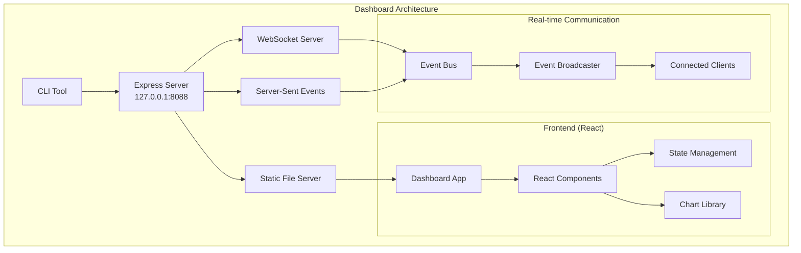
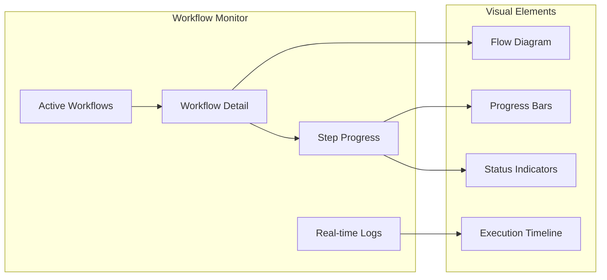
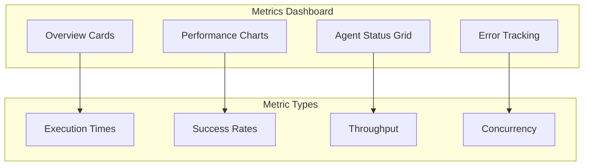
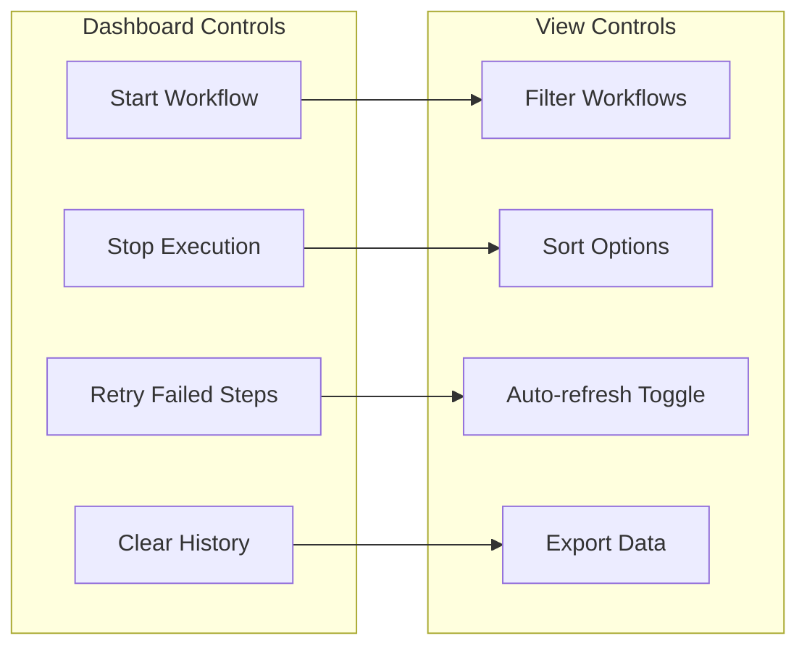

# Real-Time Dashboard Specification

This document defines the **real-time web dashboard** for @orchestr8 MVP, providing live monitoring and visualization of agent orchestration workflows.

> Created: 2025-01-17  
> Version: 1.0.0  
> Status: MVP Dashboard Framework

## Overview

The @orchestr8 MVP includes a **real-time web dashboard** accessible via browser at `http://127.0.0.1:8088` when the orchestration server is running. This provides immediate visual feedback and monitoring capabilities for agent workflows.

## Dashboard Architecture



## Technology Stack (Per ADR-016)

### Frontend Framework

- **React 18** with hooks and concurrent features
- **TypeScript** for type safety
- **Vite** for fast development and building
- **Tailwind CSS** for utility-first styling

### Real-time Communication

- **WebSocket** for bidirectional communication
- **Server-Sent Events (SSE)** as fallback
- **Reconnection logic** with exponential backoff

### Visualization Libraries

- **Recharts** for charts and metrics visualization
- **React Flow** for workflow diagram rendering
- **Lucide React** for icons

### State Management

- **Zustand** for lightweight state management
- **React Query** for server state synchronization

### Build and Development

- **Vite** build tool with hot module replacement
- **ESLint + Prettier** for code quality
- **PostCSS** for CSS processing

## Dashboard Features

### 1. Live Workflow Monitoring



**Features:**

- Live workflow execution visualization
- Step-by-step progress tracking
- Real-time log streaming
- Interactive workflow diagrams
- Execution timeline with durations

### 2. Agent Performance Metrics



**Metrics Displayed:**

- Active workflow count
- Agent execution times (P50, P95, P99)
- Success/failure rates
- Concurrent agent executions
- Error frequency and types
- System resource usage

### 3. Interactive Controls



**Interactive Elements:**

- Start new workflow executions
- Cancel running workflows
- Retry failed steps
- Filter and search workflows
- Export execution data
- Real-time/pause toggle

## Frontend Implementation

### Project Structure

```
dashboard/
├── src/
│   ├── components/
│   │   ├── WorkflowMonitor/
│   │   │   ├── WorkflowList.tsx
│   │   │   ├── WorkflowDetail.tsx
│   │   │   ├── StepProgress.tsx
│   │   │   └── FlowDiagram.tsx
│   │   ├── Metrics/
│   │   │   ├── MetricsOverview.tsx
│   │   │   ├── PerformanceCharts.tsx
│   │   │   └── AgentGrid.tsx
│   │   ├── Controls/
│   │   │   ├── WorkflowControls.tsx
│   │   │   └── ViewControls.tsx
│   │   └── Layout/
│   │       ├── Header.tsx
│   │       ├── Sidebar.tsx
│   │       └── MainContent.tsx
│   ├── hooks/
│   │   ├── useWebSocket.ts
│   │   ├── useWorkflows.ts
│   │   └── useMetrics.ts
│   ├── stores/
│   │   ├── workflowStore.ts
│   │   ├── metricsStore.ts
│   │   └── uiStore.ts
│   ├── types/
│   │   ├── workflow.ts
│   │   ├── metrics.ts
│   │   └── dashboard.ts
│   ├── utils/
│   │   ├── websocket.ts
│   │   ├── formatting.ts
│   │   └── constants.ts
│   ├── App.tsx
│   ├── main.tsx
│   └── index.html
├── public/
├── package.json
├── vite.config.ts
├── tailwind.config.js
└── tsconfig.json
```

### Core Components

#### Dashboard App Root

```typescript
// src/App.tsx
import React from 'react';
import { QueryClient, QueryClientProvider } from '@tanstack/react-query';
import { Header } from './components/Layout/Header';
import { Sidebar } from './components/Layout/Sidebar';
import { MainContent } from './components/Layout/MainContent';
import { useWebSocket } from './hooks/useWebSocket';
import { Toaster } from './components/ui/Toaster';

const queryClient = new QueryClient({
  defaultOptions: {
    queries: {
      refetchOnWindowFocus: false,
      retry: 1,
    },
  },
});

export function App() {
  const { connectionStatus } = useWebSocket();

  return (
    <QueryClientProvider client={queryClient}>
      <div className="min-h-screen bg-gray-50 dark:bg-gray-900">
        <Header connectionStatus={connectionStatus} />
        <div className="flex">
          <Sidebar />
          <MainContent />
        </div>
        <Toaster />
      </div>
    </QueryClientProvider>
  );
}
```

#### WebSocket Hook

```typescript
// src/hooks/useWebSocket.ts
import { useEffect, useRef, useState } from 'react'
import { useWorkflowStore } from '../stores/workflowStore'
import { useMetricsStore } from '../stores/metricsStore'

export interface WebSocketHook {
  connectionStatus: 'connecting' | 'connected' | 'disconnected' | 'error'
  send: (message: any) => void
  reconnect: () => void
}

export function useWebSocket(): WebSocketHook {
  const [connectionStatus, setConnectionStatus] =
    useState<WebSocketHook['connectionStatus']>('connecting')
  const wsRef = useRef<WebSocket | null>(null)
  const reconnectTimeoutRef = useRef<NodeJS.Timeout | null>(null)
  const reconnectAttempts = useRef(0)

  const { addWorkflowEvent, updateWorkflowStatus } = useWorkflowStore()
  const { updateMetrics } = useMetricsStore()

  const connect = () => {
    try {
      const ws = new WebSocket('ws://127.0.0.1:8088/ws')
      wsRef.current = ws

      ws.onopen = () => {
        setConnectionStatus('connected')
        reconnectAttempts.current = 0
        console.log('✓ WebSocket connected')
      }

      ws.onmessage = (event) => {
        try {
          const data = JSON.parse(event.data)
          handleWebSocketMessage(data)
        } catch (error) {
          console.error('Failed to parse WebSocket message:', error)
        }
      }

      ws.onclose = () => {
        setConnectionStatus('disconnected')
        scheduleReconnect()
      }

      ws.onerror = () => {
        setConnectionStatus('error')
        scheduleReconnect()
      }
    } catch (error) {
      setConnectionStatus('error')
      scheduleReconnect()
    }
  }

  const scheduleReconnect = () => {
    if (reconnectTimeoutRef.current) return

    const delay = Math.min(1000 * Math.pow(2, reconnectAttempts.current), 30000)
    reconnectAttempts.current++

    reconnectTimeoutRef.current = setTimeout(() => {
      reconnectTimeoutRef.current = null
      setConnectionStatus('connecting')
      connect()
    }, delay)
  }

  const handleWebSocketMessage = (data: any) => {
    switch (data.type) {
      case 'workflow.started':
      case 'workflow.completed':
      case 'workflow.failed':
        updateWorkflowStatus(data.workflowId, data.status, data.timestamp)
        break

      case 'step.started':
      case 'step.completed':
      case 'step.failed':
        addWorkflowEvent(data)
        break

      case 'metrics.update':
        updateMetrics(data.metrics)
        break

      case 'log.entry':
        // Handle real-time log entries
        break

      default:
        console.warn('Unknown WebSocket message type:', data.type)
    }
  }

  const send = (message: any) => {
    if (wsRef.current?.readyState === WebSocket.OPEN) {
      wsRef.current.send(JSON.stringify(message))
    } else {
      console.warn('WebSocket not connected, cannot send message')
    }
  }

  const reconnect = () => {
    if (reconnectTimeoutRef.current) {
      clearTimeout(reconnectTimeoutRef.current)
      reconnectTimeoutRef.current = null
    }
    reconnectAttempts.current = 0
    setConnectionStatus('connecting')
    connect()
  }

  useEffect(() => {
    connect()

    return () => {
      if (reconnectTimeoutRef.current) {
        clearTimeout(reconnectTimeoutRef.current)
      }
      if (wsRef.current) {
        wsRef.current.close()
      }
    }
  }, [])

  return { connectionStatus, send, reconnect }
}
```

#### Workflow Store (Zustand)

```typescript
// src/stores/workflowStore.ts
import { create } from 'zustand'
import { devtools } from 'zustand/middleware'

export interface WorkflowExecution {
  id: string
  workflowId: string
  status: 'pending' | 'running' | 'completed' | 'failed' | 'cancelled'
  startedAt: string
  completedAt?: string
  duration?: number
  steps: StepExecution[]
  metadata: {
    name: string
    description?: string
  }
}

export interface StepExecution {
  id: string
  name: string
  status:
    | 'pending'
    | 'running'
    | 'completed'
    | 'failed'
    | 'skipped'
    | 'cancelled'
  startedAt?: string
  completedAt?: string
  duration?: number
  agentId: string
  error?: string
  output?: any
}

export interface WorkflowEvent {
  type: string
  workflowId: string
  stepId?: string
  timestamp: string
  data: any
}

interface WorkflowStore {
  executions: WorkflowExecution[]
  selectedExecutionId: string | null
  events: WorkflowEvent[]

  // Actions
  addExecution: (execution: WorkflowExecution) => void
  updateWorkflowStatus: (
    id: string,
    status: WorkflowExecution['status'],
    timestamp: string,
  ) => void
  updateStepStatus: (
    workflowId: string,
    stepId: string,
    status: StepExecution['status'],
  ) => void
  addWorkflowEvent: (event: WorkflowEvent) => void
  selectExecution: (id: string | null) => void
  clearHistory: () => void

  // Selectors
  getExecutionById: (id: string) => WorkflowExecution | undefined
  getActiveExecutions: () => WorkflowExecution[]
  getRecentEvents: (limit?: number) => WorkflowEvent[]
}

export const useWorkflowStore = create<WorkflowStore>()(
  devtools(
    (set, get) => ({
      executions: [],
      selectedExecutionId: null,
      events: [],

      addExecution: (execution) =>
        set((state) => ({
          executions: [execution, ...state.executions].slice(0, 100), // Keep last 100
        })),

      updateWorkflowStatus: (id, status, timestamp) =>
        set((state) => ({
          executions: state.executions.map((exec) =>
            exec.id === id
              ? {
                  ...exec,
                  status,
                  completedAt: ['completed', 'failed', 'cancelled'].includes(
                    status,
                  )
                    ? timestamp
                    : exec.completedAt,
                  duration:
                    exec.startedAt &&
                    ['completed', 'failed', 'cancelled'].includes(status)
                      ? new Date(timestamp).getTime() -
                        new Date(exec.startedAt).getTime()
                      : exec.duration,
                }
              : exec,
          ),
        })),

      updateStepStatus: (workflowId, stepId, status) =>
        set((state) => ({
          executions: state.executions.map((exec) =>
            exec.workflowId === workflowId
              ? {
                  ...exec,
                  steps: exec.steps.map((step) =>
                    step.id === stepId ? { ...step, status } : step,
                  ),
                }
              : exec,
          ),
        })),

      addWorkflowEvent: (event) =>
        set((state) => ({
          events: [event, ...state.events].slice(0, 1000), // Keep last 1000 events
        })),

      selectExecution: (id) => set({ selectedExecutionId: id }),

      clearHistory: () =>
        set({ executions: [], events: [], selectedExecutionId: null }),

      getExecutionById: (id) => get().executions.find((exec) => exec.id === id),

      getActiveExecutions: () =>
        get().executions.filter((exec) =>
          ['pending', 'running'].includes(exec.status),
        ),

      getRecentEvents: (limit = 50) => get().events.slice(0, limit),
    }),
    { name: 'workflow-store' },
  ),
)
```

#### Workflow List Component

```typescript
// src/components/WorkflowMonitor/WorkflowList.tsx
import React from 'react';
import { Clock, CheckCircle, XCircle, AlertCircle, Play } from 'lucide-react';
import { useWorkflowStore } from '../../stores/workflowStore';
import { formatDuration, formatTimestamp } from '../../utils/formatting';

const statusIcons = {
  pending: <Clock className="h-4 w-4 text-yellow-500" />,
  running: <Play className="h-4 w-4 text-blue-500 animate-pulse" />,
  completed: <CheckCircle className="h-4 w-4 text-green-500" />,
  failed: <XCircle className="h-4 w-4 text-red-500" />,
  cancelled: <AlertCircle className="h-4 w-4 text-gray-500" />
};

const statusColors = {
  pending: 'bg-yellow-50 border-yellow-200 text-yellow-800',
  running: 'bg-blue-50 border-blue-200 text-blue-800',
  completed: 'bg-green-50 border-green-200 text-green-800',
  failed: 'bg-red-50 border-red-200 text-red-800',
  cancelled: 'bg-gray-50 border-gray-200 text-gray-800'
};

export function WorkflowList() {
  const { executions, selectedExecutionId, selectExecution } = useWorkflowStore();

  return (
    <div className="bg-white dark:bg-gray-800 rounded-lg shadow-sm border">
      <div className="p-4 border-b border-gray-200 dark:border-gray-700">
        <h2 className="text-lg font-semibold text-gray-900 dark:text-white">
          Workflow Executions
        </h2>
        <p className="text-sm text-gray-500 dark:text-gray-400">
          {executions.length} total executions
        </p>
      </div>

      <div className="divide-y divide-gray-200 dark:divide-gray-700 max-h-96 overflow-y-auto">
        {executions.length === 0 ? (
          <div className="p-8 text-center text-gray-500 dark:text-gray-400">
            <Clock className="h-12 w-12 mx-auto mb-3 opacity-50" />
            <p>No workflow executions yet</p>
            <p className="text-sm">Start a workflow to see it here</p>
          </div>
        ) : (
          executions.map((execution) => (
            <div
              key={execution.id}
              className={`p-4 cursor-pointer hover:bg-gray-50 dark:hover:bg-gray-700 transition-colors ${
                selectedExecutionId === execution.id ? 'bg-blue-50 dark:bg-blue-900/20' : ''
              }`}
              onClick={() => selectExecution(execution.id)}
            >
              <div className="flex items-start justify-between">
                <div className="flex-1">
                  <div className="flex items-center space-x-2">
                    {statusIcons[execution.status]}
                    <h3 className="font-medium text-gray-900 dark:text-white">
                      {execution.metadata.name}
                    </h3>
                    <span className={`px-2 py-1 text-xs rounded-full border ${statusColors[execution.status]}`}>
                      {execution.status}
                    </span>
                  </div>

                  <div className="mt-1 text-sm text-gray-500 dark:text-gray-400">
                    <p>Started: {formatTimestamp(execution.startedAt)}</p>
                    {execution.duration && (
                      <p>Duration: {formatDuration(execution.duration)}</p>
                    )}
                  </div>

                  <div className="mt-2 flex items-center space-x-4 text-xs text-gray-400">
                    <span>{execution.steps.length} steps</span>
                    <span>
                      {execution.steps.filter(s => s.status === 'completed').length} completed
                    </span>
                    {execution.steps.some(s => s.status === 'failed') && (
                      <span className="text-red-500">
                        {execution.steps.filter(s => s.status === 'failed').length} failed
                      </span>
                    )}
                  </div>
                </div>

                <div className="ml-4">
                  <div className="w-16 bg-gray-200 dark:bg-gray-600 rounded-full h-2">
                    <div
                      className={`h-2 rounded-full transition-all duration-300 ${
                        execution.status === 'completed' ? 'bg-green-500' :
                        execution.status === 'failed' ? 'bg-red-500' :
                        execution.status === 'running' ? 'bg-blue-500' :
                        'bg-gray-400'
                      }`}
                      style={{
                        width: `${(execution.steps.filter(s =>
                          ['completed', 'failed', 'skipped'].includes(s.status)
                        ).length / execution.steps.length) * 100}%`
                      }}
                    />
                  </div>
                </div>
              </div>
            </div>
          ))
        )}
      </div>
    </div>
  );
}
```

## Backend Integration

### WebSocket Event Broadcasting

```typescript
// Server-side WebSocket integration
import WebSocket from 'ws'
import { EventEmitter } from 'events'

export class DashboardBroadcaster extends EventEmitter {
  private wss: WebSocket.Server
  private clients = new Set<WebSocket>()

  constructor(server: any) {
    super()

    this.wss = new WebSocket.Server({
      server,
      path: '/ws',
    })

    this.wss.on('connection', (ws) => {
      this.clients.add(ws)
      console.log(`Dashboard client connected. Total: ${this.clients.size}`)

      // Send initial state
      this.sendToClient(ws, {
        type: 'connection.established',
        timestamp: new Date().toISOString(),
      })

      ws.on('close', () => {
        this.clients.delete(ws)
        console.log(
          `Dashboard client disconnected. Total: ${this.clients.size}`,
        )
      })

      ws.on('message', (data) => {
        try {
          const message = JSON.parse(data.toString())
          this.handleClientMessage(ws, message)
        } catch (error) {
          console.error('Invalid WebSocket message:', error)
        }
      })
    })
  }

  broadcast(event: any): void {
    const message = JSON.stringify({
      ...event,
      timestamp: new Date().toISOString(),
    })

    this.clients.forEach((client) => {
      if (client.readyState === WebSocket.OPEN) {
        client.send(message)
      }
    })
  }

  private sendToClient(client: WebSocket, event: any): void {
    if (client.readyState === WebSocket.OPEN) {
      client.send(JSON.stringify(event))
    }
  }

  private handleClientMessage(client: WebSocket, message: any): void {
    switch (message.type) {
      case 'ping':
        this.sendToClient(client, { type: 'pong' })
        break

      case 'subscribe':
        // Handle subscription requests
        break

      default:
        console.warn('Unknown client message type:', message.type)
    }
  }
}
```

### Express Route Integration

```typescript
// Dashboard route serving
import express from 'express'
import path from 'path'

export function setupDashboardRoutes(app: express.Express): void {
  // Serve dashboard static files
  const dashboardPath = path.join(__dirname, '../dashboard/dist')
  app.use('/dashboard', express.static(dashboardPath))

  // Dashboard root route - serve React app
  app.get('/', (req, res) => {
    res.sendFile(path.join(dashboardPath, 'index.html'))
  })

  // API routes for dashboard data
  app.get('/api/v1/dashboard/executions', (req, res) => {
    const executions = getRecentExecutions()
    res.json(executions)
  })

  app.get('/api/v1/dashboard/metrics', (req, res) => {
    const metrics = getCurrentMetrics()
    res.json(metrics)
  })

  app.get('/api/v1/dashboard/system', (req, res) => {
    const systemInfo = {
      version: process.env.npm_package_version,
      uptime: process.uptime(),
      memory: process.memoryUsage(),
      platform: process.platform,
      nodeVersion: process.version,
    }
    res.json(systemInfo)
  })
}
```

## Performance Considerations

### Frontend Optimization

- **Virtualized lists** for large workflow/event lists
- **Debounced updates** to prevent UI thrashing
- **Selective rendering** based on visible components
- **Lazy loading** for non-critical dashboard sections

### Backend Optimization

- **Event batching** to reduce WebSocket message frequency
- **Connection pooling** for WebSocket clients
- **Memory limits** on stored events/executions
- **Efficient serialization** for real-time data

### Real-time Updates

- **Heartbeat mechanism** for connection health
- **Automatic reconnection** with exponential backoff
- **Offline detection** and graceful degradation
- **Buffer management** for missed events

## Security Considerations

### Network Security

- Dashboard bound to `127.0.0.1:8088` only (localhost)
- No external network access required
- WebSocket secured with same-origin policy
- No authentication required for MVP (local-only)

### Data Privacy

- No sensitive data transmitted to dashboard
- Agent outputs filtered for PII
- Local storage only (no cloud transmission)
- Session-based data (cleared on restart)

## User Experience Features

### Responsive Design

- **Mobile-friendly** layout with touch interactions
- **Dark mode** support following system preferences
- **Keyboard shortcuts** for common actions
- **Accessibility** compliance (ARIA labels, keyboard navigation)

### Visual Feedback

- **Loading states** for async operations
- **Toast notifications** for important events
- **Smooth animations** for state transitions
- **Status indicators** with clear color coding

### Customization

- **Configurable refresh rates** for real-time updates
- **Filter presets** for common workflow queries
- **Dashboard layout** persistence in localStorage
- **Export functionality** for execution data

## Deployment and Build

### Development Setup

```bash
# Navigate to dashboard directory
cd dashboard/

# Install dependencies
npm install

# Start development server
npm run dev

# Build for production
npm run build

# Preview production build
npm run preview
```

### Production Build Integration

```typescript
// Build integration in main server
const isDevelopment = process.env.NODE_ENV === 'development'

if (isDevelopment) {
  // In development, proxy to Vite dev server
  const { createProxyMiddleware } = require('http-proxy-middleware')
  app.use(
    '/dashboard',
    createProxyMiddleware({
      target: 'http://localhost:5173',
      changeOrigin: true,
      pathRewrite: { '^/dashboard': '' },
    }),
  )
} else {
  // In production, serve built files
  setupDashboardRoutes(app)
}
```

### Package.json Configuration

```json
{
  "name": "@orchestr8/dashboard",
  "version": "1.0.0",
  "type": "module",
  "scripts": {
    "dev": "vite",
    "build": "tsc && vite build",
    "preview": "vite preview",
    "lint": "eslint src --ext .ts,.tsx",
    "type-check": "tsc --noEmit"
  },
  "dependencies": {
    "react": "^18.2.0",
    "react-dom": "^18.2.0",
    "@tanstack/react-query": "^5.0.0",
    "zustand": "^4.4.0",
    "recharts": "^2.8.0",
    "react-flow-renderer": "^10.3.17",
    "lucide-react": "^0.290.0"
  },
  "devDependencies": {
    "@types/react": "^18.2.0",
    "@types/react-dom": "^18.2.0",
    "@typescript-eslint/eslint-plugin": "^6.0.0",
    "@vitejs/plugin-react": "^4.0.0",
    "autoprefixer": "^10.4.0",
    "eslint": "^8.45.0",
    "postcss": "^8.4.0",
    "tailwindcss": "^3.3.0",
    "typescript": "^5.0.0",
    "vite": "^4.4.0"
  }
}
```

## Future Enhancements (Post-MVP)

### Advanced Features

- **Historical analytics** with trend analysis
- **Custom dashboard widgets** with drag-and-drop
- **Advanced filtering** with saved queries
- **Performance profiling** with flame graphs
- **Alerting system** with configurable thresholds

### Integration Features

- **Export to external monitoring** (Grafana, DataDog)
- **Webhook notifications** for workflow events
- **Slack/Discord integration** for team notifications
- **CSV/JSON export** for workflow data
- **REST API** for programmatic access

### Enterprise Features

- **User authentication** and role-based access
- **Multi-tenant support** with workspace isolation
- **Advanced security** with HTTPS and CSP
- **Audit logging** for compliance requirements
- **High availability** with load balancing

## Conclusion

This dashboard specification provides:

- ✅ **Real-time monitoring** of workflow executions
- ✅ **Interactive visualization** of agent orchestration
- ✅ **Performance metrics** and system health
- ✅ **Modern web technology** stack
- ✅ **Responsive design** for various devices
- ✅ **Local-only security** appropriate for MVP
- ✅ **Extensible architecture** for future features

The dashboard enhances the @orchestr8 MVP by providing immediate visual feedback and monitoring capabilities, making agent orchestration transparent and debuggable for developers.
