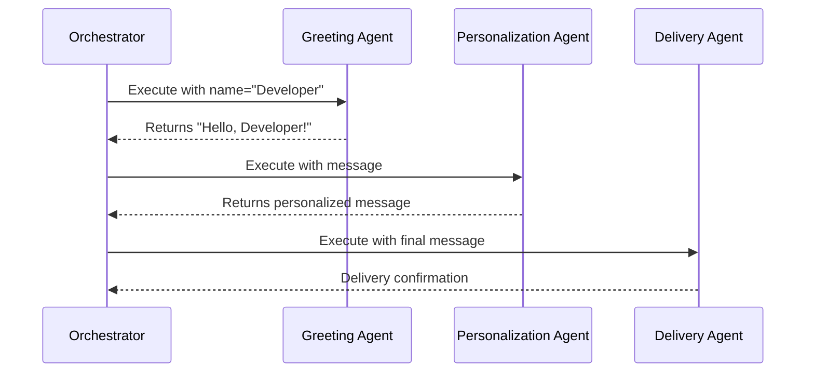
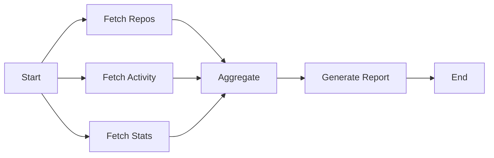
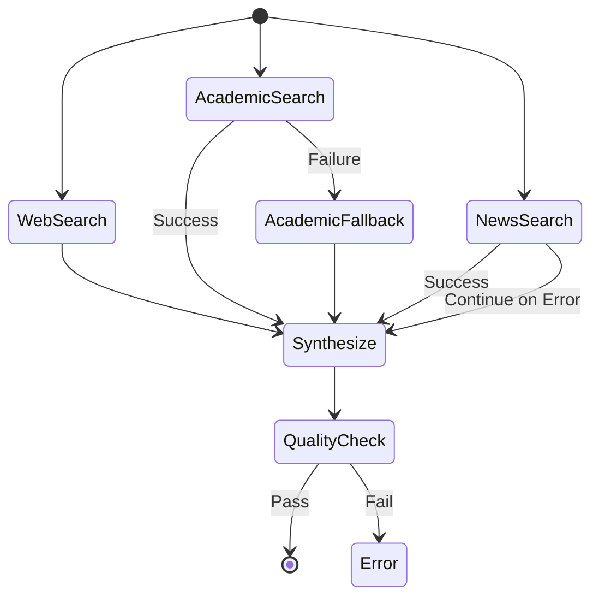

11# MVP Example Workflows

This document defines 3 concrete example workflows for the @orchestr8 MVP to demonstrate core capabilities.

> Created: 2025-01-17
> Version: 1.0.0
> Purpose: Validate MVP functionality with real-world examples

## Example 1: Hello World (Simple Sequential)

### Purpose

Demonstrate basic sequential agent execution with simple data flow.

### Workflow Definition

```json
{
  "version": "1.0.0",
  "metadata": {
    "id": "hello-world-example",
    "name": "Hello World Workflow",
    "description": "Simple sequential greeting workflow"
  },
  "context": {
    "variables": {
      "userName": "Developer",
      "language": "en"
    }
  },
  "steps": [
    {
      "id": "greeting",
      "name": "Generate Greeting",
      "agent": {
        "id": "@orchestr8/greeting-agent",
        "version": "1.0.0"
      },
      "input": {
        "mapping": {
          "name": "${variables.userName}",
          "language": "${variables.language}"
        }
      },
      "output": {
        "capture": ["message", "timestamp"]
      }
    },
    {
      "id": "personalize",
      "name": "Personalize Message",
      "agent": {
        "id": "@orchestr8/personalization-agent",
        "version": "1.0.0"
      },
      "dependencies": ["greeting"],
      "input": {
        "mapping": {
          "baseMessage": "${steps.greeting.output.message}",
          "userName": "${variables.userName}"
        }
      }
    },
    {
      "id": "deliver",
      "name": "Deliver Message",
      "agent": {
        "id": "@orchestr8/delivery-agent",
        "version": "1.0.0"
      },
      "dependencies": ["personalize"],
      "input": {
        "mapping": {
          "message": "${steps.personalize.output.personalizedMessage}",
          "timestamp": "${steps.greeting.output.timestamp}"
        }
      },
      "policies": {
        "timeout": 5000,
        "retry": {
          "maxAttempts": 2
        }
      }
    }
  ],
  "policies": {
    "timeout": {
      "global": 30000
    }
  }
}
```

### Expected Execution



### Test Validation

```typescript
describe('Hello World Workflow', () => {
  test('should execute sequentially', async () => {
    const result = await orchestrator.execute(helloWorldWorkflow)

    expect(result.success).toBe(true)
    expect(result.outputs.deliver.status).toBe('delivered')
    expect(result.duration).toBeLessThan(30000)
  })
})
```

## Example 2: Data Pipeline (Parallel Processing)

### Purpose

Demonstrate parallel agent execution with data aggregation.

### Workflow Definition

```json
{
  "version": "1.0.0",
  "metadata": {
    "id": "data-pipeline-example",
    "name": "Data Processing Pipeline",
    "description": "Parallel data extraction and processing"
  },
  "context": {
    "variables": {
      "dataSource": "github",
      "targetUser": "octocat",
      "dateRange": "30d"
    }
  },
  "steps": [
    {
      "id": "fetch-repos",
      "name": "Fetch Repositories",
      "agent": {
        "id": "@orchestr8/github-repos-agent",
        "version": "1.0.0"
      },
      "input": {
        "mapping": {
          "username": "${variables.targetUser}"
        }
      }
    },
    {
      "id": "fetch-activity",
      "name": "Fetch Activity",
      "agent": {
        "id": "@orchestr8/github-activity-agent",
        "version": "1.0.0"
      },
      "input": {
        "mapping": {
          "username": "${variables.targetUser}",
          "range": "${variables.dateRange}"
        }
      }
    },
    {
      "id": "fetch-stats",
      "name": "Fetch Statistics",
      "agent": {
        "id": "@orchestr8/github-stats-agent",
        "version": "1.0.0"
      },
      "input": {
        "mapping": {
          "username": "${variables.targetUser}"
        }
      }
    },
    {
      "id": "aggregate",
      "name": "Aggregate Data",
      "agent": {
        "id": "@orchestr8/aggregation-agent",
        "version": "1.0.0"
      },
      "dependencies": ["fetch-repos", "fetch-activity", "fetch-stats"],
      "input": {
        "mapping": {
          "repositories": "${steps.fetch-repos.output}",
          "activity": "${steps.fetch-activity.output}",
          "statistics": "${steps.fetch-stats.output}"
        }
      }
    },
    {
      "id": "generate-report",
      "name": "Generate Report",
      "agent": {
        "id": "@orchestr8/report-agent",
        "version": "1.0.0"
      },
      "dependencies": ["aggregate"],
      "input": {
        "mapping": {
          "data": "${steps.aggregate.output}",
          "format": "markdown"
        }
      }
    }
  ],
  "policies": {
    "timeout": {
      "global": 60000,
      "perStep": 15000
    },
    "resilience": {
      "circuitBreaker": {
        "failureThreshold": 3,
        "resetTimeout": 30000
      }
    }
  }
}
```

### Expected Execution



### Performance Requirements

- Parallel fetch steps complete within 15 seconds
- Total execution under 60 seconds
- Circuit breaker prevents cascading failures
- Partial data aggregation on individual fetch failures

## Example 3: Multi-Agent Research (Complex Orchestration)

### Purpose

Demonstrate complex orchestration with conditional execution, error handling, and fallbacks.

### Workflow Definition

```json
{
  "version": "1.0.0",
  "metadata": {
    "id": "multi-agent-research",
    "name": "Comprehensive Research Workflow",
    "description": "Multi-source research with fallback strategies"
  },
  "context": {
    "variables": {
      "researchTopic": "quantum computing",
      "depth": "comprehensive",
      "sources": ["web", "academic", "news"]
    },
    "secretRefs": ["secret://openai/api-key", "secret://tavily/api-key"]
  },
  "steps": [
    {
      "id": "web-search",
      "name": "Web Search",
      "agent": {
        "id": "@orchestr8/web-search-agent",
        "version": "1.0.0",
        "config": {
          "provider": "tavily",
          "maxResults": 10
        }
      },
      "input": {
        "mapping": {
          "query": "${variables.researchTopic}",
          "depth": "${variables.depth}"
        }
      },
      "policies": {
        "timeout": 10000,
        "retry": {
          "maxAttempts": 2,
          "backoff": "exponential"
        }
      },
      "onError": "continue"
    },
    {
      "id": "academic-search",
      "name": "Academic Search",
      "agent": {
        "id": "@orchestr8/academic-agent",
        "version": "1.0.0"
      },
      "input": {
        "mapping": {
          "topic": "${variables.researchTopic}",
          "yearRange": "2020-2024"
        }
      },
      "condition": {
        "expression": "variables.sources",
        "operator": "contains",
        "value": "academic"
      },
      "onError": "fallback",
      "fallbackStepId": "academic-fallback"
    },
    {
      "id": "academic-fallback",
      "name": "Academic Fallback (ArXiv)",
      "agent": {
        "id": "@orchestr8/arxiv-agent",
        "version": "1.0.0"
      },
      "input": {
        "mapping": {
          "query": "${variables.researchTopic}"
        }
      },
      "dependencies": [],
      "condition": {
        "expression": "steps.academic-search.status",
        "operator": "equals",
        "value": "failed"
      }
    },
    {
      "id": "news-search",
      "name": "News Search",
      "agent": {
        "id": "@orchestr8/news-agent",
        "version": "1.0.0"
      },
      "input": {
        "mapping": {
          "topic": "${variables.researchTopic}",
          "recency": "7d"
        }
      },
      "condition": {
        "expression": "variables.sources",
        "operator": "contains",
        "value": "news"
      },
      "onError": "continue"
    },
    {
      "id": "synthesize",
      "name": "Synthesize Research",
      "agent": {
        "id": "@orchestr8/synthesis-agent",
        "version": "1.0.0",
        "config": {
          "model": "claude-3-sonnet",
          "temperature": 0.7
        }
      },
      "dependencies": ["web-search"],
      "input": {
        "mapping": {
          "webResults": "${steps.web-search.output}",
          "academicResults": "${steps.academic-search.output || steps.academic-fallback.output || []}",
          "newsResults": "${steps.news-search.output || []}",
          "topic": "${variables.researchTopic}"
        }
      },
      "policies": {
        "timeout": 20000
      }
    },
    {
      "id": "quality-check",
      "name": "Quality Assurance",
      "agent": {
        "id": "@orchestr8/qa-agent",
        "version": "1.0.0"
      },
      "dependencies": ["synthesize"],
      "input": {
        "mapping": {
          "content": "${steps.synthesize.output}",
          "criteria": {
            "minSources": 3,
            "requiredSections": ["summary", "findings", "references"]
          }
        }
      }
    }
  ],
  "policies": {
    "timeout": {
      "global": 120000
    },
    "resilience": {
      "circuitBreaker": {
        "failureThreshold": 5,
        "resetTimeout": 60000,
        "halfOpenRequests": 2
      },
      "retry": {
        "maxAttempts": 3,
        "baseDelay": 1000,
        "maxDelay": 10000
      }
    },
    "cancellation": {
      "graceful": true,
      "timeout": 5000
    }
  }
}
```

### Execution Flow



### Error Handling Demonstration

```typescript
describe('Multi-Agent Research', () => {
  test('should handle partial failures gracefully', async () => {
    // Mock academic-search to fail
    mockAgent('@orchestr8/academic-agent', () => {
      throw new Error('Service unavailable')
    })

    const result = await orchestrator.execute(researchWorkflow)

    // Should still succeed with fallback
    expect(result.success).toBe(true)
    expect(result.outputs.synthesize).toBeDefined()

    // Should have used fallback
    expect(result.journal).toContain({
      step: 'academic-fallback',
      status: 'completed',
    })
  })

  test('should respect circuit breaker', async () => {
    // Trigger multiple failures
    for (let i = 0; i < 5; i++) {
      await orchestrator.execute(failingWorkflow)
    }

    // Circuit should be open
    const result = await orchestrator.execute(researchWorkflow)
    expect(result.errors).toContain({
      type: 'CircuitBreakerOpen',
    })
  })
})
```

## Validation Criteria

Each example workflow must demonstrate:

### Example 1 (Hello World)

- ✅ Basic sequential execution
- ✅ Simple data passing between steps
- ✅ Basic timeout and retry policies
- ✅ Under 30 second execution

### Example 2 (Data Pipeline)

- ✅ Parallel execution of independent steps
- ✅ Data aggregation from multiple sources
- ✅ Circuit breaker activation on failures
- ✅ Under 60 second execution

### Example 3 (Multi-Agent Research)

- ✅ Conditional step execution
- ✅ Fallback handling
- ✅ Error recovery strategies
- ✅ Complex data synthesis
- ✅ Under 120 second execution

## Performance Benchmarks

```typescript
const benchmarks = {
  helloWorld: {
    p50: 500, // ms
    p95: 1000, // ms
    p99: 2000, // ms
  },
  dataPipeline: {
    p50: 5000, // ms
    p95: 10000, // ms
    p99: 15000, // ms
  },
  multiAgentResearch: {
    p50: 20000, // ms
    p95: 40000, // ms
    p99: 60000, // ms
  },
}
```

## Usage in Testing

```bash
# Run example workflows
orchestr8 run examples/hello-world.json
orchestr8 run examples/data-pipeline.json
orchestr8 run examples/multi-agent-research.json

# Validate examples
orchestr8 test --examples

# Benchmark examples
orchestr8 benchmark --workflow examples/*.json
```

## Documentation Integration

These examples will be featured in:

1. **Getting Started Guide** - Hello World as first example
2. **Parallel Execution Tutorial** - Data Pipeline demonstration
3. **Advanced Orchestration Guide** - Multi-Agent Research patterns
4. **Performance Documentation** - Benchmark results
5. **API Reference** - Code snippets from examples
