# Execution Semantics Specification

This document defines the **deterministic execution model** for @orchestr8, specifying how workflows execute, handle failures, and maintain consistency.

> Created: 2025-01-17  
> Version: 1.0.0  
> Status: MVP Execution Model

## Overview

The execution semantics define **predictable, deterministic behavior** for agent orchestration, ensuring workflows execute consistently across environments and can be debugged effectively.

## Execution State Machine

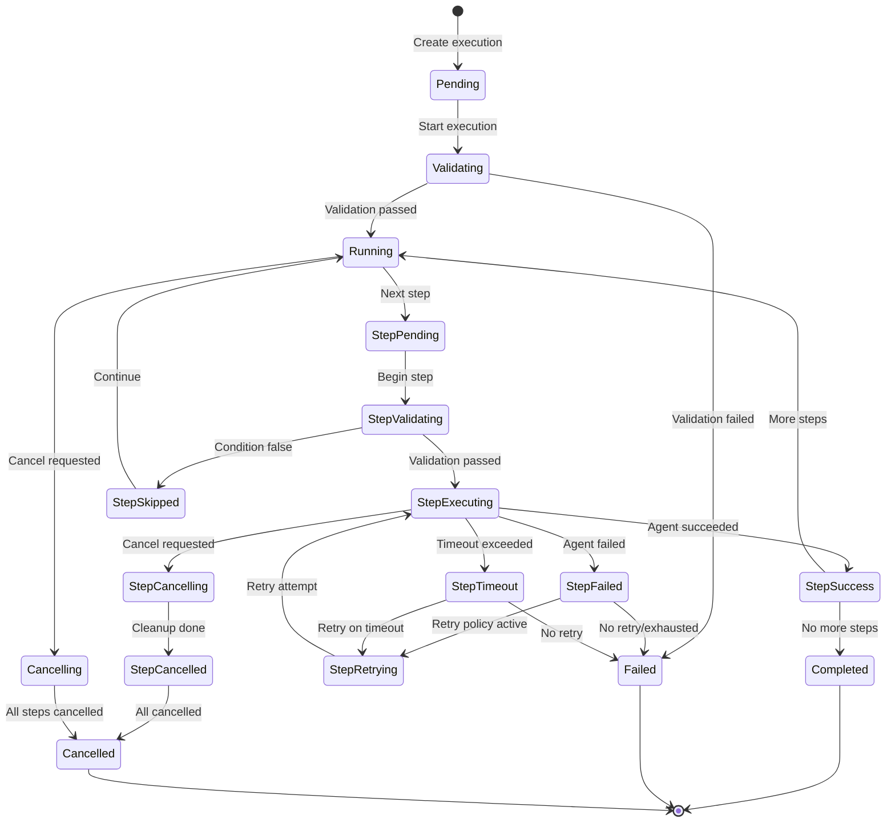

## Step Execution Flow

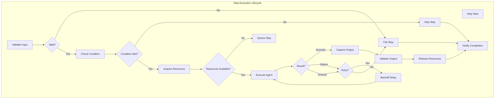

## Deterministic Execution Rules

### 1. Step Boundaries

Steps are **atomic units** with clear boundaries:

```typescript
interface StepBoundary {
  // Entry boundary
  preConditions: {
    inputValidation: boolean
    dependenciesMet: boolean
    resourcesAvailable: boolean
  }

  // Exit boundary
  postConditions: {
    outputValidated: boolean
    stateUpdated: boolean
    resourcesReleased: boolean
  }

  // Invariants
  invariants: {
    idempotencyMaintained: boolean
    sideEffectsRecorded: boolean
  }
}
```

### 2. Execution Order

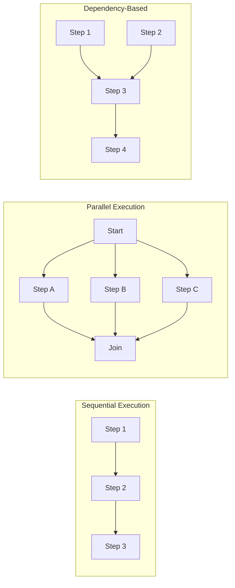

**Rules:**

1. **Sequential**: Steps execute in array order, each waiting for previous
2. **Parallel**: Steps without dependencies execute simultaneously
3. **Dependency-based**: Steps wait for all dependencies before starting
4. **Deterministic scheduling**: Same input always produces same execution order

### 3. Data Flow

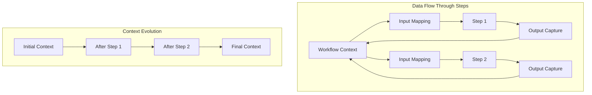

**Data Flow Rules:**

```typescript
interface DataFlowRules {
  // Input mapping
  inputMapping: {
    source: 'context' | 'previousStep' | 'literal'
    transform?: JMESPathExpression
    validation: JSONSchema
  }

  // Output capture
  outputCapture: {
    destination: string // Context path
    transform?: JMESPathExpression
    merge: 'replace' | 'merge' | 'append'
  }

  // Isolation
  isolation: {
    readOnly: string[] // Context paths that cannot be modified
    private: string[] // Step-local variables
  }
}
```

## Failure Handling

### Failure Modes

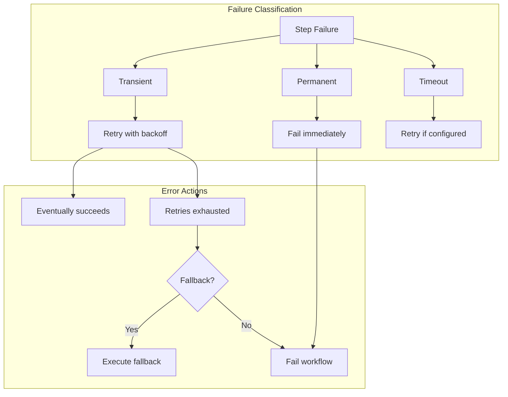

### Error Classification

```typescript
export class ErrorClassifier {
  private readonly transientErrors = new Set([
    'ECONNREFUSED',
    'ETIMEDOUT',
    'ENOTFOUND',
    'NetworkError',
    'TimeoutError',
    'ServiceUnavailable',
    'TooManyRequests',
  ])

  private readonly permanentErrors = new Set([
    'ValidationError',
    'AuthenticationError',
    'AuthorizationError',
    'NotFoundError',
    'ConflictError',
    'BadRequest',
  ])

  classify(error: Error): ErrorClassification {
    // Check error type
    if (this.transientErrors.has(error.name)) {
      return { type: 'transient', retryable: true }
    }

    if (this.permanentErrors.has(error.name)) {
      return { type: 'permanent', retryable: false }
    }

    // Check HTTP status codes
    if ('statusCode' in error) {
      const status = (error as any).statusCode
      if (status >= 500) return { type: 'transient', retryable: true }
      if (status === 429) return { type: 'transient', retryable: true }
      if (status >= 400 && status < 500)
        return { type: 'permanent', retryable: false }
    }

    // Default: treat as transient
    return { type: 'transient', retryable: true }
  }
}
```

## Cancellation Semantics (Per ADR-019)

### Precise Cancellation Contract

**ADR-019 Cancellation Semantics:**

- **Grace Period**: Exactly 5 seconds for cooperative cleanup
- **Force Termination**: After grace period expires
- **Signal Propagation**: All BaseAgent.execute() methods MUST accept AbortSignal
- **Recording**: Steps record "Cancelled" state in execution journal
- **Cleanup Guarantee**: Resources released even during forced termination

### Cooperative Cancellation with AbortSignal

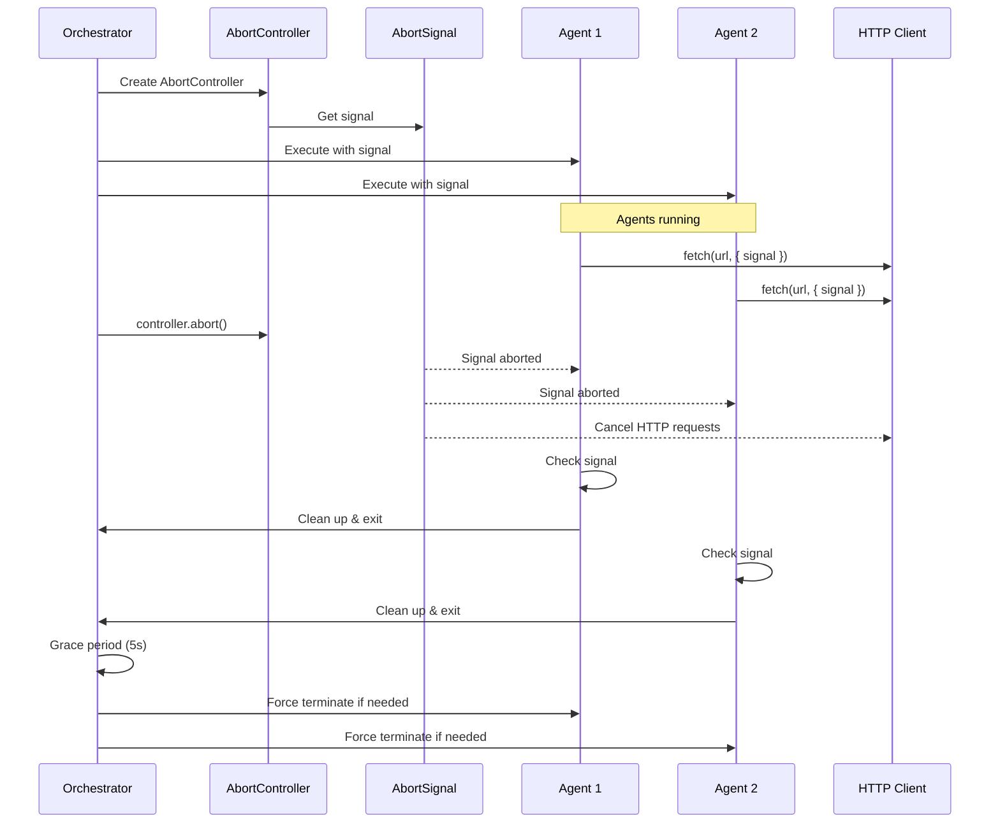

### HTTP Headers and Payload Limits (Per ADR-003, ADR-015)

```typescript
// HTTP execution context with proper headers and limits
export interface HTTPExecutionContext {
  maxPayloadSize: number // 1MB for sync, 10MB for async
  headers: {
    'Content-Type': 'application/json'
    ETag?: string
    'Cache-Control': 'max-age=0, must-revalidate'
    Location?: string
    'Retry-After'?: string
    'Idempotency-Key'?: string
  }
  timeout: number // 30s for sync, unlimited for async
}

// Payload size validation
export class PayloadValidator {
  private readonly SYNC_MAX_SIZE = 1024 * 1024 // 1MB
  private readonly ASYNC_MAX_SIZE = 10 * 1024 * 1024 // 10MB
  private readonly JOURNAL_MAX_SIZE = 10 * 1024 * 1024 // 10MB

  validatePayload(payload: any, mode: 'sync' | 'async' | 'journal'): void {
    const size = JSON.stringify(payload).length
    const maxSize = this.getMaxSize(mode)

    if (size > maxSize) {
      throw new Error(
        `Payload size ${size} exceeds maximum ${maxSize} bytes for ${mode} mode`,
      )
    }
  }

  private getMaxSize(mode: 'sync' | 'async' | 'journal'): number {
    switch (mode) {
      case 'sync':
        return this.SYNC_MAX_SIZE
      case 'async':
        return this.ASYNC_MAX_SIZE
      case 'journal':
        return this.JOURNAL_MAX_SIZE
      default:
        return this.ASYNC_MAX_SIZE
    }
  }
}

// HTTP headers management
export class HTTPHeaderManager {
  generateETag(content: any): string {
    const hash = crypto.createHash('sha256')
    hash.update(JSON.stringify(content))
    return `"${hash.digest('hex').substring(0, 16)}"`
  }

  generateLocationHeader(executionId: string): string {
    return `/v1/executions/${executionId}`
  }

  calculateRetryAfter(attempt: number): string {
    // Exponential backoff: 5, 10, 20 seconds
    const delay = Math.min(5 * Math.pow(2, attempt), 60)
    return delay.toString()
  }

  setExecutionHeaders(
    response: any,
    executionId: string,
    status: string,
    content?: any,
  ): void {
    response.setHeader('Location', this.generateLocationHeader(executionId))

    if (content) {
      response.setHeader('ETag', this.generateETag(content))
      response.setHeader('Cache-Control', 'max-age=0, must-revalidate')
    }

    if (status === 'running') {
      response.setHeader('Retry-After', '5')
    }

    if (status === 'failed') {
      response.setHeader('Retry-After', '10')
    }
  }
}
```

### AbortSignal-Based Cancellation

```typescript
// Use native AbortSignal for cancellation propagation
export class CancellationManager {
  private controller = new AbortController()

  get signal(): AbortSignal {
    return this.controller.signal
  }

  cancel(reason?: string): void {
    this.controller.abort(reason)
  }

  // Create linked cancellation for child operations
  createLinked(parentSignal?: AbortSignal): AbortController {
    const childController = new AbortController()

    // Link to parent if provided
    if (parentSignal) {
      if (parentSignal.aborted) {
        childController.abort(parentSignal.reason)
      } else {
        parentSignal.addEventListener('abort', () => {
          childController.abort(parentSignal.reason)
        })
      }
    }

    return childController
  }
}

// Agent implementation with proper cancellation
export class BaseAgent {
  async execute(input: any, signal: AbortSignal): Promise<any> {
    // Check if already cancelled
    if (signal.aborted) {
      throw new DOMException('Operation cancelled', 'AbortError')
    }

    // Create timeout signal
    const timeoutSignal = AbortSignal.timeout(30000)

    // Combine signals
    const combinedSignal = AbortSignal.any([signal, timeoutSignal])

    try {
      return await this.performWork(input, combinedSignal)
    } finally {
      // Cleanup resources even on cancellation
      await this.cleanup()
    }
  }

  private async performWork(input: any, signal: AbortSignal): Promise<any> {
    // Use signal with fetch
    const response = await fetch(this.endpoint, {
      method: 'POST',
      body: JSON.stringify(input),
      signal, // Automatically cancels HTTP request
    })

    // Check cancellation between operations
    if (signal.aborted) {
      throw new DOMException('Operation cancelled', 'AbortError')
    }

    return await response.json()
  }

  private async cleanup(): Promise<void> {
    // Always release resources
    // This runs even if cancelled
  }
}
```

## Idempotency Requirements (Per ADR-019)

### Precise Idempotency Contract

**ADR-019 Idempotency Semantics:**

- **TTL**: Exactly 10 minutes (600 seconds) for idempotency cache
- **Key Format**: Alphanumeric and hyphens only, 1-255 characters
- **Error Caching**: Failed executions are NOT cached (retry allowed)
- **Success Caching**: Only successful executions cached and returned
- **Cleanup**: Expired entries removed automatically every 60 seconds

### Idempotency Token Flow

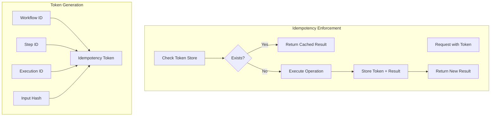

### Idempotency Implementation

```typescript
export class IdempotencyManager {
  private store: Map<string, IdempotentResult> = new Map()
  private readonly ttlMs = 10 * 60 * 1000 // 10 minutes per ADR-019

  constructor() {
    // Start cleanup timer - removes expired entries every 60 seconds
    setInterval(() => this.cleanup(), 60000)
  }

  async executeIdempotent<T>(
    token: string,
    operation: () => Promise<T>,
  ): Promise<T> {
    // Check for existing result
    const existing = this.store.get(token)
    if (existing && !this.isExpired(existing)) {
      return existing.result as T
    }

    // Execute operation
    try {
      const result = await operation()

      // Store only successful results (per ADR-019)
      this.store.set(token, {
        result,
        timestamp: Date.now(),
        ttl: this.ttlMs,
      })

      return result
    } catch (error) {
      // Don't cache errors per ADR-019
      throw error
    }
  }

  generateToken(components: IdempotencyComponents): string {
    const data = JSON.stringify({
      workflowId: components.workflowId,
      stepId: components.stepId,
      executionId: components.executionId,
      inputHash: this.hashInput(components.input),
    })

    return crypto.createHash('sha256').update(data).digest('hex')
  }

  private hashInput(input: any): string {
    const normalized = this.normalizeInput(input)
    return crypto
      .createHash('sha256')
      .update(JSON.stringify(normalized))
      .digest('hex')
  }

  private isExpired(record: IdempotentResult): boolean {
    return Date.now() - record.timestamp > record.ttl
  }

  private cleanup(): void {
    // Remove expired entries (per ADR-019)
    for (const [key, record] of this.store.entries()) {
      if (this.isExpired(record)) {
        this.store.delete(key)
      }
    }
  }

  validateKey(key: string): boolean {
    // ADR-019 key format: alphanumeric and hyphens only, 1-255 characters
    if (key.length < 1 || key.length > 255) {
      return false
    }
    return /^[a-zA-Z0-9-]+$/.test(key)
  }
}
```

## Resource Management

### Resource Acquisition and Release

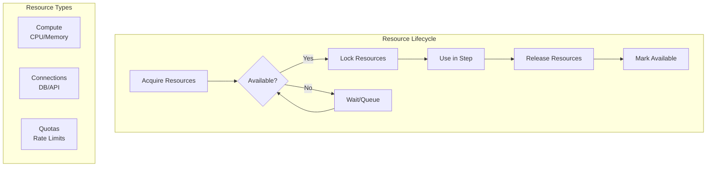

### Resource Manager

```typescript
export class ResourceManager {
  private resources: Map<string, Resource> = new Map()
  private allocations: Map<string, Allocation> = new Map()

  async acquire(
    stepId: string,
    requirements: ResourceRequirements,
  ): Promise<ResourceHandle> {
    const handle = crypto.randomUUID()

    // Wait for resources to be available
    await this.waitForAvailability(requirements)

    // Acquire resources atomically
    const allocation = this.allocateResources(requirements)
    this.allocations.set(handle, {
      stepId,
      resources: allocation,
      acquiredAt: Date.now(),
    })

    return {
      handle,
      release: async () => this.release(handle),
    }
  }

  async release(handle: string): Promise<void> {
    const allocation = this.allocations.get(handle)
    if (!allocation) return

    // Release resources
    allocation.resources.forEach((resource) => {
      resource.release()
    })

    this.allocations.delete(handle)

    // Notify waiting steps
    this.notifyWaiters()
  }

  // Automatic cleanup on step failure/timeout
  async cleanup(stepId: string): Promise<void> {
    for (const [handle, allocation] of this.allocations) {
      if (allocation.stepId === stepId) {
        await this.release(handle)
      }
    }
  }
}
```

## Execution Context

### Context Structure

```typescript
export interface ExecutionContext {
  // Immutable metadata
  readonly execution: {
    id: string
    workflowId: string
    startedAt: Date
    correlationId: string
  }

  // Mutable state
  variables: Record<string, any>

  // Step results
  steps: Map<string, StepResult>

  // Secrets (never logged)
  secrets: SecretStore

  // Cancellation
  cancellationToken: CancellationToken

  // Resource management
  resources: ResourceManager
}

export interface StepResult {
  stepId: string
  status: 'success' | 'failure' | 'skipped' | 'cancelled'
  output?: any
  error?: Error
  startedAt: Date
  completedAt: Date
  attempts: number
  duration: number
}
```

### Context Propagation

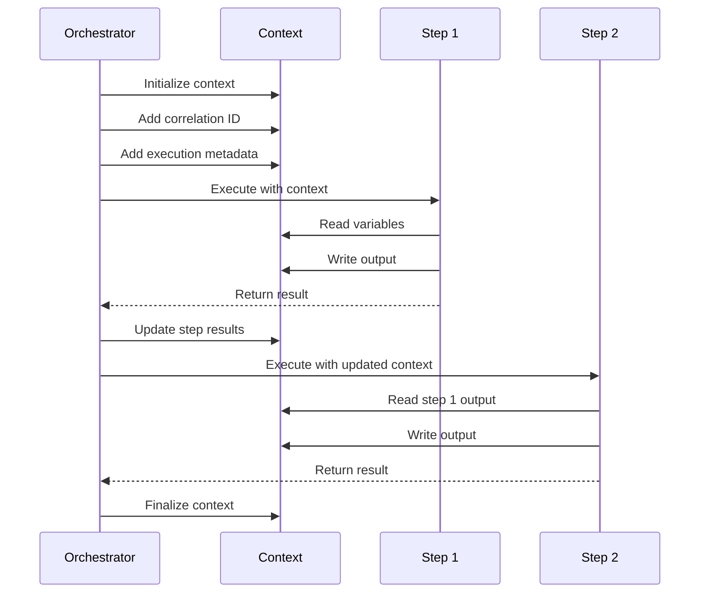

## Concurrency Control (Per ADR-019)

### Precise Scheduling Contract

**ADR-019 Scheduling Semantics:**

- **Global Concurrency**: Default 10, configurable via workflow policy
- **Fair Scheduling**: Ready queue with FIFO ordering for fairness
- **Topological Ordering**: Dependencies enforced strictly before execution
- **No Starvation**: Fair queue prevents any step from waiting indefinitely
- **Resource Awareness**: Scheduler considers resource requirements

### Parallel Execution Limits

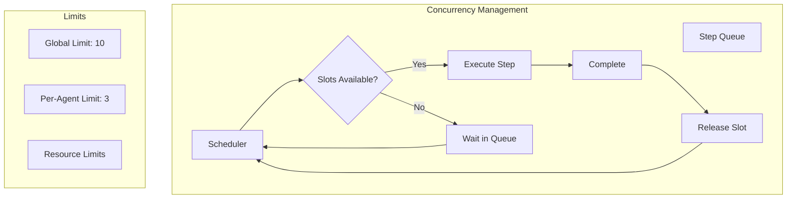

### Fair Scheduler Implementation (Per ADR-019)

```typescript
// Simple priority queue implementation for the scheduler
class PriorityQueue<T extends { priority?: number; queuedAt: number }> {
  private items: T[] = []

  enqueue(item: T, priority?: number): void {
    // Store priority in the item if provided
    if (priority !== undefined) {
      item.priority = priority
    }
    this.items.push(item)
    this.items.sort((a, b) => {
      // Higher priority first (lower number = higher priority)
      if (a.priority !== b.priority) {
        return (a.priority ?? 0) - (b.priority ?? 0)
      }
      // FIFO within same priority
      return a.queuedAt - b.queuedAt
    })
  }

  dequeue(): T | undefined {
    return this.items.shift()
  }

  peek(): T | undefined {
    return this.items[0]
  }

  get size(): number {
    return this.items.length
  }

  remove(predicate: (item: T) => boolean): T | undefined {
    const index = this.items.findIndex(predicate)
    if (index !== -1) {
      return this.items.splice(index, 1)[0]
    }
    return undefined
  }

  filter(predicate: (item: T) => boolean): T[] {
    return this.items.filter(predicate)
  }

  drain(): T[] {
    const allItems = [...this.items]
    this.items = []
    return allItems
  }
}

export class FairScheduler {
  private globalLimit: number = 10
  private readyQueue: PriorityQueue<ScheduledTask> = new PriorityQueue()
  private runningTasks = new Set<string>()
  private completedTasks = new Set<string>() // Track completed tasks
  private dependencies = new Map<string, Set<string>>()
  private perAgentLimits = new Map<string, number>() // Per-agent concurrency limits
  private runningPerAgent = new Map<string, number>() // Track per-agent running count

  constructor(maxConcurrency: number = 10) {
    this.globalLimit = maxConcurrency
  }

  async schedule<T>(
    taskId: string,
    operation: (signal: AbortSignal) => Promise<T>,
    dependencies: string[] = [],
    signal?: AbortSignal,
  ): Promise<T> {
    // Register dependencies for topological ordering (ADR-019)
    this.dependencies.set(taskId, new Set(dependencies))

    return new Promise((resolve, reject) => {
      const task: ScheduledTask = {
        id: taskId,
        operation,
        dependencies: new Set(dependencies),
        resolve,
        reject,
        signal,
        queuedAt: Date.now(), // For fair FIFO ordering
      }

      this.enqueue(task)
      this.processQueue()
    })
  }

  private enqueue(task: ScheduledTask): void {
    // Fair scheduling: prioritize by queue time (FIFO)
    const priority = -task.queuedAt // Negative for min-heap behavior
    this.readyQueue.enqueue(task, priority)
  }

  private async processQueue(): Promise<void> {
    while (
      this.readyQueue.size() > 0 &&
      this.runningTasks.size < this.globalLimit
    ) {
      const task = this.findNextReadyTask()
      if (!task) break // No tasks with satisfied dependencies

      this.runningTasks.add(task.id)
      this.runTask(task)
    }
  }

  private findNextReadyTask(): ScheduledTask | null {
    // Find task with all dependencies satisfied (topological ordering)
    const tasks = this.readyQueue.drain()
    let readyTask: ScheduledTask | null = null
    const remainingTasks: ScheduledTask[] = []

    for (const task of tasks) {
      if (this.areDependenciesCompleted(task.dependencies)) {
        readyTask = task
        break // Take first ready task (maintains FIFO fairness)
      }
      remainingTasks.push(task)
    }

    // Re-enqueue remaining tasks
    remainingTasks.forEach((task) => this.enqueue(task))

    return readyTask
  }

  private areDependenciesCompleted(dependencies: Set<string>): boolean {
    // Check that all dependencies are in completedTasks, not just "not running"
    return Array.from(dependencies).every((dep) => this.completedTasks.has(dep))
  }

  private async runTask(task: ScheduledTask): Promise<void> {
    try {
      const result = await task.operation(
        task.signal || new AbortController().signal,
      )
      task.resolve(result)
      this.completedTasks.add(task.id) // Mark as completed on success
    } catch (error) {
      task.reject(error)
      // Note: Failed tasks are NOT added to completedTasks
    } finally {
      this.runningTasks.delete(task.id)
      this.dependencies.delete(task.id) // Cleanup

      // Update per-agent counts if applicable
      if (task.agentId) {
        const current = this.runningPerAgent.get(task.agentId) || 0
        this.runningPerAgent.set(task.agentId, Math.max(0, current - 1))
      }

      this.processQueue() // Process next tasks
    }
  }
}

interface ScheduledTask {
  id: string
  agentId?: string // For per-agent concurrency limits
  operation: (signal: AbortSignal) => Promise<any>
  dependencies: Set<string>
  resolve: (value: any) => void
  reject: (error: Error) => void
  signal?: AbortSignal
  queuedAt: number // For fair scheduling (FIFO within priority)
  priority?: number // Optional priority level
}
```

## Observability Hooks

### Execution Events

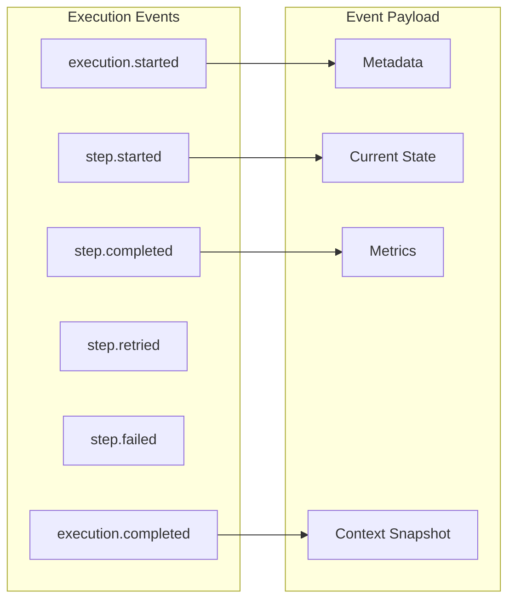

### Event Emitter

```typescript
export class ExecutionEventEmitter extends EventEmitter {
  emitExecutionStarted(context: ExecutionContext): void {
    this.emit('execution.started', {
      executionId: context.execution.id,
      workflowId: context.execution.workflowId,
      correlationId: context.execution.correlationId,
      timestamp: new Date(),
    })
  }

  emitStepStarted(step: WorkflowStep, context: ExecutionContext): void {
    this.emit('step.started', {
      executionId: context.execution.id,
      stepId: step.id,
      agentId: step.agent.id,
      dependencies: step.dependencies,
      timestamp: new Date(),
    })
  }

  emitStepCompleted(
    step: WorkflowStep,
    result: StepResult,
    context: ExecutionContext,
  ): void {
    this.emit('step.completed', {
      executionId: context.execution.id,
      stepId: step.id,
      status: result.status,
      duration: result.duration,
      attempts: result.attempts,
      timestamp: new Date(),
    })
  }

  // Hook for metrics collection
  onStepCompleted(handler: (event: StepCompletedEvent) => void): void {
    this.on('step.completed', handler)
  }
}
```

## Performance Guarantees

### Execution Overhead

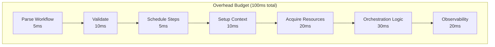

### Performance Targets

| Operation                    | Target (p50) | Target (p95) | Target (p99) |
| ---------------------------- | ------------ | ------------ | ------------ |
| Workflow parsing             | 5ms          | 10ms         | 20ms         |
| Step scheduling              | 5ms          | 10ms         | 15ms         |
| Context setup                | 10ms         | 20ms         | 30ms         |
| Resource acquisition         | 20ms         | 50ms         | 100ms        |
| Total orchestration overhead | 50ms         | 100ms        | 150ms        |

## Conclusion

These execution semantics provide:

- ✅ **Deterministic behavior** across all executions
- ✅ **Clear failure handling** with classification and retry
- ✅ **Cooperative cancellation** with graceful shutdown
- ✅ **Idempotency guarantees** for safe retries
- ✅ **Resource management** with proper cleanup
- ✅ **Observable execution** with comprehensive events

The model prioritizes **predictability and debuggability** while maintaining performance targets suitable for production use.
