# Lean MVP Specification - @orchestr8 Agent Orchestration System

This document defines the **realistic 4-week MVP scope** for @orchestr8, focusing on delivering core value with minimal complexity.

> Created: 2025-01-17  
> Version: 1.0.0  
> Timeline: 4 weeks  
> Status: MVP Definition

## Executive Summary

The @orchestr8 MVP delivers a **working agent orchestration system** with CLI tooling, basic resilience patterns, and execution observability in 4 weeks. Visual builders, advanced debugging, and multiple API interfaces are deferred to post-MVP phases.

## MVP Architecture (Simplified)

```mermaid
graph TB
    subgraph "External Interfaces - MVP Only"
        CLI[CLI Tool]
        REST[Minimal REST API]
        NPM[NPM Registry]
    end

    subgraph "Core Platform - MVP Packages"
        subgraph "Essential Packages Only"
            Core[@orchestr8/core<br/>Orchestration Engine]
            Resilience[@orchestr8/resilience<br/>Basic Patterns]
            AgentBase[@orchestr8/agent-base<br/>Base Classes]
            Testing[@orchestr8/testing<br/>Test Harness]
            Schema[@orchestr8/schema<br/>Workflow AST]
            CLIPkg[@orchestr8/cli<br/>Developer Tool]
        end
    end

    subgraph "Deferred Post-MVP"
        style Deferred fill:#f9f9f9,stroke:#999,stroke-dasharray: 5 5
        GraphQL[GraphQL API]
        WebSocket[WebSocket]
        Builder[Visual Builder]
        Debugger[Advanced Debugger]
        Registry[Agent Registry]
    end

    CLI --> Core
    REST --> Core
    Core --> Resilience
    Core --> AgentBase
    AgentBase --> Testing
    Core --> Schema
    CLI --> CLIPkg
    CLIPkg --> NPM
```

## 4-Week MVP Timeline

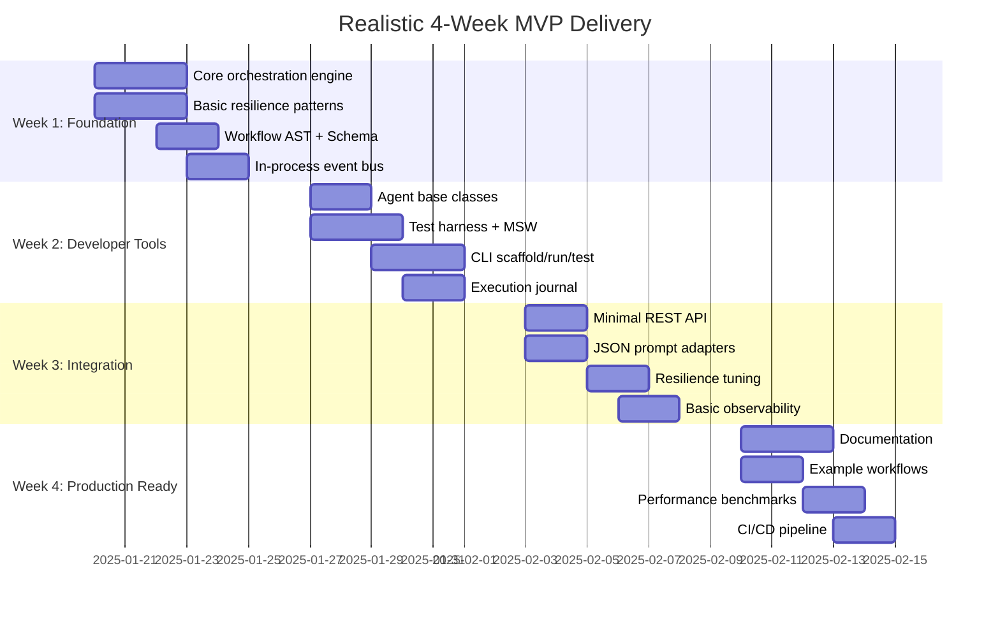

## Core MVP Components

### 1. Orchestration Engine (Week 1)

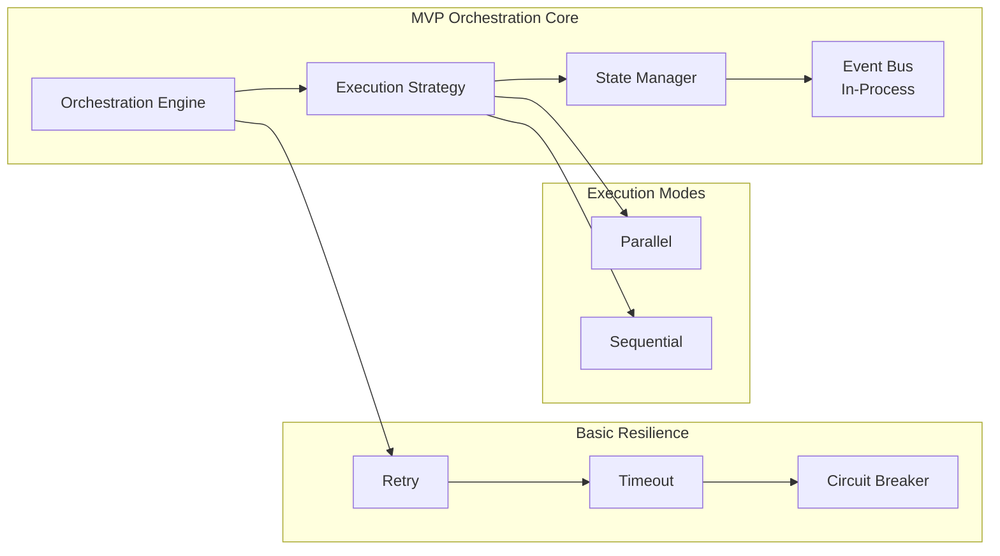

**Deliverables:**

- Parallel and sequential execution strategies
- Basic retry with exponential backoff
- Timeout management per operation
- Simple circuit breaker (open/closed/half-open)
- In-process event bus with bounded queues

**NOT in MVP:**

- Bulkhead isolation
- Rate limiting
- Adaptive circuit breakers
- Cross-process messaging

### 2. Workflow AST and Schema (Week 1)

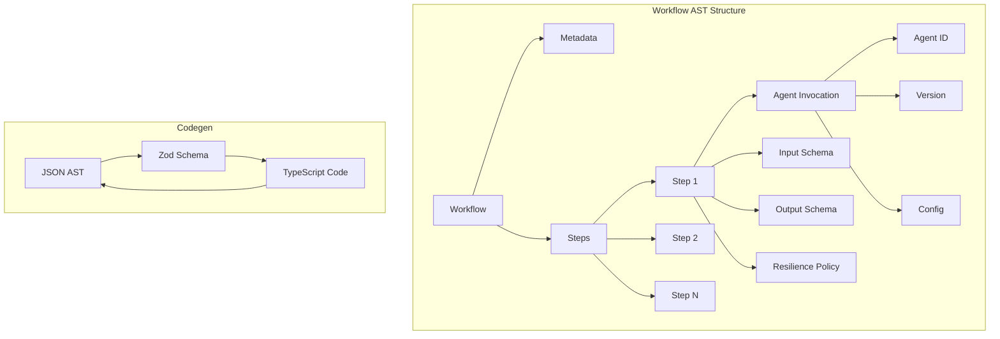

**Deliverables:**

- JSON Schema for Workflow AST
- Zod types for runtime validation
- TypeScript codegen (one-way for MVP)
- Schema versioning (v1.0.0)

**NOT in MVP:**

- YAML/XML formats
- Visual AST editor
- Multi-format round-trip
- Schema migration tools

### 3. Developer CLI (Week 2)

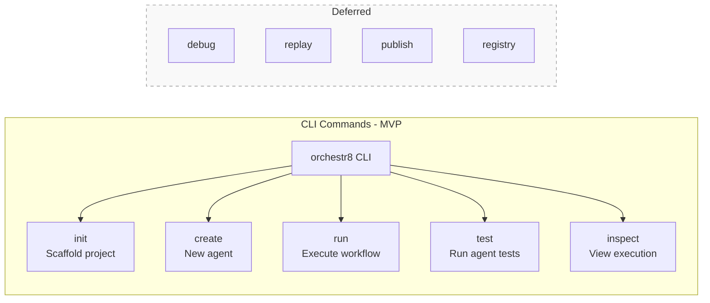

**Deliverables:**

- Project scaffolding
- Agent creation from templates
- Workflow execution
- Test runner integration
- Basic execution inspection

**NOT in MVP:**

- Interactive debugging
- State modification
- Registry operations
- Visual tools

### 4. Minimal REST API (Week 3)

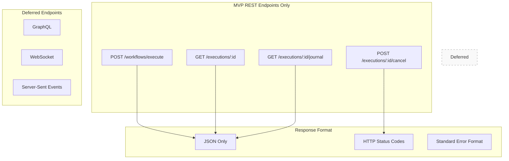

**Deliverables:**

- Execute workflow endpoint
- Get execution status
- Retrieve execution journal
- Cancel execution
- Standard error responses

**NOT in MVP:**

- GraphQL interface
- WebSocket subscriptions
- Server-sent events
- Batch operations

## Resilience Pattern Composition (MVP)

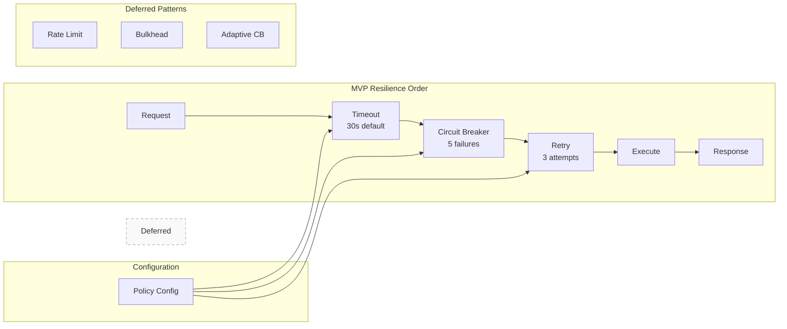

**Order Rationale:**

1. **Timeout first**: Prevents hanging operations
2. **Circuit breaker second**: Stops cascading failures
3. **Retry last**: Only retry if circuit is closed

**Default Configuration:**

```typescript
{
  timeout: {
    default: 30000,  // 30 seconds
    perOperation: {} // Override per agent
  },
  circuitBreaker: {
    failureThreshold: 5,
    resetTimeout: 60000, // 1 minute
    halfOpenRequests: 3
  },
  retry: {
    maxAttempts: 3,
    initialDelay: 1000,
    maxDelay: 10000,
    backoffMultiplier: 2,
    jitter: true
  }
}
```

## Execution Semantics (MVP)

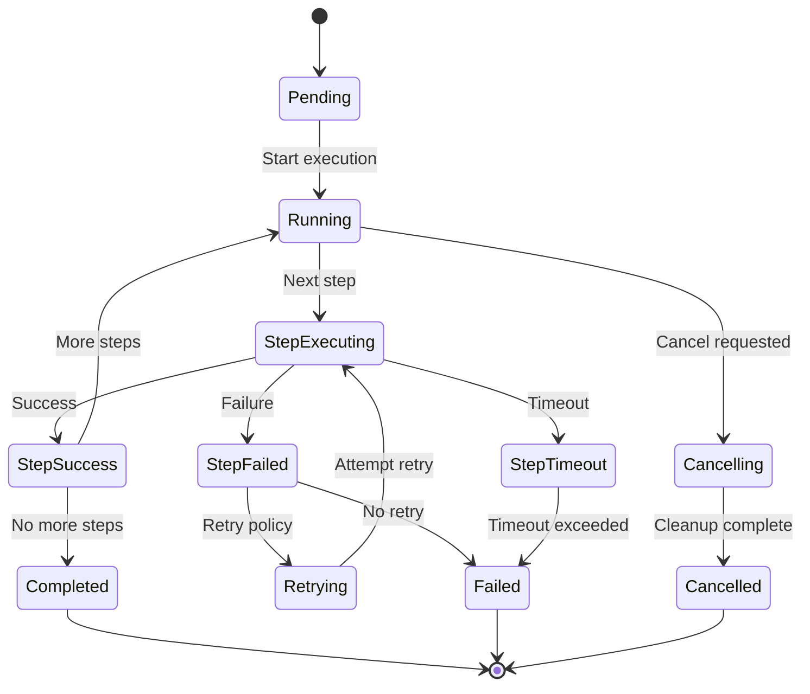

**Key Semantics:**

- **Deterministic step boundaries**: Each step completes fully before next
- **Fail-fast default**: Stop on first failure unless configured otherwise
- **Cooperative cancellation**: Agents check cancellation token
- **Idempotency required**: Agents must handle duplicate invocations

## Observability (MVP)

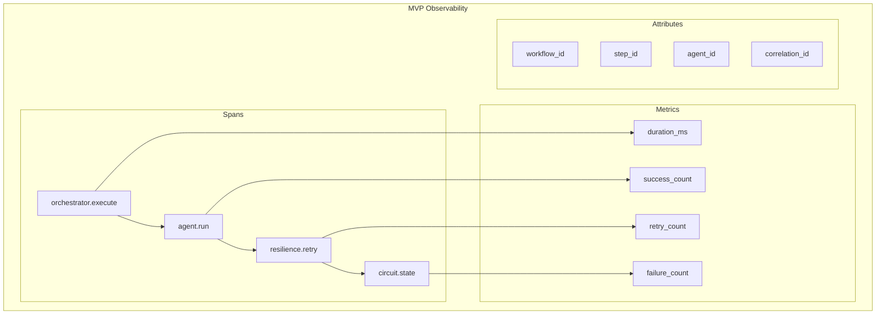

**Deliverables:**

- OpenTelemetry spans for key operations
- Basic metrics (counters, histograms)
- Correlation ID propagation
- JSON structured logging

**NOT in MVP:**

- Distributed tracing
- Custom dashboards
- Metric aggregation
- Log analysis

## Testing Strategy (MVP)

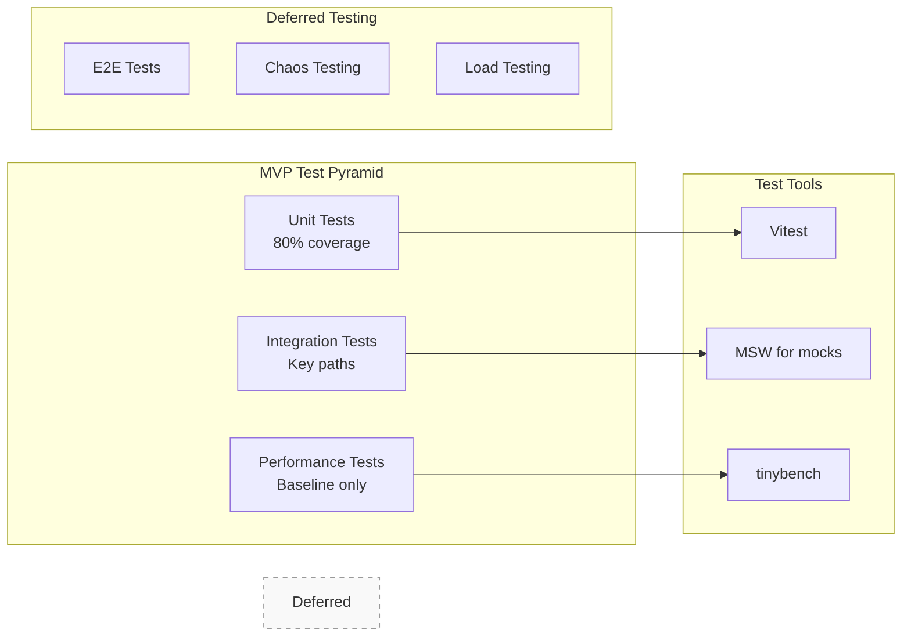

**Deliverables:**

- 80% unit test coverage on core packages
- Integration tests for orchestration flows
- Performance baseline with tinybench
- Agent test harness with MSW

**NOT in MVP:**

- End-to-end UI tests
- Chaos engineering
- Load testing
- Mutation testing

## What's NOT in the MVP

### Deferred to Post-MVP Phases

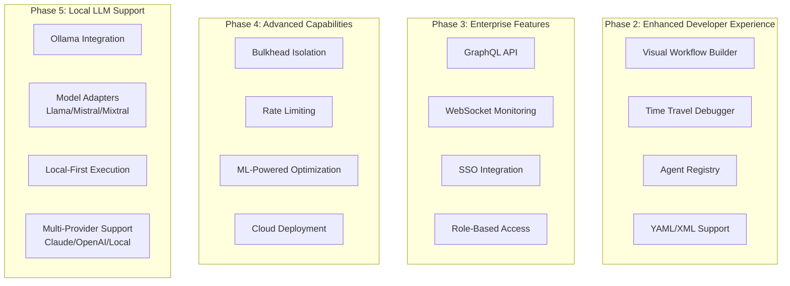

### Explicit Non-Goals for MVP

1. **No Visual Tools**: CLI only, no web UI
2. **No Advanced Debugging**: Basic journal inspection only
3. **No Multiple API Formats**: REST with JSON only
4. **No Cross-Process Communication**: In-process only
5. **No Agent Registry**: Direct imports only
6. **No Authentication**: Local execution only
7. **No Cloud Features**: Single-node deployment
8. **No Advanced Resilience**: Basic patterns only
9. **No Local LLM Support**: Claude-only for MVP (Ollama in Phase 5)

## Success Criteria for MVP

### Week 1 Checkpoint

- [ ] Core orchestration engine runs hello-world
- [ ] Basic resilience patterns functional
- [ ] Workflow AST defined with JSON Schema
- [ ] In-process event bus operational

### Week 2 Checkpoint

- [ ] CLI can scaffold and run agents
- [ ] Test harness executes with MSW
- [ ] Execution journal captures steps
- [ ] Agent base classes documented

### Week 3 Checkpoint

- [ ] REST API serves 4 endpoints
- [ ] JSON prompts execute successfully
- [ ] Resilience policies tunable
- [ ] Basic observability operational

### Week 4 Checkpoint

- [ ] Documentation complete on Docusaurus
- [ ] 3+ example workflows functional
- [ ] Performance baseline established
- [ ] CI/CD pipeline green

## Risk Mitigation

| Risk               | Mitigation                                |
| ------------------ | ----------------------------------------- |
| Scope creep        | Hard stop on features not in MVP          |
| Performance issues | Baseline early, monitor continuously      |
| Complex debugging  | Simple journal format, clear boundaries   |
| Type complexity    | Single AST schema, generated types        |
| Testing bottleneck | Parallel test execution, focused coverage |

## Measurement Plan for Claims

### Instead of "95% Better"

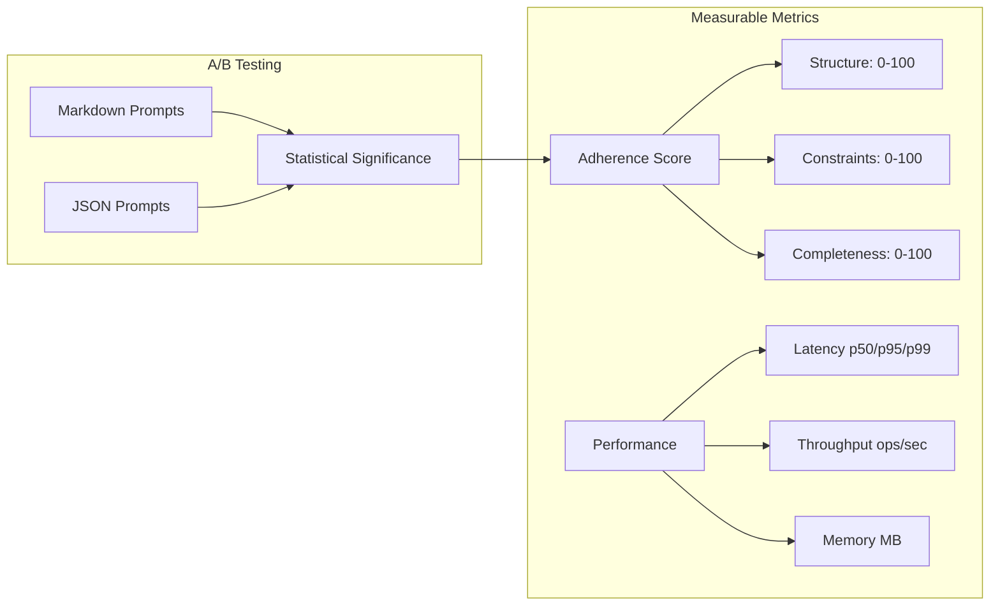

**Measurement Protocol:**

1. Define 5 standard tasks
2. Score adherence on 3 dimensions (0-100)
3. Run A/B test with N=20 iterations
4. Require p<0.05 for claims
5. Report actual improvement percentage

## Conclusion

This lean MVP delivers **core orchestration value in 4 weeks** by:

- **Focusing**: CLI + REST, no visual tools
- **Simplifying**: 6 packages, not 17
- **Deferring**: Complex features to post-MVP
- **Measuring**: Real metrics, not marketing claims
- **Shipping**: Working system, not promises

The reduced scope enables high quality, comprehensive testing, and solid documentation while maintaining a clear path to the full vision in subsequent phases.
