# Measurement Plan - MVP Testing Methodology

This document defines the **measurement and testing methodology** for validating @orchestr8 MVP claims and performance targets.

> Created: 2025-01-17  
> Version: 1.0.0  
> Status: MVP Measurement Framework

## Overview

Instead of unsubstantiated claims like "95% better", this plan defines **measurable metrics** with clear testing protocols and statistical validation requirements.

## Core Metrics Framework

```mermaid
graph TB
    subgraph "Measurable Dimensions"
        PERF[Performance<br/>Metrics]
        QUAL[Quality<br/>Metrics]
        REL[Reliability<br/>Metrics]
        USE[Usability<br/>Metrics]
    end

    subgraph "Performance"
        LAT[Latency p50/p95/p99]
        THRU[Throughput ops/sec]
        MEM[Memory usage MB]
        CPU[CPU utilization %]
    end

    subgraph "Quality"
        ADH[Instruction Adherence]
        COMP[Completeness Score]
        CORR[Correctness Rate]
    end

    subgraph "Reliability"
        UPTIME[Uptime %]
        MTBF[Mean Time Between Failures]
        MTTR[Mean Time To Recovery]
        SUCCESS[Success Rate %]
    end

    subgraph "Usability"
        TTF[Time To First Result]
        LEARN[Learning Curve]
        ERRORS[Error Rate]
    end

    PERF --> LAT
    PERF --> THRU
    PERF --> MEM
    PERF --> CPU

    QUAL --> ADH
    QUAL --> COMP
    QUAL --> CORR

    REL --> UPTIME
    REL --> MTBF
    REL --> MTTR
    REL --> SUCCESS

    USE --> TTF
    USE --> LEARN
    USE --> ERRORS
```

## Performance Benchmarks

### Orchestration Overhead Testing

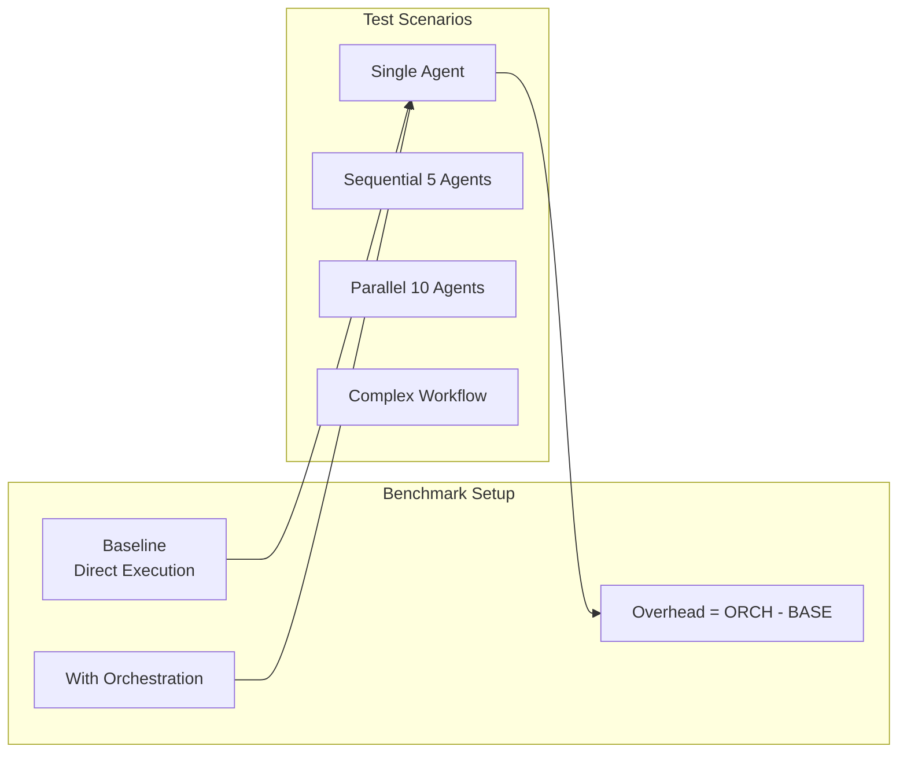

### Test Implementation

**IMPORTANT: No distributional assumptions - use nonparametric methods**

```typescript
// Performance benchmark harness - uses percentiles, not means
export class PerformanceBenchmark {
  async measureOverhead(): Promise<BenchmarkResult> {
    const scenarios = [
      this.singleAgent(),
      this.sequentialAgents(5),
      this.parallelAgents(10),
      this.complexWorkflow(),
    ]

    const results = []
    for (const scenario of scenarios) {
      // Baseline: Direct execution
      const baselineStart = performance.now()
      await this.executeDirectly(scenario)
      const baselineTime = performance.now() - baselineStart

      // With orchestration
      const orchStart = performance.now()
      await this.executeWithOrchestration(scenario)
      const orchTime = performance.now() - orchStart

      results.push({
        scenario: scenario.name,
        baseline: baselineTime,
        orchestrated: orchTime,
        overhead: orchTime - baselineTime,
        percentOverhead: ((orchTime - baselineTime) / baselineTime) * 100,
      })
    }

    return this.calculateStats(results)
  }

  calculateStats(results: TimingResult[]): BenchmarkStats {
    const overheads = results.map((r) => r.overhead)
    return {
      p50: this.percentile(overheads, 50),
      p95: this.percentile(overheads, 95),
      p99: this.percentile(overheads, 99),
      mean: this.mean(overheads),
      stdDev: this.stdDev(overheads),
    }
  }
}
```

### Success Criteria with Latency Distributions

| Metric                       | Target | Measurement Method        | Statistical Method                      |
| ---------------------------- | ------ | ------------------------- | --------------------------------------- |
| Orchestration overhead p50   | <50ms  | Direct timing comparison  | Percentile (no distribution assumption) |
| Orchestration overhead p95   | <100ms | Direct timing comparison  | Percentile (no distribution assumption) |
| Orchestration overhead p99   | <150ms | Direct timing comparison  | Percentile (no distribution assumption) |
| Orchestration overhead p99.9 | <300ms | Direct timing comparison  | Percentile (no distribution assumption) |
| Memory overhead              | <50MB  | Process memory monitoring | Steady-state after warmup               |
| Concurrent agents            | 10+    | Load testing              | Count-based metric                      |

### Latency Distribution Analysis

```typescript
export interface LatencyDistribution {
  percentiles: {
    p50: number // Median latency
    p90: number // 90th percentile
    p95: number // 95th percentile
    p99: number // 99th percentile
    p99_9: number // 99.9th percentile
  }
  distribution: {
    mean: number
    stdDev: number
    skewness: number // Distribution shape
    kurtosis: number // Tail heaviness
  }
  outliers: {
    count: number // Number of outliers
    threshold: number // Outlier threshold (p95 * 2)
    maxValue: number // Worst case observed
  }
}

export class LatencyAnalyzer {
  analyzeDistribution(measurements: number[]): LatencyDistribution {
    const sorted = measurements.sort((a, b) => a - b)

    return {
      percentiles: {
        p50: this.percentile(sorted, 50),
        p90: this.percentile(sorted, 90),
        p95: this.percentile(sorted, 95),
        p99: this.percentile(sorted, 99),
        p99_9: this.percentile(sorted, 99.9),
      },
      distribution: {
        mean: this.mean(sorted),
        stdDev: this.standardDeviation(sorted),
        skewness: this.skewness(sorted),
        kurtosis: this.kurtosis(sorted),
      },
      outliers: {
        count: this.countOutliers(sorted),
        threshold: this.percentile(sorted, 95) * 2,
        maxValue: sorted[sorted.length - 1],
      },
    }
  }
}
```

## Instruction Adherence Testing

### Replacing "95% Better" Claim

Instead of unsubstantiated claims, measure actual adherence with A/B testing:

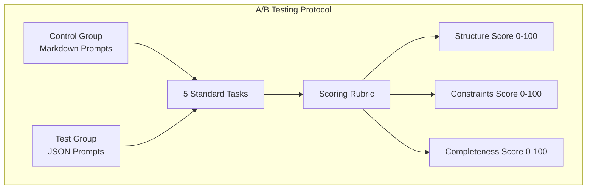

### Scoring Rubric

```typescript
export interface AdherenceScore {
  structure: number // 0-100: Following prescribed structure
  constraints: number // 0-100: Respecting forbidden/required
  completeness: number // 0-100: All steps executed
  overall: number // Weighted average
}

export class AdherenceEvaluator {
  async evaluate(
    prompt: string,
    format: 'markdown' | 'json',
    task: StandardTask,
  ): Promise<AdherenceScore> {
    const execution = await this.executeTask(prompt, format, task)

    return {
      structure: this.scoreStructure(execution, task.expectedStructure),
      constraints: this.scoreConstraints(execution, task.constraints),
      completeness: this.scoreCompleteness(execution, task.requiredSteps),
      overall: this.calculateWeightedScore(),
    }
  }

  private scoreStructure(execution: Execution, expected: Structure): number {
    // Compare actual vs expected structure
    let score = 100
    for (const element of expected.requiredElements) {
      if (!execution.hasElement(element)) {
        score -= 10
      }
    }
    return Math.max(0, score)
  }
}
```

### Statistical Validation (Nonparametric)

```typescript
import { mannWhitneyU } from '@stdlib/stats'

export class StatisticalValidator {
  requireSignificance(
    control: number[],
    test: number[],
    alpha: number = 0.05,
  ): TestResult {
    // Mann-Whitney U test for nonparametric comparison
    // Does NOT assume normal distribution
    const { pValue, statistic } = mannWhitneyU(control, test)

    // Use percentiles instead of means for comparison
    const controlP50 = this.percentile(control, 50)
    const testP50 = this.percentile(test, 50)

    return {
      significant: pValue < alpha,
      pValue,
      controlMedian: controlP50,
      testMedian: testP50,
      improvement: ((testP50 - controlP50) / controlP50) * 100,
      method: 'Mann-Whitney U (nonparametric)',
    }
  }

  // Bootstrap confidence intervals for percentile differences
  bootstrapCI(
    control: number[],
    test: number[],
    percentile: number = 50,
  ): ConfidenceInterval {
    const bootstrapSamples = 10000
    const differences = []

    for (let i = 0; i < bootstrapSamples; i++) {
      const controlSample = this.resample(control)
      const testSample = this.resample(test)

      const diff =
        this.percentile(testSample, percentile) -
        this.percentile(controlSample, percentile)
      differences.push(diff)
    }

    return {
      lower: this.percentile(differences, 2.5),
      upper: this.percentile(differences, 97.5),
      confidence: 0.95,
    }
  }
}
```

### Required Sample Size

- Minimum 20 iterations per task
- 5 different task types
- Total: 100 measurements per format
- Require p < 0.05 for claims

## Resilience Testing

### Failure Scenario Testing

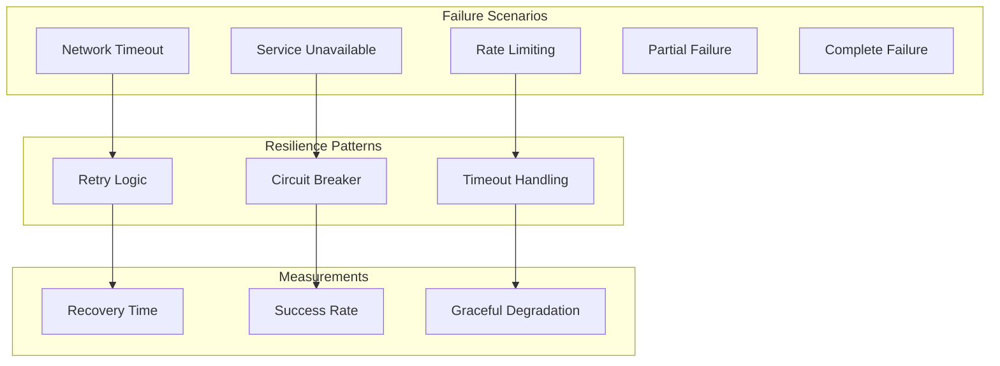

### Chaos Testing

```typescript
export class ChaosTest {
  async injectFailures(): Promise<ResilienceMetrics> {
    const scenarios = [
      () => this.simulateTimeout(30000),
      () => this.simulateServiceDown(),
      () => this.simulateIntermittent(0.3),
      () => this.simulateSlowResponse(5000),
      () => this.simulateCascadingFailure(),
    ]

    const results = []
    for (const scenario of scenarios) {
      const start = Date.now()
      const success = await this.runWithFailure(scenario)
      const recovery = Date.now() - start

      results.push({
        scenario: scenario.name,
        success,
        recoveryTime: recovery,
        retriesUsed: this.countRetries(),
        circuitBreakerTriggered: this.cbTriggered(),
      })
    }

    return this.analyzeResilience(results)
  }
}
```

## Error Budgets and SLI/SLO Framework

### Service Level Indicators (SLIs)

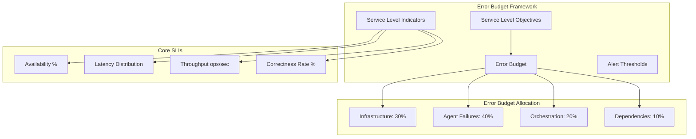

### Error Budget Definitions

```typescript
export interface ErrorBudget {
  sli: string // Service Level Indicator name
  slo: number // Service Level Objective (e.g., 99.9%)
  period: 'monthly' | 'weekly' // Measurement period
  budget: {
    total: number // Total allowed errors
    consumed: number // Errors consumed so far
    remaining: number // Remaining error budget
    burnRate: number // Current burn rate per hour
  }
  alerts: {
    warning: number // Warning threshold (50% consumed)
    critical: number // Critical threshold (80% consumed)
    emergency: number // Emergency threshold (95% consumed)
  }
}

// MVP Error Budget Targets
export const MVP_ERROR_BUDGETS: ErrorBudget[] = [
  {
    sli: 'orchestration_availability',
    slo: 99.5, // 99.5% uptime
    period: 'monthly',
    budget: {
      total: 216, // 0.5% of 30 days = 3.6 hours = 216 minutes
      consumed: 0,
      remaining: 216,
      burnRate: 0,
    },
    alerts: {
      warning: 108, // 50% consumed = 108 minutes
      critical: 173, // 80% consumed = 173 minutes
      emergency: 205, // 95% consumed = 205 minutes
    },
  },
  {
    sli: 'agent_execution_success',
    slo: 99.0, // 99% success rate
    period: 'monthly',
    budget: {
      total: 1000, // 1% of 100,000 monthly executions
      consumed: 0,
      remaining: 1000,
      burnRate: 0,
    },
    alerts: {
      warning: 500, // 50% consumed
      critical: 800, // 80% consumed
      emergency: 950, // 95% consumed
    },
  },
  {
    sli: 'latency_p95',
    slo: 95.0, // 95% of requests under 100ms
    period: 'weekly',
    budget: {
      total: 500, // 5% of 10,000 weekly requests
      consumed: 0,
      remaining: 500,
      burnRate: 0,
    },
    alerts: {
      warning: 250, // 50% consumed
      critical: 400, // 80% consumed
      emergency: 475, // 95% consumed
    },
  },
]
```

### Error Budget Monitoring

```typescript
export class ErrorBudgetMonitor {
  private budgets: Map<string, ErrorBudget> = new Map()

  async updateErrorBudget(
    sli: string,
    errorCount: number,
    totalCount: number,
    timestamp: Date,
  ): Promise<ErrorBudgetStatus> {
    const budget = this.budgets.get(sli)
    if (!budget) throw new Error(`Unknown SLI: ${sli}`)

    // Calculate current success rate
    const successRate = ((totalCount - errorCount) / totalCount) * 100
    const sloViolation = successRate < budget.slo

    if (sloViolation) {
      // Consume error budget
      const budgetConsumed = this.calculateBudgetConsumption(
        budget.slo,
        successRate,
        totalCount,
      )

      budget.budget.consumed += budgetConsumed
      budget.budget.remaining = Math.max(
        0,
        budget.budget.total - budget.budget.consumed,
      )

      // Calculate burn rate (errors per hour)
      budget.budget.burnRate = this.calculateBurnRate(budget, timestamp)
    }

    return this.evaluateBudgetStatus(budget)
  }

  private evaluateBudgetStatus(budget: ErrorBudget): ErrorBudgetStatus {
    const percentConsumed = (budget.budget.consumed / budget.budget.total) * 100

    let status: 'healthy' | 'warning' | 'critical' | 'emergency' = 'healthy'
    if (percentConsumed >= 95) status = 'emergency'
    else if (percentConsumed >= 80) status = 'critical'
    else if (percentConsumed >= 50) status = 'warning'

    return {
      sli: budget.sli,
      status,
      percentConsumed,
      timeToExhaustion: this.calculateTimeToExhaustion(budget),
      recommendations: this.getRecommendations(status, budget),
    }
  }

  private getRecommendations(status: string, budget: ErrorBudget): string[] {
    switch (status) {
      case 'emergency':
        return [
          'Stop all non-critical deployments',
          'Implement immediate reliability fixes',
          'Consider rolling back recent changes',
          'Page on-call engineer',
        ]
      case 'critical':
        return [
          'Pause feature development',
          'Focus on reliability improvements',
          'Review recent changes for issues',
          'Increase monitoring frequency',
        ]
      case 'warning':
        return [
          'Investigate error patterns',
          'Consider reliability improvements',
          'Review deployment cadence',
        ]
      default:
        return ['Monitor trends and maintain reliability']
    }
  }
}

export interface ErrorBudgetStatus {
  sli: string
  status: 'healthy' | 'warning' | 'critical' | 'emergency'
  percentConsumed: number
  timeToExhaustion: number // Hours until budget exhausted
  recommendations: string[]
}
```

### Burn Rate Alerts

```typescript
export class BurnRateAlerter {
  // Alert thresholds based on burn rate
  private readonly BURN_RATE_THRESHOLDS = {
    // If we burn budget at this rate, we'll exhaust it in:
    '1hour': 720, // 720x normal rate = exhaust in 1 hour
    '6hour': 120, // 120x normal rate = exhaust in 6 hours
    '24hour': 30, // 30x normal rate = exhaust in 24 hours
    '72hour': 10, // 10x normal rate = exhaust in 72 hours
  }

  evaluateBurnRate(budget: ErrorBudget): BurnRateAlert[] {
    const normalRate = budget.budget.total / (30 * 24) // Normal hourly rate
    const currentRate = budget.budget.burnRate
    const multiplier = currentRate / normalRate

    const alerts: BurnRateAlert[] = []

    if (multiplier >= this.BURN_RATE_THRESHOLDS['1hour']) {
      alerts.push({
        severity: 'emergency',
        message: `Error budget will be exhausted in 1 hour at current rate`,
        currentRate,
        normalRate,
        multiplier,
      })
    } else if (multiplier >= this.BURN_RATE_THRESHOLDS['6hour']) {
      alerts.push({
        severity: 'critical',
        message: `Error budget will be exhausted in 6 hours at current rate`,
        currentRate,
        normalRate,
        multiplier,
      })
    }

    return alerts
  }
}
```

## Load Testing

### Concurrent Execution Testing

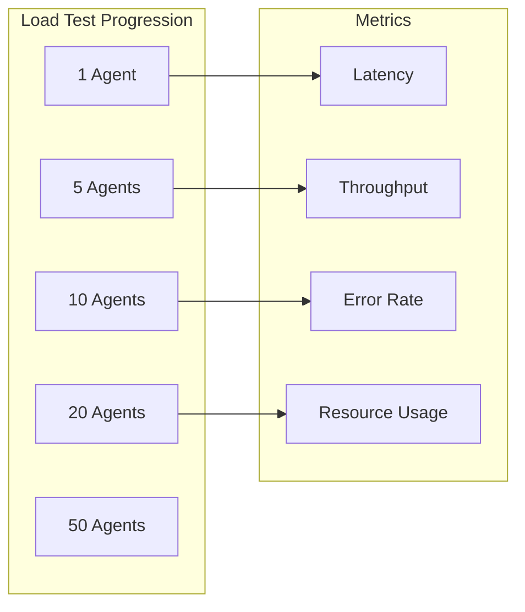

### Load Test Implementation

```typescript
export class LoadTest {
  async rampUp(): Promise<LoadTestResult> {
    const levels = [1, 5, 10, 20, 50]
    const results = []

    for (const level of levels) {
      const agents = this.createAgents(level)
      const start = Date.now()

      const executions = await Promise.allSettled(
        agents.map((a) => a.execute()),
      )

      const duration = Date.now() - start
      const successful = executions.filter(
        (e) => e.status === 'fulfilled',
      ).length

      results.push({
        concurrency: level,
        duration,
        successRate: (successful / level) * 100,
        throughput: level / (duration / 1000),
        avgLatency: duration / level,
        memory: process.memoryUsage().heapUsed / 1024 / 1024,
        cpu: process.cpuUsage(),
      })

      // Stop if success rate drops below 95%
      if (successful / level < 0.95) break
    }

    return {
      maxConcurrency: results[results.length - 1].concurrency,
      results,
    }
  }
}
```

## Quality Metrics

### Test Coverage Analysis

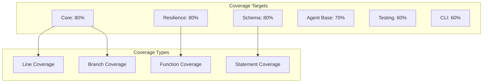

### Coverage Enforcement

```json
// vitest.config.ts coverage thresholds
{
  "coverage": {
    "threshold": {
      "global": {
        "branches": 70,
        "functions": 70,
        "lines": 80,
        "statements": 80
      },
      "./packages/core": {
        "branches": 75,
        "functions": 75,
        "lines": 80,
        "statements": 80
      }
    }
  }
}
```

## Performance Baseline Methodology

### Baseline Establishment Protocol

Performance baselines are critical for detecting regressions and validating improvements. This methodology defines how to establish, maintain, and validate performance baselines for the @orchestr8 MVP.

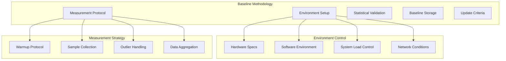

### Environment Standardization

```typescript
export interface BaselineEnvironment {
  hardware: {
    cpu: string;              // "Intel i7-9750H 2.6GHz" or similar
    memory: number;           // 16384 (MB)
    disk: string;             // "SSD 512GB"
    network: string;          // "1Gbps Ethernet" or "WiFi 6"
  };

  software: {
    os: string;               // "macOS 14.2" or "Ubuntu 22.04"
    nodeVersion: string;      // "20.11.0"
    npmVersion: string;       // "10.2.4"
    dockerVersion?: string;   // "24.0.7" if using containers
  };

  runtime: {
    cpuQuiet: boolean;        // CPU usage <5% before tests
    memoryAvailable: number;  // Available memory in MB
    networkLatency: number;   // Ping latency to reference server (ms)
    diskIO: number;           // Current disk IO operations/sec
  };
}

export class BaselineEnvironmentController {
  async setupControlledEnvironment(): Promise<BaselineEnvironment> {
    // 1. Verify hardware meets minimum requirements
    await this.validateHardwareSpecs();

    // 2. Ensure system is in quiet state
    await this.waitForSystemQuiet();

    // 3. Control background processes
    await this.minimizeBackgroundLoad();

    // 4. Collect environment metadata
    return await this.captureEnvironmentState();
  }

  private async waitForSystemQuiet(): Promise<void> {
    // Post-MVP: Implement CPU usage monitoring
    // For MVP, use simple wait to let system settle
    const settleTime = 2000; // 2 seconds
    console.log(`⏳ Waiting ${settleTime}ms for system to settle...`);
    await new Promise(resolve => setTimeout(resolve, settleTime));
    console.log(`✓ System ready for benchmarking`);

    // Post-MVP implementation with getCurrentCpuUsage():
    // const cpuUsage = await this.getCurrentCpuUsage();
    // Wait for CPU < 5% before proceeding
  }

  private async minimizeBackgroundLoad(): Promise<void> {
    // Close unnecessary applications
    // Pause non-critical system services
    // Clear system caches
    // Set process priority for test runner

    // NOTE: System tuning commands are OPTIONAL and LOCAL-ONLY
    // They should NOT be run in CI environments
    if (process.env.CI) {
      console.log('CI environment detected - skipping system tuning');
      return;
    }

    console.log('System tuning commands are optional for local performance testing');
    console.log('They require sudo access and may not work in all environments');

    // Uncomment the following lines only for dedicated performance testing:
    /*
    if (process.platform === 'win32') {
      // Windows-specific optimizations (requires admin)
      // await this.exec('powercfg -setactive 8c5e7fda-e8bf-4a96-9a85-a6e23a8c635c');
    } else if (process.platform === 'darwin') {
      // macOS-specific optimizations (requires sudo)
      // await this.exec('sudo pmset -a standby 0');
    } else {
      // Linux-specific optimizations (requires sudo)
      // await this.exec('echo performance | sudo tee /sys/devices/system/cpu/cpu*/cpufreq/scaling_governor');
    }
    */
  }
}
```

### Measurement Protocol

```typescript
export interface BaselineMeasurement {
  metric: string
  samples: number[]
  environment: BaselineEnvironment
  timestamp: Date
  configuration: {
    warmupIterations: number
    measurementIterations: number
    cooldownTime: number
  }
  statistics: {
    mean: number
    median: number
    stdDev: number
    p95: number
    p99: number
    outlierCount: number
  }
}

export class BaselineMeasurementProtocol {
  private readonly WARMUP_ITERATIONS = 10
  private readonly MEASUREMENT_ITERATIONS = 100
  private readonly COOLDOWN_TIME = 5000 // 5 seconds

  async establishBaseline(
    metricName: string,
    measurementFunction: () => Promise<number>,
  ): Promise<BaselineMeasurement> {
    console.log(`📊 Establishing baseline for ${metricName}`)

    // 1. Environment setup
    const environment =
      await new BaselineEnvironmentController().setupControlledEnvironment()

    // 2. Warmup phase
    console.log(`🔥 Warmup: ${this.WARMUP_ITERATIONS} iterations`)
    for (let i = 0; i < this.WARMUP_ITERATIONS; i++) {
      await measurementFunction()
      await this.shortDelay()
    }

    // 3. Cooldown before measurement
    console.log(`⏳ Cooldown: ${this.COOLDOWN_TIME}ms`)
    await new Promise((resolve) => setTimeout(resolve, this.COOLDOWN_TIME))

    // 4. Actual measurements
    console.log(`📏 Measuring: ${this.MEASUREMENT_ITERATIONS} iterations`)
    const samples: number[] = []

    for (let i = 0; i < this.MEASUREMENT_ITERATIONS; i++) {
      try {
        const sample = await measurementFunction()
        samples.push(sample)

        // Progress indicator
        if ((i + 1) % 10 === 0) {
          console.log(
            `   ${i + 1}/${this.MEASUREMENT_ITERATIONS} samples collected`,
          )
        }

        await this.shortDelay()
      } catch (error) {
        console.warn(`⚠️ Sample ${i + 1} failed: ${error.message}`)
        // Continue with remaining samples
      }
    }

    if (samples.length < this.MEASUREMENT_ITERATIONS * 0.9) {
      throw new Error(
        `Insufficient samples: ${samples.length}/${this.MEASUREMENT_ITERATIONS}`,
      )
    }

    // 5. Statistical analysis
    const statistics = this.calculateStatistics(samples)

    // 6. Outlier detection and removal
    const { cleanSamples, outlierCount } = this.removeOutliers(
      samples,
      statistics,
    )
    const finalStatistics = this.calculateStatistics(cleanSamples)

    console.log(
      `✅ Baseline established: ${finalStatistics.median.toFixed(2)}ms (median)`,
    )

    return {
      metric: metricName,
      samples: cleanSamples,
      environment,
      timestamp: new Date(),
      configuration: {
        warmupIterations: this.WARMUP_ITERATIONS,
        measurementIterations: this.MEASUREMENT_ITERATIONS,
        cooldownTime: this.COOLDOWN_TIME,
      },
      statistics: {
        ...finalStatistics,
        outlierCount,
      },
    }
  }

  private calculateStatistics(samples: number[]): Statistics {
    const sorted = [...samples].sort((a, b) => a - b)
    const mean = samples.reduce((a, b) => a + b, 0) / samples.length
    const median = this.percentile(sorted, 50)
    const variance =
      samples.reduce((acc, val) => acc + Math.pow(val - mean, 2), 0) /
      samples.length
    const stdDev = Math.sqrt(variance)

    return {
      mean,
      median,
      stdDev,
      p95: this.percentile(sorted, 95),
      p99: this.percentile(sorted, 99),
    }
  }

  private removeOutliers(
    samples: number[],
    stats: Statistics,
  ): { cleanSamples: number[]; outlierCount: number } {
    // Use IQR method for outlier detection
    const q1 = this.percentile(
      samples.sort((a, b) => a - b),
      25,
    )
    const q3 = this.percentile(
      samples.sort((a, b) => a - b),
      75,
    )
    const iqr = q3 - q1
    const lowerBound = q1 - 1.5 * iqr
    const upperBound = q3 + 1.5 * iqr

    const cleanSamples = samples.filter(
      (sample) => sample >= lowerBound && sample <= upperBound,
    )

    return {
      cleanSamples,
      outlierCount: samples.length - cleanSamples.length,
    }
  }

  private async shortDelay(): Promise<void> {
    // Small delay to prevent overwhelming the system
    await new Promise((resolve) => setTimeout(resolve, 50))
  }
}
```

### Baseline Storage and Versioning

```typescript
export interface BaselineRecord {
  id: string
  version: string
  date: Date
  measurements: BaselineMeasurement[]
  gitCommit: string
  environment: BaselineEnvironment
  validated: boolean
  notes?: string
}

export class BaselineStorage {
  private readonly BASELINE_FILE = '.orchestr8/baselines.json'

  async saveBaseline(baseline: BaselineRecord): Promise<void> {
    const existingBaselines = await this.loadBaselines()

    // Validate baseline before saving
    await this.validateBaseline(baseline)

    existingBaselines.push(baseline)

    // Keep only last 10 baselines per version
    const filtered = this.retainRecentBaselines(existingBaselines, 10)

    await fs.promises.writeFile(
      this.BASELINE_FILE,
      JSON.stringify(filtered, null, 2),
    )

    console.log(`✅ Baseline saved: ${baseline.id}`)
  }

  async getCurrentBaseline(version?: string): Promise<BaselineRecord | null> {
    const baselines = await this.loadBaselines()

    if (version) {
      return (
        baselines
          .filter((b) => b.version === version && b.validated)
          .sort((a, b) => b.date.getTime() - a.date.getTime())[0] || null
      )
    }

    return (
      baselines
        .filter((b) => b.validated)
        .sort((a, b) => b.date.getTime() - a.date.getTime())[0] || null
    )
  }

  async compareWithBaseline(
    current: BaselineMeasurement,
    baseline: BaselineRecord,
  ): Promise<BaselineComparison> {
    const baselineMeasurement = baseline.measurements.find(
      (m) => m.metric === current.metric,
    )

    if (!baselineMeasurement) {
      throw new Error(`No baseline found for metric: ${current.metric}`)
    }

    const improvement = this.calculateImprovement(
      current.statistics.median,
      baselineMeasurement.statistics.median,
    )

    const significance = await this.testStatisticalSignificance(
      current.samples,
      baselineMeasurement.samples,
    )

    return {
      metric: current.metric,
      current: current.statistics.median,
      baseline: baselineMeasurement.statistics.median,
      improvement,
      significant: significance.significant,
      pValue: significance.pValue,
      recommendation: this.getRecommendation(improvement, significance),
    }
  }

  private async validateBaseline(baseline: BaselineRecord): Promise<void> {
    // Check measurement count
    if (baseline.measurements.length === 0) {
      throw new Error('Baseline must contain at least one measurement')
    }

    // Check sample sizes
    for (const measurement of baseline.measurements) {
      if (measurement.samples.length < 50) {
        throw new Error(
          `Insufficient samples for ${measurement.metric}: ${measurement.samples.length}`,
        )
      }

      // Check coefficient of variation (CV)
      const cv = measurement.statistics.stdDev / measurement.statistics.mean
      if (cv > 0.2) {
        // CV > 20% indicates high variability
        console.warn(
          `⚠️ High variability in ${measurement.metric}: CV=${(cv * 100).toFixed(1)}%`,
        )
      }
    }

    // Validate environment consistency
    await this.validateEnvironmentConsistency(baseline.environment)

    baseline.validated = true
  }
}
```

### Automated Baseline Updates

```typescript
export class BaselineManager {
  async updateBaseline(
    trigger: 'scheduled' | 'manual' | 'release',
  ): Promise<void> {
    console.log(`🔄 Updating baseline (trigger: ${trigger})`)

    try {
      // 1. Run full measurement suite
      const measurements = await this.runMeasurementSuite()

      // 2. Create baseline record
      const baseline: BaselineRecord = {
        id: `baseline-${Date.now()}`,
        version: await this.getCurrentVersion(),
        date: new Date(),
        measurements,
        gitCommit: await this.getCurrentGitCommit(),
        environment:
          await new BaselineEnvironmentController().setupControlledEnvironment(),
        validated: false,
      }

      // 3. Compare with previous baseline
      const previousBaseline = await new BaselineStorage().getCurrentBaseline(
        baseline.version,
      )

      if (previousBaseline) {
        const regressions = await this.detectRegressions(
          baseline,
          previousBaseline,
        )

        if (regressions.length > 0) {
          console.warn('⚠️ Performance regressions detected:')
          regressions.forEach((r) => {
            console.warn(`  ${r.metric}: ${r.degradation.toFixed(1)}% slower`)
          })

          if (trigger === 'scheduled') {
            // Don't update baseline automatically if regressions detected
            throw new Error(
              'Baseline update blocked due to performance regressions',
            )
          }
        }
      }

      // 4. Save new baseline
      await new BaselineStorage().saveBaseline(baseline)

      // 5. Update CI/CD configuration
      await this.updateCIConfiguration(baseline)

      console.log('✅ Baseline updated successfully')
    } catch (error) {
      console.error('❌ Baseline update failed:', error.message)
      throw error
    }
  }

  private async runMeasurementSuite(): Promise<BaselineMeasurement[]> {
    const protocol = new BaselineMeasurementProtocol()
    const measurements: BaselineMeasurement[] = []

    // Core performance measurements
    const metrics = [
      {
        name: 'orchestration_overhead_single',
        fn: () => this.measureSingleAgentOverhead(),
      },
      {
        name: 'orchestration_overhead_sequential_5',
        fn: () => this.measureSequentialOverhead(5),
      },
      {
        name: 'orchestration_overhead_parallel_10',
        fn: () => this.measureParallelOverhead(10),
      },
      {
        name: 'resilience_retry_latency',
        fn: () => this.measureResilienceLatency(),
      },
      {
        name: 'event_bus_throughput',
        fn: () => this.measureEventBusThroughput(),
      },
      {
        name: 'memory_usage_steady_state',
        fn: () => this.measureMemoryUsage(),
      },
    ]

    for (const metric of metrics) {
      try {
        const measurement = await protocol.establishBaseline(
          metric.name,
          metric.fn,
        )
        measurements.push(measurement)
      } catch (error) {
        console.error(`Failed to measure ${metric.name}:`, error.message)
        // Continue with other metrics
      }
    }

    return measurements
  }

  async scheduleBaselineUpdates(): Promise<void> {
    // Weekly baseline updates
    setInterval(
      async () => {
        try {
          await this.updateBaseline('scheduled')
        } catch (error) {
          console.error('Scheduled baseline update failed:', error.message)
        }
      },
      7 * 24 * 60 * 60 * 1000,
    ) // Weekly

    console.log('📅 Scheduled baseline updates configured')
  }
}
```

### CI/CD Integration

```typescript
export class BaselineCIIntegration {
  async validatePerformance(
    prNumber?: string,
    baseline?: BaselineRecord,
  ): Promise<PerformanceValidationResult> {
    if (!baseline) {
      baseline = await new BaselineStorage().getCurrentBaseline()
      if (!baseline) {
        throw new Error('No baseline found for performance validation')
      }
    }

    console.log(
      `🧪 Running performance validation against baseline ${baseline.id}`,
    )

    // Run current measurements
    const currentMeasurements =
      await new BaselineManager().runMeasurementSuite()

    // Compare each measurement
    const comparisons: BaselineComparison[] = []
    const regressions: PerformanceRegression[] = []

    for (const measurement of currentMeasurements) {
      try {
        const comparison = await new BaselineStorage().compareWithBaseline(
          measurement,
          baseline,
        )

        comparisons.push(comparison)

        // Check for significant regressions
        if (comparison.improvement < -10 && comparison.significant) {
          regressions.push({
            metric: measurement.metric,
            degradation: Math.abs(comparison.improvement),
            significance: comparison.pValue,
            recommendation: comparison.recommendation,
          })
        }
      } catch (error) {
        console.warn(
          `Comparison failed for ${measurement.metric}:`,
          error.message,
        )
      }
    }

    // Generate report
    const passed = regressions.length === 0

    if (prNumber) {
      await this.postPRComment(prNumber, comparisons, regressions)
    }

    return {
      passed,
      comparisons,
      regressions,
      summary: this.generateSummary(comparisons, regressions),
    }
  }

  private async postPRComment(
    prNumber: string,
    comparisons: BaselineComparison[],
    regressions: PerformanceRegression[],
  ): Promise<void> {
    const comment = this.formatPRComment(comparisons, regressions)

    // Use GitHub API to post comment
    await fetch(
      `https://api.github.com/repos/orchestr8/orchestr8/issues/${prNumber}/comments`,
      {
        method: 'POST',
        headers: {
          Authorization: `token ${process.env.GITHUB_TOKEN}`,
          'Content-Type': 'application/json',
        },
        body: JSON.stringify({ body: comment }),
      },
    )
  }

  private formatPRComment(
    comparisons: BaselineComparison[],
    regressions: PerformanceRegression[],
  ): string {
    const lines = ['## 📊 Performance Analysis', '']

    if (regressions.length === 0) {
      lines.push('✅ **No performance regressions detected**')
    } else {
      lines.push('⚠️ **Performance regressions detected:**')
      lines.push('')

      for (const regression of regressions) {
        lines.push(
          `- **${regression.metric}**: ${regression.degradation.toFixed(1)}% slower (p=${regression.significance.toFixed(3)})`,
        )
      }
    }

    lines.push('')
    lines.push('### Detailed Comparison')
    lines.push('')
    lines.push('| Metric | Current | Baseline | Change | Significant |')
    lines.push('|--------|---------|----------|--------|-------------|')

    for (const comp of comparisons) {
      const changeIcon =
        comp.improvement > 0 ? '📈' : comp.improvement < 0 ? '📉' : '➡️'
      const significanceIcon = comp.significant ? '✅' : '❌'

      lines.push(
        `| ${comp.metric} | ${comp.current.toFixed(1)}ms | ${comp.baseline.toFixed(1)}ms | ${changeIcon} ${comp.improvement.toFixed(1)}% | ${significanceIcon} |`,
      )
    }

    return lines.join('\n')
  }
}
```

## Baseline Establishment

### Week 1 Baseline

```typescript
export const MVP_BASELINE = {
  performance: {
    orchestrationOverhead: {
      p50: 50, // ms
      p90: 80, // ms
      p95: 100, // ms
      p99: 150, // ms
      p99_9: 300, // ms - hard ceiling
    },
    latencyDistribution: {
      mean: 55, // ms
      stdDev: 25, // ms
      skewness: 1.2, // Right-skewed (expected)
      kurtosis: 3.5, // Moderate tail heaviness
      outlierRate: 2.0, // % of requests beyond p95*2
    },
    throughput: {
      singleAgent: 100, // ops/sec
      concurrent10: 50, // ops/sec
    },
    memory: {
      idle: 50, // MB
      active: 200, // MB
      peak: 500, // MB
    },
  },

  quality: {
    testCoverage: {
      core: 80, // %
      overall: 70, // %
    },
    adherence: {
      structure: 85, // score
      constraints: 90, // score
      completeness: 95, // score
    },
  },

  reliability: {
    successRate: 99.0, // %
    availability: 99.5, // %
    mtbf: 3600, // seconds
    mttr: 30, // seconds
    errorBudgets: {
      orchestrationAvailability: {
        monthly: 216, // minutes (0.5% of month)
        consumed: 0, // minutes consumed
      },
      agentExecutionSuccess: {
        monthly: 1000, // failed executions (1% of 100k)
        consumed: 0, // failures consumed
      },
      latencyP95: {
        weekly: 500, // slow requests (5% of 10k)
        consumed: 0, // slow requests consumed
      },
    },
  },
}
```

## Continuous Monitoring

### Daily Metrics Dashboard

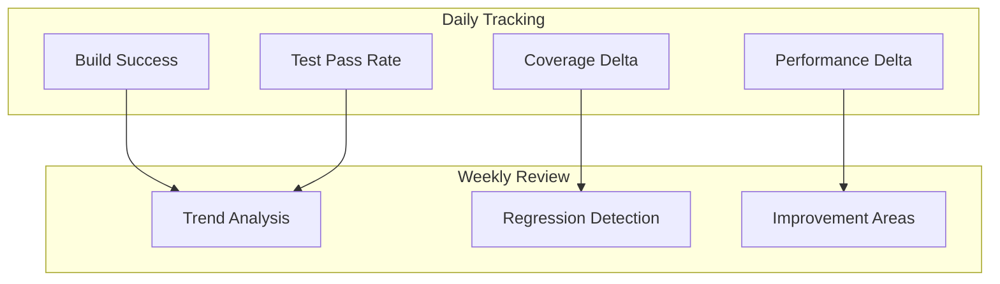

### Automated Regression Detection

```typescript
export class RegressionDetector {
  async checkRegression(
    current: Metrics,
    baseline: Metrics,
    threshold: number = 0.1,
  ): RegressionReport {
    const regressions = []

    // Check performance regression
    if (current.overhead.p95 > baseline.overhead.p95 * (1 + threshold)) {
      regressions.push({
        metric: 'orchestration_overhead_p95',
        baseline: baseline.overhead.p95,
        current: current.overhead.p95,
        degradation:
          ((current.overhead.p95 - baseline.overhead.p95) /
            baseline.overhead.p95) *
          100,
      })
    }

    // Check other metrics...

    return {
      hasRegression: regressions.length > 0,
      regressions,
      recommendation: this.getRecommendation(regressions),
    }
  }
}
```

## Reporting Template

### Weekly Performance Report

```markdown
## Week N Performance Report

### Executive Summary

- Overall Health: 🟢 Green / 🟡 Yellow / 🔴 Red
- Key Achievement: [Main accomplishment]
- Primary Concern: [Top issue if any]

### Performance Metrics

| Metric       | Target   | Actual   | Status |
| ------------ | -------- | -------- | ------ |
| Overhead p95 | <100ms   | 87ms     | ✅     |
| Throughput   | 50 ops/s | 52 ops/s | ✅     |
| Memory       | <200MB   | 180MB    | ✅     |

### Quality Metrics

| Package    | Coverage Target | Actual | Delta |
| ---------- | --------------- | ------ | ----- |
| Core       | 80%             | 82%    | +2%   |
| Resilience | 80%             | 78%    | -2%   |

### Action Items

1. Address resilience coverage gap
2. Optimize memory usage in parallel execution
3. Investigate timeout in test scenario #3
```

## Prompt Quality Metrics

### Adherence Scoring System

Comprehensive statistical measurement of how well agent responses follow instructions:

| Metric                  | Target | Minimum | Alert Threshold |
| ----------------------- | ------ | ------- | --------------- |
| Overall Adherence Score | 95%    | 85%     | <85%            |
| Role Compliance         | 95%    | 90%     | <90%            |
| Instruction Following   | 98%    | 95%     | <95%            |
| Format Compliance       | 98%    | 95%     | <95%            |
| Quality Standards       | 90%    | 85%     | <85%            |
| Reasoning Clarity       | 85%    | 80%     | <80%            |

### Consistency Metrics

Measures consistency across multiple agent responses to similar prompts:

```typescript
interface ConsistencyTargets {
  semantic_similarity: 0.9 // 90% minimum semantic consistency
  format_consistency: 0.98 // 98% format uniformity
  terminology_consistency: 0.95 // 95% terminology alignment
  quality_variance: 0.1 // 10% maximum quality variance
}
```

### A/B Testing Framework

Statistical framework for prompt optimization:

| Configuration       | Value           | Description                     |
| ------------------- | --------------- | ------------------------------- |
| Significance Level  | p < 0.05        | 95% confidence                  |
| Minimum Sample Size | 100 per variant | Statistical power               |
| Early Stopping      | Enabled         | Bounded confidence intervals    |
| Power Analysis      | 0.80            | 80% power to detect differences |
| Effect Size         | 0.2σ            | Minimum detectable difference   |

### Prompt Version Tracking

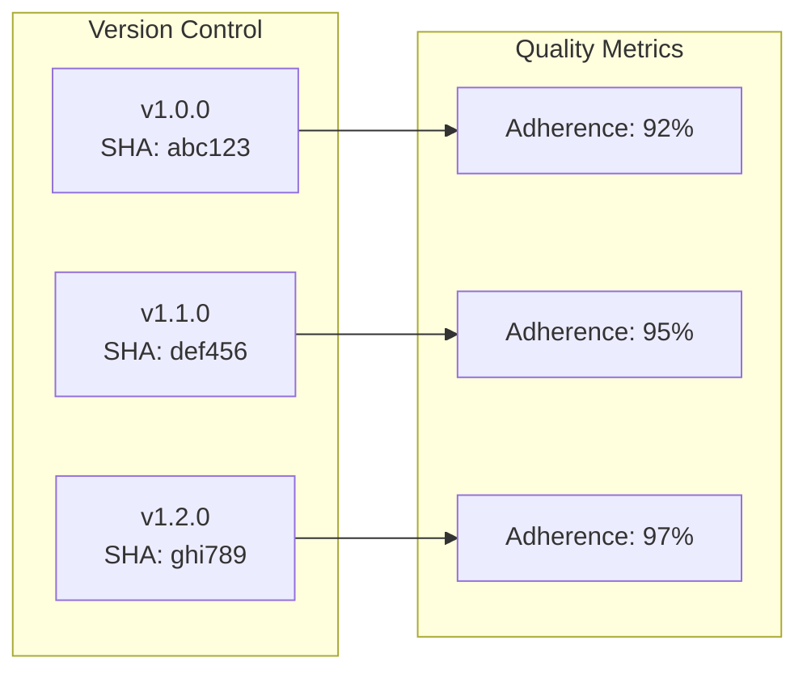

### Error Budget for Prompts

Allowable failure rates for prompt-based operations:

| Budget Category      | Allowance | Measurement Period | Action             |
| -------------------- | --------- | ------------------ | ------------------ |
| Prompt Failures      | 5%        | 24 hours           | Review prompt      |
| Retry Rate           | 10%       | 1 hour             | Optimize prompt    |
| Response Time P95    | 2000ms    | 5 minutes          | Performance tuning |
| Adherence Violations | 15%       | 24 hours           | Prompt revision    |

### Quality Degradation Monitoring

Real-time alerts for prompt quality issues:

```typescript
interface DegradationThresholds {
  immediate_alert: {
    adherence_drop: 0.1 // 10% sudden drop
    error_spike: 0.2 // 20% error rate
    response_time_spike: 2.0 // 2x normal
  }
  trend_alert: {
    degradation_slope: -0.05 // 5% decline per day
    sample_size: 50 // Minimum for trend
    confidence: 0.95 // Statistical confidence
  }
}
```

### Prompt Performance SLIs

Service Level Indicators for prompt quality:

| SLI               | Definition                           | Target  | Measurement       |
| ----------------- | ------------------------------------ | ------- | ----------------- |
| Adherence Rate    | % responses >85% adherence           | 95%     | Per execution     |
| Consistency Score | Semantic similarity across responses | 90%     | 5-response window |
| Error-free Rate   | % without retries or errors          | 90%     | Hourly            |
| Response Latency  | P95 response time                    | <2000ms | 5-minute window   |
| Quality Score     | Composite quality metric             | 90%     | Daily average     |

## Dashboard Metrics and Real-time Monitoring

### Dashboard Performance Metrics

The React dashboard introduces additional measurement requirements for user experience and real-time communication performance.

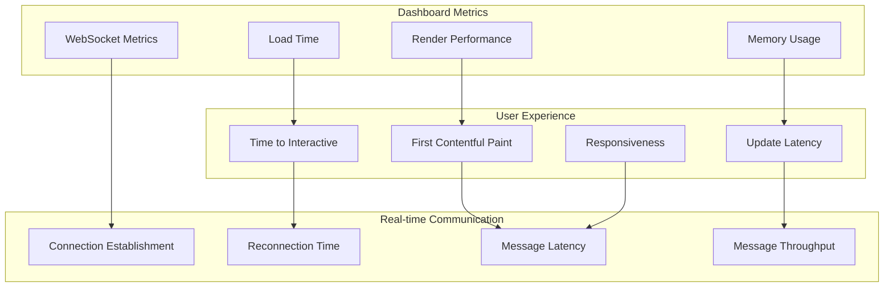

### WebSocket Performance Metrics

```typescript
export interface WebSocketMetrics {
  connection: {
    establishmentTime: number // ms to establish WebSocket connection
    reconnectionTime: number // ms to reconnect after failure
    reconnectionAttempts: number // Count of reconnection attempts
    connectionUptime: number // % of time connected
  }

  messaging: {
    roundTripLatency: {
      p50: number // ms for ping/pong
      p95: number // ms for ping/pong
      p99: number // ms for ping/pong
    }
    messageLatency: {
      workflowEvents: number // ms from server event to UI update
      stepUpdates: number // ms from step completion to display
      metricsUpdates: number // ms from metric change to chart update
    }
    throughput: {
      messagesPerSecond: number // Server → Client message rate
      peakBurstSize: number // Max messages in 1-second window
      queueDepth: number // Backlog during high load
    }
  }

  reliability: {
    connectionDrops: number // Count per hour
    messageDrops: number // Lost messages (no ack)
    duplicateMessages: number // Duplicate message count
    outOfOrderMessages: number // Messages received out of sequence
  }
}

export class WebSocketMonitor {
  private metrics: WebSocketMetrics
  private pingInterval: NodeJS.Timer

  async measureConnectionTime(): Promise<number> {
    const start = performance.now()

    return new Promise((resolve, reject) => {
      const ws = new WebSocket('ws://127.0.0.1:8088/ws')

      ws.onopen = () => {
        const connectionTime = performance.now() - start
        ws.close()
        resolve(connectionTime)
      }

      ws.onerror = reject
      setTimeout(() => reject(new Error('Connection timeout')), 5000)
    })
  }

  async measurePingLatency(): Promise<number> {
    const start = performance.now()

    return new Promise((resolve) => {
      const ws = new WebSocket('ws://127.0.0.1:8088/ws')

      ws.onopen = () => {
        ws.send(JSON.stringify({ type: 'ping', timestamp: start }))
      }

      ws.onmessage = (event) => {
        const data = JSON.parse(event.data)
        if (data.type === 'pong') {
          const latency = performance.now() - start
          ws.close()
          resolve(latency)
        }
      }
    })
  }

  async stressTestMessaging(): Promise<ThroughputResult> {
    const messageCount = 1000
    const concurrency = 10
    const results: number[] = []

    const startTime = performance.now()

    const workers = Array.from({ length: concurrency }, async () => {
      for (let i = 0; i < messageCount / concurrency; i++) {
        const messageStart = performance.now()
        await this.sendAndWaitForAck({
          type: 'workflow.started',
          workflowId: `test-${i}`,
          timestamp: new Date().toISOString(),
        })
        results.push(performance.now() - messageStart)
      }
    })

    await Promise.all(workers)
    const totalTime = performance.now() - startTime

    return {
      messagesPerSecond: messageCount / (totalTime / 1000),
      averageLatency: results.reduce((a, b) => a + b) / results.length,
      p95Latency: this.percentile(results, 95),
      maxLatency: Math.max(...results),
    }
  }
}
```

### Dashboard Component Performance

```typescript
export interface ComponentMetrics {
  renderPerformance: {
    workflowList: {
      initialRender: number // ms to render 100 workflows
      updateRender: number // ms to update single workflow
      scrollPerformance: number // fps during scroll
      memoryFootprint: number // MB for 1000 workflows
    }

    metricsCharts: {
      dataProcessing: number // ms to process 1000 data points
      chartRender: number // ms to render chart
      animationFps: number // fps during transitions
      memoryUsage: number // MB for active charts
    }

    flowDiagram: {
      layoutCalculation: number // ms to layout 50-node workflow
      renderTime: number // ms to render complete diagram
      interactionLatency: number // ms from click to response
      memoryPerNode: number // KB per workflow node
    }
  }

  userExperience: {
    timeToInteractive: number // ms until dashboard is usable
    firstContentfulPaint: number // ms to first meaningful content
    largestContentfulPaint: number // ms to largest content element
    cumulativeLayoutShift: number // Layout stability score
  }

  resourceUsage: {
    initialBundleSize: number // KB for initial JS bundle
    totalAssetSize: number // KB for all assets
    heapMemoryUsage: number // MB heap memory in browser
    domNodeCount: number // Number of DOM nodes
  }
}

export class DashboardPerformanceMonitor {
  async measureComponentRender(componentName: string): Promise<RenderMetrics> {
    const observer = new PerformanceObserver((list) => {
      const entries = list.getEntries()
      return entries.filter((entry) => entry.name.includes(componentName))
    })

    observer.observe({ entryTypes: ['measure'] })

    // Trigger component render and measure
    performance.mark(`${componentName}-start`)
    await this.renderComponent(componentName)
    performance.mark(`${componentName}-end`)

    performance.measure(
      `${componentName}-render`,
      `${componentName}-start`,
      `${componentName}-end`,
    )

    const measurements = performance.getEntriesByName(`${componentName}-render`)
    return {
      renderTime: measurements[0]?.duration || 0,
      componentName,
    }
  }

  async measureTimeToInteractive(): Promise<number> {
    return new Promise((resolve) => {
      const observer = new PerformanceObserver((list) => {
        const entries = list.getEntries()
        const tti = entries.find(
          (entry) => entry.name === 'dashboard-interactive',
        )
        if (tti) {
          resolve(tti.startTime)
          observer.disconnect()
        }
      })

      observer.observe({ entryTypes: ['mark'] })

      // Mark when dashboard becomes interactive
      setTimeout(() => {
        performance.mark('dashboard-interactive')
      }, 0)
    })
  }

  async stressTestWorkflowList(): Promise<ScrollPerformance> {
    const workflowCount = 1000
    const workflows = this.generateMockWorkflows(workflowCount)

    // Measure initial render
    const renderStart = performance.now()
    await this.renderWorkflowList(workflows)
    const initialRender = performance.now() - renderStart

    // Measure scroll performance
    const scrollMetrics = await this.measureScrollFPS()

    // Measure memory usage
    const memoryUsage =
      (performance as any).memory?.usedJSHeapSize / 1024 / 1024 || 0

    return {
      initialRender,
      scrollFPS: scrollMetrics.averageFPS,
      memoryUsage,
      workflowCount,
    }
  }
}
```

### Real-time Update Performance

```typescript
export interface RealTimeMetrics {
  eventProcessing: {
    workflowStarted: number // ms from WebSocket message to UI update
    stepCompleted: number // ms from step complete to progress update
    metricsUpdate: number // ms from metric change to chart update
    errorOccurred: number // ms from error to notification display
  }

  uiResponsiveness: {
    stateUpdateLatency: number // ms for Zustand state updates
    reactRenderLatency: number // ms for React re-renders
    chartUpdateLatency: number // ms for chart data updates
    listItemUpdates: number // ms to update workflow list items
  }

  batchingEfficiency: {
    eventsPerBatch: number // Average events batched together
    batchProcessingTime: number // ms to process typical batch
    memoryEfficiency: number // KB per processed event
    cpuUtilization: number // % CPU during event bursts
  }
}

export class RealTimeMonitor {
  async measureEventLatency(eventType: string): Promise<number> {
    const latencies: number[] = []

    // Create test WebSocket connection
    const ws = new WebSocket('ws://127.0.0.1:8088/ws')

    return new Promise((resolve) => {
      ws.onopen = () => {
        // Send 100 test events and measure latency
        for (let i = 0; i < 100; i++) {
          const start = performance.now()

          ws.send(
            JSON.stringify({
              type: eventType,
              testId: i,
              timestamp: start,
            }),
          )

          // Measure time until UI update (would need DOM observer)
          this.observeUIUpdate(eventType, i).then(() => {
            latencies.push(performance.now() - start)

            if (latencies.length === 100) {
              resolve(latencies.reduce((a, b) => a + b) / latencies.length)
            }
          })
        }
      }
    })
  }

  async measureBatchingPerformance(): Promise<BatchingMetrics> {
    const eventBursts = [10, 50, 100, 500, 1000]
    const results: BatchResult[] = []

    for (const burstSize of eventBursts) {
      const start = performance.now()

      // Send burst of events
      const events = this.generateEventBurst(burstSize)
      await this.processBatch(events)

      const processingTime = performance.now() - start
      const memoryAfter =
        (performance as any).memory?.usedJSHeapSize / 1024 || 0

      results.push({
        burstSize,
        processingTime,
        memoryUsage: memoryAfter,
        eventsPerSecond: burstSize / (processingTime / 1000),
      })
    }

    return this.analyzeBatchingResults(results)
  }
}
```

### Dashboard Metrics Targets

```typescript
export const DASHBOARD_PERFORMANCE_TARGETS = {
  webSocket: {
    connectionTime: {
      target: 100, // ms
      warning: 200, // ms
      critical: 500, // ms
    },

    messageLatency: {
      target: 10, // ms
      warning: 25, // ms
      critical: 50, // ms
    },

    throughput: {
      target: 1000, // messages/second
      warning: 500, // messages/second
      critical: 100, // messages/second
    },

    reliability: {
      connectionUptime: 99.9, // %
      messageDelivery: 99.99, // %
      duplicateRate: 0.01, // %
    },
  },

  dashboard: {
    timeToInteractive: {
      target: 1000, // ms
      warning: 2000, // ms
      critical: 5000, // ms
    },

    renderPerformance: {
      workflowList100: 50, // ms
      chartUpdate: 16, // ms (60fps)
      flowDiagram50Nodes: 200, // ms
      scrollFPS: 58, // fps (near 60fps)
    },

    memoryUsage: {
      initialLoad: 10, // MB
      with1000Workflows: 50, // MB
      maxHeapSize: 100, // MB
      memoryLeakRate: 0, // MB/hour
    },

    bundleSize: {
      initialBundle: 250, // KB gzipped
      totalAssets: 500, // KB gzipped
      chunkSize: 50, // KB per lazy chunk
    },
  },

  userExperience: {
    coreWebVitals: {
      firstContentfulPaint: 800, // ms
      largestContentfulPaint: 1200, // ms
      cumulativeLayoutShift: 0.1, // score
      firstInputDelay: 10, // ms
    },

    interactionResponsiveness: {
      buttonClick: 16, // ms
      formInput: 50, // ms
      navigationChange: 100, // ms
      searchResults: 200, // ms
    },
  },
}
```

### Dashboard-Specific Error Budgets

```typescript
export const DASHBOARD_ERROR_BUDGETS: ErrorBudget[] = [
  {
    sli: 'dashboard_availability',
    slo: 99.9, // 99.9% uptime
    period: 'monthly',
    budget: {
      total: 43, // 0.1% of 30 days = 43 minutes
      consumed: 0,
      remaining: 43,
      burnRate: 0,
    },
    alerts: {
      warning: 21, // 50% consumed
      critical: 34, // 80% consumed
      emergency: 41, // 95% consumed
    },
  },

  {
    sli: 'websocket_connection_success',
    slo: 99.5, // 99.5% connection success
    period: 'weekly',
    budget: {
      total: 50, // 0.5% of 10,000 weekly connections
      consumed: 0,
      remaining: 50,
      burnRate: 0,
    },
    alerts: {
      warning: 25, // 50% consumed
      critical: 40, // 80% consumed
      emergency: 47, // 95% consumed
    },
  },

  {
    sli: 'real_time_update_latency',
    slo: 95.0, // 95% of updates under 25ms
    period: 'daily',
    budget: {
      total: 500, // 5% of 10,000 daily updates
      consumed: 0,
      remaining: 500,
      burnRate: 0,
    },
    alerts: {
      warning: 250, // 50% consumed
      critical: 400, // 80% consumed
      emergency: 475, // 95% consumed
    },
  },
]
```

### Automated Dashboard Testing

```typescript
export class DashboardTestSuite {
  async runPerformanceTests(): Promise<DashboardTestResults> {
    const results = {
      webSocket: await this.testWebSocketPerformance(),
      components: await this.testComponentPerformance(),
      realTime: await this.testRealTimeUpdates(),
      userExperience: await this.testUserExperience(),
      errorBudgets: await this.validateErrorBudgets(),
    }

    return this.generateReport(results)
  }

  private async testWebSocketPerformance(): Promise<WebSocketTestResults> {
    const monitor = new WebSocketMonitor()

    return {
      connectionTime: await this.measureAverageConnectionTime(monitor, 100),
      pingLatency: await this.measurePingLatency(monitor, 100),
      throughput: await monitor.stressTestMessaging(),
      reliability: await this.testConnectionReliability(monitor),
    }
  }

  private async testComponentPerformance(): Promise<ComponentTestResults> {
    const monitor = new DashboardPerformanceMonitor()

    return {
      workflowList: await monitor.stressTestWorkflowList(),
      metricsCharts: await this.testChartPerformance(monitor),
      flowDiagram: await this.testFlowDiagramPerformance(monitor),
      memoryUsage: await this.testMemoryUsage(monitor),
    }
  }

  private async testRealTimeUpdates(): Promise<RealTimeTestResults> {
    const monitor = new RealTimeMonitor()

    return {
      eventLatency: await monitor.measureEventLatency('workflow.started'),
      batchingPerformance: await monitor.measureBatchingPerformance(),
      uiResponsiveness: await this.testUIResponsiveness(monitor),
      stateManagement: await this.testStateManagement(monitor),
    }
  }
}
```

### Dashboard Monitoring Integration

The dashboard metrics integrate with the existing measurement framework:

```typescript
// Add to existing MVP_BASELINE
export const DASHBOARD_BASELINE = {
  ...MVP_BASELINE,

  dashboard: {
    webSocket: {
      connectionTime: 80, // ms
      messageLatency: 12, // ms
      throughput: 800, // messages/second
      connectionUptime: 99.8, // %
    },

    performance: {
      timeToInteractive: 1200, // ms
      renderTime100Workflows: 60, // ms
      chartUpdateTime: 18, // ms
      memoryUsage: 15, // MB
    },

    userExperience: {
      firstContentfulPaint: 900, // ms
      cumulativeLayoutShift: 0.08, // score
      interactionLatency: 12, // ms
    },

    errorBudgets: {
      dashboardAvailability: {
        monthly: 43, // minutes (0.1% of month)
        consumed: 0, // minutes consumed
      },
      webSocketConnections: {
        weekly: 50, // failed connections (0.5% of 10k)
        consumed: 0, // failures consumed
      },
      realTimeUpdateLatency: {
        daily: 500, // slow updates (5% of 10k)
        consumed: 0, // slow updates consumed
      },
    },
  },
}
```

## Conclusion

This measurement plan provides:

- ✅ **Objective metrics** instead of marketing claims
- ✅ **Statistical validation** for all comparisons
- ✅ **Continuous monitoring** to prevent regression
- ✅ **Clear baselines** for MVP success
- ✅ **Automated testing** for consistent measurement
- ✅ **Dashboard performance monitoring** for real-time user experience
- ✅ **WebSocket reliability metrics** for live communication
- ✅ **Component-level performance tracking** for React dashboard
- ✅ **Error budget management** for dashboard availability

By following this methodology, we can make **evidence-based claims** about @orchestr8's performance and capabilities, including the real-time dashboard experience.
