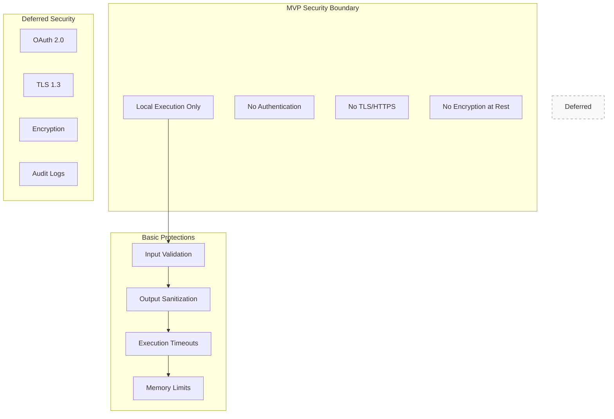
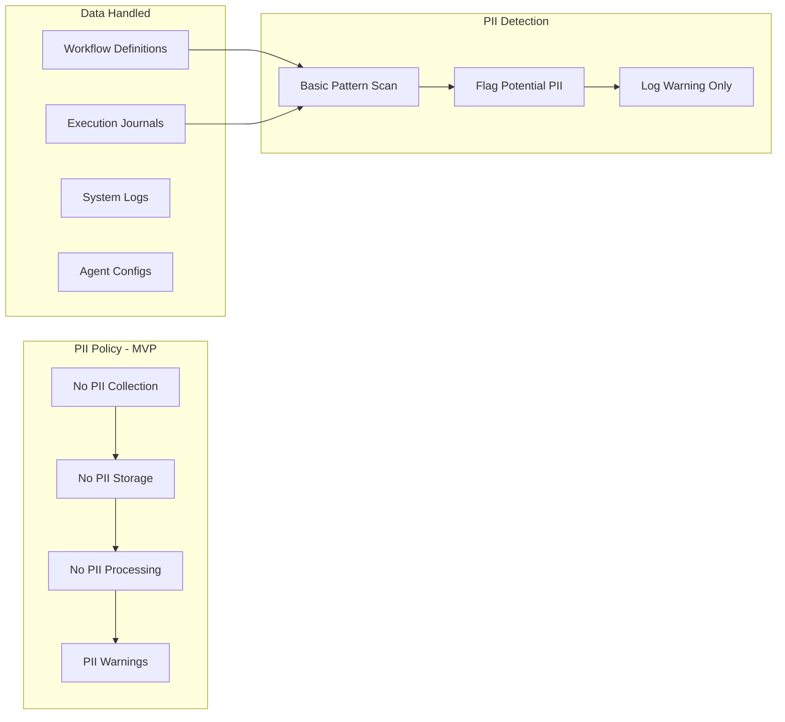
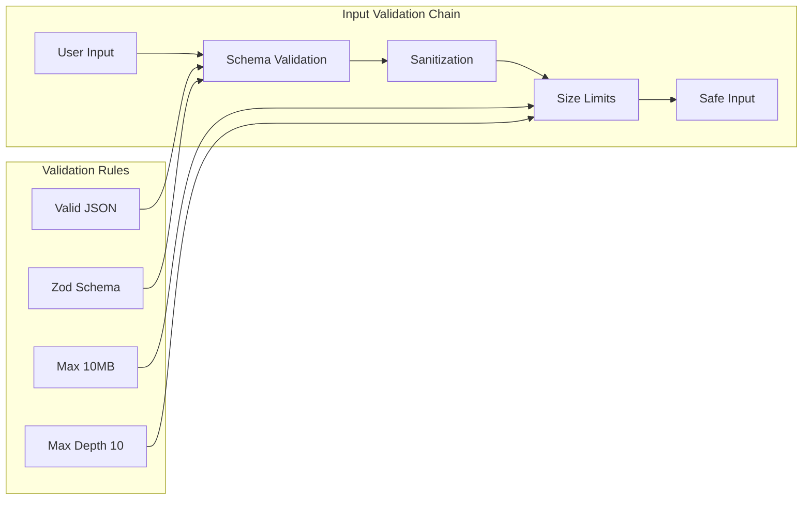
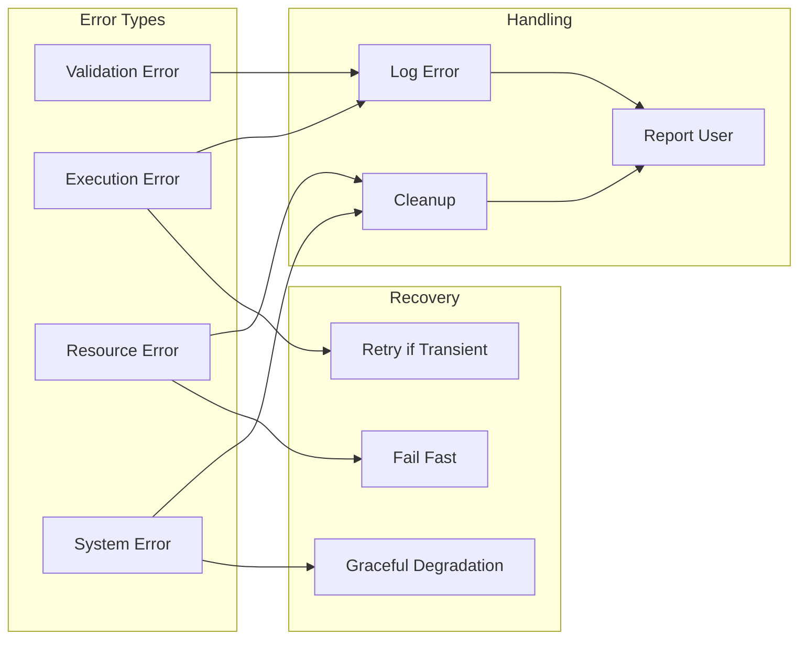
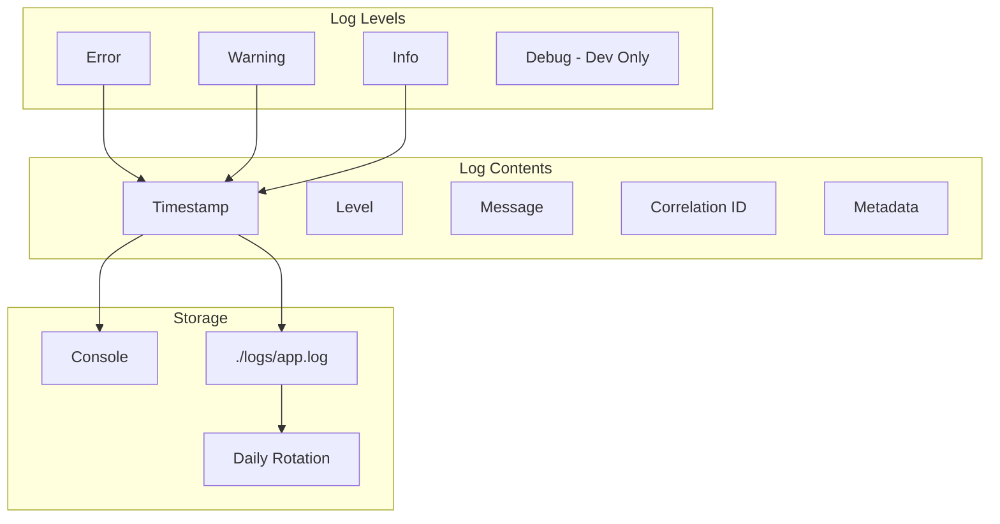
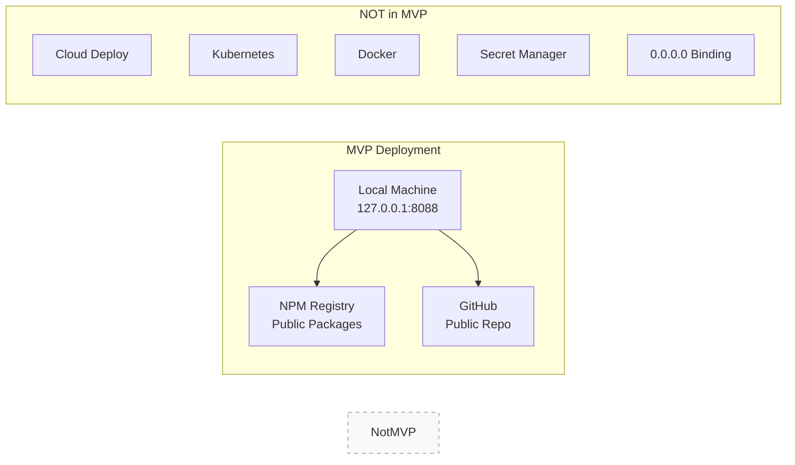
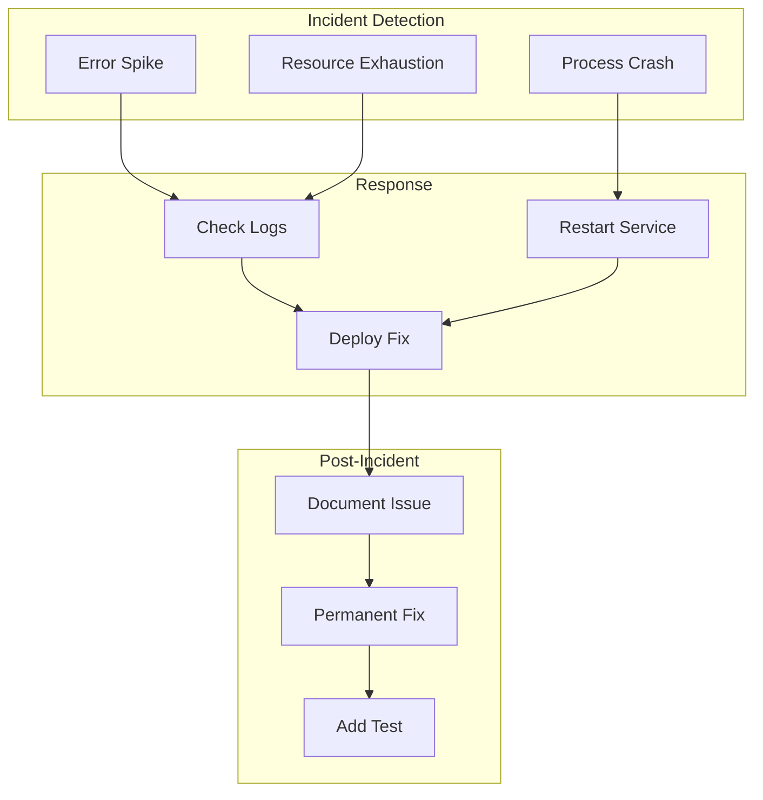
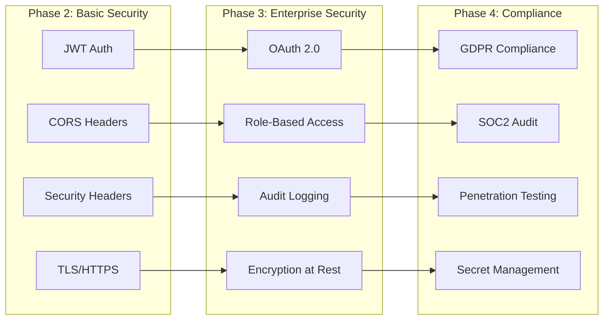

# Security and Operations - MVP Policies

This document defines the **security and operational policies** for @orchestr8 MVP, focusing on PII handling, data retention, and basic security practices.

> Created: 2025-01-17  
> Version: 1.0.0  
> Status: MVP Security Framework

## Overview

The @orchestr8 MVP implements **minimal but essential security** for local development use. Enterprise security features are deferred to post-MVP phases.

## Security Architecture - MVP



## PII Handling Policy

### MVP Stance: No PII Storage



### PII Detection Patterns

```typescript
// MVP PII Detection - Warning only
export class PIIDetector {
  private patterns = {
    ssn: /\b\d{3}-\d{2}-\d{4}\b/,
    creditCard: /\b\d{4}[\s-]?\d{4}[\s-]?\d{4}[\s-]?\d{4}\b/,
    email: /\b[A-Za-z0-9._%+-]+@[A-Za-z0-9.-]+\.[A-Z|a-z]{2,}\b/,
    phone: /\b\d{3}[\s.-]?\d{3}[\s.-]?\d{4}\b/,
    ipAddress: /\b(?:\d{1,3}\.){3}\d{1,3}\b/,
  }

  scan(data: unknown): PIIWarning[] {
    const warnings: PIIWarning[] = []
    const text = JSON.stringify(data)

    for (const [type, pattern] of Object.entries(this.patterns)) {
      if (pattern.test(text)) {
        warnings.push({
          type,
          message: `Potential ${type} detected in data`,
          severity: 'warning',
          recommendation: 'Remove PII before processing',
        })
      }
    }

    return warnings
  }

  // MVP: Warn but don't block
  handleDetection(warnings: PIIWarning[]): void {
    if (warnings.length > 0) {
      console.warn('⚠️ Potential PII detected:', warnings)
      console.warn('MVP does not handle PII. Please remove sensitive data.')
    }
  }
}
```

### PII Compliance Statement

**MVP Limitations:**

- ❌ **NOT GDPR compliant** - No data subject rights implementation
- ❌ **NOT CCPA compliant** - No consumer privacy controls
- ❌ **NOT HIPAA compliant** - No healthcare data safeguards
- ❌ **NOT PCI DSS compliant** - No payment card security

**User Responsibility:**

- Users MUST NOT process PII with MVP
- Users are responsible for data sanitization
- MVP provides warnings only

## Data Retention Policy

### MVP Retention: Minimal and Local

```mermaid
graph TB
    subgraph "Data Lifecycle - MVP"
        CREATE[Data Created]
        STORE[Local Storage Only]
        RETAIN[Session Duration]
        DELETE[Manual Cleanup]
    end

    subgraph "Retention Periods"
        EXEC[Executions: Session]
        JOURNAL[Journals: 24 hours]
        LOGS[Logs: 7 days]
        CACHE[Cache: 1 hour]
    end

    subgraph "Storage Locations"
        MEMORY[In-Memory]
        TMPDIR[/tmp Directory]
        LOGFILE[./logs Directory]
    end

    CREATE --> STORE
    STORE --> RETAIN
    RETAIN --> DELETE

    EXEC --> MEMORY
    JOURNAL --> TMPDIR
    LOGS --> LOGFILE
```

### Retention Implementation

```typescript
// MVP Data Retention Manager
export class RetentionManager {
  private retentionPolicies = {
    executions: {
      location: 'memory',
      duration: 'session',
      cleanup: 'on_exit',
    },
    journals: {
      location: '/tmp/orchestr8',
      duration: 24 * 60 * 60 * 1000, // 24 hours
      cleanup: 'scheduled',
    },
    logs: {
      location: './logs',
      duration: 7 * 24 * 60 * 60 * 1000, // 7 days
      cleanup: 'rotation',
    },
    cache: {
      location: 'memory',
      duration: 60 * 60 * 1000, // 1 hour
      cleanup: 'ttl',
    },
  }

  async cleanupExpired(): Promise<void> {
    // Journals: Delete files older than 24 hours
    await this.cleanupDirectory('/tmp/orchestr8', 24 * 60 * 60 * 1000)

    // Logs: Rotate files older than 7 days
    await this.rotateLogs('./logs', 7)

    // Memory: Clear expired cache entries
    this.clearExpiredCache()
  }

  private async cleanupDirectory(dir: string, maxAge: number): Promise<void> {
    const now = Date.now()
    const files = await fs.readdir(dir)

    for (const file of files) {
      const stats = await fs.stat(path.join(dir, file))
      if (now - stats.mtime.getTime() > maxAge) {
        await fs.unlink(path.join(dir, file))
      }
    }
  }
}
```

### Data Categories and Retention

| Data Type            | Location    | Retention  | Cleanup   | Encryption |
| -------------------- | ----------- | ---------- | --------- | ---------- |
| Workflow Definitions | Local files | Permanent  | Manual    | None (MVP) |
| Execution State      | Memory      | Session    | On exit   | None (MVP) |
| Execution Journals   | /tmp        | 24 hours   | Automated | None (MVP) |
| System Logs          | ./logs      | 7 days     | Rotation  | None (MVP) |
| Agent Cache          | Memory      | 1 hour     | TTL       | None (MVP) |
| API Responses        | Memory      | Not stored | Immediate | None (MVP) |

## File Permissions and Security

### MVP File Security Requirements (Per ADR-007)

```mermaid
graph TB
    subgraph "File Permissions"
        CONFIG[Config Files<br/>0600 (rw------)]
        SECRETS[Secret Files<br/>0600 (rw------)]
        LOGS[Log Files<br/>0644 (rw-r--r--)]
        TEMP[Temp Files<br/>0600 (rw------)]
    end

    subgraph "Directory Permissions"
        CONFDIR[Config Dir<br/>0700 (rwx-----)]
        LOGDIR[Log Dir<br/>0755 (rwxr-xr-x)]
        TMPDIR[Temp Dir<br/>0700 (rwx-----)]
    end

    CONFIG --> CONFDIR
    SECRETS --> CONFDIR
    LOGS --> LOGDIR
    TEMP --> TMPDIR
```

### File Permission Implementation

```typescript
// MVP File Security Manager
export class FileSecurityManager {
  private readonly SECURE_FILE_MODE = 0o600 // rw-------
  private readonly SECURE_DIR_MODE = 0o700 // rwx------
  private readonly LOG_FILE_MODE = 0o644 // rw-r--r--
  private readonly LOG_DIR_MODE = 0o755 // rwxr-xr-x

  async createSecureFile(filePath: string, data: string): Promise<void> {
    // Create directory with secure permissions
    const dir = path.dirname(filePath)
    await fs.mkdir(dir, { recursive: true, mode: this.SECURE_DIR_MODE })

    // Write file with secure permissions
    await fs.writeFile(filePath, data, { mode: this.SECURE_FILE_MODE })

    // Verify permissions were set correctly
    await this.verifyPermissions(filePath, this.SECURE_FILE_MODE)
  }

  async createLogFile(filePath: string): Promise<void> {
    const dir = path.dirname(filePath)
    await fs.mkdir(dir, { recursive: true, mode: this.LOG_DIR_MODE })

    // Touch file with appropriate permissions
    await fs.writeFile(filePath, '', { mode: this.LOG_FILE_MODE })

    await this.verifyPermissions(filePath, this.LOG_FILE_MODE)
  }

  async verifyPermissions(
    filePath: string,
    expectedMode: number,
  ): Promise<void> {
    try {
      const stats = await fs.stat(filePath)
      const actualMode = stats.mode & parseInt('777', 8)

      if (actualMode !== expectedMode) {
        console.warn(`⚠️  File permissions mismatch: ${filePath}`)
        console.warn(
          `   Expected: ${expectedMode.toString(8)}, Actual: ${actualMode.toString(8)}`,
        )

        // Attempt to fix permissions
        await fs.chmod(filePath, expectedMode)
        console.log(`✓ Fixed permissions for: ${filePath}`)
      }
    } catch (error) {
      console.error(`❌ Failed to verify permissions for: ${filePath}`, error)
      throw error
    }
  }

  // Secure file patterns that require 0600 permissions
  isSecureFile(filePath: string): boolean {
    const securePatterns = [
      /\.key$/, // Private keys
      /\.pem$/, // Certificates
      /\.env$/, // Environment files
      /config\.json$/, // Configuration files
      /settings\.json$/, // Settings files
      /secrets\./, // Secret files
      /\.secret$/, // Secret files
      /\.token$/, // Token files
      /auth\./, // Auth files
    ]

    return securePatterns.some((pattern) => pattern.test(filePath))
  }

  async setSecurePermissions(filePath: string): Promise<void> {
    if (this.isSecureFile(filePath)) {
      await fs.chmod(filePath, this.SECURE_FILE_MODE)
      console.log(`✓ Applied secure permissions (0600) to: ${filePath}`)
    }
  }
}
```

### File Permission Enforcement

```typescript
// Startup permission validation
export class PermissionValidator {
  private fileSecurityManager = new FileSecurityManager()

  async validateStartupPermissions(): Promise<void> {
    const criticalPaths = [
      './config/',
      './logs/',
      '/tmp/orchestr8/',
      process.env.HOME + '/.orchestr8/',
    ]

    for (const dirPath of criticalPaths) {
      if (await this.pathExists(dirPath)) {
        await this.validateDirectoryPermissions(dirPath)
      }
    }
  }

  private async validateDirectoryPermissions(dirPath: string): Promise<void> {
    const files = await fs.readdir(dirPath, { withFileTypes: true })

    for (const file of files) {
      const fullPath = path.join(dirPath, file.name)

      if (file.isFile() && this.fileSecurityManager.isSecureFile(fullPath)) {
        await this.fileSecurityManager.setSecurePermissions(fullPath)
      }
    }
  }

  private async pathExists(path: string): Promise<boolean> {
    try {
      await fs.access(path)
      return true
    } catch {
      return false
    }
  }
}
```

## Input Validation

### MVP Validation Strategy



### Validation Implementation

```typescript
// MVP Input Validation
export class InputValidator {
  private limits = {
    maxSize: 10 * 1024 * 1024, // 10MB
    maxDepth: 10,
    maxArrayLength: 1000,
    maxStringLength: 100000,
    maxProperties: 100,
  }

  validate(input: unknown, schema: z.ZodSchema): ValidationResult {
    // Size check first (fail fast)
    const size = JSON.stringify(input).length
    if (size > this.limits.maxSize) {
      return {
        valid: false,
        error: `Input exceeds ${this.limits.maxSize} bytes`,
      }
    }

    // Depth check
    if (this.getDepth(input) > this.limits.maxDepth) {
      return {
        valid: false,
        error: `Input exceeds max depth of ${this.limits.maxDepth}`,
      }
    }

    // Schema validation
    const result = schema.safeParse(input)
    if (!result.success) {
      return {
        valid: false,
        error: result.error.message,
      }
    }

    // Basic sanitization
    const sanitized = this.sanitize(result.data)

    return {
      valid: true,
      data: sanitized,
    }
  }

  private sanitize(data: unknown): unknown {
    // Comprehensive sanitization for various injection attacks
    if (typeof data === 'string') {
      // XSS Prevention
      let sanitized = data
        .replace(/<script[^>]*>.*?<\/script>/gi, '[REMOVED_SCRIPT]')
        .replace(/<iframe[^>]*>.*?<\/iframe>/gi, '[REMOVED_IFRAME]')
        .replace(/javascript:/gi, '[REMOVED_JS]')
        .replace(/on\w+\s*=/gi, '[REMOVED_EVENT]') // onclick, onload, etc.
        .replace(/<embed[^>]*>/gi, '[REMOVED_EMBED]')
        .replace(/<object[^>]*>/gi, '[REMOVED_OBJECT]')

      // SQL Injection Prevention
      sanitized = sanitized
        .replace(
          /(\b)(DROP|DELETE|INSERT|UPDATE|ALTER|CREATE|TRUNCATE|EXEC|EXECUTE)(\s+)/gi,
          '$1[BLOCKED_SQL]$3',
        )
        .replace(
          /(\b)(UNION|SELECT\s+\*|OR\s+1\s*=\s*1|AND\s+1\s*=\s*1)(\b)/gi,
          '$1[BLOCKED_SQL]$3',
        )
        .replace(/--\s*$/gm, '[REMOVED_COMMENT]') // SQL comments
        .replace(/\/\*[\s\S]*?\*\//g, '[REMOVED_COMMENT]') // Multi-line SQL comments

      // Command Injection Prevention
      sanitized = sanitized
        .replace(/[;&|`$()]/g, '') // Remove shell metacharacters
        .replace(/\.\.\//g, '[BLOCKED_PATH]') // Path traversal
        .replace(/~\//g, '[BLOCKED_PATH]') // Home directory access

      // NoSQL Injection Prevention (MongoDB)
      sanitized = sanitized
        .replace(/\$where/gi, '[BLOCKED_NOSQL]')
        .replace(/\$regex/gi, '[BLOCKED_NOSQL]')
        .replace(/\$ne/gi, '[BLOCKED_NOSQL]')

      return sanitized
    }

    // Recursively sanitize objects
    if (typeof data === 'object' && data !== null) {
      if (Array.isArray(data)) {
        return data.map((item) => this.sanitize(item))
      }

      const sanitized: any = {}
      for (const [key, value] of Object.entries(data)) {
        // Sanitize keys as well
        const sanitizedKey = this.sanitizeKey(key)
        sanitized[sanitizedKey] = this.sanitize(value)
      }
      return sanitized
    }

    return data
  }

  private sanitizeKey(key: string): string {
    // Prevent prototype pollution
    const dangerousKeys = ['__proto__', 'constructor', 'prototype']
    if (dangerousKeys.includes(key)) {
      return `[BLOCKED_KEY_${key}]`
    }

    // Remove special characters that could be used in attacks
    return key.replace(/[^\w\s-._]/g, '')
  }
}
```

## Resource Limits

### MVP Resource Constraints

```mermaid
graph TB
    subgraph "Resource Limits"
        MEM[Memory<br/>Max 512MB]
        CPU[CPU<br/>1 Core]
        TIME[Execution<br/>5 min max]
        CONC[Concurrency<br/>10 agents]
    end

    subgraph "Enforcement"
        MONITOR[Monitor Usage]
        ENFORCE[Enforce Limits]
        KILL[Kill if Exceeded]
    end

    subgraph "Monitoring"
        METRICS[process.memoryUsage()]
        TIMER[setTimeout()]
        COUNTER[Active Count]
    end

    MEM --> MONITOR
    CPU --> MONITOR
    TIME --> ENFORCE
    CONC --> ENFORCE

    MONITOR --> METRICS
    ENFORCE --> TIMER
    ENFORCE --> COUNTER
    ENFORCE --> KILL
```

### Resource Management

```typescript
// MVP Resource Manager
export class ResourceManager {
  private limits = {
    maxMemory: 512 * 1024 * 1024, // 512MB
    maxExecutionTime: 5 * 60 * 1000, // 5 minutes
    maxConcurrentAgents: 10,
    maxQueueSize: 1000,
  }

  private activeAgents = new Set<string>()
  private executionTimers = new Map<string, NodeJS.Timeout>()

  async executeWithLimits(
    executionId: string,
    operation: () => Promise<unknown>,
  ): Promise<unknown> {
    // Check concurrent limit
    if (this.activeAgents.size >= this.limits.maxConcurrentAgents) {
      throw new Error('Max concurrent agents exceeded')
    }

    // Check memory before starting
    if (process.memoryUsage().heapUsed > this.limits.maxMemory) {
      throw new Error('Memory limit exceeded')
    }

    // Set execution timeout
    const timer = setTimeout(() => {
      this.killExecution(executionId)
    }, this.limits.maxExecutionTime)

    this.activeAgents.add(executionId)
    this.executionTimers.set(executionId, timer)

    try {
      return await operation()
    } finally {
      this.activeAgents.delete(executionId)
      clearTimeout(timer)
      this.executionTimers.delete(executionId)
    }
  }

  private killExecution(executionId: string): void {
    console.error(`Killing execution ${executionId}: timeout exceeded`)
    // In production, would force cleanup
    this.activeAgents.delete(executionId)
    this.executionTimers.delete(executionId)
  }
}
```

## Error Handling and Recovery

### MVP Error Strategy



### Error Response Format

```typescript
// Standardized error responses
export interface ErrorResponse {
  error: {
    code: string
    message: string
    details?: unknown
    timestamp: string
    correlationId: string
  }
}

export class ErrorHandler {
  handleError(error: unknown, context: ExecutionContext): ErrorResponse {
    const timestamp = new Date().toISOString()
    const correlationId = context.executionId

    // Don't leak sensitive information
    if (error instanceof ValidationError) {
      return {
        error: {
          code: 'VALIDATION_ERROR',
          message: this.sanitizeMessage(error.message),
          timestamp,
          correlationId,
        },
      }
    }

    if (error instanceof ResourceError) {
      return {
        error: {
          code: 'RESOURCE_LIMIT',
          message: 'Resource limit exceeded',
          timestamp,
          correlationId,
        },
      }
    }

    // Generic error (don't expose internals)
    return {
      error: {
        code: 'INTERNAL_ERROR',
        message: 'An error occurred processing your request',
        timestamp,
        correlationId,
      },
    }
  }

  private sanitizeMessage(message: string): string {
    // Remove file paths, internal details
    return message
      .replace(/\/[^\s]+/g, '[path]')
      .replace(/\b\d{1,3}\.\d{1,3}\.\d{1,3}\.\d{1,3}\b/g, '[ip]')
  }
}
```

## Logging and Auditing

### MVP Logging Strategy



### Structured Logging

```typescript
// MVP Structured Logger
export class StructuredLogger {
  private logLevel = process.env.LOG_LEVEL || 'info'
  private logFile = './logs/orchestr8.log'

  log(level: string, message: string, meta?: any): void {
    const entry = {
      timestamp: new Date().toISOString(),
      level,
      message,
      ...meta,
      // Never log PII
      ...this.sanitizeMeta(meta),
    }

    // Console output
    console.log(JSON.stringify(entry))

    // File output (non-blocking)
    this.writeToFile(entry).catch((err) =>
      console.error('Failed to write log:', err),
    )
  }

  private sanitizeMeta(meta: any): any {
    if (!meta) return {}

    // Comprehensive list of sensitive field patterns
    const sensitivePatterns = [
      /password/i,
      /passwd/i,
      /pwd/i,
      /secret/i,
      /token/i,
      /api[_-]?key/i,
      /apikey/i,
      /auth/i,
      /bearer/i,
      /credential/i,
      /private[_-]?key/i,
      /ssh[_-]?key/i,
      /access[_-]?token/i,
      /refresh[_-]?token/i,
      /client[_-]?secret/i,
      /aws[_-]?access/i,
      /aws[_-]?secret/i,
      /stripe/i,
      /paypal/i,
      /webhook[_-]?secret/i,
      /signing[_-]?key/i,
      /encryption[_-]?key/i,
      /cert/i,
      /pem/i,
      /pkcs/i,
    ]

    // Deep clone to avoid mutation
    const sanitized = JSON.parse(JSON.stringify(meta))

    // Recursively redact sensitive fields
    const redact = (obj: any): any => {
      if (!obj || typeof obj !== 'object') return obj

      for (const key in obj) {
        // Check if key matches sensitive patterns
        if (sensitivePatterns.some((pattern) => pattern.test(key))) {
          obj[key] = '[REDACTED]'
        } else if (typeof obj[key] === 'object') {
          obj[key] = redact(obj[key])
        } else if (typeof obj[key] === 'string') {
          // Redact values that look like secrets
          if (this.looksLikeSecret(obj[key])) {
            obj[key] = '[REDACTED]'
          }
        }
      }

      return obj
    }

    return redact(sanitized)
  }

  private looksLikeSecret(value: string): boolean {
    // Patterns that suggest a value is a secret
    const secretPatterns = [
      /^sk[_-]/, // Stripe secret key
      /^pk[_-]/, // Private key prefix
      /^ey[A-Za-z0-9]/, // JWT token
      /^ghp_/, // GitHub personal access token
      /^ghs_/, // GitHub secret
      /^github_pat_/, // GitHub PAT
      /^glpat-/, // GitLab PAT
      /^sq0/, // Square OAuth
      /^AC[a-z0-9]{32}$/, // Twilio
      /^SG\./, // SendGrid
      /\b[A-Za-z0-9]{40}\b/, // Generic API key pattern
      /^-----BEGIN/, // PEM certificate/key
    ]

    return secretPatterns.some((pattern) => pattern.test(value))
  }

  private async writeToFile(entry: any): Promise<void> {
    const line = JSON.stringify(entry) + '\n'
    await fs.appendFile(this.logFile, line)
  }
}
```

## Network Security

### Port Binding Configuration

```typescript
// Secure port binding for MVP - MUST bind to 127.0.0.1 only
export class SecureServer {
  private readonly DEFAULT_PORT = 8088
  private readonly BIND_ADDRESS = '127.0.0.1' // localhost only - REQUIRED

  startServer(app: Express): void {
    const port = this.getPort()
    const host = this.getBindAddress()

    // CRITICAL: Bind to localhost only in MVP
    // Per ADR-007: MUST NOT bind to 0.0.0.0 or any external interface
    app.listen(port, host, () => {
      console.log(`Server listening on ${host}:${port}`)
      console.log('✓ Server bound to localhost only (127.0.0.1)')
      console.log(
        '⚠️  WARNING: Do not expose to network without authentication',
      )

      // Validate binding address
      this.validateBinding(host)
    })
  }

  private validateBinding(host: string): void {
    const allowedAddresses = ['127.0.0.1', 'localhost']
    if (!allowedAddresses.includes(host)) {
      console.error(`❌ SECURITY ERROR: Invalid binding address: ${host}`)
      console.error('❌ MVP MUST bind to 127.0.0.1 only')
      process.exit(1)
    }
  }

  private getPort(): number {
    const envPort = process.env.PORT
    if (envPort) {
      const port = parseInt(envPort, 10)
      if (port < 1024) {
        throw new Error('Cannot bind to privileged port < 1024')
      }
      if (port > 65535) {
        throw new Error('Invalid port number > 65535')
      }
      return port
    }
    return this.DEFAULT_PORT
  }

  private getBindAddress(): string {
    // MVP: Force localhost binding - Per ADR-007
    if (process.env.BIND_ADDRESS && process.env.BIND_ADDRESS !== '127.0.0.1') {
      console.warn('⚠️  Ignoring BIND_ADDRESS - MVP forces localhost only')
      console.warn('⚠️  Per ADR-007: MUST bind to 127.0.0.1 for security')
    }
    return this.BIND_ADDRESS
  }
}
```

### CORS Configuration (DISABLED per ADR-007)

```typescript
// CORS DISABLED for MVP - Per ADR-007 security requirements
// MVP binds to 127.0.0.1 only, no external access, therefore no CORS needed

export function configureCORS(app: Express): void {
  // Per ADR-007: CORS must be disabled entirely
  // No CORS middleware applied

  console.log('ℹ️  CORS disabled - localhost-only binding per ADR-007')

  // Security headers only (no CORS)
  app.use((req, res, next) => {
    // Basic security headers
    res.setHeader('X-Content-Type-Options', 'nosniff')
    res.setHeader('X-Frame-Options', 'DENY')
    res.setHeader('X-XSS-Protection', '1; mode=block')
    res.setHeader('Referrer-Policy', 'no-referrer')

    // Validate request is from localhost
    const host = req.get('host')
    if (
      host &&
      !host.startsWith('127.0.0.1:') &&
      !host.startsWith('localhost:')
    ) {
      console.warn(`⚠️  Non-localhost request from: ${host}`)
      return res.status(403).json({
        error: {
          code: 'FORBIDDEN',
          message: 'API only accepts localhost connections',
        },
      })
    }

    next()
  })
}
```

## Deployment Security

### MVP Deployment: Local Only



### Package Publishing Security

```json
// package.json security settings
{
  "publishConfig": {
    "access": "public",
    "registry": "https://registry.npmjs.org/"
  },
  "files": ["dist", "README.md", "LICENSE"],
  "scripts": {
    "prepublishOnly": "npm test && npm run build"
  }
}
```

### Security Checklist

```markdown
## Pre-Release Security Checklist

- [ ] No hardcoded secrets in code
- [ ] No PII in example data
- [ ] No internal URLs/IPs
- [ ] Dependencies audited (`npm audit`)
- [ ] Input validation on all endpoints
- [ ] Error messages sanitized
- [ ] Resource limits enforced
- [ ] Logs don't contain sensitive data
```

## Incident Response

### MVP Incident Handling



### Incident Response Runbook

```markdown
## MVP Incident Response

### 1. Detection

- Monitor error rates in logs
- Check resource usage
- Watch for process crashes

### 2. Triage

- Severity: Critical | High | Medium | Low
- Impact: How many users affected?
- Scope: Which component failed?

### 3. Mitigation

- Restart service if crashed
- Clear cache if memory issue
- Disable problematic agent
- Roll back if recent change

### 4. Resolution

- Identify root cause
- Develop fix
- Test fix locally
- Deploy patch

### 5. Post-Mortem

- Document timeline
- Identify improvements
- Add regression tests
- Update runbook
```

## Security Roadmap

### Post-MVP Security Enhancements



## Conclusion

This MVP security and operations framework provides:

- ✅ **Clear boundaries** - Local execution only
- ✅ **PII awareness** - Detection and warnings
- ✅ **Data retention** - Automated cleanup
- ✅ **Input validation** - Schema-based protection
- ✅ **Resource limits** - Prevent exhaustion
- ✅ **Error handling** - Safe error responses
- ✅ **Basic logging** - Structured JSON logs
- ✅ **Incident response** - Simple runbook

**NOT included in MVP:**

- ❌ Authentication/Authorization
- ❌ Encryption (TLS or at-rest)
- ❌ Compliance certifications
- ❌ Advanced threat detection
- ❌ Distributed security

The MVP focuses on **preventing basic vulnerabilities** while maintaining simplicity for the 4-week delivery timeline. Enterprise security features are clearly documented for post-MVP implementation.
