# Technical Specification - MVP Focus

This is the technical specification for the @orchestr8 MVP detailed in @.agent-os/specs/2025-01-17-orchestr8-system/spec.md

> Created: 2025-01-17  
> Version: 1.0.0-mvp  
> Timeline: 4-Week Sprint  
> Status: MVP Implementation

## MVP Technical Summary

The @orchestr8 MVP delivers a **working agent orchestration system** with CLI tooling, basic resilience patterns, and execution observability in 4 weeks. Focus is on core functionality without visual tools or complex features.

```mermaid
graph TB
    subgraph "MVP Architecture - 6 Packages Only"
        subgraph "Week 1: Core"
            Core[@orchestr8/core<br/>Engine]
            Resilience[@orchestr8/resilience<br/>Patterns]
            Schema[@orchestr8/schema<br/>AST]
        end

        subgraph "Week 2: Framework"
            AgentBase[@orchestr8/agent-base<br/>Base Classes]
            Testing[@orchestr8/testing<br/>Test Harness]
            CLI[@orchestr8/cli<br/>Developer Tool]
        end
    end

    subgraph "MVP Interfaces"
        CLITool[CLI Commands]
        REST[REST API<br/>4 endpoints]
        NPM[NPM Packages]
    end

    subgraph "NOT in MVP"
        style NotMVP fill:#f9f9f9,stroke:#999,stroke-dasharray: 5 5
        Visual[Visual Builder]
        GraphQL[GraphQL]
        Registry[Agent Registry]
    end

    CLITool --> CLI
    REST --> Core
    Core --> Resilience
    Core --> Schema
    AgentBase --> Testing
    CLI --> NPM
```

## Technical Requirements - MVP Only

### Core Technology Stack (Minimal)

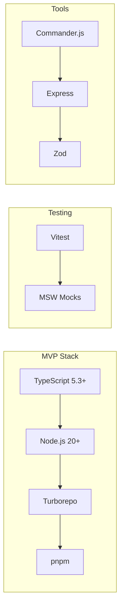

**MVP Technology Selections:**

- **Language:** TypeScript with strict mode
- **Runtime:** Node.js 20 LTS
- **Build:** Turborepo for 6 packages
- **Testing:** Vitest + MSW
- **CLI:** Commander.js
- **API:** Express (minimal)
- **Validation:** Zod

### MVP Package Architecture

```mermaid
graph TB
    subgraph "6 Core Packages Only"
        Core[@orchestr8/core<br/>⚡ Orchestration]
        Resilience[@orchestr8/resilience<br/>🛡️ Patterns]
        Schema[@orchestr8/schema<br/>📋 Workflow AST]
        AgentBase[@orchestr8/agent-base<br/>🤖 Base Classes]
        Testing[@orchestr8/testing<br/>🧪 Test Harness]
        CLI[@orchestr8/cli<br/>⌨️ Developer CLI]
    end

    Core --> Resilience
    Core --> Schema
    AgentBase --> Core
    Testing --> AgentBase
    CLI --> Core
    CLI --> Testing
```

## MVP Resilience Implementation

### Basic Patterns Only

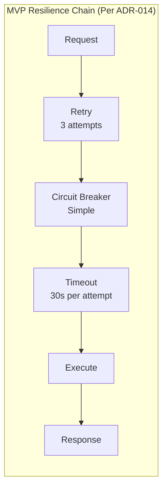

**Composition Order (Per ADR-014):**

1. **Retry orchestrates** - Controls multiple attempts with backoff
2. **Circuit breaker tracks** - Monitors failures across all attempts
3. **Timeout per attempt** - Each retry gets its own 30s timeout

### Resilience Helper Implementation (Per ADR-004)

```typescript
// MVP Resilience Helper - AbortSignal propagation and exponential backoff with jitter
export class ResilienceHelper {
  constructor(
    private config = {
      timeout: 30000, // Per-attempt timeout
      retries: 3,
      circuitBreaker: {
        failureThreshold: 5,
        resetTimeout: 60000,
      },
    },
  ) {}

  async execute<T>(
    operation: (signal: AbortSignal) => Promise<T>,
    signal?: AbortSignal,
  ): Promise<T> {
    // Check for cancellation before starting
    if (signal?.aborted) {
      throw new AbortError('Operation aborted before execution')
    }

    // Retry wraps everything (outermost)
    return await this.retry(async (attempt: number) => {
      // Circuit breaker checks state
      return await this.circuitBreaker(async () => {
        // Timeout per individual attempt (innermost) with AbortSignal
        return await this.timeout(operation, signal)
      })
    }, signal)
  }

  private async retry<T>(
    fn: (attempt: number) => Promise<T>,
    signal?: AbortSignal,
  ): Promise<T> {
    let lastError: Error

    for (let attempt = 0; attempt < this.config.retries; attempt++) {
      // Check for cancellation before each attempt
      if (signal?.aborted) {
        throw new AbortError('Operation aborted during retry')
      }

      try {
        return await fn(attempt)
      } catch (error) {
        lastError = error as Error

        // Don't retry if aborted
        if (error instanceof AbortError) {
          throw error
        }

        if (attempt < this.config.retries - 1) {
          // Exponential backoff with full jitter (per ADR-004)
          const baseDelay = Math.pow(2, attempt) * 1000 // 1s, 2s, 4s
          const jitteredDelay = Math.random() * baseDelay // Full jitter
          await this.delay(jitteredDelay, signal)
        }
      }
    }

    throw lastError!
  }

  private async circuitBreaker<T>(fn: () => Promise<T>): Promise<T> {
    if (this.circuitOpen) {
      throw new CircuitBreakerOpenError('Circuit breaker open')
    }

    try {
      const result = await fn()
      this.recordSuccess()
      return result
    } catch (error) {
      this.recordFailure()
      throw error
    }
  }

  private async timeout<T>(
    fn: (signal: AbortSignal) => Promise<T>,
    parentSignal?: AbortSignal,
  ): Promise<T> {
    // Create timeout controller
    const timeoutController = new AbortController()

    // Combine parent signal with timeout signal
    const combinedSignal = this.combineSignals(
      [parentSignal, timeoutController.signal].filter(Boolean) as AbortSignal[],
    )

    const timeoutId = setTimeout(() => {
      timeoutController.abort()
    }, this.config.timeout)

    try {
      return await fn(combinedSignal)
    } catch (error) {
      if (timeoutController.signal.aborted && !parentSignal?.aborted) {
        throw new TimeoutError(
          `Operation timed out after ${this.config.timeout}ms`,
        )
      }
      throw error
    } finally {
      clearTimeout(timeoutId)
    }
  }

  private combineSignals(signals: AbortSignal[]): AbortSignal {
    if (signals.length === 0) {
      return new AbortController().signal
    }
    if (signals.length === 1) {
      return signals[0]
    }

    const controller = new AbortController()

    // Abort if any signal aborts
    signals.forEach((signal) => {
      if (signal.aborted) {
        controller.abort()
      } else {
        signal.addEventListener('abort', () => controller.abort(), {
          once: true,
        })
      }
    })

    return controller.signal
  }

  private async delay(ms: number, signal?: AbortSignal): Promise<void> {
    return new Promise((resolve, reject) => {
      const timeout = setTimeout(resolve, ms)

      if (signal) {
        const onAbort = () => {
          clearTimeout(timeout)
          reject(new AbortError('Delay aborted'))
        }

        if (signal.aborted) {
          clearTimeout(timeout)
          reject(new AbortError('Delay aborted'))
        } else {
          signal.addEventListener('abort', onAbort, { once: true })
        }
      }
    })
  }

  // Circuit breaker state management
  private circuitOpen = false
  private failureCount = 0
  private lastFailureTime = 0

  private recordSuccess(): void {
    this.failureCount = 0
    this.circuitOpen = false
  }

  private recordFailure(): void {
    this.failureCount++
    this.lastFailureTime = Date.now()

    if (this.failureCount >= this.config.circuitBreaker.failureThreshold) {
      this.circuitOpen = true
    }
  }

  private get circuitOpen(): boolean {
    if (!this._circuitOpen) return false

    // Check if reset timeout has passed
    if (
      Date.now() - this.lastFailureTime >=
      this.config.circuitBreaker.resetTimeout
    ) {
      this._circuitOpen = false
      this.failureCount = 0
    }

    return this._circuitOpen
  }

  private set circuitOpen(value: boolean) {
    this._circuitOpen = value
  }

  private _circuitOpen = false
}

// Error classes for proper error handling
export class AbortError extends Error {
  constructor(message: string) {
    super(message)
    this.name = 'AbortError'
  }
}

export class CircuitBreakerOpenError extends Error {
  constructor(message: string) {
    super(message)
    this.name = 'CircuitBreakerOpenError'
  }
}

export class TimeoutError extends Error {
  constructor(message: string) {
    super(message)
    this.name = 'TimeoutError'
  }
}
```

### Enhanced Implementation (Per ADR-019)

The following implementations provide the precise operational semantics defined in ADR-019 for production-grade resilience, scheduling, and observability.

#### Resilience Composition with Circuit Breaker Keys

```typescript
// Enhanced resilience manager with precise ADR-019 semantics
export class ProductionResilienceManager {
  private circuitBreakers = new Map<string, CircuitBreakerState>()
  private readonly scheduler: FairScheduler

  constructor(private config: GlobalResilienceConfig) {
    this.scheduler = new FairScheduler(config.maxConcurrency)
  }

  async executeWithResilience<T>(
    operation: (signal: AbortSignal) => Promise<T>,
    signal: AbortSignal,
    config: ResilienceConfig,
  ): Promise<T> {
    // ADR-019: Exact composition order
    return await this.retry(
      async (attemptSignal) => {
        return await this.circuitBreaker(
          async (cbSignal) => {
            return await this.timeout(operation, config.timeoutMs, cbSignal)
          },
          config.circuitBreakerKey,
          attemptSignal,
        )
      },
      signal,
      config.retryPolicy,
    )
  }

  private async retry<T>(
    operation: (signal: AbortSignal) => Promise<T>,
    signal: AbortSignal,
    policy: RetryPolicy,
  ): Promise<T> {
    let lastError: Error | undefined

    for (let attempt = 0; attempt < policy.maxAttempts; attempt++) {
      if (signal.aborted) {
        throw new CancelledError('Operation cancelled', { attempts: attempt })
      }

      try {
        return await operation(signal)
      } catch (error) {
        lastError = error as Error

        // Check if error is retryable per ADR-019 taxonomy
        if (!this.isRetryableError(error)) {
          throw error
        }

        // Apply jitterfull backoff for non-final attempts
        if (attempt < policy.maxAttempts - 1) {
          const baseDelay = policy.baseDelayMs * Math.pow(2, attempt)
          const jitteredDelay = baseDelay * (0.5 + Math.random() * 1.0) // Full jitter
          await this.delay(jitteredDelay, signal)
        }
      }
    }

    throw lastError!
  }

  private async circuitBreaker<T>(
    operation: (signal: AbortSignal) => Promise<T>,
    key: string,
    signal: AbortSignal,
  ): Promise<T> {
    const cb = this.getOrCreateCircuitBreaker(key)

    // Check circuit breaker state per ADR-019 policy
    if (cb.state === 'open') {
      const timeSinceOpen = Date.now() - cb.openedAt!
      if (timeSinceOpen < 60000) {
        // 60s timeout
        throw new CircuitOpenError(`Circuit breaker ${key} is open`, {
          key,
          state: 'open',
        })
      } else {
        // Transition to half-open for single probe
        cb.state = 'half-open'
        cb.halfOpenAttempts = 0
      }
    }

    if (cb.state === 'half-open' && cb.halfOpenAttempts! > 0) {
      throw new CircuitOpenError(
        `Circuit breaker ${key} in half-open - already probing`,
        { key, state: 'half-open' },
      )
    }

    try {
      if (cb.state === 'half-open') {
        cb.halfOpenAttempts!++
      }

      const result = await operation(signal)

      // Success: reset or close circuit
      if (cb.state === 'half-open') {
        cb.state = 'closed'
        cb.failureCount = 0
        cb.halfOpenAttempts = undefined
        cb.openedAt = undefined
      } else {
        cb.failureCount = Math.max(0, cb.failureCount - 1) // Gradual recovery
      }

      return result
    } catch (error) {
      // Count failures per ADR-019 taxonomy
      if (this.isCircuitBreakerError(error)) {
        cb.failureCount++

        if (cb.state === 'half-open') {
          cb.state = 'open'
          cb.openedAt = Date.now()
          cb.halfOpenAttempts = undefined
        } else if (cb.failureCount >= 5) {
          // ADR-019 threshold
          cb.state = 'open'
          cb.openedAt = Date.now()
        }
      }

      throw error
    }
  }

  private isRetryableError(error: any): boolean {
    // ADR-019 retryable error taxonomy
    return (
      error instanceof TimeoutError ||
      error instanceof NetworkError ||
      error instanceof RetryableError ||
      (error.code >= 500 && error.code < 600)
    ) // 5xx HTTP errors
  }

  private isCircuitBreakerError(error: any): boolean {
    // ADR-019 circuit breaker error taxonomy
    return (
      error instanceof TimeoutError ||
      error instanceof NetworkError ||
      error instanceof RetryableError ||
      (error.code >= 500 && error.code < 600)
    )
  }
}

interface CircuitBreakerState {
  state: 'closed' | 'open' | 'half-open'
  failureCount: number
  openedAt?: number
  halfOpenAttempts?: number
}
```

#### Fair Scheduler with Topological Ordering

```typescript
// Fair scheduler implementing ADR-019 concurrency semantics
export class FairScheduler {
  private readyQueue: PriorityQueue<ScheduledTask> = new PriorityQueue()
  private runningTasks = new Set<string>()
  private dependencies = new Map<string, Set<string>>()

  constructor(private maxConcurrency: number = 10) {}

  async schedule<T>(
    taskId: string,
    operation: (signal: AbortSignal) => Promise<T>,
    dependencies: string[] = [],
    signal?: AbortSignal,
  ): Promise<T> {
    // Register dependencies for topological ordering
    this.dependencies.set(taskId, new Set(dependencies))

    return new Promise((resolve, reject) => {
      const task: ScheduledTask = {
        id: taskId,
        operation,
        dependencies: new Set(dependencies),
        resolve,
        reject,
        signal,
        queuedAt: Date.now(),
      }

      this.enqueue(task)
      this.processQueue()
    })
  }

  private enqueue(task: ScheduledTask): void {
    // Fair scheduling: prioritize by queue time
    const priority = -task.queuedAt // Negative for min-heap behavior
    this.readyQueue.enqueue(task, priority)
  }

  private async processQueue(): Promise<void> {
    while (
      this.readyQueue.size() > 0 &&
      this.runningTasks.size < this.maxConcurrency
    ) {
      const task = this.findNextReadyTask()
      if (!task) break

      this.runningTasks.add(task.id)
      this.runTask(task)
    }
  }

  private findNextReadyTask(): ScheduledTask | null {
    // Find task with all dependencies satisfied (topological ordering)
    const tasks = this.readyQueue.drain()
    let readyTask: ScheduledTask | null = null
    const remainingTasks: ScheduledTask[] = []

    for (const task of tasks) {
      if (this.areDependenciesCompleted(task.dependencies)) {
        readyTask = task
        break
      }
      remainingTasks.push(task)
    }

    // Re-enqueue remaining tasks
    remainingTasks.forEach((task) => this.enqueue(task))

    return readyTask
  }

  private areDependenciesCompleted(dependencies: Set<string>): boolean {
    return Array.from(dependencies).every((dep) => !this.runningTasks.has(dep))
  }

  private async runTask(task: ScheduledTask): Promise<void> {
    try {
      const result = await task.operation(
        task.signal || new AbortController().signal,
      )
      task.resolve(result)
    } catch (error) {
      task.reject(error)
    } finally {
      this.runningTasks.delete(task.id)
      this.processQueue() // Process next tasks
    }
  }
}

interface ScheduledTask {
  id: string
  operation: (signal: AbortSignal) => Promise<any>
  dependencies: Set<string>
  resolve: (value: any) => void
  reject: (error: Error) => void
  signal?: AbortSignal
  queuedAt: number
}
```

#### Idempotency Manager

```typescript
// Idempotency manager implementing ADR-019 semantics
export class IdempotencyManager {
  private cache = new Map<string, IdempotencyRecord>()
  private readonly ttlMs = 10 * 60 * 1000 // 10 minutes TTL

  async executeIdempotent<T>(
    key: string,
    operation: () => Promise<T>,
  ): Promise<{ result: T; wasReused: boolean }> {
    const existing = this.cache.get(key)

    if (existing && !this.isExpired(existing)) {
      // Return cached result
      return { result: existing.result as T, wasReused: true }
    }

    // Execute operation and cache result
    try {
      const result = await operation()
      this.cache.set(key, {
        result,
        timestamp: Date.now(),
        executionId: generateExecutionId(),
      })

      return { result, wasReused: false }
    } catch (error) {
      // Don't cache errors per ADR-019
      throw error
    }
  }

  private isExpired(record: IdempotencyRecord): boolean {
    return Date.now() - record.timestamp > this.ttlMs
  }

  // Cleanup expired entries periodically
  startCleanup(): void {
    setInterval(() => {
      for (const [key, record] of this.cache.entries()) {
        if (this.isExpired(record)) {
          this.cache.delete(key)
        }
      }
    }, 60000) // Clean every minute
  }
}

interface IdempotencyRecord {
  result: any
  timestamp: number
  executionId: string
}
```

#### Expression Evaluation with Validation

```typescript
// Expression evaluator implementing ADR-019 syntax
export class ExpressionEvaluator {
  evaluate(expression: string, context: ExecutionContext): any {
    // ADR-019 syntax: ${steps.<id>.output.<path>} with ?? operator
    const match = expression.match(
      /^\$\{steps\.([^.]+)\.output\.([^}]+)\}(?:\s*\?\?\s*(.+))?$/,
    )

    if (!match) {
      throw new ValidationError(`Invalid expression syntax: ${expression}`, {
        code: 'EXPR_INVALID_SYNTAX',
        expression,
      })
    }

    const [, stepId, outputPath, defaultValue] = match

    // Validate step exists
    if (!context.steps.has(stepId)) {
      if (defaultValue !== undefined) {
        return this.parseValue(defaultValue)
      }
      throw new ValidationError(`Step not found: ${stepId}`, {
        code: 'EXPR_STEP_NOT_FOUND',
        stepId,
        expression,
      })
    }

    const step = context.steps.get(stepId)!

    // Validate step is completed
    if (step.status !== 'completed') {
      throw new ValidationError(`Step not completed: ${stepId}`, {
        code: 'EXPR_STEP_NOT_COMPLETED',
        stepId,
        status: step.status,
        expression,
      })
    }

    // Extract output value
    const value = this.extractValue(step.output, outputPath)

    if (value === undefined && defaultValue !== undefined) {
      return this.parseValue(defaultValue)
    }

    if (value === undefined) {
      throw new ValidationError(`Output path not found: ${outputPath}`, {
        code: 'EXPR_PATH_NOT_FOUND',
        stepId,
        outputPath,
        expression,
      })
    }

    return value
  }

  private extractValue(obj: any, path: string): any {
    return path.split('.').reduce((current, key) => current?.[key], obj)
  }

  private parseValue(value: string): any {
    // Handle JSON literals
    if (value.startsWith('"') && value.endsWith('"')) {
      return value.slice(1, -1) // String literal
    }
    if (value === 'true') return true
    if (value === 'false') return false
    if (value === 'null') return null
    if (/^\d+$/.test(value)) return parseInt(value, 10)
    if (/^\d+\.\d+$/.test(value)) return parseFloat(value)
    return value // Fallback to string
  }
}
```

## Error Taxonomy and Structured Error Codes

Based on the architectural review feedback, the @orchestr8 system requires a comprehensive error taxonomy with structured error codes to enable proper error handling, monitoring, and debugging across all components.

### Error Classification Framework

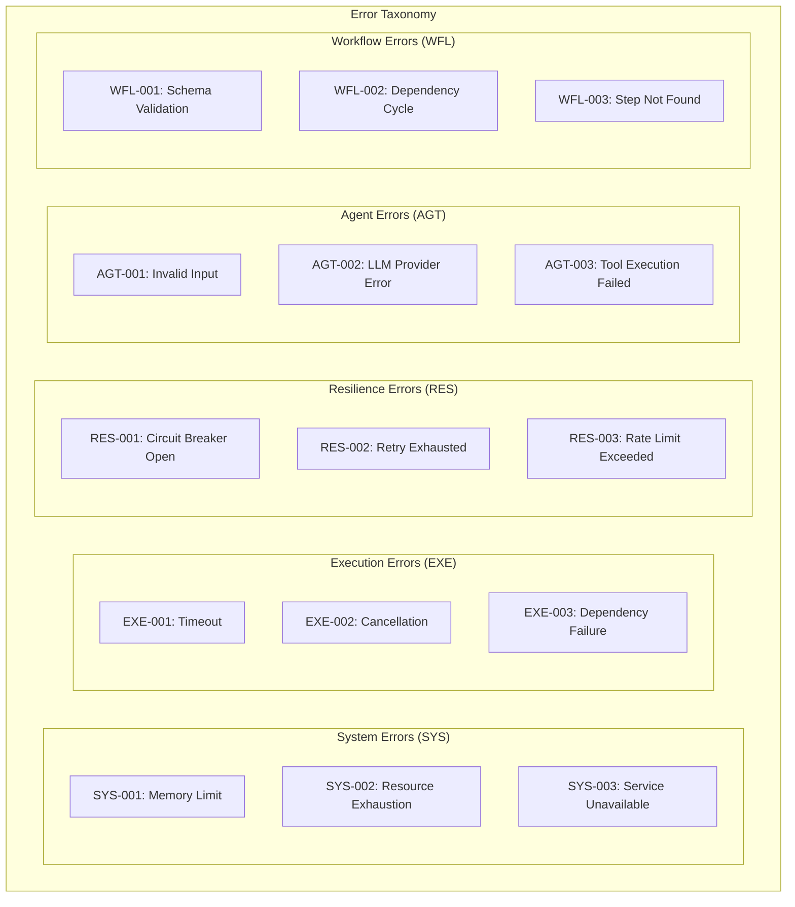

### Core Error Types with Structured Codes

```typescript
export enum ErrorCategory {
  SYSTEM = 'SYS',
  EXECUTION = 'EXE',
  RESILIENCE = 'RES',
  AGENT = 'AGT',
  WORKFLOW = 'WFL',
  VALIDATION = 'VAL',
  NETWORK = 'NET',
  AUTHENTICATION = 'AUTH',
  CONFIGURATION = 'CFG',
}

export enum ErrorSeverity {
  CRITICAL = 'CRITICAL', // System failure, immediate attention
  ERROR = 'ERROR', // Operation failed, retry may work
  WARNING = 'WARNING', // Degraded performance, monitoring needed
  INFO = 'INFO', // Informational, no action needed
}

export interface StructuredError {
  code: string // e.g., "SYS-001"
  category: ErrorCategory
  severity: ErrorSeverity
  message: string
  timestamp: string
  correlationId?: string
  executionId?: string
  stepId?: string
  agentId?: string
  metadata?: Record<string, any>
  cause?: Error
  stack?: string
  retryable: boolean
  userActionRequired: boolean
}

// Enhanced error classes with structured codes
export class OrchestrationError extends Error implements StructuredError {
  code: string
  category: ErrorCategory
  severity: ErrorSeverity
  timestamp: string
  correlationId?: string
  executionId?: string
  stepId?: string
  agentId?: string
  metadata?: Record<string, any>
  cause?: Error
  retryable: boolean
  userActionRequired: boolean

  constructor(
    code: string,
    category: ErrorCategory,
    message: string,
    options: {
      severity?: ErrorSeverity
      correlationId?: string
      executionId?: string
      stepId?: string
      agentId?: string
      metadata?: Record<string, any>
      cause?: Error
      retryable?: boolean
      userActionRequired?: boolean
    } = {},
  ) {
    super(message)
    this.name = 'OrchestrationError'
    this.code = code
    this.category = category
    this.severity = options.severity || ErrorSeverity.ERROR
    this.timestamp = new Date().toISOString()
    this.correlationId = options.correlationId
    this.executionId = options.executionId
    this.stepId = options.stepId
    this.agentId = options.agentId
    this.metadata = options.metadata
    this.cause = options.cause
    this.retryable = options.retryable || false
    this.userActionRequired = options.userActionRequired || false
  }

  toJSON(): StructuredError {
    return {
      code: this.code,
      category: this.category,
      severity: this.severity,
      message: this.message,
      timestamp: this.timestamp,
      correlationId: this.correlationId,
      executionId: this.executionId,
      stepId: this.stepId,
      agentId: this.agentId,
      metadata: this.metadata,
      cause: this.cause,
      stack: this.stack,
      retryable: this.retryable,
      userActionRequired: this.userActionRequired,
    }
  }
}
```

### Comprehensive Error Code Registry

```typescript
export const ERROR_CODES = {
  // System Errors (SYS)
  SYS_001_MEMORY_LIMIT: {
    code: 'SYS-001',
    category: ErrorCategory.SYSTEM,
    severity: ErrorSeverity.CRITICAL,
    message: 'Memory limit exceeded',
    retryable: false,
    userActionRequired: true,
  },
  SYS_002_RESOURCE_EXHAUSTION: {
    code: 'SYS-002',
    category: ErrorCategory.SYSTEM,
    severity: ErrorSeverity.CRITICAL,
    message: 'System resources exhausted',
    retryable: false,
    userActionRequired: true,
  },
  SYS_003_SERVICE_UNAVAILABLE: {
    code: 'SYS-003',
    category: ErrorCategory.SYSTEM,
    severity: ErrorSeverity.ERROR,
    message: 'Required service unavailable',
    retryable: true,
    userActionRequired: false,
  },

  // Execution Errors (EXE)
  EXE_001_TIMEOUT: {
    code: 'EXE-001',
    category: ErrorCategory.EXECUTION,
    severity: ErrorSeverity.ERROR,
    message: 'Operation timed out',
    retryable: true,
    userActionRequired: false,
  },
  EXE_002_CANCELLATION: {
    code: 'EXE-002',
    category: ErrorCategory.EXECUTION,
    severity: ErrorSeverity.INFO,
    message: 'Operation cancelled by user',
    retryable: false,
    userActionRequired: false,
  },
  EXE_003_DEPENDENCY_FAILURE: {
    code: 'EXE-003',
    category: ErrorCategory.EXECUTION,
    severity: ErrorSeverity.ERROR,
    message: 'Step dependency failed',
    retryable: false,
    userActionRequired: true,
  },

  // Resilience Errors (RES)
  RES_001_CIRCUIT_BREAKER_OPEN: {
    code: 'RES-001',
    category: ErrorCategory.RESILIENCE,
    severity: ErrorSeverity.WARNING,
    message: 'Circuit breaker open - service degraded',
    retryable: true,
    userActionRequired: false,
  },
  RES_002_RETRY_EXHAUSTED: {
    code: 'RES-002',
    category: ErrorCategory.RESILIENCE,
    severity: ErrorSeverity.ERROR,
    message: 'All retry attempts exhausted',
    retryable: false,
    userActionRequired: true,
  },
  RES_003_RATE_LIMIT_EXCEEDED: {
    code: 'RES-003',
    category: ErrorCategory.RESILIENCE,
    severity: ErrorSeverity.WARNING,
    message: 'Rate limit exceeded - throttling active',
    retryable: true,
    userActionRequired: false,
  },

  // Agent Errors (AGT)
  AGT_001_INVALID_INPUT: {
    code: 'AGT-001',
    category: ErrorCategory.AGENT,
    severity: ErrorSeverity.ERROR,
    message: 'Agent received invalid input',
    retryable: false,
    userActionRequired: true,
  },
  AGT_002_LLM_PROVIDER_ERROR: {
    code: 'AGT-002',
    category: ErrorCategory.AGENT,
    severity: ErrorSeverity.ERROR,
    message: 'LLM provider error',
    retryable: true,
    userActionRequired: false,
  },
  AGT_003_TOOL_EXECUTION_FAILED: {
    code: 'AGT-003',
    category: ErrorCategory.AGENT,
    severity: ErrorSeverity.ERROR,
    message: 'Agent tool execution failed',
    retryable: true,
    userActionRequired: false,
  },

  // Workflow Errors (WFL)
  WFL_001_SCHEMA_VALIDATION: {
    code: 'WFL-001',
    category: ErrorCategory.WORKFLOW,
    severity: ErrorSeverity.ERROR,
    message: 'Workflow schema validation failed',
    retryable: false,
    userActionRequired: true,
  },
  WFL_002_DEPENDENCY_CYCLE: {
    code: 'WFL-002',
    category: ErrorCategory.WORKFLOW,
    severity: ErrorSeverity.ERROR,
    message: 'Circular dependency detected in workflow',
    retryable: false,
    userActionRequired: true,
  },
  WFL_003_STEP_NOT_FOUND: {
    code: 'WFL-003',
    category: ErrorCategory.WORKFLOW,
    severity: ErrorSeverity.ERROR,
    message: 'Referenced workflow step not found',
    retryable: false,
    userActionRequired: true,
  },

  // Validation Errors (VAL)
  VAL_001_MISSING_REQUIRED_FIELD: {
    code: 'VAL-001',
    category: ErrorCategory.VALIDATION,
    severity: ErrorSeverity.ERROR,
    message: 'Required field missing',
    retryable: false,
    userActionRequired: true,
  },
  VAL_002_INVALID_FORMAT: {
    code: 'VAL-002',
    category: ErrorCategory.VALIDATION,
    severity: ErrorSeverity.ERROR,
    message: 'Invalid data format',
    retryable: false,
    userActionRequired: true,
  },

  // Network Errors (NET)
  NET_001_CONNECTION_FAILED: {
    code: 'NET-001',
    category: ErrorCategory.NETWORK,
    severity: ErrorSeverity.ERROR,
    message: 'Network connection failed',
    retryable: true,
    userActionRequired: false,
  },
  NET_002_DNS_RESOLUTION_FAILED: {
    code: 'NET-002',
    category: ErrorCategory.NETWORK,
    severity: ErrorSeverity.ERROR,
    message: 'DNS resolution failed',
    retryable: true,
    userActionRequired: false,
  },

  // Configuration Errors (CFG)
  CFG_001_INVALID_CONFIG: {
    code: 'CFG-001',
    category: ErrorCategory.CONFIGURATION,
    severity: ErrorSeverity.CRITICAL,
    message: 'Invalid configuration detected',
    retryable: false,
    userActionRequired: true,
  },
  CFG_002_MISSING_ENV_VAR: {
    code: 'CFG-002',
    category: ErrorCategory.CONFIGURATION,
    severity: ErrorSeverity.CRITICAL,
    message: 'Required environment variable missing',
    retryable: false,
    userActionRequired: true,
  },
} as const
```

### Error Factory and Utilities

```typescript
export class ErrorFactory {
  static create(
    errorCode: keyof typeof ERROR_CODES,
    context: {
      correlationId?: string
      executionId?: string
      stepId?: string
      agentId?: string
      metadata?: Record<string, any>
      cause?: Error
      customMessage?: string
    } = {},
  ): OrchestrationError {
    const errorDef = ERROR_CODES[errorCode]

    return new OrchestrationError(
      errorDef.code,
      errorDef.category,
      context.customMessage || errorDef.message,
      {
        severity: errorDef.severity,
        correlationId: context.correlationId,
        executionId: context.executionId,
        stepId: context.stepId,
        agentId: context.agentId,
        metadata: context.metadata,
        cause: context.cause,
        retryable: errorDef.retryable,
        userActionRequired: errorDef.userActionRequired,
      },
    )
  }

  static fromError(
    error: Error,
    errorCode: keyof typeof ERROR_CODES,
    context: {
      correlationId?: string
      executionId?: string
      stepId?: string
      agentId?: string
      metadata?: Record<string, any>
    } = {},
  ): OrchestrationError {
    return this.create(errorCode, {
      ...context,
      cause: error,
      customMessage: error.message,
    })
  }
}

// Enhanced error classes for specific error types
export class SystemError extends OrchestrationError {
  constructor(code: string, message: string, options: any = {}) {
    super(code, ErrorCategory.SYSTEM, message, {
      severity: ErrorSeverity.CRITICAL,
      ...options,
    })
    this.name = 'SystemError'
  }
}

export class ExecutionTimeoutError extends OrchestrationError {
  constructor(timeoutMs: number, options: any = {}) {
    super(
      'EXE-001',
      ErrorCategory.EXECUTION,
      `Operation timed out after ${timeoutMs}ms`,
      {
        severity: ErrorSeverity.ERROR,
        retryable: true,
        metadata: { timeoutMs },
        ...options,
      },
    )
    this.name = 'ExecutionTimeoutError'
  }
}

export class CircuitBreakerOpenError extends OrchestrationError {
  constructor(serviceKey: string, options: any = {}) {
    super(
      'RES-001',
      ErrorCategory.RESILIENCE,
      `Circuit breaker open for service: ${serviceKey}`,
      {
        severity: ErrorSeverity.WARNING,
        retryable: true,
        metadata: { serviceKey },
        ...options,
      },
    )
    this.name = 'CircuitBreakerOpenError'
  }
}

export class WorkflowValidationError extends OrchestrationError {
  constructor(validationErrors: string[], options: any = {}) {
    super(
      'WFL-001',
      ErrorCategory.WORKFLOW,
      `Workflow validation failed: ${validationErrors.join(', ')}`,
      {
        severity: ErrorSeverity.ERROR,
        retryable: false,
        userActionRequired: true,
        metadata: { validationErrors },
        ...options,
      },
    )
    this.name = 'WorkflowValidationError'
  }
}
```

### Error Monitoring and Metrics

```typescript
export class ErrorMetricsCollector {
  private errorCounts = new Map<string, number>()
  private errorRates = new Map<string, { count: number; window: number }>()

  recordError(error: StructuredError): void {
    // Increment error count by code
    const current = this.errorCounts.get(error.code) || 0
    this.errorCounts.set(error.code, current + 1)

    // Update error rate (5-minute window)
    const now = Date.now()
    const windowKey = `${error.code}_${Math.floor(now / 300000)}`
    const windowData = this.errorRates.get(windowKey) || {
      count: 0,
      window: now,
    }
    this.errorRates.set(windowKey, { count: windowData.count + 1, window: now })

    // Log structured error
    console.error('Structured error occurred:', {
      code: error.code,
      category: error.category,
      severity: error.severity,
      message: error.message,
      correlationId: error.correlationId,
      executionId: error.executionId,
      retryable: error.retryable,
      userActionRequired: error.userActionRequired,
      timestamp: error.timestamp,
    })

    // Trigger alerts for critical errors
    if (error.severity === ErrorSeverity.CRITICAL) {
      this.triggerCriticalAlert(error)
    }
  }

  private triggerCriticalAlert(error: StructuredError): void {
    // In MVP: log critical alert
    console.error('CRITICAL ERROR ALERT:', {
      code: error.code,
      message: error.message,
      executionId: error.executionId,
      timestamp: error.timestamp,
    })

    // Future: integrate with alerting system
  }

  getErrorStats(): { code: string; count: number; category: ErrorCategory }[] {
    return Array.from(this.errorCounts.entries()).map(([code, count]) => {
      const category = code.split('-')[0] as ErrorCategory
      return { code, count, category }
    })
  }
}

// Global error metrics instance
export const errorMetrics = new ErrorMetricsCollector()
```

### Integration with Existing Components

```typescript
// Updated resilience components to use structured errors
export class EnhancedRetryPolicy {
  async execute<T>(
    operation: (signal: AbortSignal) => Promise<T>,
    signal: AbortSignal,
    config: RetryConfig,
  ): Promise<T> {
    let lastError: OrchestrationError

    for (let attempt = 1; attempt <= config.maxAttempts; attempt++) {
      try {
        if (signal.aborted) {
          throw ErrorFactory.create('EXE_002_CANCELLATION', {
            correlationId: this.correlationId,
          })
        }

        return await operation(signal)
      } catch (error) {
        // Convert to structured error if needed
        lastError =
          error instanceof OrchestrationError
            ? error
            : ErrorFactory.fromError(
                error as Error,
                'AGT_003_TOOL_EXECUTION_FAILED',
                {
                  correlationId: this.correlationId,
                  metadata: { attempt, maxAttempts: config.maxAttempts },
                },
              )

        // Record error metrics
        errorMetrics.recordError(lastError)

        if (!lastError.retryable || attempt === config.maxAttempts) {
          break
        }

        await this.delay(this.calculateDelay(attempt, config), signal)
      }
    }

    // Final error with retry exhausted context
    throw ErrorFactory.create('RES_002_RETRY_EXHAUSTED', {
      correlationId: this.correlationId,
      cause: lastError,
      metadata: { maxAttempts: config.maxAttempts, finalError: lastError.code },
    })
  }
}
```

### Error Recovery Strategies

```typescript
export interface ErrorRecoveryStrategy {
  canRecover(error: StructuredError): boolean
  recover(error: StructuredError, context: ExecutionContext): Promise<void>
}

export class CircuitBreakerRecovery implements ErrorRecoveryStrategy {
  canRecover(error: StructuredError): boolean {
    return error.code === 'RES-001' && error.retryable
  }

  async recover(
    error: StructuredError,
    context: ExecutionContext,
  ): Promise<void> {
    // Wait for circuit breaker to reset
    await new Promise((resolve) => setTimeout(resolve, 60000))
    console.info('Circuit breaker recovery attempted', {
      correlationId: context.correlationId,
      errorCode: error.code,
    })
  }
}

export class ErrorRecoveryManager {
  private strategies: ErrorRecoveryStrategy[] = [new CircuitBreakerRecovery()]

  async attemptRecovery(
    error: StructuredError,
    context: ExecutionContext,
  ): Promise<boolean> {
    for (const strategy of this.strategies) {
      if (strategy.canRecover(error)) {
        try {
          await strategy.recover(error, context)
          return true
        } catch (recoveryError) {
          console.warn('Error recovery failed', {
            originalError: error.code,
            recoveryError:
              recoveryError instanceof Error
                ? recoveryError.message
                : recoveryError,
            correlationId: context.correlationId,
          })
        }
      }
    }
    return false
  }
}
```

### Error Taxonomy Benefits

This comprehensive error taxonomy provides:

1. **Structured Error Codes**: Clear categorization with unique identifiers
2. **Severity Classification**: Critical/Error/Warning/Info levels for proper alerting
3. **Retry Guidance**: Built-in retryable flags for automatic recovery decisions
4. **Context Preservation**: Correlation IDs, execution context, and metadata
5. **Metrics Collection**: Automatic error counting and rate tracking
6. **Recovery Strategies**: Pluggable recovery mechanisms for different error types
7. **User Action Flags**: Clear indication when user intervention is required
8. **Debugging Support**: Rich context for troubleshooting and root cause analysis

The implementation addresses the architectural review's error handling concerns while maintaining simplicity for the MVP timeline.

## Structured Logging Implementation

### Correlation ID Propagation (Per ADR-004)

```typescript
// Structured logging with correlation ID support
export class StructuredLogger {
  private serviceName = '@orchestr8/core'
  private serviceVersion = '1.0.0'

  constructor(private context?: { correlationId?: string }) {}

  // Core logging method with structured format
  log(
    level: 'info' | 'warn' | 'error' | 'debug',
    message: string,
    metadata?: Record<string, any>,
  ): void {
    const entry = {
      timestamp: new Date().toISOString(),
      level,
      message,
      service: this.serviceName,
      version: this.serviceVersion,
      correlationId:
        this.context?.correlationId || this.generateCorrelationId(),
      ...this.sanitizeMetadata(metadata),
    }

    // Output to console in development, structured JSON in production
    if (process.env.NODE_ENV === 'development') {
      console.log(`[${entry.level.toUpperCase()}] ${entry.message}`, metadata)
    } else {
      console.log(JSON.stringify(entry))
    }
  }

  // Convenience methods
  info(message: string, metadata?: Record<string, any>): void {
    this.log('info', message, metadata)
  }

  warn(message: string, metadata?: Record<string, any>): void {
    this.log('warn', message, metadata)
  }

  error(message: string, error?: Error, metadata?: Record<string, any>): void {
    const errorMetadata = error
      ? {
          error: {
            name: error.name,
            message: error.message,
            stack: error.stack,
          },
        }
      : {}

    this.log('error', message, { ...errorMetadata, ...metadata })
  }

  debug(message: string, metadata?: Record<string, any>): void {
    if (process.env.NODE_ENV === 'development' || process.env.DEBUG) {
      this.log('debug', message, metadata)
    }
  }

  // Create child logger with inherited correlation ID
  child(additionalContext: Record<string, any>): StructuredLogger {
    return new StructuredLogger({
      ...this.context,
      ...additionalContext,
    })
  }

  private generateCorrelationId(): string {
    return `${Date.now()}-${Math.random().toString(36).substr(2, 9)}`
  }

  private sanitizeMetadata(
    metadata?: Record<string, any>,
  ): Record<string, any> {
    if (!metadata) return {}

    // Remove sensitive fields
    const sensitive = ['password', 'token', 'secret', 'key', 'auth']
    const sanitized = { ...metadata }

    for (const key in sanitized) {
      if (sensitive.some((s) => key.toLowerCase().includes(s))) {
        sanitized[key] = '[REDACTED]'
      }
    }

    return sanitized
  }
}

// Usage example with correlation ID propagation
export class OrchestrationEngine {
  private logger: StructuredLogger

  constructor(correlationId?: string) {
    this.logger = new StructuredLogger({ correlationId })
  }

  async execute(workflow: Workflow): Promise<ExecutionResult> {
    const executionId = crypto.randomUUID()
    const logger = this.logger.child({ executionId, workflowId: workflow.id })

    logger.info('Starting workflow execution', {
      steps: workflow.steps.length,
      timeout: workflow.timeout,
    })

    try {
      const result = await this.executeSteps(workflow.steps, logger)

      logger.info('Workflow execution completed', {
        duration: result.duration,
        status: 'success',
      })

      return result
    } catch (error) {
      logger.error('Workflow execution failed', error, {
        failedAt: Date.now(),
      })
      throw error
    }
  }

  private async executeSteps(
    steps: WorkflowStep[],
    logger: StructuredLogger,
  ): Promise<ExecutionResult> {
    for (const [index, step] of steps.entries()) {
      const stepLogger = logger.child({ stepId: step.id, stepIndex: index })

      stepLogger.info('Executing step', {
        agentId: step.agent.id,
        dependencies: step.dependencies,
      })

      // Execute step with correlation context
      await this.executeStep(step, stepLogger)

      stepLogger.info('Step completed')
    }

    return { status: 'completed', outputs: {} }
  }
}
```

## MVP Workflow AST

### JSON-Based Schema (No XML)

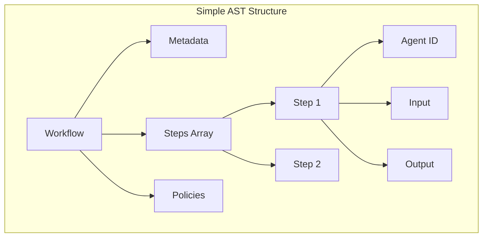

### Minimal Schema

```typescript
// MVP Workflow Schema - Keep it simple
export const WorkflowSchema = z.object({
  version: z.string(),
  metadata: z.object({
    id: z.string().uuid(),
    name: z.string(),
  }),
  steps: z.array(
    z.object({
      id: z.string(),
      agent: z.object({
        id: z.string(),
        version: z.string().optional(),
      }),
      input: z.record(z.unknown()).optional(),
      dependencies: z.array(z.string()).optional(),
    }),
  ),
  policies: z
    .object({
      timeout: z.number().default(30000),
      retries: z.number().default(3),
    })
    .optional(),
})
```

## Execution Semantics

### Resilience Composition (Per ADR-014)

**Correct Composition Order:**

```typescript
// Per ADR-014: Retry wraps circuit breaker wraps timeout
async executeWithResilience<T>(operation: () => Promise<T>): Promise<T> {
  return await retry(async () => {
    // Circuit breaker tracks aggregate failures
    return await circuitBreaker(async () => {
      // Each attempt gets its own timeout
      return await timeout(operation, 30000); // Per-attempt timeout
    });
  }, { maxAttempts: 3 });
}
```

**Key Points (Per ADR-014):**

- Retry is the outermost wrapper (orchestrates attempts)
- Circuit breaker in the middle (tracks aggregate failures)
- Timeout is innermost (30s per individual attempt)
- Total worst-case execution time: 3 × 30s = 90s

### Concurrency Control

**Proper Semaphore with FIFO Fairness:**

```typescript
// Use a proper semaphore library or implement fair queuing
import { Semaphore } from 'async-sema'

class ConcurrencyController {
  // Global and per-agent semaphores for fairness
  private globalSemaphore = new Semaphore(10) // MVP: max 10 concurrent
  private agentSemaphores = new Map<string, Semaphore>()

  async execute(step: WorkflowStep): Promise<void> {
    const agentId = step.agent.id

    // Get or create per-agent semaphore (max 3 per agent)
    if (!this.agentSemaphores.has(agentId)) {
      this.agentSemaphores.set(agentId, new Semaphore(3))
    }
    const agentSem = this.agentSemaphores.get(agentId)!

    // Acquire both semaphores (FIFO order preserved)
    await this.globalSemaphore.acquire()
    await agentSem.acquire()

    try {
      // Execute step
      await this.executeStep(step)
    } finally {
      // Always release in reverse order
      agentSem.release()
      this.globalSemaphore.release()
    }
  }

  // No manual queue management needed - semaphore handles FIFO
  // No starvation possible - fair queuing guaranteed
}
```

### Step Join Semantics

**Fail-Fast vs Wait-Then-Evaluate:**

```typescript
interface JoinSemantics {
  type: 'fail-fast' | 'wait-all';

  // Fail-fast: Cancel remaining on first failure
  // Wait-all: Wait for all, then evaluate
}

async executeJoin(
  steps: WorkflowStep[],
  semantics: JoinSemantics
): Promise<StepResult[]> {
  if (semantics.type === 'fail-fast') {
    // Use Promise.all - fails immediately
    return await Promise.all(steps.map(s => this.execute(s)));
  } else {
    // Use Promise.allSettled - wait for all
    const results = await Promise.allSettled(steps.map(s => this.execute(s)));

    // Evaluate after all complete
    const failures = results.filter(r => r.status === 'rejected');
    if (failures.length > 0) {
      throw new AggregateError(failures.map(f => f.reason));
    }

    return results.map(r => r.value);
  }

}
```

### Idempotency Management

**Size-Bounded LRU Store with TTL:**

```typescript
// Use a proper LRU cache library to prevent memory leaks
import LRU from 'tiny-lru'

class IdempotencyStore {
  // Size-bounded LRU cache with TTL
  private store = LRU(1000, 3600000) // Max 1000 entries, 1hr TTL

  async get(key: string): Promise<any | undefined> {
    return this.store.get(key)
  }

  async set(key: string, result: any, ttl = 3600000): Promise<void> {
    this.store.set(key, result, ttl)
  }

  // LRU automatically evicts oldest entries when full
  // No manual cleanup needed - prevents memory leaks

  getStats() {
    return {
      size: this.store.size,
      capacity: 1000,
      hits: this.store.hits,
      misses: this.store.misses,
    }
  }
}
```

**Note:** MVP idempotency is process-local and non-durable. Distributed idempotency deferred to post-MVP.

### Resource Management

**Always Release on Error/Timeout:**

```typescript
class ResourceManager {
  private resources = new Map<string, Resource>()

  async withResource<T>(
    id: string,
    operation: (resource: Resource) => Promise<T>,
  ): Promise<T> {
    const resource = await this.acquire(id)

    try {
      return await operation(resource)
    } finally {
      // ALWAYS release, even on error/timeout
      await this.release(id)
    }
  }

  private async release(id: string): Promise<void> {
    const resource = this.resources.get(id)
    if (!resource) return // Idempotent release

    try {
      await resource.cleanup()
    } finally {
      this.resources.delete(id)
    }
  }
}
```

**Invariant:** Resources are always released, even on error or timeout. Release operations are idempotent.

## MVP Agent Framework

### Simple Base Class

```typescript
// MVP Agent Base - Minimal complexity
export abstract class BaseAgent {
  abstract id: string
  abstract version: string

  async execute(input: unknown, context: ExecutionContext): Promise<unknown> {
    // Validate input
    const validated = this.validateInput(input)

    // Execute with cancellation support
    if (context.cancellationToken.isCancelled()) {
      throw new Error('Cancelled')
    }

    // Run agent logic
    const result = await this.run(validated, context)

    // Validate output
    return this.validateOutput(result)
  }

  protected abstract validateInput(input: unknown): unknown
  protected abstract run(
    input: unknown,
    context: ExecutionContext,
  ): Promise<unknown>
  protected abstract validateOutput(output: unknown): unknown
}
```

### Enhanced Agent Base with Chain of Thought

```typescript
// Enhanced Agent Base with Chain of Thought Support
export abstract class EnhancedBaseAgent extends BaseAgent {
  protected enableChainOfThought: boolean = true
  protected reasoningDepth: 'basic' | 'detailed' | 'comprehensive' = 'detailed'

  async execute(
    input: unknown,
    context: ExecutionContext,
  ): Promise<AgentResult> {
    // Validate input
    const validated = this.validateInput(input)

    // Check cancellation
    if (context.cancellationToken.isCancelled()) {
      throw new Error('Cancelled')
    }

    // Execute with optional Chain of Thought
    let reasoning: ThinkingProcess | undefined
    let result: unknown

    if (this.enableChainOfThought) {
      const analysis = await this.analyzeTask(validated, context)
      reasoning = analysis.reasoning
      result = await this.runWithThinking(validated, context, analysis)
    } else {
      result = await this.run(validated, context)
    }

    // Validate output
    const validatedOutput = this.validateOutput(result)

    return {
      output: validatedOutput,
      reasoning: reasoning,
      metadata: {
        agent_id: this.id,
        version: this.version,
        execution_time: Date.now() - context.startTime,
        reasoning_enabled: this.enableChainOfThought,
      },
    }
  }

  /**
   * Analyze the task and generate structured reasoning
   */
  protected async analyzeTask(
    input: unknown,
    context: ExecutionContext,
  ): Promise<TaskAnalysis> {
    const complexity = this.assessComplexity(input)
    const reasoning = this.generateReasoningFramework(complexity)

    return {
      complexity,
      reasoning,
      approach: this.selectApproach(input, complexity),
      quality_requirements: this.getQualityRequirements(context),
    }
  }

  /**
   * Execute with structured thinking process
   */
  protected async runWithThinking(
    input: unknown,
    context: ExecutionContext,
    analysis: TaskAnalysis,
  ): Promise<unknown> {
    const thinking = new ThinkingProcess(analysis.reasoning)

    // Step 1: Input Analysis
    thinking.addStep('input_analysis', () => this.analyzeInput(input, context))

    // Step 2: Goal Clarification
    thinking.addStep('goal_clarification', () =>
      this.clarifyGoals(input, context),
    )

    // Step 3: Approach Selection
    thinking.addStep('approach_selection', () =>
      this.selectDetailedApproach(input, analysis),
    )

    // Step 4: Execution Planning
    thinking.addStep('execution_planning', () =>
      this.planExecution(input, analysis),
    )

    // Step 5: Execute Core Logic
    const result = await thinking.executeStep('core_execution', () =>
      this.run(input, context),
    )

    // Step 6: Quality Validation
    thinking.addStep('quality_validation', () =>
      this.validateQuality(result, analysis.quality_requirements),
    )

    // Step 7: Final Verification
    thinking.addStep('final_verification', () =>
      this.verifyResult(result, input, context),
    )

    return result
  }

  /**
   * Generate reasoning framework based on task complexity
   */
  protected generateReasoningFramework(
    complexity: TaskComplexity,
  ): ReasoningFramework {
    switch (complexity.level) {
      case 'simple':
        return {
          steps: ['input_analysis', 'core_execution', 'output_validation'],
          detail_level: 'basic',
          include_alternatives: false,
        }

      case 'moderate':
        return {
          steps: [
            'input_analysis',
            'goal_clarification',
            'approach_selection',
            'core_execution',
            'quality_validation',
          ],
          detail_level: 'detailed',
          include_alternatives: true,
        }

      case 'complex':
        return {
          steps: [
            'input_analysis',
            'goal_clarification',
            'approach_selection',
            'execution_planning',
            'core_execution',
            'quality_validation',
            'final_verification',
          ],
          detail_level: 'comprehensive',
          include_alternatives: true,
          require_confidence_assessment: true,
        }
    }
  }

  /**
   * Assess task complexity to determine reasoning depth
   */
  protected assessComplexity(input: unknown): TaskComplexity {
    // Override in specific agents based on domain knowledge
    return {
      level: 'moderate',
      factors: ['input_structure', 'output_requirements', 'domain_knowledge'],
      estimated_steps: 5,
      requires_validation: true,
    }
  }

  // Abstract methods for Chain of Thought implementation
  protected abstract analyzeInput(
    input: unknown,
    context: ExecutionContext,
  ): InputAnalysis
  protected abstract clarifyGoals(
    input: unknown,
    context: ExecutionContext,
  ): GoalClarification
  protected abstract selectDetailedApproach(
    input: unknown,
    analysis: TaskAnalysis,
  ): ApproachSelection
  protected abstract planExecution(
    input: unknown,
    analysis: TaskAnalysis,
  ): ExecutionPlan
  protected abstract validateQuality(
    result: unknown,
    requirements: QualityRequirements,
  ): QualityValidation
  protected abstract verifyResult(
    result: unknown,
    input: unknown,
    context: ExecutionContext,
  ): ResultVerification
}

// Chain of Thought Data Structures
interface ThinkingProcess {
  steps: ThinkingStep[]
  reasoning_framework: ReasoningFramework
  start_time: number
  completion_time?: number

  addStep(name: string, logic: () => any): void
  executeStep(name: string, logic: () => Promise<any>): Promise<any>
  getReasoningTrace(): ReasoningTrace
}

interface ThinkingStep {
  name: string
  description?: string
  input?: unknown
  output?: unknown
  reasoning?: string
  confidence?: number
  alternatives_considered?: Alternative[]
  execution_time: number
}

interface TaskAnalysis {
  complexity: TaskComplexity
  reasoning: ReasoningFramework
  approach: ApproachSelection
  quality_requirements: QualityRequirements
}

interface TaskComplexity {
  level: 'simple' | 'moderate' | 'complex'
  factors: string[]
  estimated_steps: number
  requires_validation: boolean
}

interface ReasoningFramework {
  steps: string[]
  detail_level: 'basic' | 'detailed' | 'comprehensive'
  include_alternatives: boolean
  require_confidence_assessment?: boolean
}

interface AgentResult {
  output: unknown
  reasoning?: ThinkingProcess
  metadata: {
    agent_id: string
    version: string
    execution_time: number
    reasoning_enabled: boolean
  }
}

// Analysis Interfaces
interface InputAnalysis {
  structure: 'simple' | 'complex' | 'malformed'
  completeness: number // 0-1
  quality_indicators: string[]
  potential_issues: string[]
}

interface GoalClarification {
  primary_objective: string
  secondary_objectives: string[]
  success_criteria: string[]
  constraints: string[]
}

interface ApproachSelection {
  selected_approach: string
  rationale: string
  alternatives_considered: Alternative[]
  estimated_confidence: number
}

interface Alternative {
  name: string
  description: string
  pros: string[]
  cons: string[]
  confidence: number
}

interface ExecutionPlan {
  steps: ExecutionStep[]
  estimated_duration: number
  resource_requirements: string[]
  risk_factors: string[]
}

interface ExecutionStep {
  name: string
  description: string
  dependencies: string[]
  estimated_time: number
}

interface QualityRequirements {
  accuracy_threshold: number
  completeness_threshold: number
  consistency_requirements: string[]
  validation_criteria: string[]
}

interface QualityValidation {
  meets_requirements: boolean
  accuracy_score: number
  completeness_score: number
  quality_issues: string[]
  recommendations: string[]
}

interface ResultVerification {
  confidence_level: number
  verification_steps: string[]
  potential_improvements: string[]
  final_assessment: 'approved' | 'needs_revision' | 'rejected'
}

interface ReasoningTrace {
  framework_used: ReasoningFramework
  steps_executed: ThinkingStep[]
  decision_points: DecisionPoint[]
  final_confidence: number
  reasoning_quality: number
}

interface DecisionPoint {
  step_name: string
  decision: string
  rationale: string
  alternatives: Alternative[]
  confidence: number
}
```

### Chain of Thought Example Implementation

```typescript
// Example: Research Agent with Chain of Thought
export class ResearchAgent extends EnhancedBaseAgent {
  id = 'research-agent'
  version = '1.0.0'

  protected analyzeInput(
    input: unknown,
    context: ExecutionContext,
  ): InputAnalysis {
    const researchInput = input as ResearchInput

    return {
      structure: researchInput.query ? 'simple' : 'malformed',
      completeness: this.calculateCompleteness(researchInput),
      quality_indicators: this.identifyQualityIndicators(researchInput),
      potential_issues: this.identifyPotentialIssues(researchInput),
    }
  }

  protected clarifyGoals(
    input: unknown,
    context: ExecutionContext,
  ): GoalClarification {
    const researchInput = input as ResearchInput

    return {
      primary_objective: `Research information about: ${researchInput.query}`,
      secondary_objectives: [
        'Verify information accuracy',
        'Provide comprehensive coverage',
        'Maintain source attribution',
      ],
      success_criteria: [
        'Query fully addressed',
        'Sources are credible',
        'Information is current',
      ],
      constraints: [
        'Use only reliable sources',
        'Respect copyright and licensing',
        'Maintain factual accuracy',
      ],
    }
  }

  protected selectDetailedApproach(
    input: unknown,
    analysis: TaskAnalysis,
  ): ApproachSelection {
    const researchInput = input as ResearchInput
    const complexity = analysis.complexity

    if (complexity.level === 'simple') {
      return {
        selected_approach: 'direct_search',
        rationale: 'Simple query can be addressed with direct search',
        alternatives_considered: [
          {
            name: 'multi_source_synthesis',
            description: 'Search multiple sources and synthesize',
            pros: ['More comprehensive'],
            cons: ['Unnecessary complexity for simple query'],
            confidence: 0.3,
          },
        ],
        estimated_confidence: 0.9,
      }
    } else {
      return {
        selected_approach: 'multi_source_synthesis',
        rationale: 'Complex query requires multiple perspectives',
        alternatives_considered: [
          {
            name: 'direct_search',
            description: 'Single source search',
            pros: ['Faster execution'],
            cons: ['May miss important information'],
            confidence: 0.4,
          },
        ],
        estimated_confidence: 0.85,
      }
    }
  }

  protected planExecution(
    input: unknown,
    analysis: TaskAnalysis,
  ): ExecutionPlan {
    return {
      steps: [
        {
          name: 'source_identification',
          description: 'Identify relevant information sources',
          dependencies: [],
          estimated_time: 2000,
        },
        {
          name: 'information_gathering',
          description: 'Collect information from identified sources',
          dependencies: ['source_identification'],
          estimated_time: 8000,
        },
        {
          name: 'verification_and_synthesis',
          description: 'Verify accuracy and synthesize findings',
          dependencies: ['information_gathering'],
          estimated_time: 5000,
        },
      ],
      estimated_duration: 15000,
      resource_requirements: ['search_capability', 'synthesis_capability'],
      risk_factors: ['source_availability', 'information_quality'],
    }
  }

  protected validateQuality(
    result: unknown,
    requirements: QualityRequirements,
  ): QualityValidation {
    const researchResult = result as ResearchResult

    const accuracy_score = this.assessAccuracy(researchResult)
    const completeness_score = this.assessCompleteness(researchResult)

    return {
      meets_requirements:
        accuracy_score >= requirements.accuracy_threshold &&
        completeness_score >= requirements.completeness_threshold,
      accuracy_score,
      completeness_score,
      quality_issues: this.identifyQualityIssues(researchResult),
      recommendations: this.generateRecommendations(researchResult),
    }
  }

  protected verifyResult(
    result: unknown,
    input: unknown,
    context: ExecutionContext,
  ): ResultVerification {
    const researchResult = result as ResearchResult
    const researchInput = input as ResearchInput

    const confidence = this.calculateFinalConfidence(
      researchResult,
      researchInput,
    )

    return {
      confidence_level: confidence,
      verification_steps: [
        'Source credibility verified',
        'Information cross-referenced',
        'Completeness assessed',
        'Accuracy validated',
      ],
      potential_improvements: this.identifyImprovements(researchResult),
      final_assessment: confidence > 0.8 ? 'approved' : 'needs_revision',
    }
  }

  // Implementation methods
  protected validateInput(input: unknown): ResearchInput {
    // Zod validation implementation
    return ResearchInputSchema.parse(input)
  }

  protected async run(
    input: unknown,
    context: ExecutionContext,
  ): Promise<ResearchResult> {
    const researchInput = input as ResearchInput

    // Core research logic here
    return {
      query: researchInput.query,
      findings: await this.performResearch(researchInput),
      sources: await this.gatherSources(researchInput),
      synthesis: await this.synthesizeFindings(researchInput),
      confidence: 0.85,
    }
  }

  protected validateOutput(output: unknown): ResearchResult {
    return ResearchResultSchema.parse(output)
  }

  // Helper methods
  private calculateCompleteness(input: ResearchInput): number {
    let score = 0.5 // Base score
    if (input.query) score += 0.3
    if (input.sources) score += 0.1
    if (input.depth) score += 0.1
    return Math.min(score, 1.0)
  }

  private identifyQualityIndicators(input: ResearchInput): string[] {
    const indicators: string[] = []
    if (input.query.length > 10) indicators.push('detailed_query')
    if (input.sources) indicators.push('source_guidance')
    if (input.depth) indicators.push('depth_specification')
    return indicators
  }

  private identifyPotentialIssues(input: ResearchInput): string[] {
    const issues: string[] = []
    if (!input.query) issues.push('missing_query')
    if (input.query.length < 5) issues.push('vague_query')
    return issues
  }

  private async performResearch(input: ResearchInput): Promise<Finding[]> {
    // Research implementation
    return []
  }

  private async gatherSources(input: ResearchInput): Promise<Source[]> {
    // Source gathering implementation
    return []
  }

  private async synthesizeFindings(input: ResearchInput): Promise<string> {
    // Synthesis implementation
    return ''
  }

  private assessAccuracy(result: ResearchResult): number {
    // Accuracy assessment logic
    return 0.9
  }

  private assessCompleteness(result: ResearchResult): number {
    // Completeness assessment logic
    return 0.85
  }

  private identifyQualityIssues(result: ResearchResult): string[] {
    // Quality issue identification
    return []
  }

  private generateRecommendations(result: ResearchResult): string[] {
    // Recommendation generation
    return []
  }

  private calculateFinalConfidence(
    result: ResearchResult,
    input: ResearchInput,
  ): number {
    // Final confidence calculation
    return 0.87
  }

  private identifyImprovements(result: ResearchResult): string[] {
    // Improvement identification
    return []
  }
}

// Type definitions for Research Agent
interface ResearchInput {
  query: string
  sources?: string[]
  depth?: 'basic' | 'detailed' | 'comprehensive'
  timeframe?: string
}

interface ResearchResult {
  query: string
  findings: Finding[]
  sources: Source[]
  synthesis: string
  confidence: number
}

interface Finding {
  content: string
  source: string
  relevance: number
  verified: boolean
}

interface Source {
  url: string
  title: string
  credibility: number
  last_accessed: string
}
```

## Prompt Template Architecture

### Template Structure and Management

The @orchestr8 system implements a sophisticated prompt template architecture that enables reusable, versioned, and validated agent prompts with enterprise-grade quality control.

```typescript
interface PromptTemplate {
  id: string // Unique template identifier
  version: string // Semantic version
  name: string // Human-readable name
  description: string // Template purpose and usage
  category: 'research' | 'analysis' | 'synthesis' | 'validation' | 'custom'

  // Template content
  structure: {
    role: RoleDefinition // Agent role and capabilities
    instructions: InstructionSet // Structured instructions
    constraints: ConstraintSet // Behavioral boundaries
    output_format: OutputSchema // Expected output structure
    error_handling: ErrorStrategy // Error recovery patterns
  }

  // Variable interpolation
  variables: TemplateVariable[]
  placeholders: PlaceholderMap

  // Quality metrics
  quality_baseline: {
    adherence_target: number // Minimum adherence score (85-98)
    consistency_target: number // Semantic consistency requirement
    performance_target: number // Response time target
  }

  // Metadata
  created_at: string
  updated_at: string
  author: string
  tags: string[]
  usage_count: number
  average_quality_score: number
}

interface TemplateVariable {
  name: string
  type: 'string' | 'number' | 'boolean' | 'object' | 'array'
  required: boolean
  default?: unknown
  validation?: ZodSchema
  description: string
  example?: unknown
}
```

### Template Validation System

```typescript
export class PromptTemplateValidator {
  private readonly schemaValidator = z.object({
    id: z.string().regex(/^[a-z0-9-]+$/),
    version: z.string().regex(/^\d+\.\d+\.\d+$/),
    name: z.string().min(3).max(100),
    description: z.string().min(10).max(500),
    category: z.enum([
      'research',
      'analysis',
      'synthesis',
      'validation',
      'custom',
    ]),
    structure: z.object({
      role: RoleDefinitionSchema,
      instructions: InstructionSetSchema,
      constraints: ConstraintSetSchema,
      output_format: z.record(z.unknown()),
      error_handling: ErrorStrategySchema,
    }),
    variables: z.array(TemplateVariableSchema),
    quality_baseline: z.object({
      adherence_target: z.number().min(85).max(98),
      consistency_target: z.number().min(0.8).max(1.0),
      performance_target: z.number().min(100).max(10000),
    }),
  })

  async validateTemplate(template: unknown): Promise<ValidationResult> {
    try {
      // 1. Schema validation
      const validated = this.schemaValidator.parse(template)

      // 2. Semantic validation
      const semanticErrors = await this.validateSemantics(validated)
      if (semanticErrors.length > 0) {
        return { valid: false, errors: semanticErrors }
      }

      // 3. Variable consistency check
      const variableErrors = this.validateVariables(validated)
      if (variableErrors.length > 0) {
        return { valid: false, errors: variableErrors }
      }

      // 4. Quality baseline validation
      const qualityErrors = this.validateQualityBaseline(validated)
      if (qualityErrors.length > 0) {
        return { valid: false, errors: qualityErrors }
      }

      return { valid: true, data: validated }
    } catch (error) {
      if (error instanceof z.ZodError) {
        return {
          valid: false,
          errors: error.errors.map((e) => ({
            path: e.path.join('.'),
            message: e.message,
          })),
        }
      }
      throw error
    }
  }

  private async validateSemantics(
    template: PromptTemplate,
  ): Promise<ValidationError[]> {
    const errors: ValidationError[] = []

    // Check role-instruction alignment
    const roleCapabilities = template.structure.role.capabilities.primary
    const instructionRequirements = this.extractRequiredCapabilities(
      template.structure.instructions,
    )

    for (const required of instructionRequirements) {
      if (
        !roleCapabilities.some((cap) => this.isCapabilityMatch(cap, required))
      ) {
        errors.push({
          path: 'structure.instructions',
          message: `Instruction requires capability '${required}' not defined in role`,
        })
      }
    }

    // Check constraint-instruction conflicts
    const constraints = template.structure.constraints.forbidden_behaviors
    const instructionActions = this.extractActions(
      template.structure.instructions,
    )

    for (const action of instructionActions) {
      if (constraints.some((c) => this.isConstraintViolation(action, c))) {
        errors.push({
          path: 'structure.instructions',
          message: `Instruction action '${action}' violates constraint`,
        })
      }
    }

    return errors
  }

  private validateVariables(template: PromptTemplate): ValidationError[] {
    const errors: ValidationError[] = []
    const definedVars = new Set(template.variables.map((v) => v.name))

    // Find all variable references in template
    const referencedVars = this.extractVariableReferences(template.structure)

    // Check all referenced variables are defined
    for (const ref of referencedVars) {
      if (!definedVars.has(ref)) {
        errors.push({
          path: 'variables',
          message: `Variable '${ref}' is referenced but not defined`,
        })
      }
    }

    // Check for unused variables
    for (const defined of definedVars) {
      if (!referencedVars.has(defined)) {
        errors.push({
          path: 'variables',
          message: `Variable '${defined}' is defined but never used`,
        })
      }
    }

    return errors
  }
}
```

### Variable Interpolation Engine

```typescript
export class TemplateInterpolator {
  private readonly VARIABLE_PATTERN = /\{\{(\w+)(?:\|(\w+))?\}\}/g

  async interpolate(
    template: PromptTemplate,
    context: InterpolationContext,
  ): Promise<InterpolatedPrompt> {
    // 1. Validate all required variables are provided
    const missingVars = this.findMissingVariables(template, context)
    if (missingVars.length > 0) {
      throw new Error(`Missing required variables: ${missingVars.join(', ')}`)
    }

    // 2. Apply default values for optional variables
    const completeContext = this.applyDefaults(template, context)

    // 3. Validate variable values against schemas
    await this.validateVariableValues(template, completeContext)

    // 4. Perform interpolation
    const interpolated = this.performInterpolation(template, completeContext)

    // 5. Post-process for formatting
    const formatted = this.applyFormatting(interpolated)

    return {
      prompt: formatted,
      metadata: {
        template_id: template.id,
        template_version: template.version,
        interpolated_at: new Date().toISOString(),
        variables_used: Object.keys(completeContext.variables),
      },
    }
  }

  private performInterpolation(
    template: PromptTemplate,
    context: InterpolationContext,
  ): string {
    const templateStr = JSON.stringify(template.structure)

    return templateStr.replace(
      this.VARIABLE_PATTERN,
      (match, varName, filter) => {
        const value = context.variables[varName]

        if (filter) {
          return this.applyFilter(value, filter)
        }

        return this.formatValue(value)
      },
    )
  }

  private applyFilter(value: unknown, filterName: string): string {
    const filters: Record<string, (val: unknown) => string> = {
      upper: (val) => String(val).toUpperCase(),
      lower: (val) => String(val).toLowerCase(),
      capitalize: (val) => {
        const str = String(val)
        return str.charAt(0).toUpperCase() + str.slice(1)
      },
      json: (val) => JSON.stringify(val, null, 2),
      escape: (val) =>
        String(val).replace(/[<>&"']/g, (char) => {
          const escapeMap: Record<string, string> = {
            '<': '&lt;',
            '>': '&gt;',
            '&': '&amp;',
            '"': '&quot;',
            "'": '&#39;',
          }
          return escapeMap[char] || char
        }),
    }

    const filter = filters[filterName]
    if (!filter) {
      throw new Error(`Unknown filter: ${filterName}`)
    }

    return filter(value)
  }
}
```

### Template Versioning and Storage

```typescript
export class TemplateRepository {
  private readonly storage: TemplateStorage
  private readonly versionManager: VersionManager

  async saveTemplate(
    template: PromptTemplate,
    options: SaveOptions = {},
  ): Promise<SaveResult> {
    // 1. Validate template
    const validation = await this.validator.validateTemplate(template)
    if (!validation.valid) {
      throw new ValidationError('Template validation failed', validation.errors)
    }

    // 2. Check for version conflicts
    const existingVersion = await this.storage.getTemplate(
      template.id,
      template.version,
    )

    if (existingVersion && !options.overwrite) {
      throw new ConflictError(
        `Template ${template.id}@${template.version} already exists`,
      )
    }

    // 3. Calculate content hash for integrity
    const contentHash = this.calculateHash(template)

    // 4. Store template with metadata
    const stored = await this.storage.save({
      ...template,
      metadata: {
        ...template.metadata,
        content_hash: contentHash,
        stored_at: new Date().toISOString(),
      },
    })

    // 5. Update version index
    await this.versionManager.registerVersion(
      template.id,
      template.version,
      contentHash,
    )

    return {
      id: template.id,
      version: template.version,
      hash: contentHash,
      stored_at: stored.metadata.stored_at,
    }
  }

  async getTemplate(
    id: string,
    versionSpec?: string,
  ): Promise<PromptTemplate | null> {
    // 1. Resolve version specification
    const version = versionSpec
      ? await this.versionManager.resolveVersion(id, versionSpec)
      : await this.versionManager.getLatestVersion(id)

    if (!version) {
      return null
    }

    // 2. Retrieve template from storage
    const template = await this.storage.getTemplate(id, version)

    if (!template) {
      return null
    }

    // 3. Verify integrity
    const expectedHash = await this.versionManager.getVersionHash(id, version)
    const actualHash = this.calculateHash(template)

    if (expectedHash !== actualHash) {
      throw new IntegrityError(
        `Template ${id}@${version} integrity check failed`,
      )
    }

    return template
  }

  async listVersions(id: string): Promise<VersionInfo[]> {
    return this.versionManager.listVersions(id)
  }
}
```

### Template Inheritance and Composition

```typescript
export class TemplateComposer {
  async composeTemplate(
    baseTemplateId: string,
    extensions: TemplateExtension[],
  ): Promise<PromptTemplate> {
    // 1. Load base template
    const base = await this.repository.getTemplate(baseTemplateId)
    if (!base) {
      throw new Error(`Base template ${baseTemplateId} not found`)
    }

    // 2. Apply extensions in order
    let composed = { ...base }

    for (const extension of extensions) {
      composed = await this.applyExtension(composed, extension)
    }

    // 3. Generate new ID and version for composed template
    composed.id = this.generateComposedId(baseTemplateId, extensions)
    composed.version = '1.0.0'
    composed.metadata = {
      ...composed.metadata,
      base_template: baseTemplateId,
      extensions: extensions.map((e) => e.id),
      composed_at: new Date().toISOString(),
    }

    // 4. Validate composed template
    const validation = await this.validator.validateTemplate(composed)
    if (!validation.valid) {
      throw new ValidationError(
        'Composed template validation failed',
        validation.errors,
      )
    }

    return composed
  }

  private async applyExtension(
    template: PromptTemplate,
    extension: TemplateExtension,
  ): Promise<PromptTemplate> {
    const result = { ...template }

    // Apply role extensions
    if (extension.role_modifications) {
      result.structure.role = this.mergeRoles(
        result.structure.role,
        extension.role_modifications,
      )
    }

    // Apply instruction additions
    if (extension.additional_instructions) {
      result.structure.instructions = this.mergeInstructions(
        result.structure.instructions,
        extension.additional_instructions,
      )
    }

    // Apply constraint additions
    if (extension.additional_constraints) {
      result.structure.constraints = this.mergeConstraints(
        result.structure.constraints,
        extension.additional_constraints,
      )
    }

    // Add new variables
    if (extension.additional_variables) {
      result.variables = [
        ...result.variables,
        ...extension.additional_variables,
      ]
    }

    return result
  }
}
```

### XML Template Support for Research Agent

Per ADR-002's scoped exception, the single MVP research agent can use XML-structured prompts:

```typescript
export class XmlPromptTemplate implements PromptTemplate {
  private readonly xmlStructure: string = `
<ai_meta>
  <parsing_rules>
    - Process XML blocks first for structured data
    - Execute instructions in sequential order
    - Use templates as exact patterns
    - Request missing data rather than assuming
  </parsing_rules>
</ai_meta>

<purpose>
  - {{purpose}}
  - {{secondary_objectives|optional}}
</purpose>

<constraints>
  <forbidden_tools>
    {{forbidden_tools|list}}
  </forbidden_tools>
  <required_tools>
    {{required_tools|list}}
  </required_tools>
  <enforcement>STRICT - Deviation means task failure</enforcement>
</constraints>

<process_flow>
  <step number="1" name="initialization">
    <instructions>
      ACTION: {{initial_action}}
      VALIDATE: {{validation_criteria}}
      BLOCK: {{blocking_conditions}}
    </instructions>
  </step>
  {{additional_steps|xml}}
</process_flow>

<error_protocols>
  <missing_data>
    ACTION: Request from user
    FORMAT: Clear, numbered list
  </missing_data>
</error_protocols>
`

  async toJson(): Promise<JsonPromptStructure> {
    // Convert XML template to JSON structure for consistency
    const parsed = await this.parseXmlToJson(this.xmlStructure)

    return {
      id: 'research-agent-xml',
      version: '1.0.0',
      name: 'Research Agent XML Template',
      description: 'XML-structured prompt for MVP research agent only',
      category: 'research',
      structure: {
        role: this.extractRole(parsed),
        instructions: this.extractInstructions(parsed),
        constraints: this.extractConstraints(parsed),
        output_format: this.extractOutputFormat(parsed),
        error_handling: this.extractErrorHandling(parsed),
      },
      variables: this.extractVariables(parsed),
      quality_baseline: {
        adherence_target: 95,
        consistency_target: 0.9,
        performance_target: 2000,
      },
    }
  }
}
```

## MVP CLI Tool

### Essential Commands Only

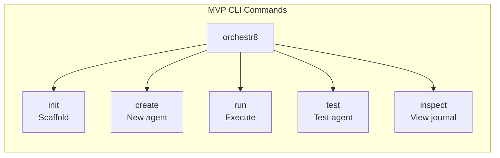

### Simple Implementation (CLI)

```typescript
// MVP CLI - Commander.js
import { Command } from 'commander'

const program = new Command()

program
  .name('orchestr8')
  .version('1.0.0')
  .description('Agent orchestration CLI')

program
  .command('init')
  .description('Initialize new project')
  .action(async () => {
    // Scaffold basic project structure
    console.log('Creating project...')
  })

program
  .command('run <workflow>')
  .description('Execute workflow')
  .action(async (workflow) => {
    // Load and execute workflow
    const engine = new OrchestrationEngine()
    await engine.execute(workflow)
  })

program.parse()
```

## MVP REST API

### 4 Endpoints Only

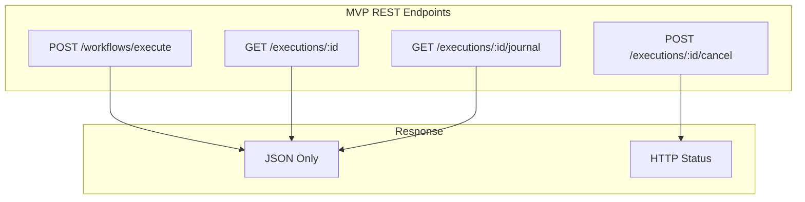

### Express Implementation with WebSocket Support

```typescript
// MVP API - Express with WebSocket integration
import express from 'express'
import http from 'http'
import WebSocket from 'ws'
import path from 'path'

const app = express()
const server = http.createServer(app)

app.use(express.json())

const executions = new Map()

// WebSocket Server for Real-time Dashboard Updates
const wss = new WebSocket.Server({
  server,
  path: '/ws',
})

// WebSocket connection management
const dashboardClients = new Set<WebSocket>()

wss.on('connection', (ws) => {
  dashboardClients.add(ws)
  console.log(`Dashboard client connected. Total: ${dashboardClients.size}`)

  // Send initial connection confirmation
  ws.send(
    JSON.stringify({
      type: 'connection.established',
      timestamp: new Date().toISOString(),
    }),
  )

  ws.on('close', () => {
    dashboardClients.delete(ws)
    console.log(
      `Dashboard client disconnected. Total: ${dashboardClients.size}`,
    )
  })

  ws.on('message', (data) => {
    try {
      const message = JSON.parse(data.toString())
      handleClientMessage(ws, message)
    } catch (error) {
      console.error('Invalid WebSocket message:', error)
    }
  })
})

// Handle client messages (ping/pong, subscriptions)
function handleClientMessage(client: WebSocket, message: any): void {
  switch (message.type) {
    case 'ping':
      client.send(JSON.stringify({ type: 'pong' }))
      break
    case 'subscribe':
      // Handle subscription to specific execution
      break
    default:
      console.warn('Unknown client message type:', message.type)
  }
}

// Broadcast events to all connected clients
function broadcastToClients(event: any): void {
  const message = JSON.stringify({
    ...event,
    timestamp: new Date().toISOString(),
  })

  dashboardClients.forEach((client) => {
    if (client.readyState === WebSocket.OPEN) {
      client.send(message)
    }
  })
}

// Dashboard static file serving
const dashboardPath = path.join(__dirname, '../dashboard/dist')
app.use('/dashboard', express.static(dashboardPath))

// Dashboard root route - serve React app
app.get('/', (req, res) => {
  res.sendFile(path.join(dashboardPath, 'index.html'))
})

// Dashboard data API endpoints
app.get('/api/v1/dashboard/executions', (req, res) => {
  const limit = parseInt(req.query.limit as string) || 50
  const status = req.query.status as string

  let executionList = Array.from(executions.values())

  if (status) {
    executionList = executionList.filter((exec) => exec.status === status)
  }

  res.json({
    executions: executionList.slice(0, limit),
    total: executionList.length,
  })
})

app.get('/api/v1/dashboard/metrics', (req, res) => {
  const activeExecutions = Array.from(executions.values()).filter((exec) =>
    ['pending', 'running'].includes(exec.status),
  )

  const metrics = {
    system: {
      uptime: process.uptime(),
      version: process.env.npm_package_version || '1.0.0',
      nodeVersion: process.version,
      memory: process.memoryUsage(),
    },
    orchestration: {
      activeExecutions: activeExecutions.length,
      totalExecutions: executions.size,
      successRate: calculateSuccessRate(executions),
      averageDuration: calculateAverageDuration(executions),
    },
    agents: {
      totalRegistered: getRegisteredAgentCount(),
      totalExecutions: getTotalAgentExecutions(),
      averageResponseTime: getAverageResponseTime(),
    },
  }

  res.json(metrics)
})

app.get('/api/v1/dashboard/system', (req, res) => {
  const systemInfo = {
    version: process.env.npm_package_version || '1.0.0',
    uptime: process.uptime(),
    platform: process.platform,
    nodeVersion: process.version,
    memory: process.memoryUsage(),
    cpu: {
      model: require('os').cpus()[0]?.model || 'Unknown',
      cores: require('os').cpus().length,
    },
  }

  res.json(systemInfo)
})

// Execute workflow with WebSocket broadcasting
app.post('/api/v1/workflows/execute', async (req, res) => {
  const id = crypto.randomUUID()

  // Broadcast workflow started event
  broadcastToClients({
    type: 'workflow.started',
    workflowId: req.body.workflow?.id || 'unknown',
    executionId: id,
  })

  try {
    const execution = await executeWorkflowWithEvents(req.body, id)
    executions.set(id, execution)

    res.status(202).json({
      executionId: id,
      status: 'running',
      checkUrl: `/api/v1/executions/${id}`,
    })
  } catch (error) {
    // Broadcast workflow failed event
    broadcastToClients({
      type: 'workflow.failed',
      workflowId: req.body.workflow?.id || 'unknown',
      executionId: id,
      error: error.message,
    })

    res.status(500).json({ error: error.message })
  }
})

// Enhanced workflow execution with event broadcasting
async function executeWorkflowWithEvents(
  workflowRequest: any,
  executionId: string,
) {
  const execution = {
    id: executionId,
    status: 'running',
    startedAt: new Date().toISOString(),
    steps: [],
  }

  // Execute workflow steps and broadcast events
  for (const [index, step] of workflowRequest.workflow.steps.entries()) {
    // Broadcast step started
    broadcastToClients({
      type: 'step.started',
      executionId,
      stepId: step.id,
      agentId: step.agent?.id,
    })

    try {
      const stepResult = await executeStep(step)

      // Broadcast step completed
      broadcastToClients({
        type: 'step.completed',
        executionId,
        stepId: step.id,
        status: 'completed',
        duration: stepResult.duration,
      })

      execution.steps.push(stepResult)
    } catch (error) {
      // Broadcast step failed
      broadcastToClients({
        type: 'step.failed',
        executionId,
        stepId: step.id,
        error: error.message,
      })

      throw error
    }
  }

  execution.status = 'completed'
  execution.completedAt = new Date().toISOString()

  // Broadcast workflow completed
  broadcastToClients({
    type: 'workflow.completed',
    workflowId: workflowRequest.workflow?.id || 'unknown',
    executionId,
    status: 'completed',
    duration:
      new Date(execution.completedAt).getTime() -
      new Date(execution.startedAt).getTime(),
  })

  return execution
}

// Get status
app.get('/api/v1/executions/:id', (req, res) => {
  const execution = executions.get(req.params.id)
  if (!execution) return res.status(404).json({ error: 'Not found' })
  res.json({ id: req.params.id, status: execution.status })
})

// Get journal
app.get('/api/v1/executions/:id/journal', (req, res) => {
  const execution = executions.get(req.params.id)
  if (!execution) return res.status(404).json({ error: 'Not found' })
  res.json(execution.journal)
})

// Cancel execution
app.post('/api/v1/executions/:id/cancel', (req, res) => {
  const execution = executions.get(req.params.id)
  if (!execution) return res.status(404).json({ error: 'Not found' })

  execution.cancel()

  // Broadcast cancellation event
  broadcastToClients({
    type: 'workflow.cancelled',
    executionId: req.params.id,
  })

  res.status(200).send()
})

// Utility functions for metrics
function calculateSuccessRate(executions: Map<string, any>): number {
  const completed = Array.from(executions.values())
  if (completed.length === 0) return 1.0

  const successful = completed.filter(
    (exec) => exec.status === 'completed',
  ).length
  return successful / completed.length
}

function calculateAverageDuration(executions: Map<string, any>): number {
  const completed = Array.from(executions.values()).filter(
    (exec) => exec.duration,
  )

  if (completed.length === 0) return 0

  const totalDuration = completed.reduce((sum, exec) => sum + exec.duration, 0)
  return totalDuration / completed.length
}

function getRegisteredAgentCount(): number {
  // Placeholder - implement agent registry
  return 5
}

function getTotalAgentExecutions(): number {
  // Placeholder - implement execution counting
  return 42
}

function getAverageResponseTime(): number {
  // Placeholder - implement response time tracking
  return 2340
}

async function executeStep(step: any): Promise<any> {
  // Placeholder step execution
  const startTime = Date.now()

  // Simulate step execution
  await new Promise((resolve) =>
    setTimeout(resolve, Math.random() * 1000 + 500),
  )

  return {
    id: step.id,
    status: 'completed',
    duration: Date.now() - startTime,
    output: { result: 'Step completed successfully' },
  }
}

server.listen(8088, '127.0.0.1', () => {
  console.log('🚀 Orchestr8 server running on http://127.0.0.1:8088')
  console.log('📊 Dashboard available at http://127.0.0.1:8088')
  console.log('🔌 WebSocket endpoint: ws://127.0.0.1:8088/ws')
})
```

## WebSocket Event Architecture

### Real-time Event Broadcasting

The MVP includes a WebSocket server for real-time dashboard updates, providing live monitoring of workflow executions without polling.

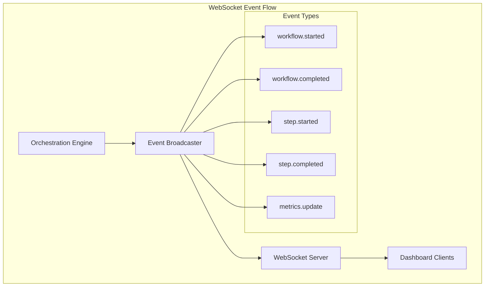

### Event Message Format

All WebSocket messages follow a consistent JSON format:

```typescript
interface WebSocketEvent {
  type: string
  timestamp: string
  [key: string]: any
}

// Workflow lifecycle events
interface WorkflowEvent extends WebSocketEvent {
  type:
    | 'workflow.started'
    | 'workflow.completed'
    | 'workflow.failed'
    | 'workflow.cancelled'
  workflowId: string
  executionId: string
  status?: string
  duration?: number
  error?: string
}

// Step lifecycle events
interface StepEvent extends WebSocketEvent {
  type: 'step.started' | 'step.completed' | 'step.failed'
  executionId: string
  stepId: string
  agentId?: string
  status?: string
  duration?: number
  error?: string
}

// Metrics updates
interface MetricsEvent extends WebSocketEvent {
  type: 'metrics.update'
  metrics: {
    activeExecutions: number
    totalExecutions: number
    successRate: number
    averageDuration: number
  }
}

// Real-time log entries
interface LogEvent extends WebSocketEvent {
  type: 'log.entry'
  level: 'info' | 'warn' | 'error'
  message: string
  executionId?: string
  stepId?: string
}
```

### Connection Management

```typescript
// WebSocket connection lifecycle
class WebSocketConnectionManager {
  private clients = new Set<WebSocket>()

  onConnection(ws: WebSocket): void {
    this.clients.add(ws)

    // Send initial connection state
    this.sendToClient(ws, {
      type: 'connection.established',
      timestamp: new Date().toISOString(),
      clientCount: this.clients.size,
    })

    ws.on('close', () => {
      this.clients.delete(ws)
    })

    ws.on('message', (data) => {
      this.handleClientMessage(ws, JSON.parse(data.toString()))
    })
  }

  broadcast(event: WebSocketEvent): void {
    const message = JSON.stringify({
      ...event,
      timestamp: new Date().toISOString(),
    })

    this.clients.forEach((client) => {
      if (client.readyState === WebSocket.OPEN) {
        client.send(message)
      }
    })
  }

  private handleClientMessage(client: WebSocket, message: any): void {
    switch (message.type) {
      case 'ping':
        client.send(JSON.stringify({ type: 'pong' }))
        break
      case 'subscribe':
        // Handle specific execution subscriptions
        this.handleSubscription(client, message.executionId)
        break
      case 'unsubscribe':
        // Handle unsubscription
        this.handleUnsubscription(client, message.executionId)
        break
    }
  }
}
```

### Dashboard Integration

The WebSocket events integrate seamlessly with the React dashboard through custom hooks:

```typescript
// Dashboard hook for WebSocket integration
export function useWebSocket() {
  const [connectionStatus, setConnectionStatus] = useState('connecting')
  const { updateWorkflowStatus, addWorkflowEvent } = useWorkflowStore()
  const { updateMetrics } = useMetricsStore()

  useEffect(() => {
    const ws = new WebSocket('ws://127.0.0.1:8088/ws')

    ws.onopen = () => setConnectionStatus('connected')
    ws.onclose = () => setConnectionStatus('disconnected')

    ws.onmessage = (event) => {
      const data = JSON.parse(event.data)

      switch (data.type) {
        case 'workflow.started':
        case 'workflow.completed':
        case 'workflow.failed':
          updateWorkflowStatus(data.executionId, data.status, data.timestamp)
          break

        case 'step.started':
        case 'step.completed':
        case 'step.failed':
          addWorkflowEvent(data)
          break

        case 'metrics.update':
          updateMetrics(data.metrics)
          break
      }
    }

    return () => ws.close()
  }, [])

  return { connectionStatus }
}
```

### Performance Considerations

**Connection Limits:**

- Maximum 10 concurrent WebSocket connections
- Automatic cleanup of stale connections
- Connection pooling to prevent resource exhaustion

**Message Throttling:**

- Event batching for high-frequency updates
- Rate limiting to prevent message flooding
- Selective broadcasting based on subscriptions

**Memory Management:**

- Bounded event history (last 1000 events)
- Client set cleanup on disconnection
- Garbage collection of closed connections

### Error Handling and Resilience

**Connection Recovery:**

- Automatic reconnection with exponential backoff
- Connection state persistence in dashboard
- Graceful degradation when WebSocket unavailable

**Message Reliability:**

- Best-effort delivery (no guaranteed delivery in MVP)
- Event ordering maintained within single connection
- Duplicate event detection on client side

**Fallback Mechanisms:**

- Polling fallback when WebSocket unavailable
- REST API as primary data source
- WebSocket as enhancement for real-time updates

### Agent Microservice Endpoints (Dual Deployment - MVP Scoped)

In addition to the orchestrator REST API, the single MVP research agent exposes a minimal microservice interface via an adapter:

- POST /process — Process a single agent request and return output
- GET /health — Health check endpoint

These endpoints are part of the agent’s adapter, not the orchestrator.

## MVP Testing Strategy

### Simple Test Harness

```typescript
// MVP Test Harness with MSW
import { setupServer } from 'msw/node'
import { http, HttpResponse } from 'msw'

export class AgentTestHarness {
  private server = setupServer()

  beforeAll() {
    this.server.listen()
  }

  afterAll() {
    this.server.close()
  }

  mockAPI(url: string, response: any) {
    this.server.use(http.get(url, () => HttpResponse.json(response)))
  }

  async testAgent(agent: BaseAgent, input: any) {
    const context = this.createContext()
    const result = await agent.execute(input, context)
    return result
  }

  private createContext(): ExecutionContext {
    return {
      executionId: 'test-id',
      cancellationToken: new CancellationToken(),
      journal: [],
    }
  }
}
```

## MVP Observability

### Minimal OpenTelemetry Setup

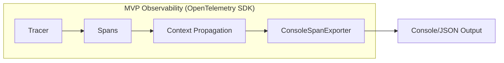

### OpenTelemetry Implementation

```typescript
// MVP Observability - Minimal OpenTelemetry SDK
import { trace, SpanStatusCode } from '@opentelemetry/api'
import { NodeTracerProvider } from '@opentelemetry/sdk-trace-node'
import {
  ConsoleSpanExporter,
  BatchSpanProcessor,
} from '@opentelemetry/sdk-trace-base'
import { Resource } from '@opentelemetry/resources'
import { SemanticResourceAttributes } from '@opentelemetry/semantic-conventions'

export class ObservabilityProvider {
  private tracer

  constructor() {
    // Initialize provider with resource
    const provider = new NodeTracerProvider({
      resource: new Resource({
        [SemanticResourceAttributes.SERVICE_NAME]: '@orchestr8',
        [SemanticResourceAttributes.SERVICE_VERSION]: '1.0.0',
      }),
    })

    // Use ConsoleSpanExporter for MVP (no OTLP infrastructure)
    const exporter = new ConsoleSpanExporter()
    provider.addSpanProcessor(new BatchSpanProcessor(exporter))

    // Register the provider
    provider.register()

    this.tracer = trace.getTracer('@orchestr8/core', '1.0.0')
  }

  // Create spans for key operations
  startSpan(name: string, attributes?: Record<string, any>) {
    const span = this.tracer.startSpan(name, {
      attributes: {
        ...attributes,
        'orchestr8.component': 'orchestrator',
      },
    })

    return {
      span,
      end: (error?: Error) => {
        if (error) {
          span.recordException(error)
          span.setStatus({ code: SpanStatusCode.ERROR })
        }
        span.end()
      },
    }
  }

  // Wrap operations with spans
  async withSpan<T>(
    name: string,
    fn: () => Promise<T>,
    attributes?: Record<string, any>,
  ): Promise<T> {
    const { span, end } = this.startSpan(name, attributes)

    try {
      const result = await fn()
      end()
      return result
    } catch (error) {
      end(error as Error)
      throw error
    }
  }
}

// Instrumented operations
export class InstrumentedOrchestrator {
  private observability = new ObservabilityProvider()

  async execute(workflow: Workflow, context: ExecutionContext) {
    return this.observability.withSpan(
      'orchestrator.execute',
      async () => this.executeInternal(workflow, context),
      {
        'workflow.id': workflow.id,
        'correlation.id': context.correlationId,
      },
    )
  }

  private async executeStep(step: WorkflowStep) {
    return this.observability.withSpan(
      'step.execute',
      async () => this.runStep(step),
      {
        'step.id': step.id,
        'agent.id': step.agent.id,
      },
    )
  }
}
```

### Minimal OTel Mode (Performance-First)

**Addressing Performance Budget Concern**: To maintain the <100ms orchestration overhead requirement, the MVP includes a minimal OpenTelemetry mode that prioritizes performance over comprehensive observability.

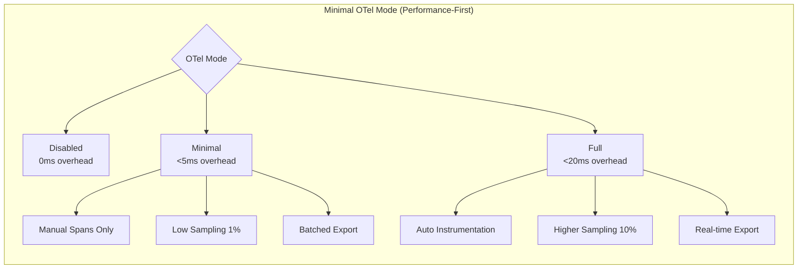

#### Performance-Optimized Configuration

```typescript
// Performance-first OpenTelemetry configuration
export interface OTelConfig {
  mode: 'disabled' | 'minimal' | 'full'
  samplingRate: number
  batchSize: number
  exportInterval: number
  manualSpansOnly: boolean
}

export class PerformanceOTelProvider {
  private tracer?: Tracer
  private config: OTelConfig

  constructor(
    config: OTelConfig = {
      mode: 'minimal',
      samplingRate: 0.01, // 1% sampling for minimal overhead
      batchSize: 100, // Batch exports to reduce I/O
      exportInterval: 5000, // Export every 5 seconds
      manualSpansOnly: true, // No auto-instrumentation
    },
  ) {
    this.config = config
    this.initializeProvider()
  }

  private initializeProvider(): void {
    if (this.config.mode === 'disabled') {
      // No-op tracer for zero overhead
      this.tracer = trace.getTracer('noop')
      return
    }

    // Create provider with performance-optimized settings
    const provider = new NodeTracerProvider({
      resource: new Resource({
        [SemanticResourceAttributes.SERVICE_NAME]: '@orchestr8',
        [SemanticResourceAttributes.SERVICE_VERSION]: '1.0.0',
      }),
      // Performance-first sampling
      sampler: new TraceIdRatioBasedSampler(this.config.samplingRate),
    })

    // Choose exporter based on mode
    const exporter =
      this.config.mode === 'minimal'
        ? new ConsoleSpanExporter()
        : new OTLPTraceExporter()

    // Batched processor for performance
    const processor = new BatchSpanProcessor(exporter, {
      maxQueueSize: this.config.batchSize,
      scheduledDelayMillis: this.config.exportInterval,
      exportTimeoutMillis: 1000, // Fast timeout
      maxExportBatchSize: this.config.batchSize,
    })

    provider.addSpanProcessor(processor)
    provider.register()

    this.tracer = trace.getTracer('@orchestr8/core', '1.0.0')
  }

  // Lightweight span creation for critical path
  createMinimalSpan(
    name: string,
    attributes?: Record<string, string>,
  ): MinimalSpan {
    if (this.config.mode === 'disabled' || !this.tracer) {
      return new NoOpSpan()
    }

    // Check sampling decision early to avoid overhead
    if (Math.random() > this.config.samplingRate) {
      return new NoOpSpan()
    }

    const span = this.tracer.startSpan(name, {
      attributes: attributes ? this.sanitizeAttributes(attributes) : undefined,
    })

    return new OTelSpan(span)
  }

  // Only trace workflow-level operations in minimal mode
  traceWorkflowExecution<T>(
    workflowId: string,
    operation: () => Promise<T>,
  ): Promise<T> {
    if (this.config.mode === 'disabled' || !this.config.manualSpansOnly) {
      return operation()
    }

    const span = this.createMinimalSpan('workflow.execution', {
      'workflow.id': workflowId,
      'orchestr8.component': 'engine',
    })

    return span.wrap(operation)
  }

  // Trace step execution only if not in minimal mode
  traceStepExecution<T>(
    stepId: string,
    agentId: string,
    operation: () => Promise<T>,
  ): Promise<T> {
    if (this.config.mode === 'minimal') {
      // Skip step-level tracing in minimal mode
      return operation()
    }

    const span = this.createMinimalSpan('step.execution', {
      'step.id': stepId,
      'agent.id': agentId,
    })

    return span.wrap(operation)
  }

  // Resilience operations only traced in full mode
  traceResilienceOperation<T>(
    operation: string,
    fn: () => Promise<T>,
  ): Promise<T> {
    if (this.config.mode !== 'full') {
      return fn()
    }

    const span = this.createMinimalSpan(`resilience.${operation}`)
    return span.wrap(fn)
  }

  private sanitizeAttributes(
    attributes: Record<string, string>,
  ): Record<string, string> {
    // Limit attribute count and size to reduce overhead
    const sanitized: Record<string, string> = {}
    let count = 0

    for (const [key, value] of Object.entries(attributes)) {
      if (count >= 10) break // Max 10 attributes

      sanitized[key] =
        typeof value === 'string'
          ? value.substring(0, 100) // Max 100 chars
          : String(value).substring(0, 100)
      count++
    }

    return sanitized
  }

  getMetrics(): {
    mode: string
    samplingRate: number
    spansCreated: number
    spansExported: number
    overhead: number // Estimated ms per operation
  } {
    return {
      mode: this.config.mode,
      samplingRate: this.config.samplingRate,
      spansCreated: 0, // TODO: implement counters
      spansExported: 0,
      overhead:
        this.config.mode === 'disabled'
          ? 0
          : this.config.mode === 'minimal'
            ? 2
            : 8,
    }
  }
}

// Minimal span interface for performance
interface MinimalSpan {
  wrap<T>(operation: () => Promise<T>): Promise<T>
  addAttribute(key: string, value: string): void
  end(error?: Error): void
}

class OTelSpan implements MinimalSpan {
  constructor(private span: Span) {}

  async wrap<T>(operation: () => Promise<T>): Promise<T> {
    try {
      const result = await operation()
      this.span.setStatus({ code: SpanStatusCode.OK })
      return result
    } catch (error) {
      this.span.recordException(error as Error)
      this.span.setStatus({ code: SpanStatusCode.ERROR })
      throw error
    } finally {
      this.span.end()
    }
  }

  addAttribute(key: string, value: string): void {
    this.span.setAttributes({ [key]: value })
  }

  end(error?: Error): void {
    if (error) {
      this.span.recordException(error)
      this.span.setStatus({ code: SpanStatusCode.ERROR })
    }
    this.span.end()
  }
}

class NoOpSpan implements MinimalSpan {
  async wrap<T>(operation: () => Promise<T>): Promise<T> {
    return operation()
  }

  addAttribute(): void {}
  end(): void {}
}
```

#### Configuration by Environment

```typescript
// Environment-based OTel configuration
export function createOTelConfig(): OTelConfig {
  const mode =
    (process.env.OTEL_MODE as 'disabled' | 'minimal' | 'full') || 'minimal'

  const configs = {
    disabled: {
      mode: 'disabled' as const,
      samplingRate: 0,
      batchSize: 0,
      exportInterval: 0,
      manualSpansOnly: true,
    },
    minimal: {
      mode: 'minimal' as const,
      samplingRate: parseFloat(process.env.OTEL_SAMPLING_RATE || '0.01'), // 1%
      batchSize: 100,
      exportInterval: 5000,
      manualSpansOnly: true,
    },
    full: {
      mode: 'full' as const,
      samplingRate: parseFloat(process.env.OTEL_SAMPLING_RATE || '0.1'), // 10%
      batchSize: 50,
      exportInterval: 2000,
      manualSpansOnly: false,
    },
  }

  return configs[mode]
}

// Usage in orchestration engine
export class OptimizedOrchestrationEngine {
  private otelProvider: PerformanceOTelProvider

  constructor() {
    this.otelProvider = new PerformanceOTelProvider(createOTelConfig())
  }

  async executeWorkflow(workflow: Workflow): Promise<ExecutionResult> {
    // Only trace workflow-level operations for minimal overhead
    return this.otelProvider.traceWorkflowExecution(workflow.id, () =>
      this.executeWorkflowInternal(workflow),
    )
  }

  private async executeWorkflowInternal(
    workflow: Workflow,
  ): Promise<ExecutionResult> {
    const startTime = performance.now()

    try {
      const result = await this.runSteps(workflow.steps)

      // Record performance metrics (always measured, regardless of OTel mode)
      const executionTime = performance.now() - startTime
      if (executionTime > 100) {
        console.warn(
          `Workflow execution exceeded 100ms target: ${executionTime.toFixed(2)}ms`,
        )
      }

      return result
    } catch (error) {
      // Log errors regardless of tracing mode
      console.error('Workflow execution failed:', error)
      throw error
    }
  }
}
```

#### Performance Benchmarking

```typescript
// Performance validation for OTel overhead
export class OTelPerformanceBenchmark {
  async validateOverhead(): Promise<{
    disabled: number
    minimal: number
    full: number
    recommendation: string
  }> {
    const modes: Array<'disabled' | 'minimal' | 'full'> = [
      'disabled',
      'minimal',
      'full',
    ]
    const results: Record<string, number> = {}

    for (const mode of modes) {
      const provider = new PerformanceOTelProvider({
        mode,
        samplingRate: mode === 'full' ? 0.1 : 0.01,
        batchSize: 100,
        exportInterval: 5000,
        manualSpansOnly: true,
      })

      // Benchmark simple workflow execution
      const times: number[] = []
      for (let i = 0; i < 50; i++) {
        const start = performance.now()

        await provider.traceWorkflowExecution('test-workflow', async () => {
          // Simulate minimal workflow
          await new Promise((resolve) => setTimeout(resolve, 10))
        })

        times.push(performance.now() - start)
      }

      // Calculate p95 overhead
      times.sort((a, b) => a - b)
      results[mode] = times[Math.floor(times.length * 0.95)]
    }

    const recommendation =
      results.minimal < 5
        ? 'minimal mode meets <5ms overhead target'
        : results.disabled === 0
          ? 'recommend disabled mode for maximum performance'
          : 'performance target cannot be met with tracing enabled'

    return {
      disabled: results.disabled,
      minimal: results.minimal,
      full: results.full,
      recommendation,
    }
  }
}
```

#### Deployment Strategy

**Development Environment:**

```bash
export OTEL_MODE=full
export OTEL_SAMPLING_RATE=0.1
# More comprehensive tracing for debugging
```

**Production Environment:**

```bash
export OTEL_MODE=minimal
export OTEL_SAMPLING_RATE=0.01
# Minimal overhead with 1% sampling
```

**Performance-Critical Production:**

```bash
export OTEL_MODE=disabled
# Zero tracing overhead for maximum performance
```

#### Key Design Decisions

1. **Sampling-first approach** - Early sampling decision to minimize overhead
2. **Manual spans only** - No auto-instrumentation in minimal mode
3. **Batched exports** - Reduce I/O overhead with larger batch sizes
4. **Configurable by environment** - Easy production optimization
5. **No-op spans** - Zero overhead when disabled or not sampled
6. **Attribute sanitization** - Limit size and count to reduce memory usage
7. **Step-level tracing optional** - Only workflow-level in minimal mode

#### Performance Targets

| Mode         | Overhead Target | Sampling Rate | Use Case                            |
| ------------ | --------------- | ------------- | ----------------------------------- |
| **Disabled** | 0ms             | 0%            | Maximum performance                 |
| **Minimal**  | <5ms            | 1%            | Production with light observability |
| **Full**     | <20ms           | 10%           | Development and debugging           |

This minimal OTel mode ensures the <100ms orchestration overhead target is achievable while still providing essential observability in production environments.

## Performance Requirements - MVP

### Realistic Targets

| Metric                 | Target       | Measurement     |
| ---------------------- | ------------ | --------------- |
| Orchestration overhead | <100ms (p95) | Console timing  |
| Concurrent agents      | 10+          | Basic testing   |
| Memory usage           | <200MB       | Process monitor |
| Test coverage          | 80% core     | Vitest coverage |
| Build time             | <30s         | Turbo cache     |

## External Dependencies - MVP Only

### Minimal Dependencies

```json
{
  "dependencies": {
    "commander": "^12.0.0",
    "express": "^4.18.0",
    "zod": "^3.22.0"
  },
  "devDependencies": {
    "typescript": "^5.3.0",
    "vitest": "^2.0.0",
    "msw": "^2.0.0",
    "turbo": "^2.0.0"
  }
}
```

**Justification:** Absolute minimum for MVP functionality.

## What's NOT in MVP

### Deferred to Post-MVP

```mermaid
graph TB
    subgraph "Not in 4-Week MVP"
        style NotMVP fill:#f9f9f9,stroke:#999,stroke-dasharray: 5 5

  XML[XML Prompts\n(workflows/policies)]
        Visual[Visual Builder]
        Debug[Time Travel Debugger]
        GraphQL[GraphQL API]
        Registry[Agent Registry]
        Auth[Authentication]
        Cloud[Cloud Deploy]
        Advanced[Advanced Resilience]
    end
```

### Explicit Non-Goals

1. **No XML for workflows/policies** — JSON only; scoped exception: agent-level XML prompt templates for the single MVP research agent
2. **No Visual Tools** - CLI only (dashboard included for monitoring)
3. **No Advanced Debugging** - Journal only
4. **No Multiple APIs** - REST + WebSocket only
5. **No Distribution** - In-process only
6. **No Auth** - Local only
7. **No Cloud** - Single-node only

## Development Workflow - MVP

### Simple Flow

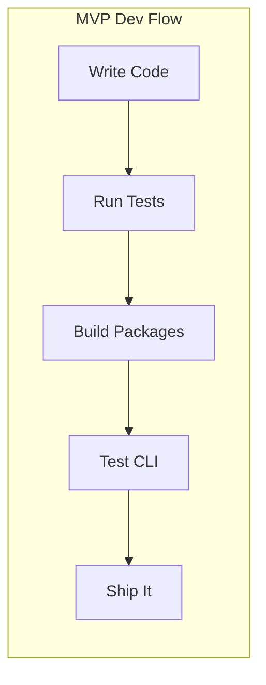

### Daily Checklist

- [ ] Code works locally
- [ ] Tests pass (80% coverage)
- [ ] CLI commands work
- [ ] REST endpoints respond
- [ ] Build successful

## Future Enhancement: LLM Provider Abstraction

### Multi-Provider Architecture (Post-MVP)

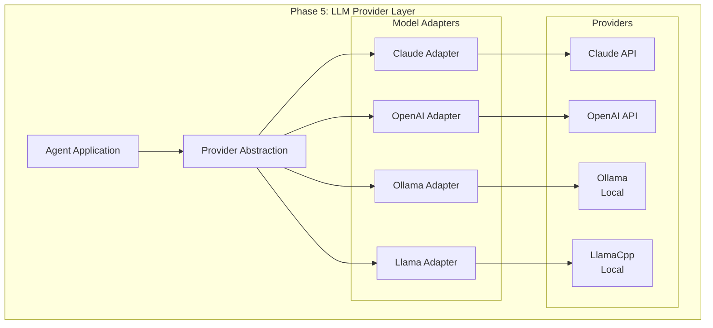

### Provider Interface Design

```typescript
// Future: @orchestr8/providers package
export interface LLMProvider {
  name: string
  type: 'cloud' | 'local'

  // Core methods
  execute(prompt: Prompt, config: ModelConfig): Promise<Response>
  stream(prompt: Prompt, config: ModelConfig): AsyncIterator<Token>
  health(): Promise<HealthStatus>

  // Provider-specific
  formatPrompt(prompt: JsonPrompt): string
  parseResponse(response: string): AgentOutput
  validateOutput(output: unknown): ValidationResult
}

export interface ModelConfig {
  model: string
  temperature?: number
  maxTokens?: number
  timeout?: number
  // Provider-specific options
  [key: string]: unknown
}
```

### Ollama Integration Example

```typescript
// Future: @orchestr8/providers/ollama
export class OllamaProvider implements LLMProvider {
  name = 'ollama'
  type = 'local' as const

  constructor(
    private config = {
      url: 'http://localhost:11434',
      model: 'llama2:13b',
      timeout: 120000, // 2 minutes for local models
    },
  ) {}

  async execute(prompt: Prompt, config: ModelConfig): Promise<Response> {
    const formatted = this.formatPrompt(prompt)

    const response = await fetch(`${this.config.url}/api/generate`, {
      method: 'POST',
      body: JSON.stringify({
        model: config.model || this.config.model,
        prompt: formatted,
        stream: false,
        options: {
          temperature: config.temperature || 0.7,
          num_predict: config.maxTokens || 4096,
        },
      }),
      signal: AbortSignal.timeout(config.timeout || this.config.timeout),
    })

    const data = await response.json()
    return this.parseResponse(data.response)
  }

  formatPrompt(prompt: JsonPrompt): string {
    // Model-specific formatting
    const model = this.config.model

    if (model.startsWith('llama')) {
      return `[INST] ${prompt.system}\n${prompt.content} [/INST]`
    }

    if (model.startsWith('mistral')) {
      return `<s>[INST] ${prompt.content} [/INST]`
    }

    // Default format
    return `${prompt.system}\n\n${prompt.content}`
  }

  parseResponse(response: string): AgentOutput {
    // Try JSON first
    try {
      return JSON.parse(response)
    } catch {
      // Fallback to structured parsing
      return this.parseStructuredText(response)
    }
  }
}
```

### Local Model Optimization

```typescript
// Optimized resilience for local models
export const localModelResilience = {
  timeout: {
    default: 120000, // 2 minutes
    perOperation: {
      'code-generation': 180000, // 3 minutes
      analysis: 240000, // 4 minutes
    },
  },
  retry: {
    maxAttempts: 5, // More retries for inconsistent outputs
    initialDelay: 2000,
    backoffMultiplier: 1.5,
  },
  circuitBreaker: {
    failureThreshold: 10, // Higher tolerance
    resetTimeout: 120000, // 2 minute reset
  },
}

// Enhanced output validation for local models
export class LocalModelValidator {
  validate(output: unknown, schema: z.ZodSchema): ValidationResult {
    // Multiple parsing attempts
    const attempts = [
      () => this.parseJSON(output),
      () => this.extractJSON(output),
      () => this.parseStructured(output),
      () => this.fuzzyParse(output),
    ]

    for (const attempt of attempts) {
      try {
        const parsed = attempt()
        const result = schema.safeParse(parsed)
        if (result.success) {
          return { valid: true, data: result.data }
        }
      } catch {
        continue
      }
    }

    return { valid: false, error: 'Failed to parse output' }
  }
}
```

### Configuration for Multi-Provider

```typescript
// orchestr8.config.ts with provider selection
export default {
  // Provider selection
  provider: process.env.LLM_PROVIDER || 'claude',

  // Provider configurations
  providers: {
    claude: {
      apiKey: process.env.CLAUDE_API_KEY,
      model: 'claude-3-opus',
      maxTokens: 4096,
    },
    openai: {
      apiKey: process.env.OPENAI_API_KEY,
      model: 'gpt-4-turbo',
      maxTokens: 4096,
    },
    ollama: {
      url: 'http://localhost:11434',
      model: process.env.OLLAMA_MODEL || 'llama2:13b',
      timeout: 120000,
    },
  },

  // Provider-specific resilience
  resilience: {
    cloud: {
      timeout: 30000,
      retries: 3,
    },
    local: {
      timeout: 120000,
      retries: 5,
    },
  },
}
```

### Benefits of Local LLM Support

1. **Privacy & Security**
   - No data leaves local infrastructure
   - Complete control over model and data
   - Suitable for sensitive workflows

2. **Cost Optimization**
   - No per-token API costs
   - Predictable infrastructure costs
   - Unlimited usage within hardware limits

3. **Offline Capability**
   - Works without internet connection
   - No dependency on external services
   - Reduced latency for local operations

4. **Model Flexibility**
   - Choose optimal model per task
   - Fine-tune models for specific domains
   - Mix cloud and local for hybrid workflows

### Trade-offs and Considerations

| Aspect           | Cloud LLMs (Claude/GPT-4) | Local LLMs (Ollama/Llama) |
| ---------------- | ------------------------- | ------------------------- |
| **Performance**  | Fast (10-30s)             | Slower (30-120s)          |
| **Quality**      | High consistency          | Variable quality          |
| **Context**      | Large (100k+ tokens)      | Limited (4-32k tokens)    |
| **Cost**         | Per-token pricing         | Hardware only             |
| **Privacy**      | Data sent to provider     | Fully local               |
| **Availability** | Internet required         | Always available          |
| **Maintenance**  | Provider managed          | Self-managed              |

## Event Bus Implementation (MVP In-Process)

### Bounded Queue with Drop-Oldest Policy (Per ADR-005)

Based on the architectural review, the Event Bus implementation requires careful memory management and observable overflow conditions:

```typescript
// MVP Event Bus - In-process with bounded queue and overflow handling
import { EventEmitter } from 'events'

export interface EventBusConfig {
  maxEvents: number
  dropPolicy: 'oldest' | 'newest'
  warningThreshold: number // Percentage (0-100)
  maxListeners: number
}

export interface EventMetrics {
  queueSize: number
  totalEvents: number
  droppedEvents: number
  dropRate: number // Percentage
  listeners: number
}

export class BoundedEventBus extends EventEmitter {
  private queue: Array<{ event: string; args: any[]; timestamp: number }> = []
  private metrics: EventMetrics = {
    queueSize: 0,
    totalEvents: 0,
    droppedEvents: 0,
    dropRate: 0,
    listeners: 0,
  }
  private lastWarningTime = 0
  private readonly warningCooldown = 10000 // 10 seconds

  constructor(
    private config: EventBusConfig = {
      maxEvents: 1000,
      dropPolicy: 'oldest',
      warningThreshold: 10,
      maxListeners: 50,
    },
  ) {
    super()

    // Prevent memory leaks from too many listeners
    this.setMaxListeners(this.config.maxListeners)

    // Monitor listener count
    this.on('newListener', () => {
      this.metrics.listeners = this.listenerCount('*')
    })

    this.on('removeListener', () => {
      this.metrics.listeners = this.listenerCount('*')
    })
  }

  emit(event: string, ...args: any[]): boolean {
    this.metrics.totalEvents++

    // Add to bounded queue
    const eventRecord = {
      event,
      args,
      timestamp: Date.now(),
    }

    this.queue.push(eventRecord)
    this.metrics.queueSize = this.queue.length

    // Apply overflow policy
    if (this.queue.length > this.config.maxEvents) {
      this.handleOverflow()
    }

    // Emit to listeners with handler isolation
    return this.emitSafely(event, ...args)
  }

  private handleOverflow(): void {
    const dropped =
      this.config.dropPolicy === 'oldest'
        ? this.queue.shift()
        : this.queue.pop()

    if (dropped) {
      this.metrics.droppedEvents++
      this.metrics.queueSize = this.queue.length
      this.updateDropRate()
      this.checkWarningThreshold()
    }
  }

  private updateDropRate(): void {
    this.metrics.dropRate =
      this.metrics.totalEvents > 0
        ? (this.metrics.droppedEvents / this.metrics.totalEvents) * 100
        : 0
  }

  private checkWarningThreshold(): void {
    if (this.metrics.dropRate >= this.config.warningThreshold) {
      const now = Date.now()
      if (now - this.lastWarningTime > this.warningCooldown) {
        console.warn(
          `Event Bus: High drop rate detected: ${this.metrics.dropRate.toFixed(2)}% ` +
            `(${this.metrics.droppedEvents}/${this.metrics.totalEvents} events dropped)`,
        )
        this.lastWarningTime = now
      }
    }
  }

  private emitSafely(event: string, ...args: any[]): boolean {
    try {
      // Use super.emit to avoid recursion
      return super.emit(event, ...args)
    } catch (error) {
      // Handler errors must not crash the event bus
      console.error(`Event Bus: Handler error for event '${event}':`, error)

      // Emit error event for monitoring (but don't fail if no listeners)
      try {
        super.emit('error', error, event, args)
      } catch {
        // Ignore error if no error listeners
      }

      return false
    }
  }

  getMetrics(): EventMetrics {
    return { ...this.metrics }
  }

  getQueueSnapshot(): Array<{ event: string; timestamp: number }> {
    return this.queue.map(({ event, timestamp }) => ({ event, timestamp }))
  }

  // Clear queue and reset metrics (useful for testing)
  reset(): void {
    this.queue = []
    this.metrics = {
      queueSize: 0,
      totalEvents: 0,
      droppedEvents: 0,
      dropRate: 0,
      listeners: this.listenerCount('*'),
    }
  }
}
```

### Usage in Core Orchestrator

```typescript
// Integration with orchestration engine
export class OrchestrationEngine {
  private eventBus = new BoundedEventBus({
    maxEvents: 1000,
    dropPolicy: 'oldest',
    warningThreshold: 10, // Warn at 10% drop rate
    maxListeners: 50,
  })

  constructor() {
    // Monitor event bus health
    setInterval(() => {
      const metrics = this.eventBus.getMetrics()
      if (metrics.dropRate > 20) {
        console.error(
          `Event Bus: Critical drop rate: ${metrics.dropRate.toFixed(2)}%`,
        )
      }
    }, 30000) // Check every 30 seconds
  }

  async executeWorkflow(workflow: Workflow): Promise<ExecutionResult> {
    const executionId = generateId()

    // Emit execution events
    this.eventBus.emit('execution.started', { executionId, workflow })

    try {
      const result = await this.runSteps(workflow.steps, executionId)
      this.eventBus.emit('execution.completed', { executionId, result })
      return result
    } catch (error) {
      this.eventBus.emit('execution.failed', { executionId, error })
      throw error
    }
  }

  // Subscribe to execution events
  onExecutionEvent(event: string, handler: (...args: any[]) => void): void {
    this.eventBus.on(event, handler)
  }

  // Get event bus health metrics
  getEventBusMetrics(): EventMetrics {
    return this.eventBus.getMetrics()
  }
}
```

### Event Bus Monitoring

```typescript
// Health check endpoint for REST API
export class EventBusHealthCheck {
  constructor(private eventBus: BoundedEventBus) {}

  getHealthStatus(): {
    status: 'healthy' | 'warning' | 'critical'
    metrics: EventMetrics
    recommendations?: string[]
  } {
    const metrics = this.eventBus.getMetrics()
    const recommendations: string[] = []

    let status: 'healthy' | 'warning' | 'critical' = 'healthy'

    // Check drop rate
    if (metrics.dropRate > 20) {
      status = 'critical'
      recommendations.push(
        'High event drop rate - consider reducing event volume or increasing queue size',
      )
    } else if (metrics.dropRate > 5) {
      status = 'warning'
      recommendations.push('Moderate event drop rate - monitor event patterns')
    }

    // Check queue utilization
    const utilization = (metrics.queueSize / 1000) * 100
    if (utilization > 90) {
      status = status === 'critical' ? 'critical' : 'warning'
      recommendations.push('Queue nearly full - events may be dropped soon')
    }

    // Check listener count
    if (metrics.listeners > 40) {
      recommendations.push(
        'High listener count - potential memory usage concern',
      )
    }

    return { status, metrics, recommendations }
  }
}
```

### Key Design Decisions (Per Review Feedback)

1. **Drop-oldest policy** - Preserves recent events which are more actionable
2. **10% warning threshold** - Early warning before critical drop rates
3. **EventEmitter max listeners** - Prevents memory leaks from listener proliferation
4. **Handler isolation** - Listener errors never crash the event bus
5. **Observable metrics** - Drop rate, queue size, listener count for monitoring
6. **Cooldown on warnings** - Prevents log spam during high drop periods

### Memory Safety Guarantees

- **Bounded queue size** - Hard limit of 1000 events prevents unbounded growth
- **LRU eviction** - Drop-oldest policy maintains recent event availability
- **Handler error isolation** - Exception handling prevents event bus crashes
- **Listener limits** - Max listeners cap prevents memory leaks
- **Metrics tracking** - Observable drop rates and queue health

This implementation satisfies the MVP requirements while addressing the critical memory safety concerns identified in the architectural review.

## Execution Journal Memory Safety

Based on the architectural review feedback, the execution journal implementation requires comprehensive memory safety rules to prevent unbounded growth and ensure reliable operation under load.

### Journal Memory Management Architecture

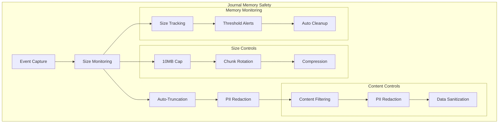

### Core Memory Safety Rules

```typescript
export interface JournalMemoryConfig {
  maxSizeBytes: number // 10MB hard limit
  maxEntriesPerExecution: number // 10,000 entries max
  maxFieldSize: number // 1KB per field max
  compressionThreshold: number // 5MB compression trigger
  truncationThreshold: number // 8MB truncation trigger
  cleanupInterval: number // 5 minutes cleanup cycle

  // PII Protection
  piiRedactionEnabled: boolean // Enable PII redaction
  piiPatterns: string[] // Regex patterns for PII
  allowedFieldTypes: string[] // Whitelisted field types

  // Content Limits
  maxMessageLength: number // 10KB per message
  maxStackTraceLength: number // 5KB per stack trace
  maxMetadataSize: number // 2KB per metadata object
}

export const DEFAULT_JOURNAL_CONFIG: JournalMemoryConfig = {
  maxSizeBytes: 10 * 1024 * 1024, // 10MB
  maxEntriesPerExecution: 10000,
  maxFieldSize: 1024, // 1KB
  compressionThreshold: 5 * 1024 * 1024, // 5MB
  truncationThreshold: 8 * 1024 * 1024, // 8MB
  cleanupInterval: 5 * 60 * 1000, // 5 minutes

  piiRedactionEnabled: true,
  piiPatterns: [
    '\\b[A-Za-z0-9._%+-]+@[A-Za-z0-9.-]+\\.[A-Z|a-z]{2,}\\b', // Email
    '\\b\\d{3}-\\d{2}-\\d{4}\\b', // SSN
    '\\b4[0-9]{12}(?:[0-9]{3})?\\b', // Credit card
    '\\b(?:\\+?1[-.]?)?\\(?[0-9]{3}\\)?[-.]?[0-9]{3}[-.]?[0-9]{4}\\b', // Phone
  ],
  allowedFieldTypes: ['string', 'number', 'boolean', 'object'],

  maxMessageLength: 10 * 1024, // 10KB
  maxStackTraceLength: 5 * 1024, // 5KB
  maxMetadataSize: 2 * 1024, // 2KB
}
```

### Memory-Safe Journal Implementation

```typescript
export class MemorySafeExecutionJournal {
  private entries: JournalEntry[] = []
  private currentSize: number = 0
  private config: JournalMemoryConfig
  private compressionEnabled: boolean = false
  private lastCleanup: number = Date.now()

  constructor(config: JournalMemoryConfig = DEFAULT_JOURNAL_CONFIG) {
    this.config = config
    this.startPeriodicCleanup()
  }

  addEntry(entry: JournalEntry): void {
    // 1. Validate entry before processing
    this.validateEntry(entry)

    // 2. Apply PII redaction
    const sanitizedEntry = this.sanitizeEntry(entry)

    // 3. Check size constraints before adding
    const entrySize = this.calculateEntrySize(sanitizedEntry)

    // 4. Trigger truncation if adding would exceed limits
    if (this.currentSize + entrySize > this.config.maxSizeBytes) {
      this.performTruncation(entrySize)
    }

    // 5. Check entry count limits
    if (this.entries.length >= this.config.maxEntriesPerExecution) {
      this.performEntryTruncation()
    }

    // 6. Add entry and update size tracking
    this.entries.push(sanitizedEntry)
    this.currentSize += entrySize

    // 7. Check if compression is needed
    if (
      this.currentSize > this.config.compressionThreshold &&
      !this.compressionEnabled
    ) {
      this.enableCompression()
    }

    console.debug(
      `Journal entry added: ${entrySize} bytes, total: ${this.currentSize} bytes`,
    )
  }

  private validateEntry(entry: JournalEntry): void {
    // Check individual field sizes
    if (entry.message && entry.message.length > this.config.maxMessageLength) {
      throw new Error(
        `Message exceeds maximum length: ${entry.message.length} > ${this.config.maxMessageLength}`,
      )
    }

    if (
      entry.error?.stack &&
      entry.error.stack.length > this.config.maxStackTraceLength
    ) {
      entry.error.stack =
        entry.error.stack.substring(0, this.config.maxStackTraceLength) +
        '... [truncated]'
    }

    if (entry.metadata) {
      const metadataSize = JSON.stringify(entry.metadata).length
      if (metadataSize > this.config.maxMetadataSize) {
        throw new Error(
          `Metadata exceeds maximum size: ${metadataSize} > ${this.config.maxMetadataSize}`,
        )
      }
    }
  }

  private sanitizeEntry(entry: JournalEntry): JournalEntry {
    if (!this.config.piiRedactionEnabled) {
      return entry
    }

    const sanitized = { ...entry }

    // Redact PII from message content
    if (sanitized.message) {
      sanitized.message = this.redactPII(sanitized.message)
    }

    // Redact PII from error messages
    if (sanitized.error?.message) {
      sanitized.error.message = this.redactPII(sanitized.error.message)
    }

    // Redact PII from stack traces
    if (sanitized.error?.stack) {
      sanitized.error.stack = this.redactPII(sanitized.error.stack)
    }

    // Recursively redact PII from metadata
    if (sanitized.metadata) {
      sanitized.metadata = this.redactPIIFromObject(sanitized.metadata)
    }

    return sanitized
  }

  private redactPII(content: string): string {
    let redacted = content

    for (const pattern of this.config.piiPatterns) {
      const regex = new RegExp(pattern, 'gi')
      redacted = redacted.replace(regex, '[REDACTED]')
    }

    return redacted
  }

  private redactPIIFromObject(obj: any): any {
    if (typeof obj === 'string') {
      return this.redactPII(obj)
    }

    if (Array.isArray(obj)) {
      return obj.map((item) => this.redactPIIFromObject(item))
    }

    if (obj && typeof obj === 'object') {
      const redacted: any = {}
      for (const [key, value] of Object.entries(obj)) {
        redacted[key] = this.redactPIIFromObject(value)
      }
      return redacted
    }

    return obj
  }

  private performTruncation(requiredSpace: number): void {
    console.warn(
      `Journal size limit approaching, performing truncation. Current: ${this.currentSize}, Required: ${requiredSpace}`,
    )

    // Remove oldest entries until we have enough space
    let freedSpace = 0
    let removedCount = 0

    while (freedSpace < requiredSpace && this.entries.length > 0) {
      const oldestEntry = this.entries.shift()!
      const entrySize = this.calculateEntrySize(oldestEntry)
      freedSpace += entrySize
      removedCount++
    }

    this.currentSize -= freedSpace

    // Add truncation marker
    this.addTruncationMarker(removedCount, freedSpace)

    console.warn(`Truncated ${removedCount} entries, freed ${freedSpace} bytes`)
  }

  private performEntryTruncation(): void {
    const entriesToRemove = Math.floor(this.config.maxEntriesPerExecution * 0.2) // Remove 20%
    let freedSpace = 0

    for (let i = 0; i < entriesToRemove && this.entries.length > 0; i++) {
      const oldestEntry = this.entries.shift()!
      freedSpace += this.calculateEntrySize(oldestEntry)
    }

    this.currentSize -= freedSpace
    this.addTruncationMarker(entriesToRemove, freedSpace)
  }

  private addTruncationMarker(removedCount: number, freedSpace: number): void {
    const marker: JournalEntry = {
      timestamp: new Date().toISOString(),
      level: 'warn',
      message: `Journal truncated: removed ${removedCount} entries (${freedSpace} bytes) due to memory limits`,
      metadata: {
        truncation: {
          removedEntries: removedCount,
          freedBytes: freedSpace,
          remainingEntries: this.entries.length,
          currentSize: this.currentSize,
        },
      },
    }

    // Add marker directly without size checks to avoid recursion
    this.entries.push(marker)
    this.currentSize += this.calculateEntrySize(marker)
  }

  private calculateEntrySize(entry: JournalEntry): number {
    // Estimate memory footprint of journal entry
    return JSON.stringify(entry).length * 2 // Factor in string overhead
  }

  private enableCompression(): void {
    console.info('Enabling journal compression due to size threshold')
    this.compressionEnabled = true

    // Compress older entries (keep recent 100 uncompressed for performance)
    const recentEntries = this.entries.slice(-100)
    const olderEntries = this.entries.slice(0, -100)

    if (olderEntries.length > 0) {
      const compressedData = this.compressEntries(olderEntries)
      const sizeBefore = olderEntries.reduce(
        (sum, entry) => sum + this.calculateEntrySize(entry),
        0,
      )
      const sizeAfter = compressedData.length

      // Replace older entries with compressed marker
      this.entries = [
        {
          timestamp: new Date().toISOString(),
          level: 'info',
          message: `Compressed ${olderEntries.length} older entries`,
          metadata: {
            compression: {
              entriesCompressed: olderEntries.length,
              sizeBefore,
              sizeAfter,
              compressionRatio:
                ((sizeAfter / sizeBefore) * 100).toFixed(1) + '%',
            },
          },
        },
        ...recentEntries,
      ]

      this.currentSize = this.currentSize - sizeBefore + sizeAfter
      console.info(`Compression complete: ${sizeBefore} → ${sizeAfter} bytes`)
    }
  }

  private compressEntries(entries: JournalEntry[]): string {
    // Simple compression - in production, use proper compression library
    const serialized = JSON.stringify(entries)
    return serialized // Placeholder - implement actual compression
  }

  private startPeriodicCleanup(): void {
    setInterval(() => {
      this.performPeriodicCleanup()
    }, this.config.cleanupInterval)
  }

  private performPeriodicCleanup(): void {
    const now = Date.now()
    const timeSinceLastCleanup = now - this.lastCleanup

    if (timeSinceLastCleanup < this.config.cleanupInterval) {
      return // Too soon since last cleanup
    }

    this.lastCleanup = now

    // Remove entries older than 1 hour to prevent unbounded growth
    const oneHourAgo = new Date(now - 60 * 60 * 1000).toISOString()
    const originalLength = this.entries.length

    this.entries = this.entries.filter((entry) => entry.timestamp > oneHourAgo)

    const removedCount = originalLength - this.entries.length

    if (removedCount > 0) {
      // Recalculate size after cleanup
      this.currentSize = this.entries.reduce(
        (sum, entry) => sum + this.calculateEntrySize(entry),
        0,
      )

      console.info(
        `Periodic cleanup: removed ${removedCount} old entries, current size: ${this.currentSize} bytes`,
      )
    }
  }

  getMemoryStats(): JournalMemoryStats {
    return {
      currentSize: this.currentSize,
      maxSize: this.config.maxSizeBytes,
      entryCount: this.entries.length,
      maxEntries: this.config.maxEntriesPerExecution,
      utilizationPercent: (this.currentSize / this.config.maxSizeBytes) * 100,
      compressionEnabled: this.compressionEnabled,
      lastCleanup: new Date(this.lastCleanup).toISOString(),
    }
  }

  exportJournal(): SafeJournalExport {
    const stats = this.getMemoryStats()

    return {
      entries: this.entries,
      metadata: {
        exportedAt: new Date().toISOString(),
        totalEntries: this.entries.length,
        totalSize: this.currentSize,
        compressionEnabled: this.compressionEnabled,
        truncationOccurred: this.entries.some((e) =>
          e.message?.includes('Journal truncated'),
        ),
      },
      stats,
    }
  }
}

export interface JournalEntry {
  timestamp: string
  level: 'debug' | 'info' | 'warn' | 'error'
  message: string
  metadata?: Record<string, any>
  error?: {
    message: string
    stack?: string
    code?: string
  }
}

export interface JournalMemoryStats {
  currentSize: number
  maxSize: number
  entryCount: number
  maxEntries: number
  utilizationPercent: number
  compressionEnabled: boolean
  lastCleanup: string
}

export interface SafeJournalExport {
  entries: JournalEntry[]
  metadata: {
    exportedAt: string
    totalEntries: number
    totalSize: number
    compressionEnabled: boolean
    truncationOccurred: boolean
  }
  stats: JournalMemoryStats
}
```

### Memory Safety Enforcement

```typescript
export class JournalMemoryEnforcer {
  private static instance: JournalMemoryEnforcer
  private activeJournals = new Map<string, MemorySafeExecutionJournal>()
  private globalMemoryLimit = 50 * 1024 * 1024 // 50MB for all journals

  static getInstance(): JournalMemoryEnforcer {
    if (!this.instance) {
      this.instance = new JournalMemoryEnforcer()
    }
    return this.instance
  }

  createJournal(executionId: string): MemorySafeExecutionJournal {
    if (this.activeJournals.has(executionId)) {
      throw new Error(`Journal already exists for execution: ${executionId}`)
    }

    // Check global memory usage before creating new journal
    this.enforceGlobalMemoryLimit()

    const journal = new MemorySafeExecutionJournal()
    this.activeJournals.set(executionId, journal)

    console.debug(`Created journal for execution: ${executionId}`)
    return journal
  }

  removeJournal(executionId: string): void {
    if (this.activeJournals.delete(executionId)) {
      console.debug(`Removed journal for execution: ${executionId}`)
    }
  }

  private enforceGlobalMemoryLimit(): void {
    const totalMemory = this.calculateTotalMemoryUsage()

    if (totalMemory > this.globalMemoryLimit) {
      console.warn(
        `Global journal memory limit exceeded: ${totalMemory} > ${this.globalMemoryLimit}`,
      )
      this.performGlobalCleanup()
    }
  }

  private calculateTotalMemoryUsage(): number {
    let total = 0
    for (const journal of this.activeJournals.values()) {
      total += journal.getMemoryStats().currentSize
    }
    return total
  }

  private performGlobalCleanup(): void {
    // Remove oldest journals until under limit
    const journalsByAge = Array.from(this.activeJournals.entries()).sort(
      ([, a], [, b]) => {
        const aLastCleanup = new Date(a.getMemoryStats().lastCleanup).getTime()
        const bLastCleanup = new Date(b.getMemoryStats().lastCleanup).getTime()
        return aLastCleanup - bLastCleanup
      },
    )

    let removedCount = 0
    while (
      this.calculateTotalMemoryUsage() > this.globalMemoryLimit &&
      journalsByAge.length > 0
    ) {
      const [executionId] = journalsByAge.shift()!
      this.removeJournal(executionId)
      removedCount++
    }

    console.warn(
      `Global cleanup: removed ${removedCount} journals to free memory`,
    )
  }

  getGlobalMemoryStats(): GlobalJournalStats {
    const totalMemory = this.calculateTotalMemoryUsage()
    const activeJournals = this.activeJournals.size

    return {
      totalMemoryUsage: totalMemory,
      globalMemoryLimit: this.globalMemoryLimit,
      utilizationPercent: (totalMemory / this.globalMemoryLimit) * 100,
      activeJournals,
      journalStats: Array.from(this.activeJournals.entries()).map(
        ([id, journal]) => ({
          executionId: id,
          stats: journal.getMemoryStats(),
        }),
      ),
    }
  }
}

export interface GlobalJournalStats {
  totalMemoryUsage: number
  globalMemoryLimit: number
  utilizationPercent: number
  activeJournals: number
  journalStats: Array<{
    executionId: string
    stats: JournalMemoryStats
  }>
}
```

### Integration with Orchestration Engine

```typescript
export class MemorySafeOrchestrationEngine {
  private journalEnforcer = JournalMemoryEnforcer.getInstance()

  async executeWorkflow(workflow: Workflow): Promise<ExecutionResult> {
    const executionId = crypto.randomUUID()
    const journal = this.journalEnforcer.createJournal(executionId)

    try {
      journal.addEntry({
        timestamp: new Date().toISOString(),
        level: 'info',
        message: 'Workflow execution started',
        metadata: {
          workflowId: workflow.id,
          executionId,
          stepCount: workflow.steps.length,
        },
      })

      // Execute workflow with memory-safe logging
      const result = await this.executeWithJournal(workflow, journal)

      journal.addEntry({
        timestamp: new Date().toISOString(),
        level: 'info',
        message: 'Workflow execution completed',
        metadata: {
          executionId,
          duration: result.duration,
          memoryStats: journal.getMemoryStats(),
        },
      })

      return result
    } catch (error) {
      journal.addEntry({
        timestamp: new Date().toISOString(),
        level: 'error',
        message: 'Workflow execution failed',
        error: {
          message: error.message,
          stack: error.stack,
        },
        metadata: {
          executionId,
          memoryStats: journal.getMemoryStats(),
        },
      })

      throw error
    } finally {
      // Clean up journal after execution completes
      setTimeout(() => {
        this.journalEnforcer.removeJournal(executionId)
      }, 60000) // Keep for 1 minute after completion
    }
  }
}
```

### Memory Safety Guarantees

The execution journal implementation provides the following memory safety guarantees:

1. **Hard Size Limit**: 10MB maximum per journal with automatic truncation
2. **Entry Count Limit**: 10,000 entries maximum per execution
3. **Field Size Limits**: 1KB maximum per field to prevent oversized entries
4. **PII Redaction**: Automatic removal of sensitive data patterns
5. **Automatic Compression**: 5MB threshold triggers compression of older entries
6. **Periodic Cleanup**: 5-minute intervals remove stale entries
7. **Global Memory Control**: 50MB total limit across all active journals
8. **Observable Metrics**: Memory usage tracking and alerting
9. **Graceful Degradation**: Truncation markers preserve audit trail
10. **Resource Cleanup**: Automatic journal disposal after execution

This implementation addresses the architectural review's memory safety concerns while maintaining the audit trail and debugging capabilities required for the MVP.

## Conclusion

This MVP technical specification delivers **core orchestration in 4 weeks** by:

- **Simplifying**: 6 packages, not 20+
- **Focusing**: CLI + REST only
- **Deferring**: Visual tools to post-MVP
- **Minimizing**: Dependencies and complexity
- **Shipping**: Working system on time

The reduced technical scope ensures deliverable quality within the aggressive timeline while maintaining a clear upgrade path for future enhancements, including multi-provider LLM support in Phase 5.
