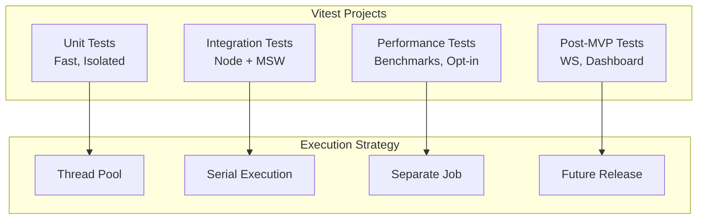

# Testing Architecture Specification

This document details the comprehensive testing architecture for @orchestr8 system, implementing concrete improvements for robustness, determinism, and ADR compliance.

> Created: 2025-01-17  
> Version: 1.0.0  
> Status: Enhanced Testing Strategy

## Vitest Project Architecture

### Project Separation Strategy

The @orchestr8 testing suite is organized into four distinct Vitest projects, each optimized for specific testing needs:



### Project Configurations

#### 1. Unit Test Project

```typescript
// vitest.config.unit.ts
import { defineConfig } from 'vitest/config'

export default defineConfig({
  test: {
    name: 'unit',
    include: ['**/*.unit.test.ts'],
    exclude: ['**/*.integration.test.ts', '**/*.perf.test.ts'],
    pool: 'threads',
    poolOptions: {
      threads: {
        singleThread: false,
        maxThreads: 8,
        minThreads: 1,
      },
    },
    isolate: true,
    coverage: {
      provider: 'v8',
      reportsDirectory: './test-results/coverage/unit',
      thresholds: {
        branches: 80,
        functions: 80,
        lines: 80,
        statements: 80,
      },
    },
    setupFiles: ['./test/setup/unit.ts'],
    environment: 'node',
    globals: true,
    clearMocks: true,
    mockReset: true,
    restoreMocks: true,
  },
})
```

#### 2. Integration Test Project

```typescript
// vitest.config.integration.ts
import { defineConfig } from 'vitest/config'

export default defineConfig({
  test: {
    name: 'integration',
    include: ['**/*.integration.test.ts'],
    pool: 'forks',
    poolOptions: {
      forks: {
        singleFork: true, // Serial execution for stability
      },
    },
    testTimeout: 30000,
    hookTimeout: 30000,
    coverage: {
      provider: 'v8',
      reportsDirectory: './test-results/coverage/integration',
      thresholds: {
        branches: 70,
        functions: 70,
        lines: 70,
        statements: 70,
      },
    },
    setupFiles: ['./test/setup/integration.ts', './test/setup/msw.ts'],
    environment: 'node',
    globals: true,
  },
})
```

#### 3. Performance Test Project

```typescript
// vitest.config.perf.ts
import { defineConfig } from 'vitest/config'

export default defineConfig({
  test: {
    name: 'performance',
    include: ['**/*.perf.test.ts', '**/*.bench.test.ts'],
    pool: 'forks',
    poolOptions: {
      forks: {
        singleFork: true,
        isolate: true,
      },
    },
    testTimeout: 60000,
    coverage: false, // No coverage for perf tests
    setupFiles: ['./test/setup/perf.ts'],
    environment: 'node',
    benchmark: {
      include: ['**/*.bench.ts'],
      exclude: ['node_modules'],
      reporters: ['default', 'json'],
      outputFile: './test-results/benchmark.json',
    },
    // Skip in CI unless explicitly enabled
    mode: process.env.RUN_PERF_TESTS ? 'run' : 'skip',
  },
})
```

#### 4. Post-MVP Test Project

```typescript
// vitest.config.post-mvp.ts
import { defineConfig } from 'vitest/config'

export default defineConfig({
  test: {
    name: 'post-mvp',
    include: ['**/*.dashboard.test.ts', '**/*.websocket.test.ts'],
    pool: 'threads',
    coverage: {
      provider: 'v8',
      reportsDirectory: './test-results/coverage/post-mvp',
      thresholds: {
        branches: 60,
        functions: 60,
        lines: 60,
        statements: 60,
      },
    },
    setupFiles: ['./test/setup/post-mvp.ts'],
    environment: 'jsdom', // For dashboard React components
    // Deferred until post-MVP phase
    mode: process.env.ENABLE_POST_MVP ? 'run' : 'skip',
  },
})
```

### Main Vitest Configuration

```typescript
// vitest.config.ts - Root configuration
import { defineConfig, defineWorkspace } from 'vitest/config'

export default defineWorkspace([
  './vitest.config.unit.ts',
  './vitest.config.integration.ts',
  './vitest.config.perf.ts',
  './vitest.config.post-mvp.ts',
])
```

## Wallaby.js Configuration

### Unified Wallaby Setup

```javascript
// wallaby.cjs
module.exports = function (wallaby) {
  // Set test environment variables at module load time
  process.env.NODE_ENV = 'test'
  process.env.VITEST = 'true'
  process.env.WALLABY_WORKER = 'true'

  return {
    files: [
      'packages/*/src/**/*.ts',
      'packages/*/src/**/*.tsx',
      '!packages/*/src/**/*.test.ts',
      '!packages/*/src/**/*.test.tsx',
      'packages/*/package.json',
      'test/setup/**/*.ts',
      'vitest.config.*.ts',
    ],

    tests: [
      'packages/*/src/**/*.unit.test.ts',
      'packages/*/src/**/*.integration.test.ts',
      // Exclude performance tests from Wallaby
      '!packages/*/src/**/*.perf.test.ts',
      '!packages/*/src/**/*.bench.test.ts',
    ],

    env: {
      type: 'node',
      params: {
        env: 'NODE_ENV=test;VITEST=true;WALLABY_WORKER=true',
      },
    },

    testFramework: 'vitest',

    setup: function (wallaby) {
      // Ensure test environment
      process.env.NODE_ENV = 'test'
      process.env.WALLABY_WORKER = 'true'

      // Setup MSW for integration tests
      if (wallaby.testPath.includes('.integration.test.')) {
        require('./test/setup/msw.ts')
      }
    },

    compilers: {
      '**/*.ts?(x)': wallaby.compilers.typeScript({
        module: 'ESNext',
        target: 'ES2022',
      }),
    },

    hints: {
      ignoreCoverage: /istanbul ignore/,
    },

    runMode: 'onsave',
  }
}
```

## Test Organization Standards

### File Naming Convention

```
src/
├── orchestrator.ts
├── orchestrator.unit.test.ts      # Unit tests
├── orchestrator.integration.test.ts # Integration tests
├── orchestrator.perf.test.ts      # Performance tests
└── orchestrator.bench.ts          # Benchmarks
```

### Test Structure Template

```typescript
// orchestrator.unit.test.ts
import { describe, it, expect, beforeEach, afterEach, vi } from 'vitest'
import { Orchestrator } from './orchestrator'

describe('Orchestrator', () => {
  describe('Core Functionality', () => {
    let orchestrator: Orchestrator

    beforeEach(() => {
      vi.clearAllMocks()
      orchestrator = new Orchestrator()
    })

    afterEach(() => {
      vi.restoreAllMocks()
    })

    describe('agent registration', () => {
      it('registers agents with unique IDs', () => {
        // Test implementation
      })

      it('rejects duplicate agent registrations', () => {
        // Test implementation
      })
    })
  })
})
```

## Property-Based Testing

### Fast-Check Integration

```typescript
// scheduler.property.test.ts
import { describe, it, expect } from 'vitest'
import fc from 'fast-check'
import { FairScheduler } from './scheduler'

describe('FairScheduler Property Tests', () => {
  it('maintains topological ordering', () => {
    fc.assert(
      fc.property(
        fc.array(
          fc.record({
            id: fc.string(),
            dependencies: fc.array(fc.string()),
          }),
          { minLength: 1, maxLength: 20 },
        ),
        (tasks) => {
          const scheduler = new FairScheduler()
          const executionOrder = scheduler.schedule(tasks)

          // Verify all dependencies execute before dependents
          for (const task of executionOrder) {
            const taskIndex = executionOrder.indexOf(task)
            for (const dep of task.dependencies) {
              const depTask = executionOrder.find((t) => t.id === dep)
              if (depTask) {
                const depIndex = executionOrder.indexOf(depTask)
                expect(depIndex).toBeLessThan(taskIndex)
              }
            }
          }
        },
      ),
    )
  })

  it('ensures FIFO fairness under contention', () => {
    fc.assert(
      fc.property(
        fc.array(fc.integer({ min: 1, max: 100 }), {
          minLength: 10,
          maxLength: 50,
        }),
        fc.integer({ min: 1, max: 5 }),
        async (taskDurations, maxConcurrency) => {
          const scheduler = new FairScheduler({ maxConcurrency })
          const submissionOrder: string[] = []
          const completionOrder: string[] = []

          const tasks = taskDurations.map((duration, i) => ({
            id: `task-${i}`,
            execute: async () => {
              submissionOrder.push(`task-${i}`)
              await new Promise((resolve) => setTimeout(resolve, duration))
              completionOrder.push(`task-${i}`)
            },
          }))

          await scheduler.executeAll(tasks)

          // Under same priority, earlier submissions should not be starved
          const starvationThreshold = maxConcurrency * 3
          for (
            let i = 0;
            i < submissionOrder.length - starvationThreshold;
            i++
          ) {
            const submittedIndex = i
            const completedIndex = completionOrder.indexOf(submissionOrder[i])
            expect(completedIndex).toBeLessThanOrEqual(
              submittedIndex + starvationThreshold,
            )
          }
        },
      ),
      { numRuns: process.env.CI ? 200 : 100 }, // Limit iterations for performance
    )
  })

  it('detects circular dependencies', () => {
    fc.assert(
      fc.property(fc.integer({ min: 3, max: 10 }), (nodeCount) => {
        const scheduler = new FairScheduler()

        // Create circular dependency
        const tasks = Array.from({ length: nodeCount }, (_, i) => ({
          id: `task-${i}`,
          dependencies: [`task-${(i + 1) % nodeCount}`],
        }))

        expect(() => scheduler.schedule(tasks)).toThrow(
          /Circular dependency detected/,
        )
      }),
    )
  })
})
```

## Deterministic Testing Utilities

### Timer Control Utilities

```typescript
// test/utils/timers.ts
import { vi, beforeEach, afterEach } from 'vitest'

export interface TimerControl {
  advance: (ms: number) => void
  runAllTimers: () => void
  runOnlyPendingTimers: () => void
  getTimerCount: () => number
  reset: () => void
}

export function useFakeTimers(
  initialTime = new Date('2025-01-17T00:00:00Z'),
): TimerControl {
  beforeEach(() => {
    vi.useFakeTimers()
    vi.setSystemTime(initialTime)
  })

  afterEach(() => {
    vi.clearAllTimers()
    vi.useRealTimers()
  })

  return {
    advance: (ms: number) => vi.advanceTimersByTime(ms),
    runAllTimers: () => vi.runAllTimers(),
    runOnlyPendingTimers: () => vi.runOnlyPendingTimers(),
    getTimerCount: () => vi.getTimerCount(),
    reset: () => {
      vi.clearAllTimers()
      vi.setSystemTime(initialTime)
    },
  }
}

// Timeout composition testing utilities
export async function testTimeoutComposition(config: {
  timeout: number
  maxAttempts: number
  backoff: { type: 'linear' | 'exponential'; delay: number }
}) {
  const timers = useFakeTimers()
  const startTime = Date.now()

  let attempts = 0
  const operation = vi.fn().mockRejectedValue(new Error('Timeout'))

  const wrappedOperation = withTimeout(
    withRetry(operation, config),
    config.timeout,
  )

  const promise = wrappedOperation()

  // Simulate per-attempt timeouts
  for (let i = 0; i < config.maxAttempts; i++) {
    await timers.advance(config.timeout)
    attempts++

    if (i < config.maxAttempts - 1) {
      const backoffDelay =
        config.backoff.type === 'exponential'
          ? Math.pow(2, i) * config.backoff.delay
          : config.backoff.delay
      await timers.advance(backoffDelay)
    }
  }

  await expect(promise).rejects.toThrow()

  const elapsedTime = Date.now() - startTime
  const expectedMaxTime =
    config.maxAttempts * config.timeout +
    (config.maxAttempts - 1) *
      config.backoff.delay *
      (config.backoff.type === 'exponential'
        ? Math.pow(2, config.maxAttempts - 1) - 1
        : 1)

  // Verify worst-case elapsed time with 10% tolerance
  expect(elapsedTime).toBeLessThanOrEqual(expectedMaxTime * 1.1)
  expect(operation).toHaveBeenCalledTimes(config.maxAttempts)

  return { attempts, elapsedTime, expectedMaxTime }
}
```

### Idempotency Testing Utilities

```typescript
// test/utils/idempotency.ts
import { vi } from 'vitest'

export class IdempotencyTestHarness {
  private cache = new Map<string, { result: any; timestamp: number }>()
  private ttl: number
  private cleanupInterval: number

  constructor(ttl = 600000, cleanupInterval = 60000) {
    this.ttl = ttl
    this.cleanupInterval = cleanupInterval
    this.startCleanup()
  }

  private startCleanup() {
    setInterval(() => {
      const now = Date.now()
      for (const [key, entry] of this.cache.entries()) {
        if (now - entry.timestamp > this.ttl) {
          this.cache.delete(key)
        }
      }
    }, this.cleanupInterval)
  }

  async testIdempotency(key: string, operation: () => Promise<any>) {
    // Check cache
    const cached = this.cache.get(key)
    if (cached && Date.now() - cached.timestamp < this.ttl) {
      return { result: cached.result, cached: true }
    }

    // Execute operation
    const result = await operation()
    this.cache.set(key, { result, timestamp: Date.now() })
    return { result, cached: false }
  }

  async testTTLExpiration(key: string, operation: () => Promise<any>) {
    const timers = useFakeTimers()

    // First request - should execute
    const result1 = await this.testIdempotency(key, operation)
    expect(result1.cached).toBe(false)

    // Immediate duplicate - should return cached
    const result2 = await this.testIdempotency(key, operation)
    expect(result2.cached).toBe(true)
    expect(result2.result).toEqual(result1.result)

    // Advance past TTL
    timers.advance(this.ttl + 1000)

    // After TTL - should execute new
    const result3 = await this.testIdempotency(key, operation)
    expect(result3.cached).toBe(false)

    return { result1, result2, result3 }
  }

  validateKeyFormat(key: string) {
    // Validate key follows expected regex pattern
    const keyRegex =
      /^[a-zA-Z0-9]{8}-[a-zA-Z0-9]{4}-[a-zA-Z0-9]{4}-[a-zA-Z0-9]{4}-[a-zA-Z0-9]{12}$/
    expect(key).toMatch(keyRegex)
  }

  async testCollisionBehavior(key: string, payload1: any, payload2: any) {
    const result1 = await this.testIdempotency(key, async () => payload1)

    // Different payload with same key should return 409
    await expect(
      this.testIdempotency(key, async () => payload2),
    ).rejects.toThrow('Idempotency key collision: different payload')
  }
}
```

### Cancellation Testing Utilities

```typescript
// test/utils/cancellation.ts
export class CancellationTestHarness {
  async testGracefulCancellation(
    operation: (signal: AbortSignal) => Promise<void>,
  ) {
    const controller = new AbortController()
    const cleanupCalled = vi.fn()
    const forcedTermination = vi.fn()

    // Start operation
    const promise = operation(controller.signal)

    // Register cleanup handlers
    controller.signal.addEventListener('abort', () => {
      setTimeout(() => {
        if (!cleanupCalled.mock.calls.length) {
          forcedTermination()
        }
      }, 5000) // 5s grace period
    })

    // Trigger cancellation after 1s
    setTimeout(() => controller.abort(), 1000)

    await expect(promise).rejects.toThrow('AbortError')

    // Verify grace period behavior
    expect(cleanupCalled).toHaveBeenCalled()
    expect(forcedTermination).not.toHaveBeenCalled()

    // Test forced termination
    const timers = useFakeTimers()
    controller.abort()
    timers.advance(5001)
    expect(forcedTermination).toHaveBeenCalled()
  }

  async testChainPropagation(agents: Agent[]) {
    const controller = new AbortController()
    const abortObservations = new Map<string, boolean>()

    // Create nested execution with AbortSignal.any
    const executeChain = async (signal: AbortSignal) => {
      for (const agent of agents) {
        const combinedSignal = AbortSignal.any([signal, agent.ownSignal])

        combinedSignal.addEventListener('abort', () => {
          abortObservations.set(agent.id, true)
        })

        await agent.execute({ signal: combinedSignal })
      }
    }

    const promise = executeChain(controller.signal)

    // Abort after partial execution
    setTimeout(() => controller.abort(), 500)

    await expect(promise).rejects.toThrow('AbortError')

    // Verify all agents observed cancellation
    for (const agent of agents) {
      expect(abortObservations.get(agent.id)).toBe(true)
    }
  }
}
```

## CI/CD Test Pipeline

### GitHub Actions Configuration

```yaml
# .github/workflows/test.yml
name: Test Suite

on:
  push:
    branches: [main, develop]
  pull_request:
    branches: [main]

env:
  NODE_ENV: test
  CI: true

jobs:
  unit-tests:
    runs-on: ubuntu-latest
    strategy:
      matrix:
        node: [20, 22] # Node 20+ required for AbortSignal.any and AbortSignal.timeout
    steps:
      - uses: actions/checkout@v4
      - uses: pnpm/action-setup@v2
      - uses: actions/setup-node@v4
        with:
          node-version: ${{ matrix.node }}
          cache: 'pnpm'

      - name: Install dependencies
        run: pnpm install --frozen-lockfile

      - name: Run unit tests
        run: pnpm test:unit --coverage
        env:
          VITEST_MAX_THREADS: 8

      - name: Upload coverage
        uses: actions/upload-artifact@v4
        with:
          name: unit-coverage-${{ matrix.node }}
          path: test-results/coverage/unit/

  integration-tests:
    runs-on: ubuntu-latest
    needs: unit-tests
    steps:
      - uses: actions/checkout@v4
      - uses: pnpm/action-setup@v2
      - uses: actions/setup-node@v4
        with:
          node-version: 20
          cache: 'pnpm'

      - name: Install dependencies
        run: pnpm install --frozen-lockfile

      - name: Run integration tests
        run: pnpm test:integration --coverage
        env:
          MSW_UNHANDLED_REQUEST: error

      - name: Upload test results
        uses: actions/upload-artifact@v4
        with:
          name: integration-results
          path: |
            test-results/junit.xml
            test-results/coverage/integration/

  performance-tests:
    runs-on: ubuntu-latest
    if: github.event_name == 'push' && github.ref == 'refs/heads/main'
    steps:
      - uses: actions/checkout@v4
      - uses: pnpm/action-setup@v2
      - uses: actions/setup-node@v4
        with:
          node-version: 20
          cache: 'pnpm'

      - name: Install dependencies
        run: pnpm install --frozen-lockfile

      - name: Run performance tests
        run: pnpm test:perf
        env:
          RUN_PERF_TESTS: true

      - name: Compare with baseline
        run: node scripts/compare-perf-baseline.js

      - name: Upload benchmark results
        uses: actions/upload-artifact@v4
        with:
          name: benchmark-results
          path: test-results/benchmark.json

  coverage-enforcement:
    runs-on: ubuntu-latest
    needs: [unit-tests, integration-tests]
    steps:
      - uses: actions/checkout@v4
      - uses: actions/download-artifact@v4
        with:
          path: test-results/

      - name: Merge coverage reports
        run: |
          pnpm dlx nyc merge test-results/unit-coverage-20 test-results/coverage-merged
          pnpm dlx nyc merge test-results/integration-coverage test-results/coverage-merged

      - name: Enforce coverage thresholds
        run: node scripts/enforce-coverage.js

      - name: Upload final coverage
        uses: codecov/codecov-action@v3
        with:
          directory: test-results/coverage-merged
          fail_ci_if_error: true
```

### Package.json Test Scripts

```json
{
  "scripts": {
    "test": "vitest",
    "test:unit": "vitest run --config vitest.config.unit.ts",
    "test:integration": "vitest run --config vitest.config.integration.ts",
    "test:perf": "vitest run --config vitest.config.perf.ts",
    "test:watch": "vitest watch",
    "test:coverage": "vitest run --coverage",
    "test:ui": "vitest --ui",
    "bench": "vitest bench",
    "coverage:enforce": "node scripts/enforce-coverage.js",
    "perf:baseline": "node scripts/create-perf-baseline.js"
  }
}
```

## Summary

This testing architecture provides:

1. **Clear separation** of test types with optimized execution strategies
2. **Deterministic testing** with fake timers and controlled randomness
3. **Property-based testing** for complex invariants
4. **Comprehensive utilities** for idempotency, cancellation, and timing
5. **Robust CI/CD pipeline** with proper isolation and reporting
6. **Developer-friendly** Wallaby.js integration for rapid feedback

The architecture ensures tests are maintainable, reliable, and provide confidence in the @orchestr8 system's correctness and performance.
