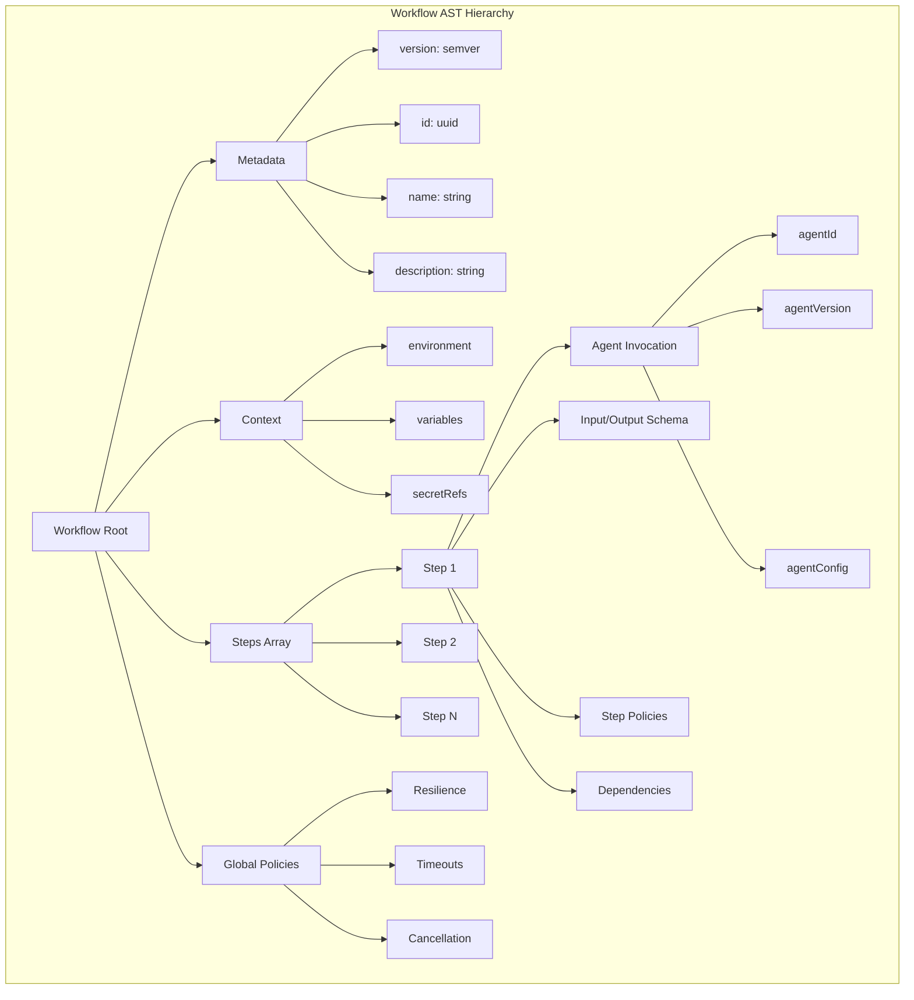
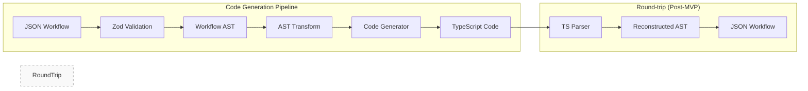
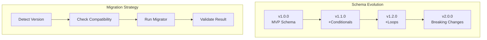

# Workflow AST Schema Specification

This document defines the **canonical Workflow Abstract Syntax Tree (AST)** for @orchestr8, providing the single source of truth for workflow representation.

> Created: 2025-01-17  
> Version: 1.0.0  
> Status: MVP Schema Definition

## Overview

The Workflow AST is a **JSON-based declarative format** that defines agent orchestration workflows. It supports versioning, validation, and TypeScript code generation while maintaining round-trip fidelity.

## AST Structure



## JSON Schema Definition

```json
{
  "$schema": "http://json-schema.org/draft-07/schema#",
  "$id": "https://orchestr8.ai/schemas/workflow/v1.0.0",
  "title": "Workflow AST Schema",
  "type": "object",
  "required": ["version", "schemaVersion", "schemaHash", "metadata", "steps"],
  "properties": {
    "version": {
      "type": "string",
      "pattern": "^\\d+\\.\\d+\\.\\d+$",
      "description": "Workflow version (semver)"
    },
    "schemaVersion": {
      "type": "string",
      "pattern": "^\\d+\\.\\d+\\.\\d+$",
      "description": "Schema version (semver) - per ADR-002"
    },
    "schemaHash": {
      "type": "string",
      "pattern": "^[a-f0-9]{64}$",
      "description": "SHA-256 hash of schema structure - per ADR-002"
    },
    "metadata": {
      "$ref": "#/definitions/WorkflowMetadata"
    },
    "context": {
      "$ref": "#/definitions/WorkflowContext"
    },
    "steps": {
      "type": "array",
      "items": {
        "$ref": "#/definitions/WorkflowStep"
      },
      "minItems": 1
    },
    "policies": {
      "$ref": "#/definitions/GlobalPolicies"
    }
  },
  "definitions": {
    "WorkflowMetadata": {
      "type": "object",
      "required": ["id", "name"],
      "properties": {
        "id": {
          "type": "string",
          "format": "uuid"
        },
        "name": {
          "type": "string",
          "minLength": 1,
          "maxLength": 255
        },
        "description": {
          "type": "string",
          "maxLength": 1000
        },
        "tags": {
          "type": "array",
          "items": {
            "type": "string"
          }
        },
        "createdAt": {
          "type": "string",
          "format": "date-time"
        },
        "updatedAt": {
          "type": "string",
          "format": "date-time"
        }
      }
    },
    "WorkflowContext": {
      "type": "object",
      "properties": {
        "environment": {
          "type": "object",
          "additionalProperties": {
            "type": "string"
          }
        },
        "variables": {
          "type": "object",
          "additionalProperties": true
        },
        "secretRefs": {
          "type": "array",
          "items": {
            "type": "string",
            "pattern": "^secret://[a-zA-Z0-9-_/]+$"
          }
        }
      }
    },
    "WorkflowStep": {
      "type": "object",
      "required": ["id", "name", "agent"],
      "properties": {
        "id": {
          "type": "string",
          "pattern": "^[a-zA-Z0-9-_]+$"
        },
        "name": {
          "type": "string"
        },
        "description": {
          "type": "string"
        },
        "agent": {
          "$ref": "#/definitions/AgentInvocation"
        },
        "input": {
          "$ref": "#/definitions/StepInput"
        },
        "output": {
          "$ref": "#/definitions/StepOutput"
        },
        "dependencies": {
          "type": "array",
          "items": {
            "type": "string"
          },
          "description": "Step IDs that must complete before this step"
        },
        "condition": {
          "$ref": "#/definitions/StepCondition"
        },
        "policies": {
          "$ref": "#/definitions/StepPolicies"
        },
        "onError": {
          "type": "string",
          "enum": ["fail", "continue", "retry", "fallback"],
          "default": "fail"
        },
        "fallbackStepId": {
          "type": "string",
          "description": "Step ID to execute when onError is 'fallback'"
        }
      }
    },
    "AgentInvocation": {
      "type": "object",
      "required": ["id"],
      "properties": {
        "id": {
          "type": "string",
          "pattern": "^@[a-zA-Z0-9-]+/[a-zA-Z0-9-]+$"
        },
        "version": {
          "type": "string",
          "pattern": "^(\\d+\\.\\d+\\.\\d+|latest|\\^\\d+\\.\\d+\\.\\d+|~\\d+\\.\\d+\\.\\d+)$"
        },
        "config": {
          "type": "object",
          "additionalProperties": true
        }
      }
    },
    "StepInput": {
      "type": "object",
      "properties": {
        "schema": {
          "type": "object",
          "description": "JSON Schema for input validation"
        },
        "mapping": {
          "type": "object",
          "additionalProperties": {
            "type": "string",
            "pattern": "^\\$\\{steps\\.[a-zA-Z0-9_-]+\\.output\\.[a-zA-Z0-9_.\\[\\]]+(?:\\?\\?.+)?\\}$"
          },
          "description": "Maps workflow context to agent input using ${steps.<id>.output.<path>} syntax (ADR-019)"
        },
        "expressionSecurity": {
          "type": "object",
          "properties": {
            "maxExpansionDepth": {
              "type": "integer",
              "default": 10,
              "description": "Maximum depth for path traversal (ADR-019)"
            },
            "maxExpansionSize": {
              "type": "integer",
              "default": 65536,
              "description": "Maximum expanded size in bytes per expression (ADR-019)"
            }
          },
          "description": "Security limits for expression engine (ADR-019)"
        },
        "transform": {
          "type": "string",
          "description": "Optional JMES path expression for transformation"
        }
      }
    },
    "StepOutput": {
      "type": "object",
      "properties": {
        "schema": {
          "type": "object",
          "description": "JSON Schema for output validation"
        },
        "capture": {
          "type": "object",
          "additionalProperties": {
            "type": "string"
          },
          "description": "Variables to capture from output"
        }
      }
    },
    "StepCondition": {
      "type": "object",
      "properties": {
        "if": {
          "type": "string",
          "description": "JMES path expression that must evaluate to true"
        },
        "unless": {
          "type": "string",
          "description": "JMES path expression that must evaluate to false"
        }
      }
    },
    "StepPolicies": {
      "type": "object",
      "properties": {
        "timeout": {
          "type": "integer",
          "minimum": 1000,
          "description": "Timeout in milliseconds"
        },
        "retry": {
          "$ref": "#/definitions/RetryPolicy"
        },
        "circuitBreaker": {
          "$ref": "#/definitions/CircuitBreakerPolicy"
        },
        "idempotencyKey": {
          "type": "string",
          "description": "Template for generating idempotency key"
        }
      }
    },
    "GlobalPolicies": {
      "type": "object",
      "properties": {
        "timeout": {
          "type": "object",
          "properties": {
            "global": {
              "type": "integer",
              "default": 300000,
              "description": "Global timeout in ms (default 5 min)"
            },
            "perStep": {
              "type": "integer",
              "default": 30000,
              "description": "Per-attempt timeout in ms - ADR-018 per-attempt semantics"
            }
          }
        },
        "resilience": {
          "$ref": "#/definitions/GlobalResilience"
        },
        "concurrency": {
          "$ref": "#/definitions/ConcurrencyPolicy"
        },
        "resilienceBudget": {
          "$ref": "#/definitions/ResilienceBudget"
        },
        "cancellation": {
          "type": "object",
          "properties": {
            "gracePeriod": {
              "type": "integer",
              "default": 5000,
              "description": "Grace period for cleanup in ms"
            },
            "propagate": {
              "type": "boolean",
              "default": true,
              "description": "Propagate cancellation to running agents"
            },
            "abortSignal": {
              "type": "boolean",
              "default": true,
              "description": "Enable AbortSignal propagation through resilience layers"
            }
          }
        }
      }
    },
    "GlobalResilience": {
      "type": "object",
      "properties": {
        "retry": {
          "$ref": "#/definitions/RetryPolicy"
        },
        "circuitBreaker": {
          "$ref": "#/definitions/CircuitBreakerPolicy"
        },
        "compositionOrder": {
          "type": "string",
          "enum": ["retry-cb-timeout", "timeout-cb-retry"],
          "default": "retry-cb-timeout",
          "description": "Per-attempt composition: retry(circuitBreaker(timeout(operation))) - ADR-018"
        }
      }
    },
    "RetryPolicy": {
      "type": "object",
      "properties": {
        "maxAttempts": {
          "type": "integer",
          "minimum": 1,
          "maximum": 10,
          "default": 3,
          "description": "Maximum retry attempts (initial + retries) - per ADR-018"
        },
        "baseDelayMs": {
          "type": "integer",
          "minimum": 100,
          "default": 1000,
          "description": "Base delay for exponential backoff in milliseconds (ADR-019)"
        },
        "jitterStrategy": {
          "type": "string",
          "enum": ["full-jitter"],
          "default": "full-jitter",
          "description": "Jitter formula: base * 2^(n-1) * random(0.5..1.5) prevents thundering herds (ADR-019)"
        },
        "maxDelayMs": {
          "type": "integer",
          "default": 4000,
          "description": "Maximum delay cap for exponential backoff"
        },
        "jitter": {
          "type": "boolean",
          "default": true,
          "description": "Apply full jitter: delay * (0.5 + Math.random() * 0.5)"
        },
        "retryableErrors": {
          "type": "array",
          "items": {
            "type": "string",
            "enum": ["RetryableError", "TimeoutError", "NetworkError"]
          },
          "default": ["RetryableError", "TimeoutError"],
          "description": "Error types that trigger retry attempts"
        }
      }
    },
    "CircuitBreakerPolicy": {
      "type": "object",
      "properties": {
        "keyStrategy": {
          "type": "object",
          "properties": {
            "agentId": {
              "type": "boolean",
              "default": true,
              "description": "Include agent identifier in circuit breaker key (ADR-019)"
            },
            "includeTarget": {
              "type": "boolean",
              "default": true,
              "description": "Include target (URL host/endpoint) in key for isolation (ADR-019)"
            }
          },
          "description": "Circuit breaker key generation: agentId + optional target (ADR-019)"
        },
        "failureThreshold": {
          "type": "integer",
          "minimum": 1,
          "default": 5,
          "description": "Consecutive failures before opening circuit (ADR-019)"
        },
        "resetTimeoutMs": {
          "type": "integer",
          "minimum": 1000,
          "default": 60000,
          "description": "Open duration before half-open transition (ADR-019)"
        },
        "halfOpenPolicy": {
          "type": "string",
          "enum": ["single-probe"],
          "default": "single-probe",
          "description": "Half-open allows exactly 1 concurrent probe (ADR-019 contract)"
        },
        "errorClassification": {
          "type": "object",
          "properties": {
            "countTimeouts": {
              "type": "boolean",
              "default": true,
              "description": "Count timeout errors as circuit breaker failures (ADR-019)"
            },
            "countNetworkErrors": {
              "type": "boolean",
              "default": true,
              "description": "Count network errors as circuit breaker failures (ADR-019)"
            },
            "count5xxErrors": {
              "type": "boolean",
              "default": true,
              "description": "Count HTTP 5xx responses as circuit breaker failures (ADR-019)"
            },
            "countRetryableErrors": {
              "type": "boolean",
              "default": true,
              "description": "Count explicit retryable errors as circuit breaker failures (ADR-019)"
            }
          },
          "description": "Error types that increment circuit breaker failure count (ADR-019)"
        }
      }
    },
    "ConcurrencyPolicy": {
      "type": "object",
      "properties": {
        "maxConcurrentSteps": {
          "type": "integer",
          "minimum": 1,
          "maximum": 10,
          "default": 10,
          "description": "Maximum parallel step execution limit"
        },
        "abortOnSignal": {
          "type": "boolean",
          "default": true,
          "description": "Enable cooperative cancellation via AbortSignal"
        },
        "cleanupTimeoutMs": {
          "type": "integer",
          "minimum": 1000,
          "default": 5000,
          "description": "Time allowed for cleanup after abort signal"
        }
      }
    },
    "ResilienceBudget": {
      "type": "object",
      "properties": {
        "perExecutionMs": {
          "type": "integer",
          "minimum": 30000,
          "default": 90000,
          "description": "Maximum time per execution (3 × 30s per-attempt timeout)"
        },
        "queueTimeoutMs": {
          "type": "integer",
          "minimum": 10000,
          "default": 30000,
          "description": "Maximum wait time before execution starts"
        },
        "totalSystemBudgetMs": {
          "type": "integer",
          "minimum": 60000,
          "default": 120000,
          "description": "Total system budget from request to response"
        }
      }
    }
  }
}
```

## Zod Type Definitions

```typescript
import { z } from 'zod'

// Base types
const WorkflowVersion = z.string().regex(/^\d+\.\d+\.\d+$/)
const StepId = z.string().regex(/^[a-zA-Z0-9-_]+$/)
const AgentId = z.string().regex(/^@[a-zA-Z0-9-]+\/[a-zA-Z0-9-]+$/)
const SecretRef = z.string().regex(/^secret:\/\/[a-zA-Z0-9-_\/]+$/)

// Metadata schema
export const WorkflowMetadataSchema = z.object({
  id: z.string().uuid(),
  name: z.string().min(1).max(255),
  description: z.string().max(1000).optional(),
  tags: z.array(z.string()).optional(),
  createdAt: z.string().datetime().optional(),
  updatedAt: z.string().datetime().optional(),
})

// Context schema
export const WorkflowContextSchema = z.object({
  environment: z.record(z.string()).optional(),
  variables: z.record(z.unknown()).optional(),
  secretRefs: z.array(SecretRef).optional(),
})

// Agent invocation
export const AgentInvocationSchema = z.object({
  id: AgentId,
  version: z
    .string()
    .regex(/^(\d+\.\d+\.\d+|latest|\^\d+\.\d+\.\d+|~\d+\.\d+\.\d+)$/)
    .optional(),
  config: z.record(z.unknown()).optional(),
})

// Step input/output
export const StepInputSchema = z.object({
  schema: z.record(z.unknown()).optional(),
  mapping: z.record(z.string().regex(/^\$\{[^}]+\}$/)).optional(),
  transform: z.string().optional(),
})

export const StepOutputSchema = z.object({
  schema: z.record(z.unknown()).optional(),
  capture: z.record(z.string()).optional(),
})

// Conditions
export const StepConditionSchema = z.object({
  if: z.string().optional(),
  unless: z.string().optional(),
})

// Policies - Updated per ADR-018
export const RetryPolicySchema = z.object({
  maxAttempts: z.number().int().min(1).max(10).default(3),
  baseDelayMs: z.number().int().min(100).default(1000),
  maxDelayMs: z.number().int().default(30000),
  jitterStrategy: z.enum(['full-jitter']).default('full-jitter'),
  retryableErrors: z
    .array(z.enum(['RetryableError', 'TimeoutError', 'NetworkError']))
    .default(['RetryableError', 'TimeoutError']),
})

export const CircuitBreakerPolicySchema = z.object({
  keyStrategy: z
    .object({
      agentId: z.boolean().default(true),
      includeTarget: z.boolean().default(true),
    })
    .optional(),
  failureThreshold: z.number().int().min(1).default(5),
  resetTimeoutMs: z.number().int().min(1000).default(60000),
  halfOpenPolicy: z.enum(['single-probe']).default('single-probe'),
  errorClassification: z
    .object({
      countTimeouts: z.boolean().default(true),
      countNetworkErrors: z.boolean().default(true),
      count5xxErrors: z.boolean().default(true),
      countRetryableErrors: z.boolean().default(true),
    })
    .optional(),
})

export const ConcurrencyPolicySchema = z.object({
  maxConcurrentSteps: z.number().int().min(1).max(10).default(10),
  abortOnSignal: z.boolean().default(true),
  cleanupTimeoutMs: z.number().int().min(1000).default(5000),
})

export const ResilienceBudgetSchema = z.object({
  perExecutionMs: z.number().int().min(30000).default(90000),
  queueTimeoutMs: z.number().int().min(10000).default(30000),
  totalSystemBudgetMs: z.number().int().min(60000).default(120000),
})

// Error taxonomy per ADR-019
export const ErrorTaxonomySchema = z.object({
  code: z.enum([
    'TIMEOUT',
    'CIRCUIT_OPEN',
    'CANCELLED',
    'VALIDATION',
    'RETRYABLE',
  ]),
  isRetryable: z.boolean(),
  attempts: z.number().int().min(0),
  cause: z.string().optional(),
  context: z.record(z.unknown()).optional(),
})

// Expression syntax validation per ADR-019
export const ExpressionSyntaxSchema = z.object({
  pattern: z
    .string()
    .regex(
      /^\$\{steps\.[a-zA-Z0-9_-]+\.output\.[a-zA-Z0-9_.[\]]+(?:\?\?.+)?\}$/,
    ),
  maxExpansionDepth: z.number().int().default(10),
  maxExpansionSize: z.number().int().default(65536),
})

export const StepPoliciesSchema = z.object({
  timeout: z.number().int().min(1000).optional(),
  retry: RetryPolicySchema.optional(),
  circuitBreaker: CircuitBreakerPolicySchema.optional(),
  idempotencyKey: z.string().optional(),
})

// Workflow step
export const WorkflowStepSchema = z.object({
  id: StepId,
  name: z.string(),
  description: z.string().optional(),
  agent: AgentInvocationSchema,
  input: StepInputSchema.optional(),
  output: StepOutputSchema.optional(),
  dependencies: z.array(StepId).optional(),
  condition: StepConditionSchema.optional(),
  policies: StepPoliciesSchema.optional(),
  onError: z.enum(['fail', 'continue', 'retry', 'fallback']).default('fail'),
})

// Global policies - Updated per ADR-018
export const GlobalPoliciesSchema = z.object({
  timeout: z
    .object({
      global: z.number().int().default(300000),
      perStep: z.number().int().default(30000),
    })
    .optional(),
  resilience: z
    .object({
      retry: RetryPolicySchema.optional(),
      circuitBreaker: CircuitBreakerPolicySchema.optional(),
      compositionOrder: z
        .enum(['retry-cb-timeout', 'timeout-cb-retry'])
        .default('retry-cb-timeout'),
    })
    .optional(),
  concurrency: ConcurrencyPolicySchema.optional(),
  resilienceBudget: ResilienceBudgetSchema.optional(),
  cancellation: z
    .object({
      gracePeriod: z.number().int().default(5000),
      propagate: z.boolean().default(true),
      abortSignal: z.boolean().default(true),
    })
    .optional(),
})

// Complete workflow schema with versioning (per ADR-002)
export const WorkflowSchema = z.object({
  version: WorkflowVersion,
  schemaVersion: z.string().regex(/^\d+\.\d+\.\d+$/), // Schema version (semver)
  schemaHash: z.string().regex(/^[a-f0-9]{64}$/), // SHA-256 hash
  metadata: WorkflowMetadataSchema,
  context: WorkflowContextSchema.optional(),
  steps: z.array(WorkflowStepSchema).min(1),
  policies: GlobalPoliciesSchema.optional(),
})

// Type exports - Updated per ADR-018
export type Workflow = z.infer<typeof WorkflowSchema>
export type WorkflowStep = z.infer<typeof WorkflowStepSchema>
export type AgentInvocation = z.infer<typeof AgentInvocationSchema>
export type RetryPolicy = z.infer<typeof RetryPolicySchema>
export type CircuitBreakerPolicy = z.infer<typeof CircuitBreakerPolicySchema>
export type ConcurrencyPolicy = z.infer<typeof ConcurrencyPolicySchema>
export type ResilienceBudget = z.infer<typeof ResilienceBudgetSchema>
export type GlobalPolicies = z.infer<typeof GlobalPoliciesSchema>

// Schema versioning utilities (per ADR-002)
export class WorkflowSchemaValidator {
  private static readonly CURRENT_SCHEMA_VERSION = '1.0.0'

  static calculateSchemaHash(schema: any): string {
    // IMPORTANT: Generate canonical JSON Schema for stable hashing
    // This avoids brittleness from Zod internals changing across versions
    const canonicalSchema = {
      $schema: 'http://json-schema.org/draft-07/schema#',
      version: this.CURRENT_SCHEMA_VERSION,
      type: 'object',
      // Extract field names and types, NOT Zod internals
      fields: Object.keys(schema).sort(),
      // Use a stable type representation
      fieldTypes: this.extractStableTypes(schema),
    }

    // Deterministic JSON serialization with sorted keys
    const sortedJson = JSON.stringify(
      canonicalSchema,
      Object.keys(canonicalSchema).sort(),
    )

    return crypto.createHash('sha256').update(sortedJson).digest('hex')
  }

  private static extractStableTypes(schema: any): Record<string, string> {
    // Extract type information in a stable way that doesn't depend on Zod internals
    const types: Record<string, string> = {}
    for (const [key, value] of Object.entries(schema)) {
      // Get the type name from Zod schema in a stable way
      types[key] = this.getStableTypeName(value)
    }
    return types
  }

  static validateSchemaHash(workflow: any): boolean {
    const expectedHash = this.calculateSchemaHash(WorkflowSchema.shape)
    return workflow.schemaHash === expectedHash
  }

  static validateWorkflowWithVersioning(data: unknown): Workflow {
    const parsed = WorkflowSchema.parse(data)

    // Validate schema version compatibility
    if (!this.isVersionCompatible(parsed.schemaVersion)) {
      throw new Error(`Unsupported schema version: ${parsed.schemaVersion}`)
    }

    // Validate schema hash
    if (!this.validateSchemaHash(parsed)) {
      throw new Error(
        `Schema hash mismatch. Expected current schema structure.`,
      )
    }

    return parsed
  }

  private static isVersionCompatible(version: string): boolean {
    const [major] = version.split('.').map(Number)
    const [currentMajor] = this.CURRENT_SCHEMA_VERSION.split('.').map(Number)

    // Major version must match for compatibility
    return major === currentMajor
  }

  private static extractTypes(schema: any): Record<string, string> {
    const types: Record<string, string> = {}

    for (const [key, value] of Object.entries(schema)) {
      if (value && typeof value === 'object' && '_def' in value) {
        types[key] = (value as any)._def.typeName || 'unknown'
      }
    }

    return types
  }
}
```

## TypeScript Code Generation



### Generated TypeScript Example

```typescript
// Generated from workflow AST
import { Orchestrator } from '@orchestr8/core'
import { GitHubAgent } from '@orchestr8/agents/github'
import { ProfileAgent } from '@orchestr8/agents/profile'

export async function executeWorkflow_research_user(
  input: WorkflowInput,
  context: WorkflowContext,
): Promise<WorkflowOutput> {
  const orchestrator = new Orchestrator({
    policies: {
      timeout: { global: 300000, perStep: 30000 },
      resilience: {
        retry: { maxAttempts: 3, initialDelay: 1000 },
        circuitBreaker: { failureThreshold: 5 },
      },
    },
  })

  // Step 1: GitHub Research
  const step1Result = await orchestrator.executeStep({
    id: 'github-research',
    agent: new GitHubAgent({ version: '1.0.0' }),
    input: {
      username: input.targetUser,
      includeRepos: true,
    },
    policies: {
      timeout: 60000,
      retry: { maxAttempts: 5 },
    },
  })

  // Step 2: Profile Analysis (depends on step 1)
  const step2Result = await orchestrator.executeStep({
    id: 'profile-analysis',
    agent: new ProfileAgent({ version: '1.0.0' }),
    input: {
      username: input.targetUser,
      githubData: step1Result.output,
    },
    dependencies: ['github-research'],
    policies: {
      timeout: 45000,
    },
  })

  return {
    githubData: step1Result.output,
    profileData: step2Result.output,
    executionId: orchestrator.getExecutionId(),
    duration: orchestrator.getExecutionDuration(),
  }
}
```

## Versioning and Migration



### Version Compatibility Matrix

| Schema Version | Orchestrator Version | Migration Required       |
| -------------- | -------------------- | ------------------------ |
| 1.0.0          | 1.0.x                | No                       |
| 1.1.0          | 1.1.x                | No (backward compatible) |
| 1.2.0          | 1.2.x                | No (backward compatible) |
| 2.0.0          | 2.0.x                | Yes (breaking changes)   |

### Migration Example

```typescript
export class WorkflowMigrator {
  async migrate(workflow: unknown): Promise<Workflow> {
    const version = this.detectVersion(workflow)

    switch (version) {
      case '1.0.0':
        return this.migrateFrom_1_0_0(workflow)
      case '1.1.0':
        return this.migrateFrom_1_1_0(workflow)
      default:
        if (this.isCompatible(version)) {
          return workflow as Workflow
        }
        throw new Error(`Unsupported workflow version: ${version}`)
    }
  }

  private migrateFrom_1_0_0(workflow: any): Workflow {
    // Add new required fields with defaults
    return {
      ...workflow,
      version: '1.2.0',
      metadata: {
        ...workflow.metadata,
        createdAt: workflow.metadata.createdAt || new Date().toISOString(),
      },
      policies: workflow.policies || {
        timeout: { global: 300000, perStep: 30000 },
      },
    }
  }
}
```

## Validation Examples

### Valid Workflow

```json
{
  "version": "1.0.0",
  "schemaVersion": "1.0.0",
  "schemaHash": "b1c2d3e4f5a6789012345678901234567890123456789012345678901234567890",
  "metadata": {
    "id": "550e8400-e29b-41d4-a716-446655440000",
    "name": "User Research Workflow",
    "description": "Research GitHub user profile and activity"
  },
  "context": {
    "variables": {
      "targetUser": "gaearon"
    }
  },
  "steps": [
    {
      "id": "github-research",
      "name": "GitHub Research",
      "agent": {
        "id": "@orchestr8/github-agent",
        "version": "^1.0.0"
      },
      "input": {
        "mapping": {
          "username": "${variables.targetUser}"
        }
      },
      "policies": {
        "timeout": 60000,
        "retry": {
          "maxAttempts": 3
        }
      }
    },
    {
      "id": "profile-analysis",
      "name": "Profile Analysis",
      "agent": {
        "id": "@orchestr8/profile-agent",
        "version": "^1.0.0"
      },
      "dependencies": ["github-research"],
      "input": {
        "mapping": {
          "username": "${variables.targetUser}",
          "githubData": "${steps.github-research.output}"
        }
      }
    }
  ],
  "policies": {
    "timeout": {
      "global": 120000,
      "perStep": 30000
    },
    "resilience": {
      "retry": {
        "maxAttempts": 3,
        "baseDelayMs": 1000,
        "maxDelayMs": 4000,
        "jitter": true
      },
      "circuitBreaker": {
        "key": "github-research",
        "failureThreshold": 5,
        "resetTimeoutMs": 60000,
        "halfOpenPolicy": "single-trial"
      },
      "compositionOrder": "retry-cb-timeout"
    },
    "concurrency": {
      "maxConcurrentSteps": 5,
      "abortOnSignal": true,
      "cleanupTimeoutMs": 5000
    },
    "resilienceBudget": {
      "perExecutionMs": 90000,
      "queueTimeoutMs": 30000,
      "totalSystemBudgetMs": 120000
    },
    "cancellation": {
      "gracePeriod": 5000,
      "propagate": true,
      "abortSignal": true
    }
  }
}
```

### Validation with Zod

```typescript
import { WorkflowSchema, WorkflowSchemaValidator } from '@orchestr8/schema'

function validateWorkflow(data: unknown): Workflow {
  try {
    // Use versioning-aware validation
    return WorkflowSchemaValidator.validateWorkflowWithVersioning(data)
  } catch (error) {
    if (error instanceof z.ZodError) {
      console.error('Validation errors:', error.errors)
      throw new WorkflowValidationError(error.errors)
    }
    throw error
  }
}

// Alternative: Basic validation without versioning checks
function validateWorkflowBasic(data: unknown): Workflow {
  try {
    return WorkflowSchema.parse(data)
  } catch (error) {
    if (error instanceof z.ZodError) {
      console.error('Validation errors:', error.errors)
      throw new WorkflowValidationError(error.errors)
    }
    throw error
  }
}

// Usage
const workflow = validateWorkflow(jsonData)
console.log(`Valid workflow: ${workflow.metadata.name}`)
console.log(`Schema version: ${workflow.schemaVersion}`)
```

## Mapping Resolution and Execution Semantics

### Variable Resolution Order

When resolving `${...}` placeholders in mappings, the following precedence order applies:

1. **Step outputs** (`${steps.<stepId>.output.<field>}`) - Highest priority
2. **Context variables** (`${variables.<name>}`) - User-defined variables
3. **Environment** (`${env.<name>}`) - Environment variables (lowest priority)

**Resolution Example:**

```typescript
function resolveMapping(template: string, context: ExecutionContext): any {
  return template.replace(/\$\{([^}]+)\}/g, (match, path) => {
    // Try step outputs first
    if (path.startsWith('steps.')) {
      const stepPath = path.substring(6)
      const value = getStepOutput(context, stepPath)
      if (value !== undefined) return value
    }

    // Try context variables
    if (path.startsWith('variables.')) {
      const varName = path.substring(10)
      const value = context.variables[varName]
      if (value !== undefined) return value
    }

    // Try environment last
    if (path.startsWith('env.')) {
      const envName = path.substring(4)
      return process.env[envName] || ''
    }

    // Default: return empty string or throw error
    if (context.strict) {
      throw new Error(`Unresolved mapping: ${match}`)
    }
    return ''
  })
}
```

### Condition Evaluation (JMESPath)

Conditions use a subset of JMESPath for safe evaluation:

**Supported JMESPath Library:** `jmespath` (npm package)

- Version: `^0.16.0`
- Sandboxed: No function expressions allowed
- Precompiled: Expressions compiled and cached

**Condition Examples:**

```json
{
  "condition": {
    "expression": "steps.github_research.output.repositories[?stars > `100`]",
    "operator": "not-empty"
  }
}
```

**Evaluation:**

```typescript
import jmespath from 'jmespath'

class ConditionEvaluator {
  private cache = new Map<string, jmespath.CompiledExpression>()

  evaluate(condition: StepCondition, context: ExecutionContext): boolean {
    // Compile and cache expression
    let compiled = this.cache.get(condition.expression)
    if (!compiled) {
      compiled = jmespath.compile(condition.expression)
      this.cache.set(condition.expression, compiled)
    }

    // Evaluate against context
    const result = compiled.search(context)

    // Apply operator
    switch (condition.operator) {
      case 'equals':
        return result === condition.value
      case 'not-empty':
        return Array.isArray(result) ? result.length > 0 : !!result
      case 'greater-than':
        return result > condition.value
      default:
        return false
    }
  }
}
```

### Secret Handling

Secrets are never included in the AST directly. They use references:

```json
{
  "secretRefs": ["secret://github/token", "secret://openai/api-key"]
}
```

**Redaction Rules:**

- Secrets are never logged
- Secrets are redacted from journal entries
- Secrets cannot be captured in `output.capture`
- Secret values are masked in error messages

```typescript
class SecretManager {
  private secrets = new Map<string, string>()

  async resolve(ref: string): Promise<string> {
    if (!ref.startsWith('secret://')) {
      throw new Error('Invalid secret reference')
    }

    const key = ref.substring(9)
    const value = await this.fetchSecret(key)

    // Never log the actual value
    this.logger.info(`Resolved secret: ${key} (***)`)

    return value
  }

  redact(text: string): string {
    // Replace all secret values with ***
    for (const [_, value] of this.secrets) {
      text = text.replace(value, '***')
    }
    return text
  }
}
```

### Deterministic Scheduling

When multiple steps are ready for execution (all dependencies met), the following rules determine execution order:

1. **Priority by dependency count** - Fewer dependencies execute first
2. **Array index as tiebreaker** - Earlier in steps array executes first
3. **Stable sort** - Maintains relative order when priorities equal

```typescript
function scheduleReadySteps(
  steps: WorkflowStep[],
  completed: Set<string>,
): WorkflowStep[] {
  const ready = steps.filter((step) =>
    step.dependencies.every((dep) => completed.has(dep)),
  )

  return ready.sort((a, b) => {
    // Primary: dependency count (ascending)
    const depDiff = a.dependencies.length - b.dependencies.length
    if (depDiff !== 0) return depDiff

    // Tiebreaker: array index
    return steps.indexOf(a) - steps.indexOf(b)
  })
}
```

### Join Failure Semantics

When steps have dependencies that fail, the behavior is controlled by `onError`:

- **`fail`** (default): Stop execution, mark workflow as failed
- **`continue`**: Skip this step, continue with others
- **`retry`**: Retry according to step policies
- **`fallback`**: Execute the step specified in `fallbackStepId`

## Best Practices

### 1. Keep Steps Atomic

Each step should do one thing well. Complex operations should be broken into multiple steps.

### 2. Use Dependencies Wisely

Only specify dependencies when output from one step is needed by another. Avoid unnecessary sequencing.

### 3. Set Reasonable Timeouts

- Global timeout: 5 minutes default
- Per-step timeout: 30 seconds default
- Override for long-running operations

### 4. Design for Idempotency

Always include idempotency keys when agents have side effects:

```json
{
  "policies": {
    "idempotencyKey": "${metadata.id}-${step.id}-${context.executionId}"
  }
}
```

### 5. Version Your Workflows

Use semantic versioning for workflows and track changes in version control.

## Conclusion

This Workflow AST Schema provides:

- ✅ **Single source of truth** for workflow representation
- ✅ **Strong typing** with Zod validation
- ✅ **Forward compatibility** through versioning
- ✅ **Code generation** to TypeScript
- ✅ **Extensibility** for future features

The schema is designed to be **simple for MVP** while allowing growth to support conditionals, loops, and complex orchestration patterns in future versions.
