# @orchestr8 MVP Tasks - 4 Week Sprint

These are the tasks for the MVP implementation detailed in @.agent-os/specs/2025-01-17-orchestr8-system/spec.md

> Created: 2025-01-17
> Status: 4-Week MVP Sprint
> Timeline: Realistic Delivery

## Realistic Hour Allocation (160 hours total)

### Week 1: 40 hours

- Turborepo setup: 6 hours
- Core orchestration: 14 hours
- Resilience patterns: 14 hours
- Workflow AST & Event Bus: 6 hours

### Week 2: 40 hours

- Agent base classes: 10 hours
- Test harness: 10 hours
- CLI tool: 14 hours
- Execution journal: 6 hours

### Week 3: 42 hours

- REST API: 10 hours
- JSON prompts: 8 hours
- Resilience tuning & observability: 10 hours
- Dual deployment (agent): 8 hours
- CI/CD pipeline setup: 6 hours (moved from Week 4 for risk mitigation)

### Week 4: 34 hours + 16 hours buffer

- Documentation: 18 hours
- Example workflows: 10 hours
- Performance baseline & polish: 6 hours (CI/CD moved to Week 3)
- Bug fixes & final testing: 10 hours

## Operational Semantics Clarifications (pre‑Week 1)

- **Resilience composition**: retry(jitteredBackoff(circuitBreaker(timeout(attempt))))
  - Timeouts count as failures for CB and retry
  - Backoff with full jitter: base _ 2^(n-1) _ random(0.5..1.5)
- **Circuit breaker policy**
  - Key: agentId + optional target (e.g., URL host)
  - Threshold: 5 failures; open 60s; half‑open allows 1 probe; close on success
  - Errors counted: timeout, network, 5xx, explicit retryable errors
- **Concurrency and scheduling**
  - Global maxConcurrency default 10 (configurable); fair ready‑queue
  - Topological scheduling; dependencies enforced strictly
- **Cancellation**
  - BaseAgent.execute must accept AbortSignal; engine propagates cancel
  - Grace period 5s; then force cancel; steps record Cancelled state
- **Interpolation and validation**
  - Expression syntax: ${steps.<id>.output.<path>} with default via ?? operator
  - Validate expressions before execution; fail fast on missing paths
- **Event bus backpressure**
  - Bounded queue 1000; overflow policy dropOldest; maintain droppedCount metric
- **Journal policy**
  - Cap 10MB; per‑field cap 8KB; truncate with '[truncated]'
  - Redaction via schema annotations; monotonic timing with deltas
- **Error taxonomy**
  - TimeoutError, CircuitOpenError, CancelledError, ValidationError, RetryableError
  - Each carries code, isRetryable, attempts, cause
- **API idempotency**
  - POST /workflows/execute supports Idempotency-Key (TTL 10m); returns same execution
- **Observability**
  - CorrelationId end‑to‑end; OTel spans for execution, step, attempt, retry, cb, timeout

## 4-Week MVP Task Breakdown


## Week 1: Foundation (Jan 20-24)

### Day 1: Turborepo Setup (6 hours)

- [ ] 1.1 Create repository with minimal structure
- [ ] 1.2 Setup only 6 core packages (@orchestr8/core, resilience, agent-base, testing, schema, cli)
- [ ] 1.3 Configure TypeScript with strict mode and project references
- [ ] 1.4 Setup Vitest for testing across packages
- [ ] 1.5 Verify pnpm install, build, and test commands work

### Days 2-3: Core Orchestration Engine (14 hours)

- [ ] 2.1 Write tests for sequential execution
- [ ] 2.1a Add property/fuzz tests for scheduler fairness and dependency ordering
- [ ] 2.2 Write tests for parallel execution (max 10 concurrent)
- [ ] 2.3 Implement ExecutionEngine with simple state machine
- [ ] 2.4 Create execution context with correlation IDs
- [ ] 2.5 Add graceful cancellation (5s timeout)
- [ ] 2.6 Verify tests pass (80% coverage target)

### Days 3-4: Basic Resilience Patterns (14 hours)

- [ ] 3.1 Write tests for retry (3 attempts max)
- [ ] 3.2 Write tests for timeout (30s default)
- [ ] 3.3 Write tests for circuit breaker (5 failure threshold)
- [ ] 3.4 Implement retry with exponential backoff (1s, 2s, 4s)
- [ ] 3.4b Add full jitter to backoff; verify distribution with test histogram
- [ ] 3.5 Implement per-attempt timeout wrapper
- [ ] 3.6 Implement circuit breaker (open at 5 failures, reset after 60s)
- [ ] 3.6a Define CB keying and half‑open probe; tests per key scope
- [ ] 3.7 Compose patterns: retry(circuitBreaker(timeout(operation)))

### Day 5: Workflow AST & Event Bus (6 hours)

- [ ] 4.1 Port JSON Schema from workflow-ast-schema.md
- [ ] 4.2 Create Zod validation from schema
- [ ] 4.2a Validate interpolation expressions; fail fast on bad paths
- [ ] 4.3 Implement in-process event bus (EventEmitter based)
- [ ] 4.4 Add bounded queue (max 1000 events)
- [ ] 4.4a On overflow, dropOldest and increment droppedCount; test coverage
- [ ] 4.5 Verify validation with example workflows

## Week 2: Developer Tools (Jan 27-31)

### Days 1-2: Agent Base Classes (10 hours)

- [ ] 5.1 Write tests for BaseAgent abstract class
- [ ] 5.2 Create BaseAgent with execute() and validate() methods
- [ ] 5.2a BaseAgent.execute(input, context, signal: AbortSignal) contract
- [ ] 5.3 Add JSON schema validation for inputs/outputs
- [ ] 5.4 Implement simple configuration injection
- [ ] 5.5 Create HelloWorldAgent as reference implementation
- [ ] 5.6 Verify 80% test coverage

### Days 2-3: Test Harness with MSW (10 hours)

- [ ] 6.1 Setup MSW for HTTP mocking
- [ ] 6.2 Create AgentTestHarness with mock LLM responses
- [ ] 6.3 Add workflow execution simulator
- [ ] 6.4 Create test fixtures for common patterns
- [ ] 6.5 Write example test suite

### Days 4-5: CLI Tool with Auto-Server (18 hours)

- [ ] 7.1 Create orchestr8 CLI with Commander.js
- [ ] 7.2 Implement auto-server detection and startup functionality
- [ ] 7.3 Implement `run` - execute workflow with auto-server management
- [ ] 7.4 Add cross-platform browser launching for dashboard
- [ ] 7.5 Implement server management commands (start, stop, status, restart)
- [ ] 7.6 Implement workflow management commands (validate, list, cancel, logs)
- [ ] 7.7 Add configuration management (config get/set/reset)
- [ ] 7.8 Add graceful signal handling and cleanup
- [ ] 7.9 Implement `init` - scaffold project from template
- [ ] 7.10 Implement `create` - generate agent from template
- [ ] 7.11 Add --help, --version, and progress indicators

### Day 5: Execution Journal + Vertical Slice Milestone (6 hours)

- [ ] 8.1 Capture execution events to in-memory store
- [ ] 8.2 Record step inputs/outputs (with size limits)
- [ ] 8.3 Add timing and duration tracking
- [ ] 8.4 Export journal as JSON file
- [ ] 8.5 Add journal size limits (max 10MB)

## 🎯 CRITICAL MILESTONE: End of Week 2 - Thin Vertical Slice

### Risk Mitigation Strategy

Based on architectural review feedback, Week 4 contains too many risky integration items (dual deployment, cross-repo distribution, CI/CD). To reduce delivery risk, we establish a **mandatory vertical slice checkpoint** at the end of Week 2.

### Vertical Slice Definition

**Goal**: Validate end-to-end architecture with a minimal but complete workflow execution.

**Success Criteria** (ALL must pass to proceed to Week 3):

- [ ] **VS.1 Engine + Resilience Integration**: Core orchestration executes sequential + parallel steps with full resilience stack (retry → circuit breaker → timeout)
- [ ] **VS.2 CLI Execution**: `orchestr8 run` command successfully executes a 2-step workflow from JSON file
- [ ] **VS.3 Journal Capture**: Execution journal captures step timing, inputs/outputs, and resilience events
- [ ] **VS.4 Basic REST Endpoints**: Minimal Express server with `/execute` and `/status` endpoints functional
- [ ] **VS.5 Working Example**: HelloWorld agent executes through full orchestration stack
- [ ] **VS.6 Performance Baseline**: <100ms orchestration overhead verified with simple benchmark
- [ ] **VS.7 Error Handling**: Timeout, retry, and circuit breaker failures properly handled and logged
- [ ] **VS.8 Idempotent Execute**: Same Idempotency-Key returns same execution
- [ ] **VS.9 Observability**: Single trace spans across engine→steps→resilience

### Vertical Slice Test Scenario

```json
{
  "version": "1.0.0",
  "metadata": {
    "id": "vs-test-workflow",
    "name": "Vertical Slice Test"
  },
  "steps": [
    {
      "id": "step1",
      "name": "Hello Step",
      "agent": { "id": "@orchestr8/hello-world" },
      "input": { "message": "Hello from step 1" }
    },
    {
      "id": "step2",
      "name": "Echo Step",
      "agent": { "id": "@orchestr8/hello-world" },
      "dependencies": ["step1"],
      "input": { "message": "${steps.step1.output.result}" }
    }
  ],
  "policies": {
    "resilience": {
      "retry": { "maxAttempts": 2 },
      "circuitBreaker": { "failureThreshold": 3 }
    }
  }
}
```

### Execution Flow Validation

1. **CLI Command**: `orchestr8 run vertical-slice-test.json`
2. **Expected Flow**:
   - Parse and validate workflow JSON
   - Start execution engine with resilience
   - Execute step1 → HelloWorld agent → capture result
   - Execute step2 with dependency on step1 → capture result
   - Generate execution journal with timing
   - Return success with execution ID
3. **REST API Check**: `GET /executions/{id}` returns complete execution status
4. **Journal Check**: `GET /executions/{id}/journal` returns step details and timing

### Checkpoint Gate

**🔴 BLOCKING CONDITION**: If vertical slice fails, STOP Week 3 work immediately.

**Recovery Actions**:

1. Identify root cause (integration, resilience, CLI, or engine)
2. Allocate up to 8 hours from Week 3 buffer to fix core issues
3. Re-run vertical slice validation
4. Only proceed to Week 3 integration after ALL criteria pass

**Risk Mitigation**: This early validation prevents Week 4 integration failures and ensures shippable foundation before complex features.

### Success Metrics

- **Functional**: All 7 vertical slice criteria passing
- **Performance**: <100ms orchestration overhead measured
- **Quality**: No critical bugs in core execution path
- **Integration**: CLI → Engine → REST API → Journal flow working

This milestone transforms Week 4 from "integration hell" to "polish and ship" by validating the architecture early.

## Week 3: Integration (Feb 3-7)

### Days 1-2: Minimal REST API (10 hours)

- [ ] 9.1 Setup Express server (no middleware bloat)
- [ ] 9.2 POST /workflows/execute - async execution start
- [ ] 9.3 GET /executions/:id - return status and progress
- [ ] 9.4 GET /executions/:id/journal - return execution journal
- [ ] 9.5 POST /executions/:id/cancel - graceful cancellation
- [ ] 9.6 Add error handling (400, 404, 500 responses)
- [ ] 9.7 Write API integration tests

### Days 2-3: JSON Prompt Configuration (8 hours)

- [ ] 10.1 Port prompt-schema.md to implementation
- [ ] 10.2 Create Zod validation for prompts
- [ ] 10.3 Implement ClaudeProvider with JSON prompts
- [ ] 10.4 Add prompt sanitization (injection prevention)
- [ ] 10.5 Convert 3 example agents to JSON format (workflows remain JSON)
- [ ] 10.6 Test prompt validation edge cases

### Days 4-5: Resilience Tuning & Basic Observability (10 hours)

- [ ] 11.1 Performance test resilience patterns
- [ ] 11.2 Tune defaults: 3 retries, 30s timeout, 5 failure CB
- [ ] 11.3 Add OpenTelemetry spans (execution, steps, resilience)
- [ ] 11.4 Implement correlation ID throughout
- [ ] 11.5 Structure logs as JSON with levels
- [ ] 11.6 Verify <100ms orchestration overhead

### Days 4-5: Dual Deployment (Agent) (8 hours)

- [ ] 11.7 Implement standalone microservice adapter (Express: /process, /health)
- [ ] 11.8 Implement Claude sub‑agent adapter (handleRequest(input, context))
- [ ] 11.9 Allow XML prompt templates for this agent only (JSON remains for workflows)
- [ ] 11.10 Tests: adapters happy path + error cases; prompt generation equality across modes

### Day 5: CI/CD Pipeline Setup (6 hours) - MOVED FROM WEEK 4

**Risk Mitigation**: Moving CI/CD setup to Week 3 reduces Week 4 delivery risk by establishing automated testing and build pipeline earlier.

- [ ] 11.11 Setup GitHub Actions workflow (test, build, lint, type-check)
- [ ] 11.12 Configure automated testing with coverage reporting (80% threshold)
- [ ] 11.13 Add quality gates: format check, security audit, dependency check
- [ ] 11.14 Setup NPM publish configuration for packages
- [ ] 11.15 Create release automation (tag-based publishing)
- [ ] 11.16 Test full CI/CD pipeline with sample PR

## Week 4: Production Ready (Feb 10-14)

### Days 1-3: Documentation (18 hours)

- [ ] 12.1 Setup Docusaurus with minimal theme
- [ ] 12.2 Write 5-minute quickstart guide
- [ ] 12.3 Document core concepts (agents, workflows, resilience)
- [ ] 12.4 Generate API reference from TypeScript
- [ ] 12.5 Port 3 examples from examples-spec.md
- [ ] 12.6 Create resilience pattern guide
- [ ] 12.7 Add troubleshooting FAQ

### Days 2-3: Example Workflows (10 hours)

- [ ] 13.1 Port hello-world example (sequential)
- [ ] 13.2 Port data-pipeline example (parallel)
- [ ] 13.3 Port multi-agent-research example (complex)
- [ ] 13.4 Verify all examples execute successfully
- [ ] 13.5 Add README with run instructions
- [ ] 13.6 Create example test suites

### Days 4-5: Performance Baseline & Final Polish (8 hours)

**Note**: CI/CD Pipeline moved to Week 3 Day 5 for risk mitigation

- [ ] 14.1 Create comprehensive benchmarks with tinybench
- [ ] 14.2 Measure and validate: <100ms overhead, 10 concurrent agents
- [ ] 14.3 Run full system integration test
- [ ] 14.4 Performance optimization based on benchmark results
- [ ] 14.5 Fix any critical bugs discovered during system testing
- [ ] 14.6 Final security audit and dependency updates
- [ ] 14.7 Prepare release notes and changelog

### Days 4-5: Cross-Repo Agent Distribution (in parallel, scoped) (6 hours)

- [ ] 15.1 Create `@yourorg/research-agents` package scaffold with CLI entry
- [ ] 15.2 Implement `install` command: copy agents and XML prompts into `.claude/`
- [ ] 15.3 Merge `.claude/settings.json` MCP server entries idempotently
- [ ] 15.4 Add selective install flags (`--agents`, `--config-only`, `--target`)
- [ ] 15.5 CI: Publish on tag push; attach release artifacts (optional)
- [ ] 15.6 Tests: dry-run to temp dir; idempotent re-run; uninstall path

## Success Metrics - MVP Checklist

```mermaid
graph TB
    subgraph "Week 1 Done"
        W1[✓ Orchestration runs<br/>✓ Resilience works<br/>✓ AST defined]
    end

    subgraph "Week 2 Done"
        W2[✓ CLI works<br/>✓ Agents testable<br/>✓ Journal captures]
    end

    subgraph "Week 3 Done"
        W3[✓ REST API up<br/>✓ JSON prompts<br/>✓ Observability]
    end

    subgraph "Week 4 Done"
        W4[✓ Docs live<br/>✓ Examples work<br/>✓ CI green]
    end

    W1 --> W2 --> W3 --> W4

    W4 --> MVP[🚀 MVP Ships!]
```



### Hard Requirements for MVP Ship

- [ ] Core orchestration executes workflows (sequential + parallel)
- [ ] Resilience patterns work: retry (3x), timeout (30s), circuit breaker
- [ ] CLI commands functional: init, create, run, test, inspect
- [ ] REST API serves 4 endpoints (execute, status, journal, cancel)
- [ ] 3 working examples from examples-spec.md
- [ ] Documentation deployed to GitHub Pages
- [ ] 80% test coverage on core packages (not config packages)
- [ ] Performance: <100ms overhead (p95), 10 concurrent agents
- [ ] CI/CD pipeline green with all checks passing
- [ ] Dual deployment agent runs in both modes locally (no auth)
- [ ] Cross-repo distribution package and CLI ready; installs agents into `.claude/` and updates MCP settings

## What We're NOT Doing (Deferred)

### NOT in MVP - Phase 2 (Post-Launch)

- XML prompt templates for workflows (Agent-level XML templates allowed only for the single MVP research agent)
- Visual workflow builder
- Time travel debugger
- Agent registry & discovery
- GraphQL API
- WebSocket subscriptions
- Authentication/authorization
- Event sourcing

### NOT in MVP - Phase 3+ (Enterprise)

- Bulkhead isolation
- Rate limiting
- Adaptive retry
- Multi-provider LLM support
- Distributed execution
- Advanced observability (Jaeger, Zipkin)
- Multi-tenancy
- 100+ concurrent agents (MVP targets 10)

## Development Rules

### Quality Standards

1. **TDD Required**: Write tests before implementation
2. **80% Coverage**: Core packages must hit this target
3. **No Scope Creep**: If not listed above, it's not in MVP
4. **Simple First**: Always choose simpler solution
5. **Document as You Go**: Don't leave docs for end

### Daily Standup Questions

1. What did we complete yesterday?
2. What will we complete today?
3. Any blockers to remove from scope?

### Risk Mitigations

| Risk                  | Mitigation                                          |
| --------------------- | --------------------------------------------------- |
| Scope creep           | Daily review against this task list - NO additions  |
| Performance issues    | Benchmark from Week 1, target <100ms overhead       |
| Complex types         | Single Workflow AST schema (workflow-ast-schema.md) |
| Testing delays        | TDD approach, write tests first                     |
| Documentation lag     | Write docs during Week 4, use examples-spec.md      |
| Resilience complexity | Only 3 patterns: retry, timeout, circuit breaker    |
| Concurrency issues    | Hard limit of 10 concurrent agents                  |

## Implementation Notes

### Package Structure (6 packages only)

```text
@orchestr8/
├── core           # Orchestration engine
├── resilience     # Retry, timeout, circuit breaker
├── agent-base     # Base classes and contracts
├── testing        # Test harness with MSW
├── schema         # Workflow AST + Zod types
└── cli            # Developer CLI tool
```

### Technology Choices

- **Language**: TypeScript (strict mode)
- **Runtime**: Node.js 20+
- **Package Manager**: pnpm
- **Build**: Turborepo
- **Testing**: Vitest + MSW
- **CLI**: Commander.js
- **API**: Express (minimal)
- **Validation**: Zod
- **Logging**: JSON structured
- **Observability**: OpenTelemetry

### MVP Constraints

- **In-process only**: No distributed execution or messaging
- **JSON workflows only**: XML prompt templates allowed for the single MVP research agent; all workflows/config remain JSON
- **Local only**: No cloud features or multi-node
- **10 agents max**: Not 100+ (performance target)
- **No auth**: Local execution only
- **No UI**: CLI + REST API only
- **80% coverage**: Core packages only (not all packages)

## Final Checklist Before Ship

### Week 4, Day 5 - Ship Checklist

- [ ] All tests passing (80% coverage)
- [ ] Performance benchmarks met (<100ms)
- [ ] Documentation live on GitHub Pages
- [ ] 3 examples fully functional
- [ ] CLI commands all working
- [ ] REST API endpoints tested
- [ ] NPM packages ready to publish
- [ ] GitHub Actions CI green
- [ ] README with quickstart
- [ ] CHANGELOG updated

```mermaid
graph TB
    subgraph "Phase 1: MVP Core (Complete)"
        MVP[Core Orchestration<br/>CLI Tools<br/>Basic Resilience]
        style MVP fill:#e1f5fe,stroke:#01579b
    end

    subgraph "Phase 2: Prompt Engineering Enhancement"
        PE1[Agent Prompt Architecture<br/>Tasks 27-30 ✓]
        PE2[Measurement Framework<br/>Tasks 31-34]
        PE3[Testing & Validation<br/>Tasks 35-38]
        PE4[Tooling & Integration<br/>Tasks 39-41]

        style PE1 fill:#e8f5e8,stroke:#2e7d32
        style PE2 fill:#fff3e0,stroke:#f57c00
        style PE3 fill:#fff3e0,stroke:#f57c00
        style PE4 fill:#fff3e0,stroke:#f57c00
    end

    MVP --> PE1
    PE1 --> PE2
    PE2 --> PE3
    PE3 --> PE4
```



### Prompt Engineering Value Proposition

**Achieves Enterprise-Grade Reliability:**

- 95%+ instruction adherence (vs typical 60-70%)
- Statistical validation and continuous improvement
- XML-structured prompts for consistency
- Chain of thought reasoning for complex tasks
- A/B testing framework for optimization

**Key Deliverables Created:**

1. **agent-prompt-engineering.md** - XML template architecture with role definitions
2. **technical-spec.md enhanced** - Chain of thought patterns for base agents
3. **prompt-schema.md enhanced** - Anthropic best practices integration
4. **prompt-quality-measurement.md** - Statistical validation framework

---

**Remember**: This is a 4-week MVP. Every task must contribute directly to shipping a working system. No nice-to-haves, no future-proofing, no over-engineering. Ship it!

**Phase 2 Note**: The prompt engineering enhancements build on the proven MVP foundation to achieve enterprise-grade agent reliability through scientific prompt optimization.
