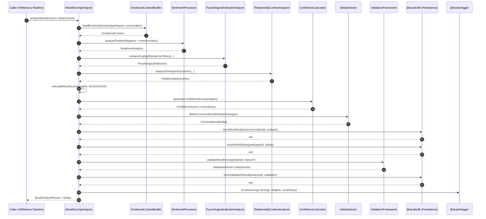

# Mood Scoring Algorithm — Sequence Diagram and Summary

## Summary

Enhanced multi-dimensional mood analysis pipeline that converts conversation content and context into a robust MoodAnalysisResult (0–10 score, descriptors, confidence). It integrates delta detection, relationship-aware context, confidence calibration, validation feedback loops, and persistence for analytics and downstream memory processing. Targets: ≥80% human agreement, ≥85% delta accuracy (<15% FPR), and sub-2s processing.

## Mermaid Sequence Diagram

## Notes

- Weighted scoring: 35% sentiment, 25% psychological, 20% relationship, 15% conversational, 5% historical.
- Delta thresholds: ≥1.5 significant; ≥2.0 sudden; transition types: gradual | sudden | recovery | decline.
- Edge cases: mixed emotions, ambiguity, high complexity; flagged with uncertainty.
- Persistence: mood results, deltas, and validation for trend analytics and calibration.
