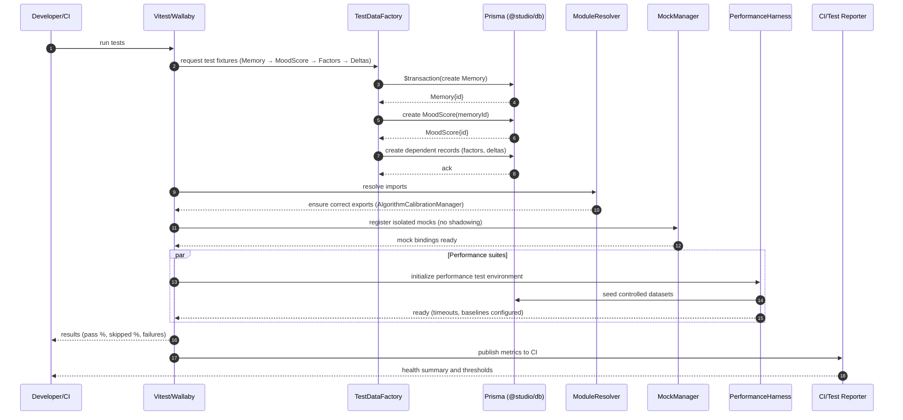

# Test Suite Fixes — Sequence Diagram and Summary

## Summary

Comprehensive stabilization of the test infrastructure to reach ≥95% pass rate and <10% skipped. Fixes foreign key violations by enforcing parent-first data setup, cleans mock strategy and module import mismatches, introduces centralized test data factories with transactions and cleanup, and re-enables 59 performance tests. No schema changes; systemic test setup overhaul.

## Mermaid Sequence Diagram

## Notes

- Enforce creation order: Memory → MoodScore → MoodFactor → Deltas; use $transaction.
- Rename local mocks to avoid shadowing real imports; DI-friendly interfaces.
- Fix import name mismatches (CalibrationSystem → AlgorithmCalibrationManager).
- Re-enable 4 perf suites with deterministic data and time control.
- CI thresholds: ≥95% pass, <10% skipped; report and fail on regressions.
