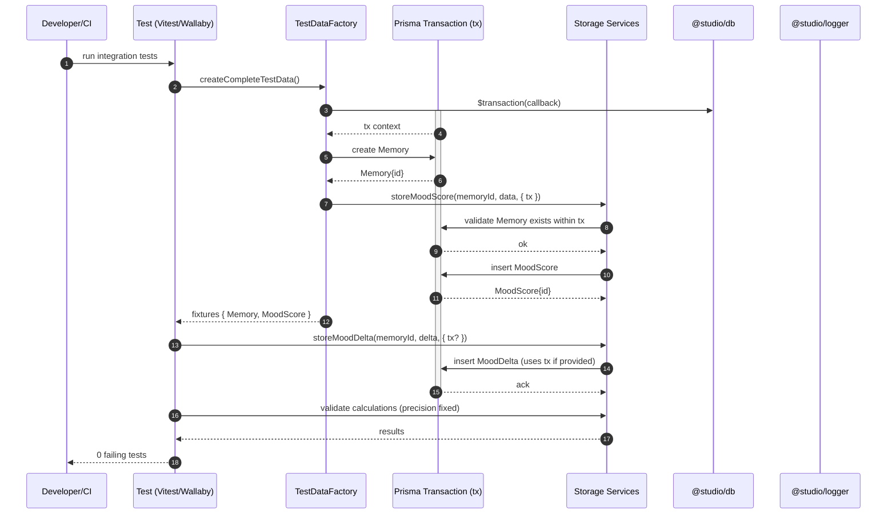

# Test Suite Transaction Isolation — Sequence Diagram and Summary

## Summary

Eliminate 28 failing tests by adding optional transaction context to storage services and TestDataFactory, ensuring that Memory created within a transaction is visible to dependent calls. Align mis-specified expectations and fix significance precision. Outcome: zero failing tests with robust, isolated, and deterministic integration flows.

## Mermaid Sequence Diagram

## Notes

- All storage methods accept optional { tx }: MoodScore, MoodDelta, ValidationResult, DeltaHistory.
- TestDataFactory never returns null; validates and logs failures; optional retries for transient issues.
- Align expectations to actual business logic; do not change core behavior to fit tests.
- Precision: standardize rounding to avoid off-by-0.01 failures.
