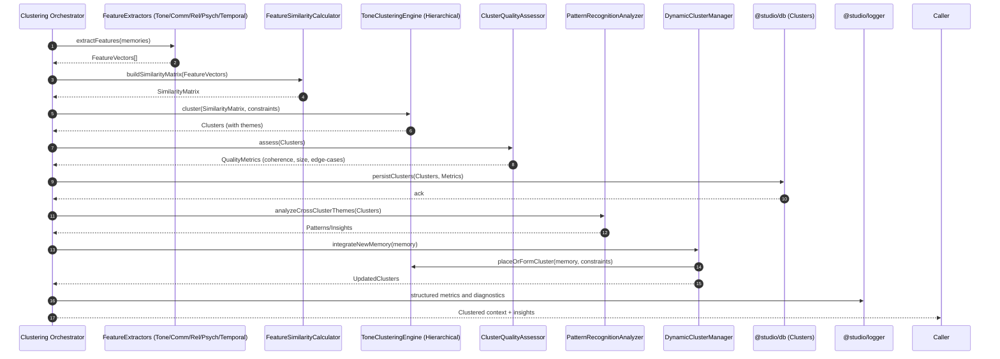

# Tone-Tagged Memory Clustering — Sequence Diagram and Summary

## Summary

Clustering framework that groups ExtractedMemory into psychologically coherent themes using multi-dimensional similarity (tone 35%, communication 25%, relationship 20%, psychological 15%, temporal 5%). Supports dynamic updates, cross-cluster pattern recognition, quality assessment, and persistence for AI to retrieve theme-aware context.

## Mermaid Sequence Diagram

## Notes

- Similarity weights: tone 35%, communication 25%, relationship 20%, psychological 15%, temporal 5%.
- Constraints: minimum cluster size, coherence threshold, edge-case resolution strategies.
- Dynamic updates preserve coherence; create new cluster if similarity below threshold.
- Patterns: cross-cluster themes, relationship dynamics, coping styles, evolution over time.
