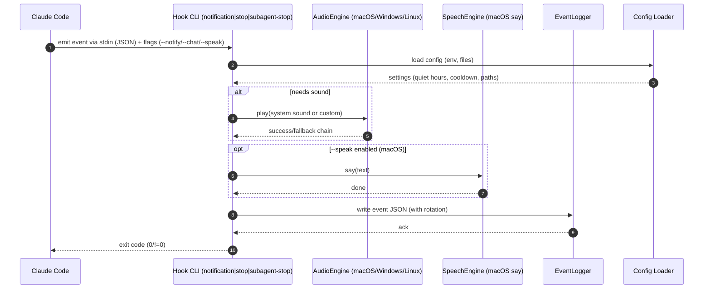

# Claude Hooks Enhancement — Sequence Diagram and Summary

## Summary

Extend @studio/claude-hooks with cross-platform audio, three core hooks (Notification, Stop, SubagentStop), event logging, speech, and CLI flags. Hooks parse Claude Code events from stdin, play sounds or speech, and log JSON events with rotation and quiet-hours/cooldown controls.

## Mermaid Sequence Diagram

## Notes

- Audio fallback: macOS afplay → Windows PowerShell → Linux aplay/paplay/play.
- Flags: --notify, --chat, --speak; respects quiet hours and cooldown.
- Logs: structured JSON, rotating files, per-event type.
