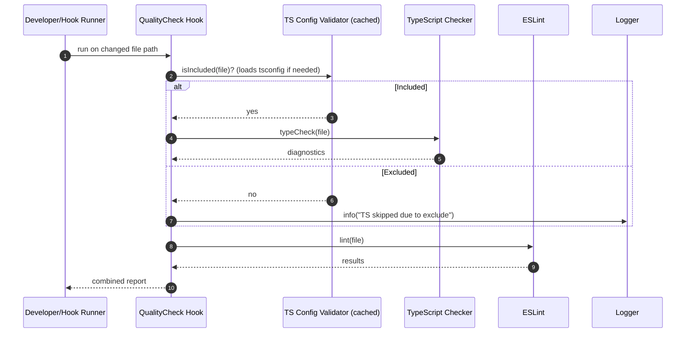

# Quality Check TypeScript Config Fix — Sequence Diagram and Summary

## Summary

Quality check hook respects tsconfig include/exclude patterns. Before type-checking a file, it validates inclusion via cached config parsing; excluded files skip TS check but still run ESLint, with clear logs.

## Mermaid Sequence Diagram

## Notes

- Cache tsconfig parsing for performance.
- Preserve TDD dummy file generation for included files only.
- Clear, non-noisy logs for skipped TS checks.
