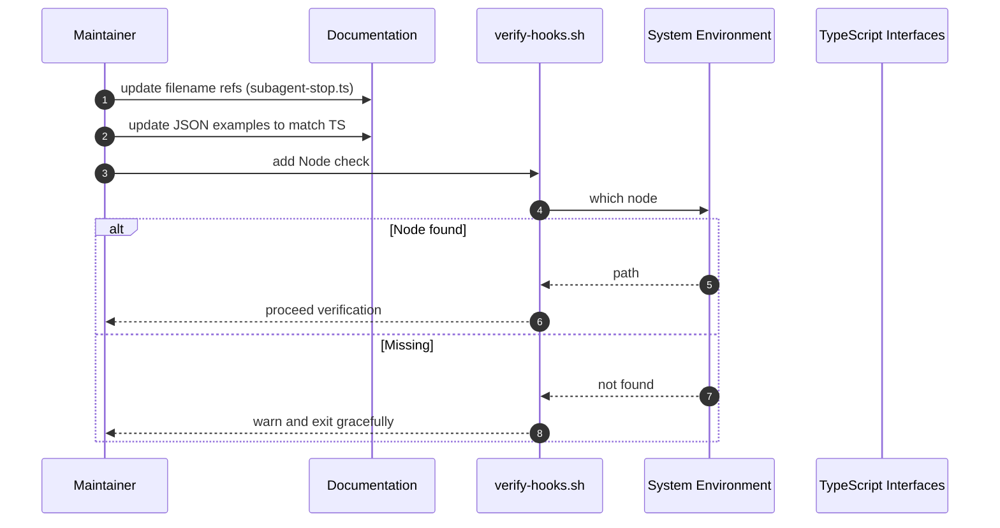

# Fix CodeRabbit Comments — Sequence Diagram and Summary

## Summary

Resolve PR #107 feedback: unify hyphen-based filenames in docs, align JSON config docs with TypeScript interfaces, and harden verification script with Node presence checks and graceful messages.

## Mermaid Sequence Diagram

## Notes

- No interface changes; docs align to code.
- Clear messaging in scripts for portability.
