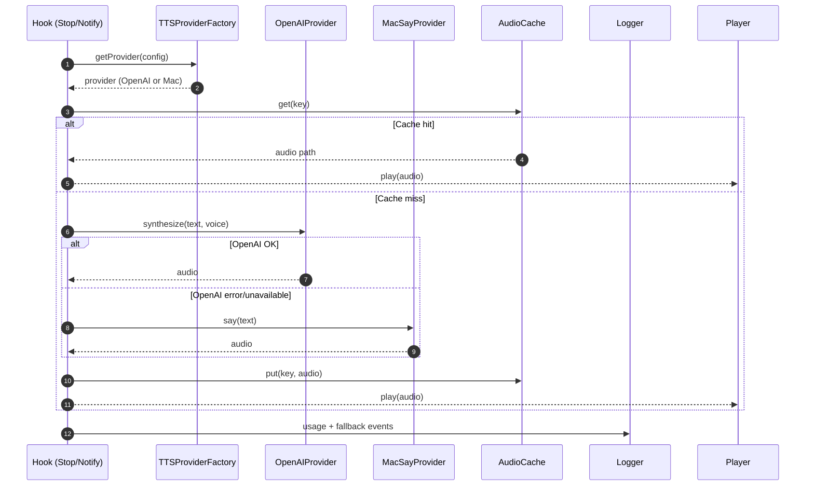

# OpenAI TTS Integration — Sequence Diagram and Summary

## Summary

Introduce provider-based TTS with OpenAI as premium voice and macOS say as fallback. Auto-fallback, caching for common phrases, and simple config with env-based credentials.

## Mermaid Sequence Diagram

## Notes

- Supports 6 OpenAI voices and quality tiers.
- Retries and rate limiting; transparent fallback to macOS say.
- Cache with TTL and LRU to control cost.
