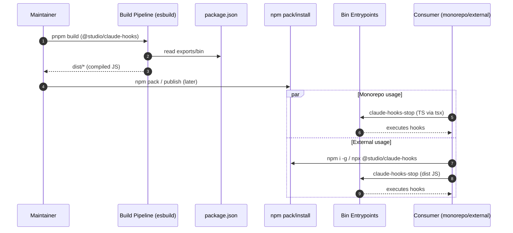

# NPM Package Distribution — Sequence Diagram and Summary

## Summary

Package @studio/claude-hooks for npm with bin commands that work in monorepo (TS via tsx) and as compiled JS for external users. Build to dist/, map bins, fix shebangs, and maintain config resolution.

## Mermaid Sequence Diagram

## Notes

- Shebang fix for cross-platform execution.
- Dual mode: dev TS and prod JS.
- Keep upward config discovery logic intact.
