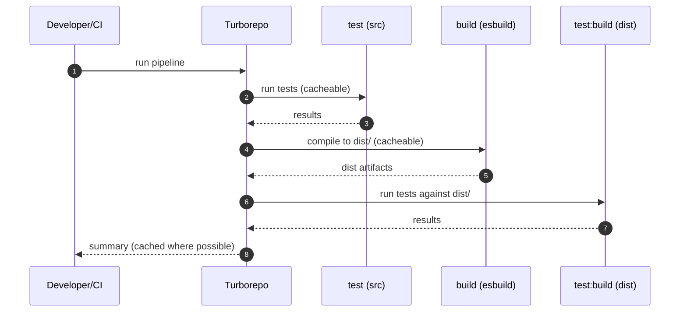

# Turborepo Build/Test Optimization — Sequence Diagram and Summary

## Summary

Integrate build tests into Turborepo, deduplicate scripts, and clean package configs. Separate unit tests (src) from build tests (dist) with caching-aware pipeline.

## Mermaid Sequence Diagram

## Notes

- Remove redundant steps from scripts; rely on pipeline deps.
- Keep configs aligned with monorepo standards.
