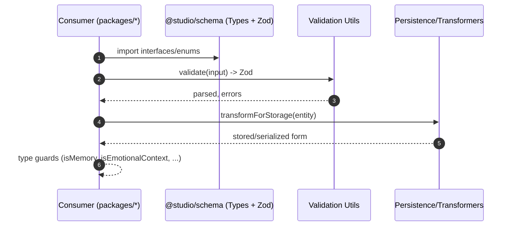

# Advanced TypeScript Interfaces — Sequence Diagram and Summary

## Summary

Comprehensive emotional-intelligence type system with Zod validation, type guards, and transformations powering memory, context, relationships, validation, and temporal analysis domains.

## Mermaid Sequence Diagram

## Notes

- Strong compile-time + runtime guarantees.
- Clear separation of types, zod schemas, and transforms.
