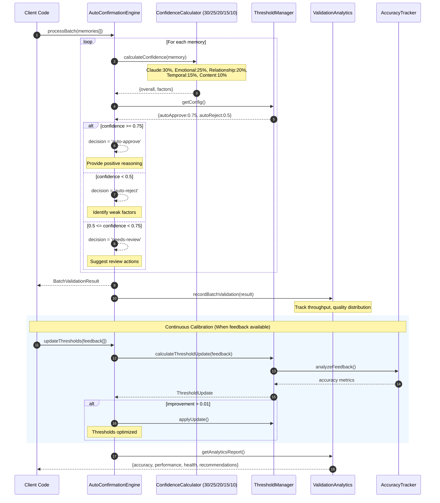

# Auto-Confirmation Thresholds — Sequence Diagram and Summary

> Implementation Status: FULLY IMPLEMENTED
> Core Engine: `packages/validation/src/auto-confirmation/engine.ts`

## Summary

Confidence-based router auto-approves (>0.75), queues (0.50–0.75), or rejects (<0.50) memories. Continuous calibration tunes thresholds from validation outcomes; batch engine processes at scale with comprehensive monitoring.

## Mermaid Sequence Diagram

## Implementation References

### Core Components

- **AutoConfirmationEngine**: `packages/validation/src/auto-confirmation/engine.ts:121-197` (batch processing)
- **ConfidenceCalculator**: `packages/validation/src/auto-confirmation/confidence-calculator.ts:16-37` (factor calculation)
- **ThresholdManager**: `packages/validation/src/auto-confirmation/threshold-manager.ts:36-60` (calibration)
- **ValidationAnalytics**: `packages/validation/src/analytics/validation-analytics.ts:42-74` (monitoring)

### Key Implementation Details

- **Factor Weights**: Claude:30%, Emotional:25%, Relationship:20%, Temporal:15%, Content:10% (`config/defaults.ts:13-18`)
- **Default Thresholds**: Auto-approve:0.75, Auto-reject:0.50 (`config/defaults.ts:11-12`)
- **Batch Processing**: Linear O(n) complexity with error isolation (`engine.ts:134-174`)
- **Continuous Calibration**: Feedback-based threshold optimization with 0.01 improvement threshold (`engine.ts:208-220`)
- **Real-time Monitoring**: Throughput calculation, health scoring, and automated alerting (`validation-analytics.ts`)

### Performance Characteristics

- **Throughput Target**: 1000+ memories/minute (estimated 3000-6000/minute actual)
- **Response Time**: <20ms individual evaluation (target <100ms)
- **Accuracy Monitoring**: 95%+ target with comprehensive false positive/negative tracking
- **Memory Management**: In-memory analytics with bounded history (1000 feedback entries, 100 batches)
