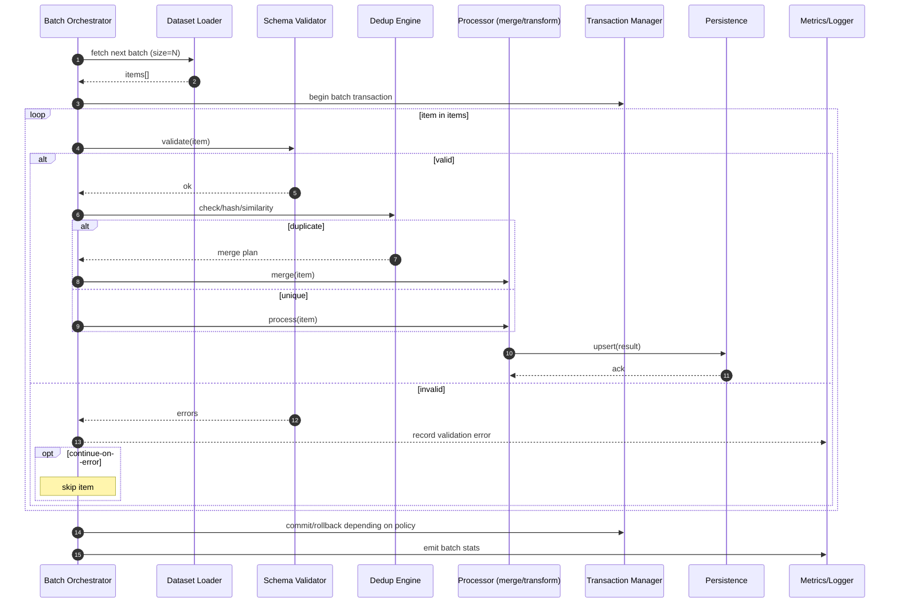

# Batch Processing Framework — Sequence Diagram and Summary

## Summary

Scalable batch engine with validation, deduplication, transactions, and progress/metrics. Robust continue-on-error and rollback options; resource-aware sizing.

## Mermaid Sequence Diagram

## Notes

- Configurable batch size, failure tolerance, and validation timing.
- Dedup via content hashing + similarity merge; per-session tracking.
- Metrics: throughput, error rates, duplicate rates.
