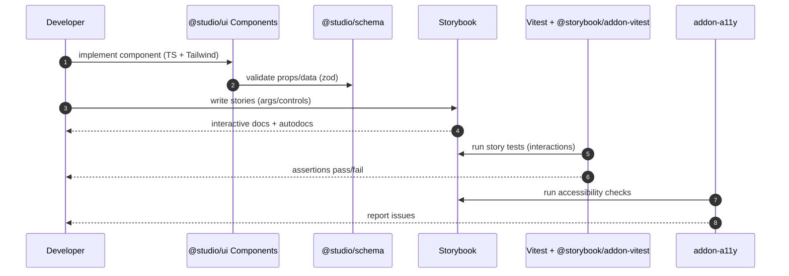

# Component Library + Storybook — Sequence Diagram and Summary

## Summary

UI component library with schema-driven validation, Storybook docs/tests, and a11y checks. Components are TS-first, Tailwind-styled, tested with Vitest/Testing Library, and documented via interactive stories.

## Mermaid Sequence Diagram

## Notes

- Story-driven development with live playground.
- Testing covers unit, interaction, and a11y.
