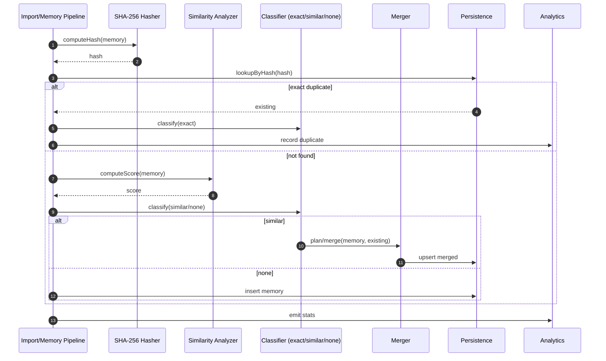

# Content Deduplication Engine — Sequence Diagram and Summary

## Summary

Hash + similarity-based dedup removes ~40% duplicates; merges similar memories while preserving metadata and audit trails; emits analytics.

## Mermaid Sequence Diagram

## Notes

- Preserve participants, sources, confidence; keep merge history.
- Thresholds configurable; collision-safe hashing.
