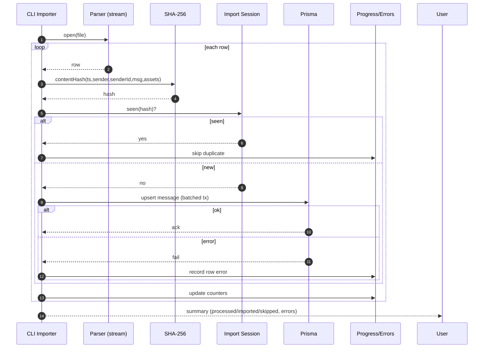

# CSV Message Import — Sequence Diagram and Summary

## Summary

Streamed CSV import with row validation, SHA-256 dedup, transactional batches, and real-time progress metrics.

## Mermaid Sequence Diagram

## Notes

- Unique constraints enforce DB-level dedup.
- Configurable batch size; continue-on-error.
