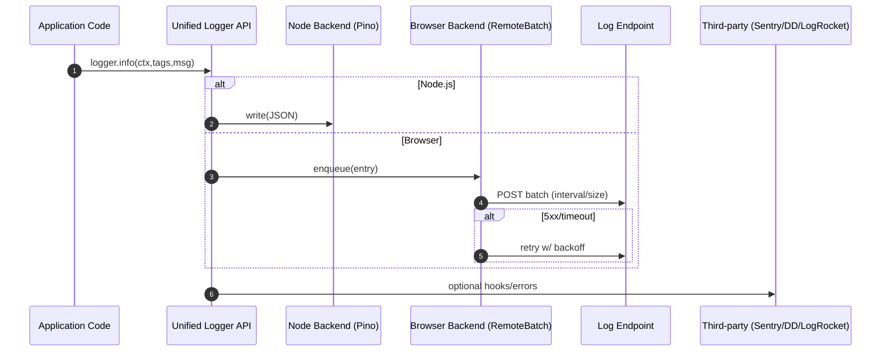

# Dual Logging System — Sequence Diagram and Summary

## Summary

Unified logger for Node and browser with env-aware presets, structured logs, remote batching with retries, redaction, and third-party hooks.

## Mermaid Sequence Diagram

## Notes

- Pretty dev output; structured prod.
- Zod-validated payloads; redaction of sensitive fields.
