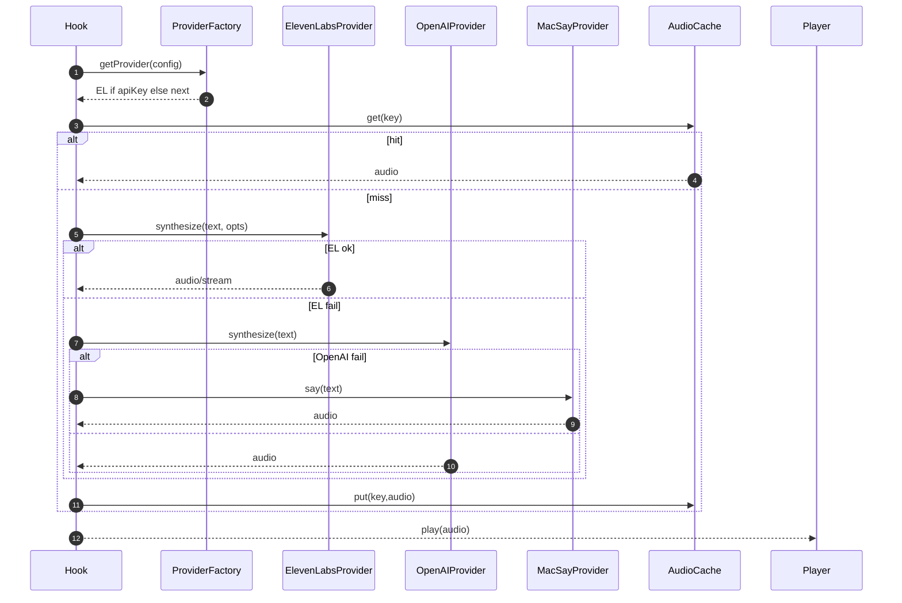

# ElevenLabs TTS Integration — Sequence Diagram and Summary

## Summary

Add ElevenLabs provider to TTS stack with streaming, multi-language voices, formats, and automatic fallback to OpenAI/macOS.

## Mermaid Sequence Diagram

## Notes

- Supports formats: mp3, opus, pcm, aac, flac, u-law, a-law.
- Streaming via chunked responses; retries + backoff.
