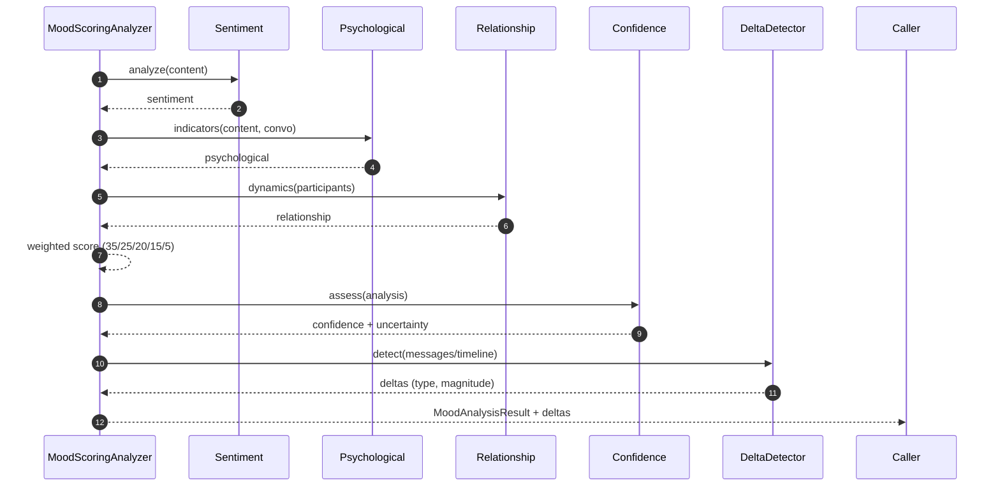

# Enhanced Mood Scoring — Sequence Diagram and Summary

## Summary

Multi-dimensional mood analysis (35/25/20/15/5 weights) with delta detection, context integration, and validation. Outputs score, descriptors, confidence, and deltas for AI usage.

## Mermaid Sequence Diagram

## Notes

- Turning points and mood repair recognized; baselines used.
