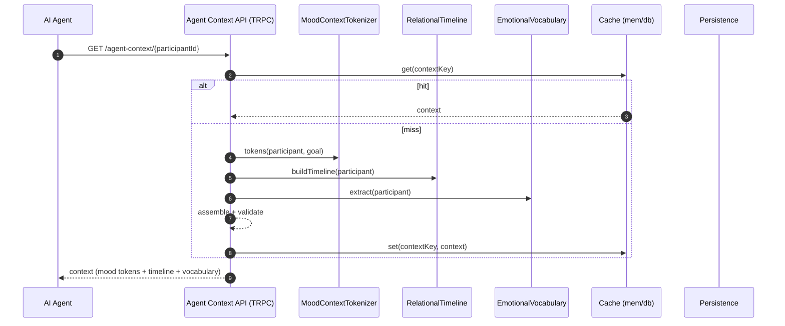

# MCP Foundation Layer — Sequence Diagram and Summary

## Summary

Foundation APIs produce agent-ready context: mood tokens, relational timelines, and vocabulary. Extensible toward MCP servers, with TRPC/HTTP endpoints and caching.

## Mermaid Sequence Diagram

## Notes

- <200ms targets with multilayer caching; MCP-ready resource shapes.
