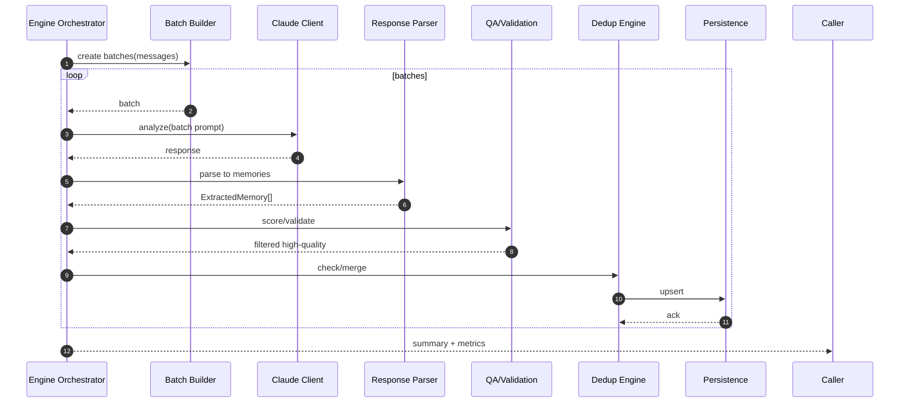

# Memory Processing Engine — Sequence Diagram and Summary

## Summary

Claude-powered extraction pipeline with batching, salience-aware prompting, parsing, deduplication, and QA to produce high-confidence memories within cost limits.

## Mermaid Sequence Diagram

## Notes

- Rate limiting/backoff; 70%+ success and 8+ confidence goals.
