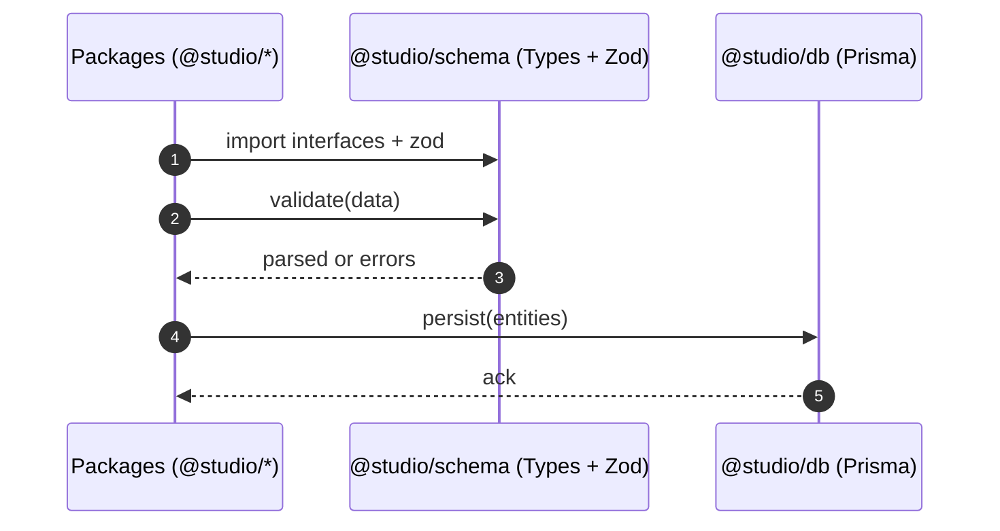

# Memory Schema Definition — Sequence Diagram and Summary

## Summary

Unified schema across memory, emotional context, relationships, validation, and temporal analysis; aligned to DB tables; validated with Zod and used across packages.

## Mermaid Sequence Diagram

## Notes

- 1,184+ lines of types; 54 DB tables alignment.
