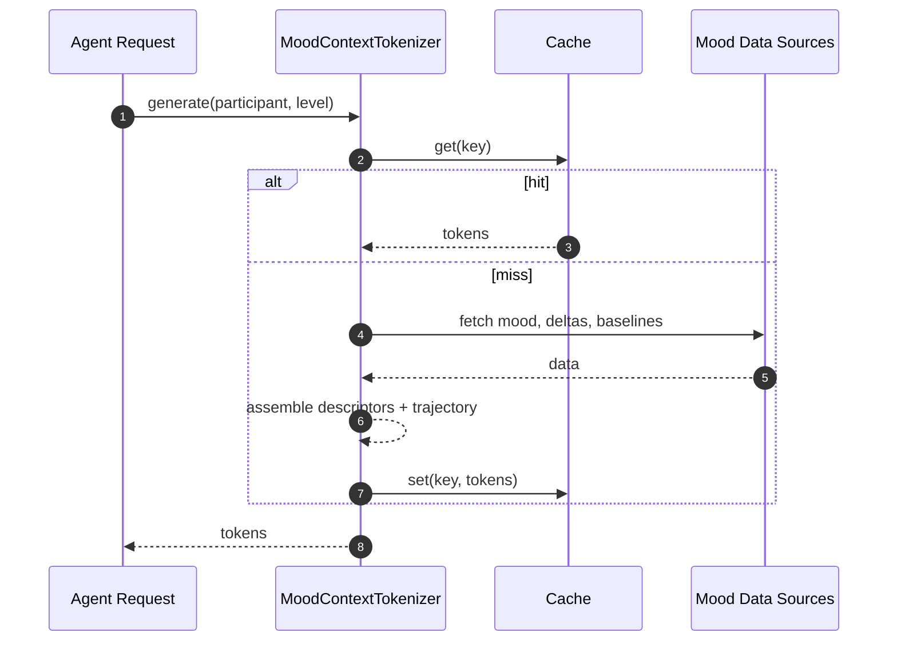

# Mood Context Token Generation — Sequence Diagram and Summary

## Summary

Tokenization engine converts mood analysis into agent-ready tokens at basic/standard/detailed levels with caching for sub-200ms responses.

## Mermaid Sequence Diagram

## Notes

- Relevance filtering by goal; multi-level caching with >80% hit rates.
