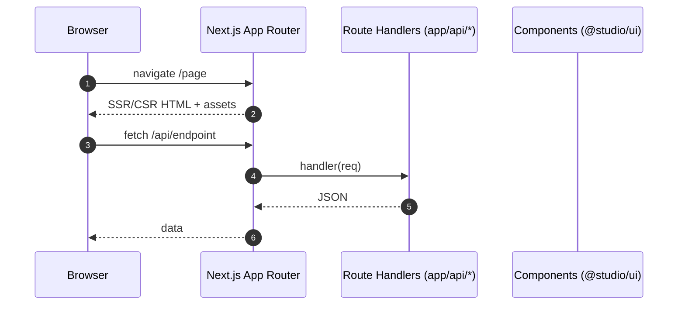

# Next.js 15 Application — Sequence Diagram and Summary

## Summary

Next.js 15 App Router app with TS, Tailwind, Storybook, and Vitest/MSW. Server components, API routes, and optimized builds.

## Mermaid Sequence Diagram

## Notes

- Storybook for component docs; Vitest for tests; MSW for mocks.
