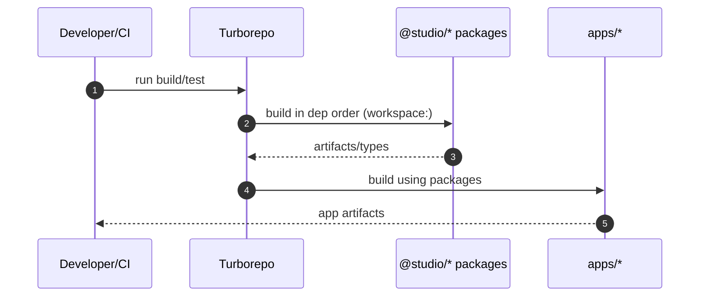

# Package Architecture — Sequence Diagram and Summary

## Summary

Monorepo with @studio/\* packages, shared configs, and Turbo orchestration enabling modular development and builds.

## Mermaid Sequence Diagram

## Notes

- Centralized TS/ESLint/Prettier; path aliases; ESM across repo.
