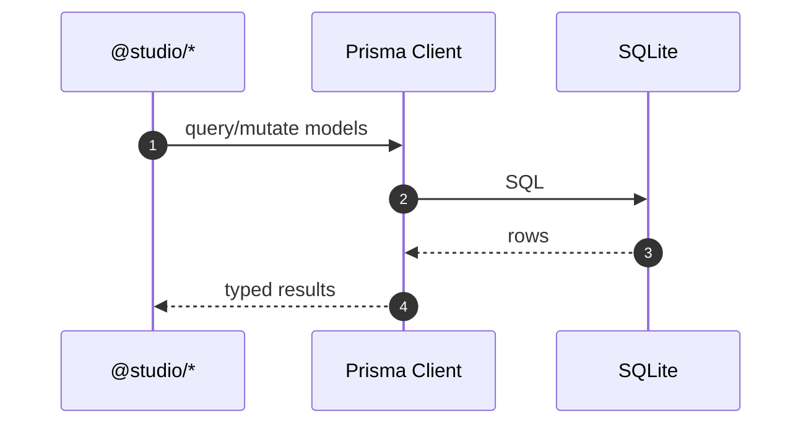

# Prisma Database Schema — Sequence Diagram and Summary

## Summary

Prisma schema with core Message/Link/Asset plus emotional intelligence models (Memory, MoodScore, MoodDelta, clusters). Generated client used by packages.

## Mermaid Sequence Diagram

## Notes

- Content hash unique constraints; relations with cascade deletes.
