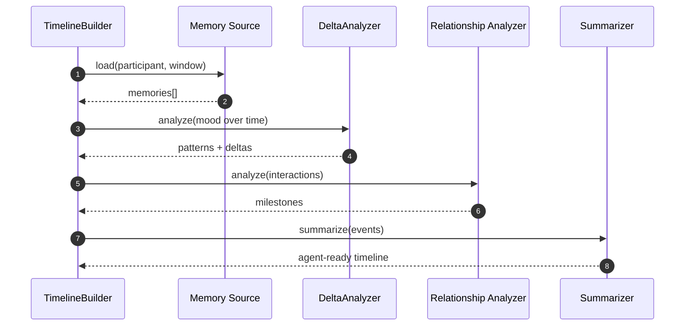

# Relational Timeline Construction — Sequence Diagram and Summary

## Summary

Build chronological emotional timelines with delta patterns, turning points, and relationship evolution for agent consumption.

## Mermaid Sequence Diagram

## Notes

- Filters by time window and significance; participant-scoped views.
