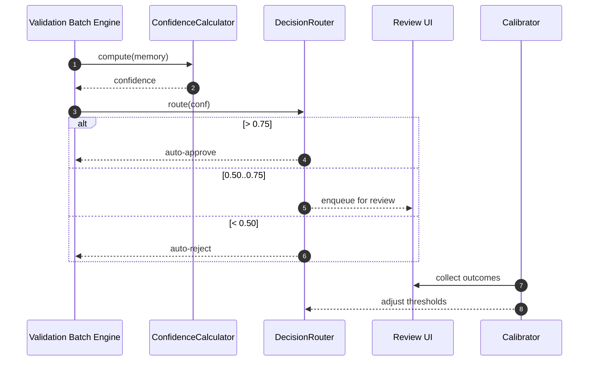

# Smart Validation System — Sequence Diagram and Summary

## Summary

Auto-confirm based on multi-factor confidence with thresholds; review UI for borderline; weekly calibration and analytics.

## Mermaid Sequence Diagram

## Notes

- 70% automation target; maintain 95% accuracy.
