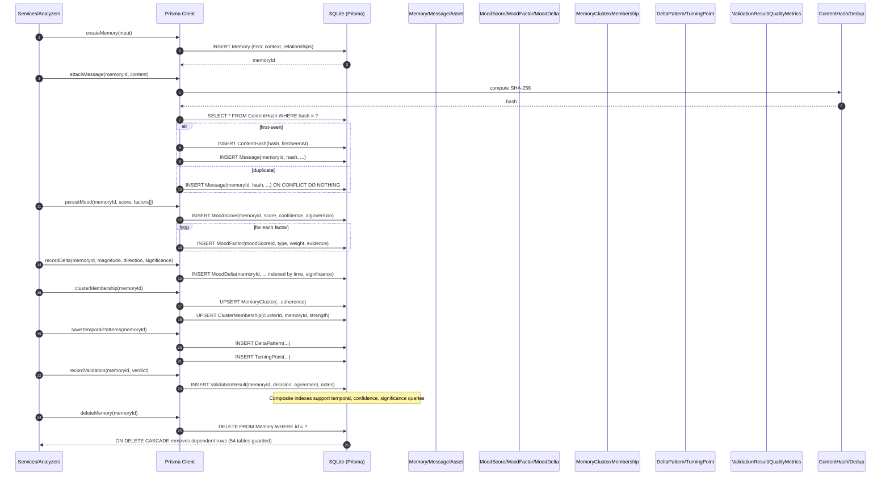

# Sophisticated Database Schema — Sequence Diagram and Summary

## Summary

A 54-table relational model for emotional intelligence workloads. It persists memories, mood scores/deltas, clustering, timelines, validation, and deduplication with strict referential integrity, composite indexes, and cascade rules to keep complex queries fast (<2s target) and data consistent.

## Sequence diagram

## Notes

- Referential integrity: ON DELETE CASCADE prevents orphans across 54 tables.
- Performance: composite indexes on (memoryId, createdAt), (score, confidence), (significance, createdAt) enable sub-2s queries.
- Dedup: SHA-256 content hash table + merge history ensures storage efficiency.
- Versioning: mood algorithm version tracked; analysis metadata captured for audits.
- Safety: all writes happen in transactions when part of batch operations.
