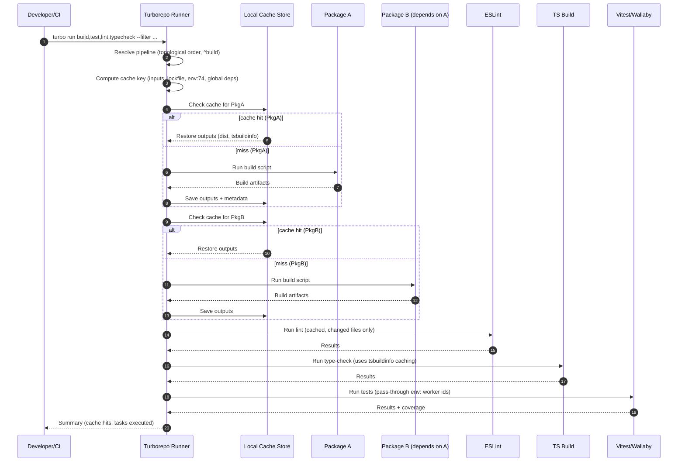

# Turborepo Monorepo Setup — Sequence Diagram and Summary

## Summary

A high-performance monorepo pipeline with Turborepo. It computes precise cache keys from inputs, env, and global deps; executes tasks in topological order; restores cached outputs on hits; and orchestrates build/test/lint/type-check with pnpm workspaces for fast local and CI cycles.

## Sequence diagram

## Notes

- Inputs tracked: src/\*\*, config files, package.json, lockfile, tsconfig, env.
- Outputs tracked: dist/\*\*, .tsbuildinfo, generated clients, storybook builds.
- Filtering: --filter to target packages; topological order ensures correctness.
- Env handling: pass-through for tests and CI; global deps changes invalidate cache.
- Dev UX: persistent dev servers are non-cached; CI benefits most from cache hits.
