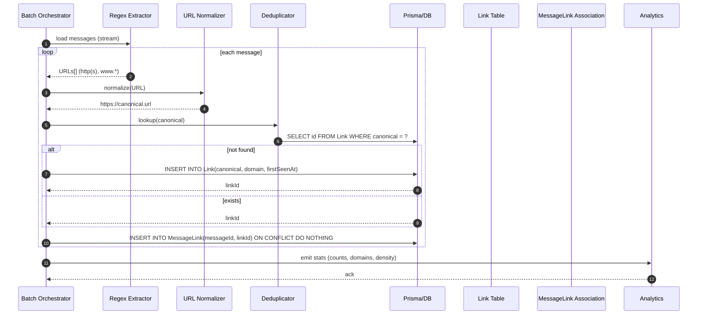

# URL Extraction Parser — Sequence Diagram and Summary

## Summary

A robust URL extraction pipeline that scans message content, normalizes URLs, deduplicates via canonical keys, persists link-message relations, and emits analytics. Designed for batch throughput with transactional safety and accurate, normalized link storage.

## Sequence diagram

## Notes

- Normalization: www → https, parameter sorting, fragment trimming, case normalization for host.
- Dedup: canonical field with unique index; conflict handling preserves relationships.
- Performance: batch-size tuning + transactions; indexes on (messageId, linkId) and (canonical).
- Scope: extraction/normalization/dedup/storage; no scraping/content fetching.
